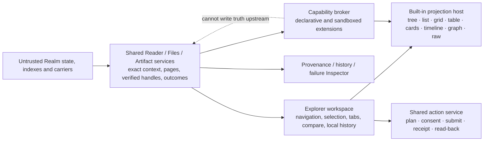

# EFS Data Explorer — current design spine

**Status:** draft set — owner-directed product baseline; no protocol bytes, product repository, extension ABI, deployment, or production implementation is adopted
**Target repos:** planning, client, sdk
**Depends on:** [[Designs/efsv2/README]], [[Designs/efsv2/hierarchical-files-and-folders]], [[Designs/efsv2/layered-type-system-and-data-abi]], [[Designs/web-client-os/README]], [[Designs/open-web-app-store/README]]
**Inputs:** [[Designs/clientv2/README]] and the product-pressure evidence linked from [[research-landscape]]
**Reviewers:** —
**Last touched:** 2026-08-22

#status/draft #kind/design #repo/planning #repo/client #repo/sdk #topic/efsv2 #topic/read-path #topic/graph-queries #topic/app-model #topic/content #topic/privacy

## Read this on a phone

**Product:** the primary general-purpose EFS data application: a guest-first
Explorer that feels as capable as a modern file manager but can inspect any
typed EFS graph through honest, configurable views.

**Recommended shape:** one qualified Reader spine plus an Explorer-owned
workspace and projection layer. Files is the first vertical, not the product's
outer boundary. Unknown Types always retain a safe raw inspection path. Rich
projections are finite, versioned and removable. Extensions never become
truth, install themselves, inherit authority or block raw access.

**First product target:** direct guest Files browsing; tree/list/grid and a
read-only typed table; exact provenance/history; verified preview/download;
local favorites, recents and saved Explorer views; complete keyboard and
screen-reader operation; honest retained/offline states; and only create folder,
create file, bounded local-file import and publish revision in the write-capable
MVP arm, through the shared, independently proved action-plan/consent/receipt/
read-back boundary.

**Hard gates:** a read-only production slice waits for E0–E4: status/IA, guest
Files, typed table, provenance/history and hostile-data/failure labs. Executable
third-party extensions separately wait for E5, and a write-capable MVP waits
for E6a; E6b gates only its deferred operations. No fixture result freezes
Core, Files, Type/Data ABI, SDK or extension bytes.

**Owner feedback now:** none. Core, Files, SDK and Web Client/OS have bounded
interface questions to answer during the experiment round; they are not a
questionnaire for the owner.

## Product direction recorded for this round

James directed on 2026-08-22 that the Data Explorer is a durable product lane,
separate from the Web Client/OS and SDK PMs. It owns the primary general-
purpose EFS data application experience and may use the planning vault for
high-quality research, brainstorming and experimentation. The product should:

- match the useful baseline of Finder, Windows File Explorer and Linux file
  managers;
- go beyond files to tables/spreadsheets, cards, galleries, timelines, graphs,
  raw Records, provenance/history and bounded application projections;
- remain modern, featureful, usable, modular and extensible over a century-
  scale, 100-year horizon; and
- keep third-party code capability-limited and unable to redefine truth or
  silently acquire authority.

The initial delegation also requires guest direct reads without wallet,
account, Commons, OS or profile hydration; visible `UNKNOWN`, `PARTIAL`, basis,
authority, currentness, availability and tampering; read-only shared-repository
intake before design writes; and no production implementation in this first
pass. The read-only intake is complete. This design set is the permitted first
durable write; it does not relax the production hold.

## Authority register

### Owner-adopted EFS-wide inputs

- EFS v2 is greenfield. V1 contracts, SDKs and clients are evidence, not an
  inherited implementation baseline.
- Core is a standalone typed graph/filesystem substrate in a qualifying EVM
  Realm. Commons and EFS OS are optional consumers, never read prerequisites.
- A direct, self-hostable guest client must open useful Files data before any
  wallet, authentication, Commons or OS boot. Guest means unauthenticated, not
  network-anonymous.
- Web, OS, agents and native adapters must reuse basis-qualified Reader/Files
  semantics and must preserve `UNKNOWN` rather than manufacture absence.
- The three-host mounted Files outcome is read-only, with pinned handles,
  verified ranges, bounded metadata and honest incomplete reads.

See [[Designs/efsv2/owner-rulings]],
[[Designs/efsv2/system-constitution]] and
[[Designs/efsv2/owner-decision-inbox]].

### Current proposals consumed behind adapters

- Hierarchical Files proposes stable File/Directory Objects, per-name
  Principal-qualified Bindings, mount-local namespace/content Plans, complete
  `BindingScope` enumeration, immutable revisions, exact view transcripts,
  verified byte acquisition and routed certified writes.
- The layered Type/Data ABI proposes exact nominal Types, raw-preserving
  representations, bounded contract Data Views, separate QueryProfiles and
  explicit projections.
- Web Client/OS proposes a finite exact-Type-first consumer adapter, stable
  Files DTOs, exhaustive `ResourceOutcome`/`ByteOutcome`, route-shaped guest
  boot, and action plan/receipt/read-back flows.
- Open Web App Store proposes inert package/catalog evidence and a one-way
  `PackageHandoff`; discovery and package evidence carry no local grants,
  activation or execution authority.

Their names, identifiers, codecs, limits, query profiles, adapter APIs,
`BindingScope`, FilesRouter, extension interfaces and repositories are not
frozen. Data Explorer depends on observable outcomes and versioned seams, not
on minting those candidates by accident.

## Product charter

> Open an exact EFS location, object or query as a guest; understand what is
> known, why it is believed and what remains unavailable; choose a useful view;
> and perform deliberate changes through inspectable plans and receipts.

### Product laws

1. **Guest useful before system hydration.** Browsing never depends on wallet,
   account, Commons, package catalog, private profile or OS boot.
2. **One resource, plural views.** A Files path, typed table, card, graph and
   raw Record are projections over qualified data, not competing truth.
3. **Qualification is first-class.** Identity, Type validity, authorship,
   Realm admission, Lens/Binding selection, basis, finality, freshness,
   completeness, availability, integrity and consumer acceptance stay
   separate.
4. **Raw evidence survives every abstraction.** Unknown, unsupported or broken
   renderers cannot hide exact identifiers, canonical bytes or resumable
   inspection.
5. **A view does not authorize.** Filters, layouts, saved views, catalogs,
   Types, MIME hints, popularity and extensions never grant write or execution
   authority.
6. **Writes are staged, not inferred.** Every mutation has an exact selection
   snapshot, deterministic plan, capability/signer review, outcome receipt and
   canonical read-back. Undo is a new defined operation, not erased history.
7. **Personal workspace state is local by default.** Recents, favorites, view
   layout, drafts, search history and derived caches are not published merely
   because the inspected data is public.
8. **Extensions fail removable.** Disabling every third-party extension leaves
   built-in navigation, raw inspection, export and recovery intact.
9. **Accessibility is architecture.** Keyboard, screen reader, touch, zoom,
   reduced motion, bidirectional text and non-drag alternatives are required
   in each slice, not a polish phase.
10. **Exit is exercised.** Exact links, retained data, view definitions,
    receipts and redacted transcripts remain exportable without the original
    operator, catalog, plugin or hosted indexer.

### Explicit non-goals

The Data Explorer is not:

- EFS OS, a desktop/window manager, wallet, identity manager, signer, package
  installer, full-text infrastructure operator or canonical Commons;
- the owner of Core, Files, Type/Data ABI, SDK or native mount semantics;
- an open-ended schema-driven application runtime where arbitrary Types create
  trusted UI or actions;
- a claim that every open query can be complete, every cached item is current,
  or every semantic object has available bytes; or
- an automatic executor for HTML, SVG, PDF, scripts, Wasm, package Releases or
  agent tools.

## Current recommendation

Use a **qualified typed Explorer workbench** over the shared Reader spine.

- A universal **inspection lane** opens Core/Files facts, exact Records,
  Occurrences, references and canonical bytes even when no rich adapter exists.
  Descriptor-driven generic field/tree display is lazy, read-only and
  untrusted; it cannot create actions or semantic authority.
- A finite **projection lane** maps explicitly accepted exact Types or bounded
  projection profiles into stable Explorer DTOs and built-in views.
- Explorer-owned workspace state controls layout, selection and navigation.
  It never changes Realm/Lens/query truth.
- The shared Web Client/OS action surface owns identity, signer, conserved
  confirmation, submission and receipt semantics. Explorer owns intent UX,
  selection previews, bulk review and presentation of outcomes.
- Extension code receives only attenuated handles through a broker. Its output
  is labelled derived, and built-in raw fallback remains available.

Detailed boundaries are in [[architecture-and-state]] and
[[views-extensions-and-capabilities]].

## Documents in this set

| Document | Owns |
|---|---|
| `README.md` | Product direction, authority, charter, cross-lane boundary and current recommendation |
| [[product-charter-and-roadmap]] | Personas, information architecture, journeys, modern file-manager baseline, MVP/next/later map, accessibility and offline requirements |
| [[architecture-and-state]] | Explorer application modules, navigation/state model, read/write/batch/undo flows, cache namespaces and failure vocabulary |
| [[views-extensions-and-capabilities]] | `ExplorerViewSpec`, built-in typed views, projection truth boundary, extension lifecycle, sandbox and capability/privacy model |
| [[experiments-and-stop-conditions]] | Disposable prototypes, usability/failure fixtures, measurable acceptance and exact production stop conditions |
| [[research-landscape]] | Dated local authority/evidence map and official-source product/standards research |
| [[owner-decision-inbox]] | Evidence-gated owner queue and delegated cross-team feedback |

## Feature horizons

| Horizon | Product outcome |
|---|---|
| **MVP target** | Guest Files navigation; tree/list/grid; breadcrumbs, tabs, search/filter/sort; metadata and verified preview/download; local favorites/recents; raw typed inspection; read-only exact-Type table; provenance/history and exact citations; explicit failure/coverage status; retained-resource offline reading; full keyboard/screen-reader/touch parity; create folder, create file, user-selected local-file import and publish revision only if the shared certified action boundary passes. No executable third-party extensions. |
| **Next** | Copy, move, rename and mask/unlink after their shared semantics pass; dual-pane and compare; robust multiselect/batch plans; modelled undo/redo and restore/fork; drag/drop plus keyboard alternative; editable typed table; cards/gallery/timeline/graph; personal and explicitly published saved Explorer views; provider-neutral richer search; offline drafts and queued unsigned plans; declarative third-party projection packs. |
| **Later** | Sandboxed executable views/analysis; cross-Realm compare and separately consented transfer; private encrypted mounts after their profile; collaborative view/activity handoff; agent/automation entry through OS capabilities; derived datasets/formulas with explicit lineage; larger native/CLI parity and specialized application projections. |

Deferral does not discard the baseline. A later item must retain an interface or
an explicit migration route in earlier state, but does not tax guest boot or
expand the initial trusted computing base.

## Ownership boundaries

| Concern | Data Explorer owns | Neighbor owns |
|---|---|---|
| Core / Realm | Showing exact read context, basis, grades, pages and causal failure | EFS v2 owns protocol semantics, admission, indexes, authority and contract Lenses |
| Files | File-manager experience, Explorer state, compare/batch UX, view choice and honest status | Files owns stable objects, names, paths, listing, revisions, byte identity and certified mutation semantics |
| SDK | Product-facing DTO requirements, evidence handles, usability and conformance fixtures | SDK owns exact codecs, raw preservation, query/cursor primitives, byte verification and action bindings |
| Web Client / OS | Explorer boot profile and product UX; intent capture and result display | Shared Reader/Artifact services, capability broker, conserved permission/signing UI, signer/submission, package activation and private system services |
| App Store | Inert package/release/catalog/provenance inspection | Package identity, closures, catalogs, resolution evidence and runtime-neutral handoff |
| Domain products | Generic typed inspection and reusable built-in view mechanics | Media, Git/Forge, EAP, Nanda, Arcade and others own domain meaning, trusted reducers and pressure fixtures |
| Native mounts | Web/CLI parity of logical outcomes and exportable view state | Drive/mount lane owns host handles, aliases, daemons, packaging and OS filesystem projection |

## Current work sequence

1. Review this first-pass design with the Core, Files, SDK and Web Client/OS
   owners; repair only real boundary contradictions.
2. Produce design-only wireframes and the fixed corpus for E0–E5 without
   selecting permanent protocol, SDK or extension bytes.
3. Run guest Files and hostile-data labs first; they validate the Reader/outcome
   spine needed by every other prototype.
4. Run typed table and provenance/history against the same exact fixture and
   compare exact-Type-only with one finite pinned projection arm.
5. Run E5 only after the stable read/result contract exists; it gates
   executable extensions, not the read-only product.
6. Add the narrow E6a create/import/publish lab only when Files and Web
   Client/OS expose an authorized disposable action boundary. Run E6b only
   before the corresponding deferred copy/batch/reversal operation.
7. Return measured failures, user confusion, missing shared interfaces and
   irreducible owner choices. Do not convert a successful fixture into an
   implementation or freeze claim.

## Explicit non-authorizations

This set does not authorize:

- a new repository, product scaffold, dependency, framework, extension store,
  public plugin, hosted indexer, Realm, deployment or public Record;
- permanent Type, View, QueryProfile, Files, SDK, `ExplorerViewSpec`, extension
  manifest, capability or result bytes;
- wallet probing, automatic account creation, background package activation,
  remote code import, ambient network/storage/signer access or telemetry;
- publishing favorites, recents, search history, private data, local caches,
  drafts, grants, secrets or agent mandates;
- treating a disposable fixture, clean-room reconstruction, usability result
  or extension escape test as general protocol conformance; or
- claiming the first MVP is production-ready while any mandatory stop condition
  in [[experiments-and-stop-conditions]] remains open.

## Open questions

- [ ] Does the universal inspection lane need a generic descriptor-rendered
      field tree in the MVP, or are Core facts plus canonical raw bytes and the
      first finite Files/table adapters sufficient? Resolve in the typed-table
      usability lab; do not infer semantic authority from the answer.
- [ ] Which Explorer surfaces are shared Web Client/OS components versus a
      separate product package? Resolve only after both boot profiles run the
      same guest fixture with zero semantic divergence.
- [ ] Does a published `ExplorerViewSpec` need an ordinary EFS application
      profile in the first release, or should all view state remain local until
      the product and privacy model stabilize? Compare personal/local and inert
      shareable mockups first.
- [ ] After E6a, is the shared create-folder/create-file/local-import/publish-
      revision set ready for the Explorer MVP, or should the first production
      slice remain explicitly read-only? The action/result semantics remain
      shared either way.

No item above needs an immediate owner decision. Each names its evidence gate.

## Pre-promotion checklist

- [ ] Product charter and ownership boundaries reviewed by Core, Files, SDK and Web Client/OS owners
- [ ] Every important requirement traces to an adopted boundary, local evidence or dated official product source
- [ ] MVP/next/later map covers the modern file-manager baseline without taxing guest boot for later features
- [ ] `ExplorerViewSpec` remains distinct from EFS Data View, Files view, Lens, QueryProfile and authority
- [ ] Every write trace uses one shared plan/consent/receipt/read-back law
- [ ] Unknown, partial, absent, unavailable and tampered fixtures remain distinct in UI, cache and export
- [ ] Extension discovery, verification, installation, authorization, activation, invocation and endorsement remain separate
- [ ] All mandatory disposable labs pass or are explicitly deferred with the product claim narrowed
- [ ] No `<!-- AGENT-Q: -->` comments remain
- [ ] At least one independent `#status/review` pass and owner review are recorded
