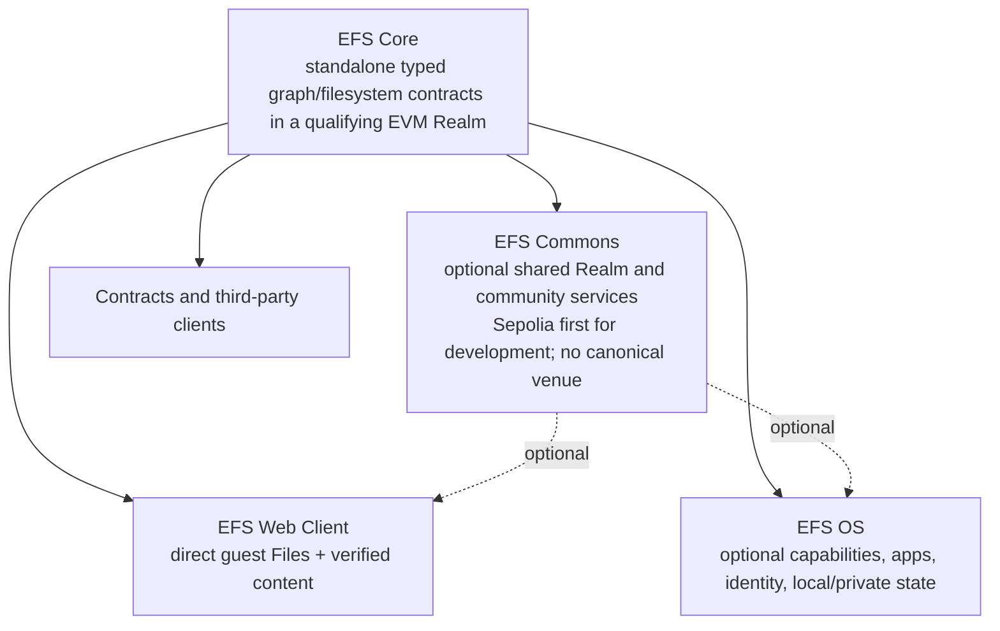

# EFS 2.0 — greenfield design set

EFS 2.0 is the one active successor design. “EFS 1.5,” “Genesis,” and “vNext”
were temporary reasoning labels, not additional products. The deployed EAS
system is v1 evidence; the EFS 1.5 bridge and July native-envelope/five-kind v2
round are historical design evidence. Nothing inherits a place in EFS 2.0
without passing the greenfield requirements and product traces.

> **Current status:** James has ratified the greenfield direction and the Core / optional Commons / Web Client and OS layer boundary. Sepolia is the first development Commons, not a permanent or canonical venue selection. The constitution and architecture below are drafts for engineering review, not ceremony-final bytes or permission to deploy permanent contracts.

## Read this on a phone

Start with [[owner-guide]] for the ten-minute, plain-language explanation: the
basic nouns, one photo from publication through reading, why the design can
support hyperstructures, what is adopted, what is provisional, and which
choices genuinely belong to the project owner later.

The shortest accurate summary is:

- EFS v2 is a public typed filesystem/database substrate designed for durable,
  reconstructible records, not a guarantee that every offchain byte survives;
- immutable Records preserve exact data, while Publications, Realm admission,
  Bindings, queries, and Lenses preserve authorship, acceptance, currentness,
  completeness, and reader policy without collapsing them into “truth”;
- Core stays small, deterministic, permissionless, and reconstructible;
- applications remain open-ended because anyone can define exact Types and
  relations without adding an application-specific Core primitive; and
- `EXP-C0` is now the one reversible engineering control. It is not frozen
  bytes, a production contract, or a permanent owner ruling.

For an engineering pass:

1. [[system-constitution]] — detailed requirements synthesis;
2. [[core-architecture-candidate]] — technical model, alternatives, and falsifiers;
3. [[ethereum-standards-and-execution-profile]] — exact Realm/EVM/read evidence
   boundary recovered from the complete EIP/ERC corpus;
4. [[owner-rulings]] — what James actually adopted; and
5. [[owner-decision-inbox]] — evidence gates, not a questionnaire.

Focused next-pass prompt: [[fable-efs2-core-engineering-kickoff]].

Current readiness program: [[v2-contract-readiness-program]] separates
`GO-CODE`, `GO-FREEZE`, and `GO-DEPLOY`; orders the remaining Type, identity,
Realm, query, Lens, reconstruction, SDK, and Data Explorer gates; and forbids a
calendar deadline from standing in for evidence or owner ratification. Its
point-in-time executable-evidence reconciliation is the
[2026-08-22 readiness baseline](../../Reviews/2026-08-22-v2-contract-readiness-baseline/README.md).
The Core-facing standards supplement is
[the 2026-08-23 EIP/ERC pressure screen](../../Reviews/2026-08-23-efs2-core-eip-erc-pressure/README.md);
it reuses the complete shared corpus index and selects no protocol bytes or
target-chain support.

The first design-only G2 artifact is the
[[Reviews/2026-08-23-efs2-exp-c0-semantic-seal/README|`EXP-C0` symbolic semantic seal]]:
61 integrated transition/read/authority/query/Lens/reconstruction traces and
their lossless result profiles. Exact disposable bytes, the independent model,
and the Solidity SUT remain pending; this is not a G2 pass.

## The current shape



- **Core** is the main Ethereum value: deterministic identities, reusable typed
  Records, authored Occurrences, Realm admission, bounded graph indexes,
  current bindings, contract Lenses, exact bytes, honest completeness, and
  independent reconstruction.
- **Commons** may add public network effects, but Core and durable links cannot
  depend on it. Sepolia is the first development Commons because it is the
  active, near-free shared venue. No permanent/canonical chain is chosen; a
  candidate must earn trust under cypherpunk/CROPS criteria.
- **Web Client** is a self-hostable direct guest reader and File Browser. A
  person can open a fresh qualifying L3 without booting an OS or creating an
  account. Its active product-layer architecture and MVP packet are in
  [[../web-client-os/README]].
- **EFS OS** is the optional higher environment for rich personal policy,
  local/encrypted state, accounts/recovery, sandboxed apps, agents, and signing.

## Current technical candidate

The current disposable control is `EXP-C0`, deliberately smaller than the July
design and selected so experiments have one default rather than several equal
arms:

```text
flat exact nominal Type Schema
        +
separately versioned QueryProfile
        +
author-neutral exact Record
        +
portable signed PublicationSet
        =
authored Occurrence
        +
destination-specific Admission Plan
        +
Realm-qualified receipt, indexes, Binding, bounded Lens, and reconstruction
```

`EXP-C0` also uses one full-width `PrincipalId` surface, a self-authenticating
Realm bootstrap with append-only revisions, and a monolithic state owner as the
first disposable Solidity control. Alternatives remain available only behind
named falsifiers. This is permission to converge designs and throwaway
experiments, not `GO-CODE`, `GO-FREEZE`, or deployment authority.

Names and ceremony-final bytes remain open. `TypeSchema` is the current
plain-language name; older files call similar concepts `TypeRevision`. EAS is
not Core. An EAS import/export adapter remains possible if it provides real
interoperability.

Focused Type proposal: [[layered-type-system-and-data-abi]] now uses a flat
exact nominal Type plus split QueryProfile as the `EXP-C0` Core control.
Semantic, shape, representation, compatibility, projection, and View
descriptors remain valuable compiler/catalog outputs and controlled comparison
arms. They have not earned separate permanent Core identities. This remains a
review/experiment target, not an adopted Type system or frozen byte format.

Focused Files proposal: [[hierarchical-files-and-folders]] defines the current
greenfield candidate for stable File/Directory Objects, per-name Bindings,
mount-local namespace/content Plans, complete directory enumeration, canonical
URLs, exact views, immutable file revisions, verified bytes, and the shared
Web/OS/mount resolver. Complete listing and certified filesystem writes depend
on the draft's generic `BindingScope` and executor/operation-bound consent
experiments; neither is current B0. It is a draft experiment target, not a
frozen profile or owner decision packet.

## Evidence map

These are inputs, not competing active architectures:

| Evidence | What to preserve |
|---|---|
| [[assumptions-and-requirements]] | Large pre-greenfield requirements/assumptions inventory. Read its correction banner first. |
| [[human-overview]] | July whole-system explanation and failure analysis. Historical synthesis until rewritten from the new constitution. |
| [[onchain-completeness]] and [[onchain-graph-queries]] | Required on-chain capability inventory and honest bounded-read pressure. Mechanisms re-opened. |
| [[lens-spec]], [[lens-pass-synthesis]], and [[lens-read-gotchas]] | Lens use cases, risk-bearer rule, typed policy, basis/completeness, and scale evidence. Old grammar is not frozen. |
| [[kel]] and KEL/account review corpus | Rotation, recovery, delegation, temporal-authority, and smart-account failure analysis. Full KEL/topology must re-earn inclusion. |
| [[mountable-filesystem-semantics]] | Adopted three-host read-only outcome and projection acceptance gates. |
| [[hierarchical-files-and-folders]] | Current greenfield hierarchical Files/1 proposal; replaces July namespace mechanisms while preserving the adopted mount outcome. |
| [[privacy-pass-synthesis]] and privacy corpus | Payload/read/metadata distinctions, privacy seams, and honest limitations. Old crypto/profile bytes are candidates. |
| [[layered-type-system-and-data-abi]] | Current Type-system proposal: exact nominal Types, bounded Data Views, directional compatibility, query-profile evolution, tags/catalog paths, projections, modular EVM deployment, and falsifying experiments. |
| [[ethereum-standards-and-execution-profile]] and [its pinned Core pressure screen](../../Reviews/2026-08-23-efs2-core-eip-erc-pressure/README.md) | Current draft rule for separating portable EFS semantics, accepted Realm execution profiles, observer read/evidence profiles, observed target support, and optional standards adapters. Exact profiles and limits remain open. |
| [[deterministic-ids]], [[codex-envelope]], [[codex-kinds]], [[codex-kernel]] | July native v2 formulas and implementation hypotheses. Useful but superseded as an automatic baseline. |
| [`../efs15/`](../efs15/) | Fully reviewed EAS-backed contraction and exact vectors. Historical evidence showing what semantic IDs, schemas, admission, and reads require. |
| [Arcade](../arcade/README.md) | Project/release/artifact, verified runner, curation, rights, comments, and direct guest pressure test. |
| [EFS Git deep dive](../../Reviews/2026-08-07-efs-git-deep-dive.md) | Native Git identity, atomic ref history, Markdown/wiki editing, collaboration, reconstruction, and hosting pressure. |
| [2026-08-13 venue/L1 evidence](../../Reviews/2026-08-13-claude-evidence-round/README.md#realm-venue-and-l1-evidence) | Dated Realm/Commons inputs for reconstruction, DA retention, shutdown/read-path, governance, exit, node-operation, and cost gates. Read its correction register; it selects no venue, requirement, or mechanism. |
| [Nanda pressure](../../Brainstorms/2026-07-29-pm-nanda-neutral-agent-infrastructure-pressure.md) | Provider/skill/release/closure/discovery needs without Nanda-specific Core kinds. |

## Build order

1. Seal `EXP-C0`'s transition, read-result, failure, and reconstruction traces.
2. Build one micro-Realm differential experiment: an independent pure model
   and deliberately simple monolithic Solidity SUT covering Type/Record,
   two-leaf Publication, EOA/ERC-1271 admission, Binding/Withdrawal,
   QueryProfile coverage, 1/8/32/64 point Lens reads, and reconstruction.
3. Run one minimal sealed comparator for each ABI-shaping seam so every
   falsifier is observable. Build no full losing-arm implementation unless the
   comparator reopens it; do not repeat broad architecture tournaments.
4. Price the complete write, index, Lens, history, and reconstruction workload
   under named execution profiles, then let SDK and Data Explorer pressure
   expose truth or usability failures.
5. Return `CONTINUE-DISPOSABLE`, `REDESIGN`, or `RECOMMEND-GO-CODE` with a small
   owner packet. Real repository contract engineering waits for the later
   owner checkpoint; ceremony-final vectors and century proof wait for
   `GO-FREEZE`.

## Hard holds

- No EAS carrier, kind table, Type/Record formula, Principal/KEL mechanism,
  Lens grammar, index layout, Realm descriptor, accepted execution/read
  profile, verifier suite, or contract split is frozen.
- No Commons venue or canonical EFS home chain is selected.
- No v1 compatibility, migration, coexistence, or legacy-read requirement.
- No durable Arcade, EAP, Nanda, or other production seed before the relevant
  semantic IDs and reconstruction contracts freeze.
- Upgradeable prototype contracts are acceptable; silent reinterpretation of
  old admitted data is not.

## Status

The active spine remains `#status/draft`. It becomes review-ready only after
the prototype/Fable/adversarial passes are integrated. Promotion remains the
owner's normal human-gated ceremony.
