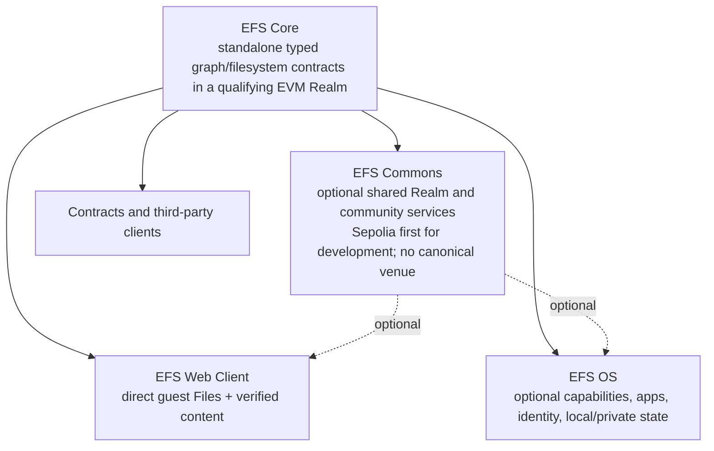

# EFS 2.0 — greenfield design set

EFS 2.0 is the one active successor design. “EFS 1.5,” “Genesis,” and “vNext”
were temporary reasoning labels, not additional products. The deployed EAS
system is v1 evidence; the EFS 1.5 bridge and July native-envelope/five-kind v2
round are historical design evidence. Nothing inherits a place in EFS 2.0
without passing the greenfield requirements and product traces.

> **Current status:** James has ratified the greenfield direction and the Core / optional Commons / Web Client and OS layer boundary. Sepolia is the first development Commons, not a permanent or canonical venue selection. The constitution and architecture below are drafts for engineering review, not ceremony-final bytes or permission to deploy permanent contracts.

## Read this on a phone

**This README is the phone summary.** Read through “Current technical
candidate,” then stop unless you want the engineering detail. For a deep pass:

1. [[system-constitution]] — detailed requirements synthesis;
2. [[core-architecture-candidate]] — technical model, alternatives, and falsifiers;
3. [[owner-rulings]] — what James actually adopted; and
4. [[owner-decision-inbox]] — evidence gates, not a questionnaire.

Focused next-pass prompt: [[fable-efs2-core-engineering-kickoff]].

## The current shape



- **Core** is the main Ethereum value: deterministic identities, reusable typed
  Records, authored Occurrences, Realm admission, bounded graph indexes,
  current bindings, contract Lenses, exact bytes, honest completeness, and
  independent reconstruction.
- **Commons** may add public network effects, but Core and durable links cannot
  depend on it. Sepolia is the first development Commons because it is the
  active, near-free shared venue. No permanent/canonical chain is chosen; a
  candidate must earn trust under cypherpunk/CROPS criteria.
- **Web Client** is a self-hostable direct guest reader and File Browser. A
  person can open a fresh qualifying L3 without booting an OS or creating an
  account. Its active product-layer architecture and MVP packet are in
  [[../web-client-os/README]].
- **EFS OS** is the optional higher environment for rich personal policy,
  local/encrypted state, accounts/recovery, sandboxed apps, agents, and signing.

## Current technical candidate

The current comparison target is deliberately smaller than the July design:

```text
immutable Type Schema
        +
author-neutral exact Record
        +
signed Envelope / immutable shared Context
        =
authored Occurrence
        +
Realm-qualified admission receipt, generic indexes, Binding, and Lens resolution
```

Names and exact bytes are open. `TypeSchema` is the current plain-language
name; older files call similar concepts `TypeRevision`. EAS is not Core. An EAS
import/export adapter remains possible if it provides real interoperability.

Focused Files proposal: [[hierarchical-files-and-folders]] defines the current
greenfield candidate for stable File/Directory Objects, per-name Bindings,
mount-local namespace/content Plans, complete directory enumeration, canonical
URLs, exact views, immutable file revisions, verified bytes, and the shared
Web/OS/mount resolver. Complete listing and certified filesystem writes depend
on the draft's generic `BindingScope` and executor/operation-bound consent
experiments; neither is current B0. It is a draft experiment target, not a
frozen profile or owner decision packet.

## Evidence map

These are inputs, not competing active architectures:

| Evidence | What to preserve |
|---|---|
| [[assumptions-and-requirements]] | Large pre-greenfield requirements/assumptions inventory. Read its correction banner first. |
| [[human-overview]] | July whole-system explanation and failure analysis. Historical synthesis until rewritten from the new constitution. |
| [[onchain-completeness]] and [[onchain-graph-queries]] | Required on-chain capability inventory and honest bounded-read pressure. Mechanisms re-opened. |
| [[lens-spec]], [[lens-pass-synthesis]], and [[lens-read-gotchas]] | Lens use cases, risk-bearer rule, typed policy, basis/completeness, and scale evidence. Old grammar is not frozen. |
| [[kel]] and KEL/account review corpus | Rotation, recovery, delegation, temporal-authority, and smart-account failure analysis. Full KEL/topology must re-earn inclusion. |
| [[mountable-filesystem-semantics]] | Adopted three-host read-only outcome and projection acceptance gates. |
| [[hierarchical-files-and-folders]] | Current greenfield hierarchical Files/1 proposal; replaces July namespace mechanisms while preserving the adopted mount outcome. |
| [[privacy-pass-synthesis]] and privacy corpus | Payload/read/metadata distinctions, privacy seams, and honest limitations. Old crypto/profile bytes are candidates. |
| [[deterministic-ids]], [[codex-envelope]], [[codex-kinds]], [[codex-kernel]] | July native v2 formulas and implementation hypotheses. Useful but superseded as an automatic baseline. |
| [`../efs15/`](../efs15/) | Fully reviewed EAS-backed contraction and exact vectors. Historical evidence showing what semantic IDs, schemas, admission, and reads require. |
| [Arcade](../arcade/README.md) | Project/release/artifact, verified runner, curation, rights, comments, and direct guest pressure test. |
| [EFS Git deep dive](../../Reviews/2026-08-07-efs-git-deep-dive.md) | Native Git identity, atomic ref history, Markdown/wiki editing, collaboration, reconstruction, and hosting pressure. |
| [2026-08-13 venue/L1 evidence](../../Reviews/2026-08-13-claude-evidence-round/README.md#realm-venue-and-l1-evidence) | Dated Realm/Commons inputs for reconstruction, DA retention, shutdown/read-path, governance, exit, node-operation, and cost gates. Read its correction register; it selects no venue, requirement, or mechanism. |
| [Nanda pressure](../../Brainstorms/2026-07-29-pm-nanda-neutral-agent-infrastructure-pressure.md) | Provider/skill/release/closure/discovery needs without Nanda-specific Core kinds. |

## Build order

1. Review the constitution and current candidate against the full survivor
   ledger and application fixtures.
2. Implement two disposable Core prototypes: self-contained Records versus
   immutable shared Context/Envelope normalization.
3. Benchmark complete write, storage, index, reconstruction, and Lens costs—not
   isolated happy paths.
4. Run the focused Fable 5 pass plus independent database, EVM/security,
   standards, privacy, and long-horizon reviews.
5. Integrate accepted findings, close the owner-sized choices, and only then
   prepare the freeze bundle and contracts/SDK plan.
6. In parallel, build the narrow direct Web Client/File Browser + one-game
   Arcade slice behind an adapter so product work tests the model without
   freezing it by accident.

## Hard holds

- No EAS carrier, kind table, Type/Record formula, Principal/KEL mechanism,
  Lens grammar, index layout, Realm descriptor, or contract split is frozen.
- No Commons venue or canonical EFS home chain is selected.
- No v1 compatibility, migration, coexistence, or legacy-read requirement.
- No durable Arcade, EAP, Nanda, or other production seed before the relevant
  semantic IDs and reconstruction contracts freeze.
- Upgradeable prototype contracts are acceptable; silent reinterpretation of
  old admitted data is not.

## Status

The two active docs are `#status/draft`. They become review-ready only after
the prototype/Fable/adversarial passes are integrated. Promotion remains the
owner's normal human-gated ceremony.
