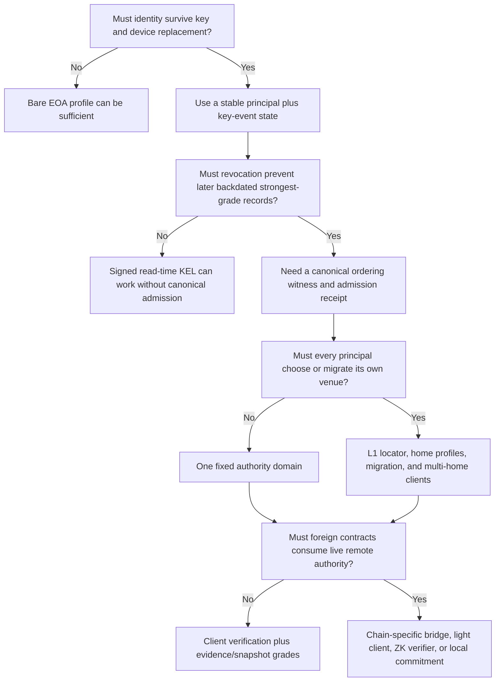

# EFS v2 — assumptions, requirements, and validation ledger

**Status:** draft reconciliation control; owner validation required
**Audience:** James, protocol designers, reviewers, and implementers
**Last touched:** 2026-07-22
**Authority:** requirements and assumptions inventory, not a byte-level specification and not an adoption of any undecided mechanism

#status/draft #kind/design #repo/planning #topic/efsv2 #topic/requirements #topic/assumptions

> **Why this exists.** EFS v2 has accumulated several good designs, but some documents turn a desired property into one particular mechanism and then treat that mechanism as settled. This ledger separates what EFS must accomplish from what we merely assume, what James has already chosen, and what still has to be proved.

Adopted owner rulings govern direction. This ledger governs **classification and blocker status**. Only a ratified requirement or invariant here constrains a technical spec; proposed requirements and recommendations do not. If two drafts conflict on an unratified question, neither wins—the joined surface remains blocked until James decides and the specs are reconciled.

## 1. The direct answer about chains and KEL homes

Blockchains do not natively call or inspect one another.

A KEL **authority home** means “the place whose ordering and finalized state answer who was authorized for this principal.” It does not create a communication channel between chains.

Three different operations have been blurred together:

```text
1. Locate authority     Where is Alice's authoritative KEL state?
2. Verify off-chain     Can a client check Alice's state and its finality?
3. Verify on-chain      Can a contract on chain X use Alice's remote state?
```

- A client can query several RPCs, verify proofs, group principals by venue, and compose a view.
- A contract on chain X cannot synchronously query chain Y.
- A foreign contract needs state delivered to it through a bridge, a light-client or ZK/finality verifier, a locally replicated commitment, or an explicitly trusted oracle/witness.
- Merely copying a signed record preserves evidence. It does not copy current KEL authority.

The current per-principal-home proposal actually contains at least three cross-chain systems:

1. each home authenticates the Ethereum-L1 locator;
2. clients authenticate each home's state and finality; and
3. foreign contracts authenticate selected remote facts.

Home migration adds a fourth: source, locator, and target must coordinate without ever allowing two authoritative admissions.

That is too much to assume into existence. It may be valuable later, but it is not required to get the main benefits of KEL.

### The narrower portability promise

The coherent promise is:

> **EFS base records, logical IDs, actor signatures, and evidence are copyable across chains without trusting the copier. Current KEL authority is rooted in an explicit authority domain; its receipts/proofs are portable but domain- and basis-bound. A foreign client may query and verify that domain; a foreign contract needs an installed verification adapter or a fully specified local commitment.**

This is still meaningful portability. It avoids pretending that chain-free record IDs imply chain-free current authority.

[[solana]] is the concrete substrate pressure test for this promise. It maps Ethereum, Solana, local, object-store, and content-addressed backends by capability and defines falsification gates; it does not select the authority topology.

[[ethereum-first-efs-and-os]] holds the broader exploratory frame: EFS may remain an Ethereum-strength protocol while the OS uses a smaller portable constitution and honestly graded local/network modes. It is not an adopted exception to the requirements in this ledger.

## 2. Vocabulary: do not mix these categories

| Category | Meaning | Example |
|---|---|---|
| **Owner ruling** | James has adopted this direction unless he reopens it | Public by default; chains persist and remain queryable |
| **Product requirement** | A user-visible outcome EFS intends to provide | A lost phone must not destroy a durable identity |
| **Protocol invariant** | A statement every conforming implementation must preserve | Unknown evidence never becomes absence |
| **Environmental assumption** | A fact outside EFS that the design relies upon | A selected chain remains economically writable and independently queryable |
| **Architecture hypothesis** | A proposed mechanism that might satisfy requirements | One authority home per principal selected from L1 |
| **Research bet** | A plausible but unproved future capability | Immutable homes can adopt future signature suites safely |
| **Implementation choice** | A concrete encoding, mapping, limit, or algorithm | One storage slot shape for a reverse index |
| **Measured unknown** | A question that should be answered by a prototype or benchmark | Whether a 256-principal lens is usable on a phone |

Rules for the design set:

1. A requirement says **what must remain true**, not which contract supplies it.
2. An assumption always names what breaks if it is false.
3. A hypothesis never becomes Etched merely because several later documents depend on it.
4. A measured unknown must have a test, owner, and pass/fail consequence.
5. “Cross-chain” always says whether it means copied bytes, client verification, or foreign-contract verification.
6. “Current” always names a chain and finalized basis. There is no unqualified global current state.

## 3. Recommended cross-pass baseline, pending ratification

These concepts are the strongest common baseline produced by the research passes. Most survive every credible topology, but the typed-lens and OS/package items remain proposed product architecture until James ratifies their corresponding requirements.

### Evidence and data

- Once admitted, signed record bytes are immutable evidence; availability and reconstruction depend on the stated durability tier.
- IDs and signing semantics are domain-separated, full-width, and chain-free where portability requires it.
- A signature proves who signed exact bytes. It does not prove a trustworthy time, current authorization, truth, privacy, or permission.
- Full authoritative bodies needed for reconstruction live in durable state, not only logs that may be pruned.
- Content authority resolves before transport. Arweave, IPFS/Filecoin, on-chain bytes, and other mirrors carry already-identified content; they do not become authors.
- Unsupported extensions and excessive work fail explicitly. Nothing silently truncates, silently weakens a grade, or turns unknown into absence.

### Identity and authorization

- A principal is a stable full-width identifier, not a wallet address, device key, app key, account, or claim about a legal person.
- Actor keys may be narrow, replaceable, revocable, and scoped.
- Current authority and historical authorship are separate questions.
- Identity recovery, funds recovery, and encryption recovery are separate powers and must not silently share one root.
- A bare self-signing EOA may remain a zero-setup evidence path even if it receives a weaker authorization grade.

### Files, graph, and lenses

- EFS is an append-only evidence graph with filesystem conventions. It is not POSIX and does not promise protocol delete, shared mutable cells, locks, or universal write ACLs.
- EFS nevertheless provides one deterministic read-only mounted projection on Linux, macOS, and Windows. Host adapters preserve canonical EFS identity and logical results rather than redefining the protocol around one host's filesystem rules.
- A lens is a typed, scoped, reproducibly compiled policy over evidence. It is not merely a global ordered author list.
- Evidence, reader policy, application capability, confidentiality, and transport are separate powers.
- Cross-venue reads carry an explicit basis vector. A client-composed view is not one atomic global snapshot.
- Core queries are described by capability first. Permanent storage layouts follow complete gas and state-growth measurements.

### Privacy and OS

- Content is public by default under James's current ruling; sensitive classes and explicit opt-in are encrypted before signing.
- Encryption can protect bytes. It does not make a public author, graph, funding path, receipt pattern, or timing pattern anonymous.
- Personal lens configuration is local or encrypted by default even when published content is public by default.
- EFS OS grants local, explicit capabilities. A view policy does not grant write, decrypt, wallet, or network authority.
- Packages are identified by reproducible closures and activated as rollback-capable generations. Update-channel trust is purpose-specific policy, not ambient vendor authority.

### Century preservation

- “100 years” is an operating discipline, not a one-time storage claim.
- The preservation set includes formats, records, receipts, identity history, proofs or proof bases, content, encryption metadata, recovery material where intended, and independent implementations.
- Cryptography must be renewed before it becomes forgeable or undecryptable. A broken algorithm cannot be repaired retroactively by prose.
- A clean implementation must be able to rebuild from public state and explicit exports without EFS-operated infrastructure.

## 4. Requirements register

The requirement IDs are stable handles for design reviews.

**Status legend:**

- `Adopted` or `Adopted/derived` means an owner ruling already constrains the design.
- `Required invariant`, `required safety boundary`, or `required honesty boundary` means the synthesis considers it necessary to make the named feature coherent. It is still **awaiting owner ratification** unless the status explicitly says adopted/derived.
- `Proposed` means strongly recommended but still needs explicit validation.
- `Needs explicit validation` is a load-bearing product choice whose answer may remove or reshape downstream requirements.
- A row may therefore be technically mandatory **if a feature ships** without yet being an adopted EFS product requirement.

### Mission and durability

| ID | Requirement | Status | Acceptance evidence |
|---|---|---|---|
| **R-M1** | EFS is a durable archive and evidence graph with filesystem/social conventions, not an ephemeral feed | Proposed | James ratifies the mission; representative app journeys agree |
| **R-M2** | An independently written implementation can reconstruct authoritative records and required indexes without a hosted EFS indexer | Adopted/derived from the no-indexer owner direction | Clean-room reconstruction drill from chain state and documented exports |
| **R-M3** | The century claim includes periodic export, retrieval, format, proof, and cryptographic-renewal exercises | Proposed | Versioned preservation runbook and recurring walk-away drill |
| **R-M4** | Carrier failure does not change authorship or content identity | Required invariant | Mirror-fallback vectors verify bytes against the selected commitment |
| **R-M5** | Every durability claim names what is durable: record, state, bytes, index, encryption key, or availability | Required invariant | Capability/durability matrix has no unqualified “permanent” cells |

### Records and kernel

| ID | Requirement | Status | Acceptance evidence |
|---|---|---|---|
| **R-D1** | Signed record semantics and logical IDs remain stable when exact bytes are copied between venues | Required for current portability direction | Cross-language, cross-chain golden vectors |
| **R-D2** | Every principal, target, slot, index, ABI, and lens preserves the full `bytes32` principal | Required invariant | Collision tests using principals with identical low 160 bits |
| **R-D3** | Required bodies and reconstruction data are state-readable rather than log-only | Adopted direction | State-only rebuild after old logs are unavailable |
| **R-D4** | The protocol separates raw evidence admission from authoritative admission | Proposed, required if R-K3 is adopted | Two-lane state machine and lane-labeled indexes |
| **R-D5** | Limits fail explicitly and deterministically; no result silently truncates | Required invariant | Boundary and adversarial work-limit vectors |
| **R-D6** | Unsupported record kinds, suites, and proof profiles fail closed | Required invariant | Unknown-extension conformance tests |
| **R-D7** | A record's semantic identity is independent of arrival order, carrier, relayer, and foreign replication | Required invariant | Permutation and replay tests |
| **R-D8** | Principal/authorship authority never derives from `msg.sender`, a relayer, paymaster, wallet vendor, or submission rail; one exact actor witness authorizes an envelope | Required invariant | Relayer/paymaster/account-adapter substitution vectors |
| **R-D9** | `order` is author-controlled ordering, not uniqueness, nonce, or trusted chronology; `claimedAt` is testimony; `admittedAt` is venue-relative existence evidence, not data freshness | Proposed freeze-sensitive semantics | Cross-language time/order vectors and misleading-clock tests |

**EIP-8130 cross-check (2026-07-19):** native transaction actor and payer context is useful venue evidence and an adapter input, but cannot satisfy R-D8 by itself because it authenticates a chain-bound transaction rather than the portable envelope witness. Its 2D/nonce-free transaction nonces likewise do not replace R-D9's record-order semantics. Test the substitution boundaries in [[Reviews/2026-07-19-base-native-aa-impact]].

### KEL and authority

| ID | Requirement | Status | Acceptance evidence |
|---|---|---|---|
| **R-K1** | A durable principal survives routine phone, wallet, app-key, and organization-signer changes | Adopted direction | Loss, rotation, delegation, and organization fixtures |
| **R-K2** | Actors are scoped and replaceable; ordinary apps do not receive principal control | Adopted KEL direction; exact grant grammar proposed | Grant attenuation model and capability abuse tests |
| **R-K3** | A revoked actor cannot later create strongest-grade records by signing and backdating | **Needs explicit validation; load-bearing** | Owner decision plus stolen-live-key formal scenarios |
| **R-K4** | If R-K3 is adopted, strongest-grade historical authorship binds authorization to an external canonical order | Derived requirement | Admission receipt and finality-basis model |
| **R-K5** | Current controller and historical authorized actor are independently answerable | Proposed | Separate APIs and fixtures for both questions |
| **R-K6** | Recovery cannot silently seize funds or decrypt data merely because it recovers identity | Required safety boundary | Independent roots and recovery matrix |
| **R-K7** | Authority transitions are prospective; past admitted evidence is not silently rewritten | Required invariant | Rotation/recovery/revocation history tests |
| **R-K8** | Bare, KEL, snapshot, and evidence-only records expose honest, non-confusable grades | Proposed | Closed grade vocabulary and downgrade tests |
| **R-K9** | Safety-critical contract gates never treat signature-only or stale foreign evidence as current authority | Required safety invariant if EFS supports gates | Gate conformance tests and stale-copy fixtures |
| **R-K10** | Algorithm succession never creates an undisclosed mutable global administrator | Required cypherpunk boundary | No-admin audit and explicit successor path |
| **R-K11** | The authority scope is explicit: global protocol profile, independent deployment/realm, or per-principal selection. Two domains cannot both claim unqualified `CURRENT` authority for the same principal | **Needs explicit sovereignty decision** | Domain/identity naming model and competing-deployment fixtures |
| **R-K12** | Authority-kernel succession has exactly one active kernel at a basis, prevents dual admission, and keeps old receipts verifiable | Required even for same-chain succession | Atomic cutover model, code authorization, rollback/reorg tests |

### Cross-chain behavior

| ID | Requirement | Status | Acceptance evidence |
|---|---|---|---|
| **R-X1** | Copied artifacts preserve verifiable bytes, IDs, signatures, and provenance | Adopted direction | Copy-forward golden vectors |
| **R-X2** | A client can distinguish portable evidence, an as-of authoritative snapshot, and live current authority | Proposed | Grade/basis API and stale-snapshot UX tests |
| **R-X3** | Every result claiming admitted, snapshot, or current authority identifies its source domain, finalized basis, proof profile, and freshness semantics. Raw portable evidence instead identifies artifact bytes, signature suite, and observed carrier/venue without inventing finality | Required invariant | Basis-vector and evidence-only conformance tests |
| **R-X4** | Foreign local storage never silently becomes a second authority history | Adopted direction | Import-lane and local-index rules |
| **R-X5** | A foreign contract uses remote authority only through an explicit installed adapter or local commitment | Physical/system boundary | One adapter prototype and fail-closed no-adapter behavior |
| **R-X6** | EFS does not promise a synchronous, atomic, globally current view across independent chains | Required honesty boundary | Product wording and application compatibility tests |
| **R-X7** | Every local-commitment profile names its updater, authentication source, monotonicity/rollback rule, finality lag, expiry/freshness, challenge/failure behavior, and trust class | Required invariant | Owner-pinned, bridge-derived, and oracle/witness fixtures |

### Lenses and graph queries

| ID | Requirement | Status | Acceptance evidence |
|---|---|---|---|
| **R-L1** | One source policy deterministically compiles to the same bounded policy in independent implementations | Proposed | Rust/TypeScript differential vectors |
| **R-L2** | A lens is typed and purpose-scoped; content, filenames, moderation, packages, and contract gates need not share policy | Proposed | Product examples and compiler type checks |
| **R-L3** | Imports, cycles, diamonds, combiners, and limits have deterministic semantics | Proposed | Adversarial compiler corpus |
| **R-L4** | A normal personal lens supports roughly 50 principals; 256 is a contingent research/benchmark target, not an adopted ceiling | 50+ owner concern; 256 measured unknown | Mobile/desktop benchmarks at 50, 100, and 256 |
| **R-L5** | Exact point queries and bounded candidate enumeration work from on-chain state for the adopted core capability list | Proposed | Real consumer contracts and full-bundle gas tests |
| **R-L6** | Absence and completeness claims name the authority venue and proof basis; omission is not proof of absence | Required invariant | Omission, pagination, reorg, and stale-basis tests |
| **R-L7** | Contract gates use small pinned policies or locally materialized roots; they do not recursively query arbitrary social graphs | Proposed boundary | Gate prototype with bounded worst-case work |
| **R-L8** | The risk bearer selects policy; no universal content/advisory lens exists; a caller cannot supply the policy that authorizes itself; safety/package gates stop rather than silently activating lower authority after removal | Proposed lens-sovereignty boundary | Self-authorization, removal, fallthrough, and package-compromise fixtures |

### Privacy

| ID | Requirement | Status | Acceptance evidence |
|---|---|---|---|
| **R-P1** | Sensitive-class and user-opted-private plaintext is encrypted before any public signing or publication | Adopted direction | Sensitivity-policy and leak-path tests |
| **R-P2** | Product language promises confidentiality, not anonymity or invisible metadata | Proposed explicit boundary | Threat-model and copy review |
| **R-P3** | Recoverable and intentionally shreddable private data are separate tiers | Proposed | Loss/recovery/shred fixtures |
| **R-P4** | Public persona, private persona, actor, and disposable stealth address are not conflated | Proposed | Identity/privacy journey tests |
| **R-P5** | Private and public personas are not co-batched or linked by shared operational defaults | Proposed | Wallet/funding/submission metadata red team |
| **R-P6** | Encryption profiles have canonical associated data, deterministic parsing, transplant resistance, and known-answer vectors | Required invariant | Independent crypto review and KAT suite |
| **R-P7** | Signing, KEM, archive encryption, scan, vault-wrap, and shred roots are separated; signature-derived archive roots are forbidden | Required safety invariant | Key-role and recovery matrix plus cross-role misuse tests |
| **R-P8** | Private-tier and public-tier records never share one envelope; KEM generations, compromise rotation, historical decryption, rewrap, and accepted inbound-share recovery are explicit | Proposed launch requirement | Mixed-envelope rejection and lifecycle/device-loss fixtures |
| **R-P9** | Integrity verification never implies interest privacy; raw RPC, OHTTP, snapshot, and local-replica modes disclose their distinct observers and guarantees | Required honesty boundary | Network-observer and query-correlation tests |

### EFS OS

| ID | Requirement | Status | Acceptance evidence |
|---|---|---|---|
| **R-O1** | Apps receive explicit least-authority handles, not ambient filesystem, network, wallet, identity, or decryption power | Proposed cypherpunk boundary | Capability abuse suite |
| **R-O2** | Unverified bytes never become executable or trusted rendered state | Proposed | Verified-read vertical slice and malicious RPC fixtures |
| **R-O3** | Package closures are reproducible, exportable, hash-addressed, health-gated, and rollback-capable | Proposed | Two independent rebuilders and rollback drills |
| **R-O4** | Update trust is a typed purpose-specific lens, not a vendor key with ambient authority | Proposed | Compromised-channel fixtures |
| **R-O5** | Browser eviction and device loss do not masquerade as protocol deletion | Required honesty boundary | Forced-eviction and clean restore tests |
| **R-O6** | If the browser cannot enforce the cage on a supported platform, the product discloses the weaker boundary or uses a stronger host | Proposed | Chrome, Firefox, Safari, and iOS cage matrix |
| **R-O7** | System Chrome owns consequential consent and trusted display; an app cannot draw or approve its own wallet, identity, recovery, or authority prompt | Proposed safety boundary | UI-redressing and confused-deputy tests |
| **R-O8** | Pending local/outbox state never masquerades as confirmed authority-domain state | Required truth boundary | Offline, rejected, reorged, and delayed-admission UX fixtures |
| **R-O9** | App network denial and endpoint/query privacy are separate controls; a verified response is not necessarily privately retrieved | Required honesty boundary | Capability and traffic-observer tests |
| **R-O10** | The same EFS view is mountable read-only on Linux, macOS, and Windows through ordinary shell and graphical file-manager workflows; Linux FUSE alone does not satisfy the requirement | **Adopted owner requirement** | One cross-adapter golden fixture; exact directory/property enumeration; portable-name collision vectors; pinned handles; verified range reads; honest `UNKNOWN`; all mutations fail read-only |

## 5. Adopted owner assumptions and their limits

Owner rulings are inputs, not laws of nature. Each still needs a named reopening condition.

| ID | Adopted assumption or direction | What it buys | What it does **not** buy | Reopen if… |
|---|---|---|---|---|
| **A-1** | Supported blockchains persist indefinitely and remain queryable | Removes dead-chain identity and currency machinery | Guaranteed RPC access, censorship resistance, affordable writes, retained logs, state availability, or valid old crypto | A chosen venue loses independent queryability, affordable inclusion, or reliable state |
| **A-2** | Cross-chain copies are best-effort snapshots; authoritative reads go to the authority domain | Avoids cross-chain fork choice | Foreign-contract current authority or atomic global reads | A target app truly requires synchronous foreign-contract authority |
| **A-3** | Content is public by default; sensitive and opted-in material is private | Supports shared discovery while protecting named classes | Automatic anonymity, correct classification, or metadata privacy | User tests show unsafe misclassification or unacceptable surprise |
| **A-4** | Core filesystem/graph behavior works from on-chain state without a trusted indexer | Gives durable independent reconstruction and bounded reads | Every global sort, analytical query, or cheap arbitrary composition | Full-bundle gas/state measurements are unacceptable |
| **A-5** | Storage starts with on-chain state plus Arweave, with optional Filecoin/IPFS mirrors | Multiple carrier properties and copy-forward recovery | Carrier economics or availability forever | Retrieval/repair drills or economics fail |
| **A-6** | KEL is worth designing; bare EOA remains the day-one path | Supports rotation, recovery, actors, organizations, passkeys, and future suites | A requirement for arbitrary homes, L1 location, or migration | KEL UX/security costs exceed the validated product requirements |
| **A-7** | Real lenses need roughly 50 principals in the normal case | Forces realistic scale work | A 256-principal portable ceiling or fifty separate authority domains | Product evidence shows a different distribution |

## 6. Load-bearing assumptions, obligations, and acceptance decisions

These used to be mixed together as things the environment might provide. They are different kinds of risk.

### External assumptions

| ID | Assumption | If false | Validation or mitigation |
|---|---|---|---|
| **E-1** | The authority venue has durable finality semantics that clients can verify | “Authoritative” reduces to trusting an RPC | Specify one finality profile and build a proof-verifying client |
| **E-2** | Users can get transactions included despite censoring relayers or sponsors | Rotation, recovery, revocation, and admission can be blocked | Test direct submission, force inclusion, multiple sponsors, and escape UX |
| **E-3** | Authority writes remain affordable for ordinary use | Per-record admission or recovery becomes unusable | Benchmark real journeys and define fee/sponsorship ceilings |
| **E-4** | State needed for reconstruction stays retrievable even if old logs are pruned | The full-body spine is incomplete | State-only clean-room reconstruction and archival diversity |
| **E-5** | Browser engines expose controls strong enough for the proposed application cage | Web OS apps retain ambient powers | Cross-engine prototype; provide native/strong-host path if needed |
| **E-6** | Large-content carriers remain economically repairable without a mandatory EFS incentive layer | Hashes survive while bytes disappear | Health labels, independent mirrors, repair loops, and annual retrieval tests |

### EFS-funded operational obligations

| ID | Obligation | Failure if omitted | Acceptance evidence |
|---|---|---|---|
| **O-1** | Maintain at least two independent implementations and RPC/data paths | One vendor becomes de facto authority | Independent verifier/client builds and clean-room interop |
| **O-2** | Operate or explicitly fund monitoring, carrier repair, proof renewal, and format migration | Recovery delays and century preservation become theater | Named owners, budget, alerts, drills, and export custody |
| **O-3** | Schedule cryptographic transition before old primitives fail | Old authorship or ciphertext becomes forgeable or unreadable | Algorithm inventory, conservative deadlines, and renewal drills |
| **O-4** | Make browser eviction/device loss survivable through exports, public state, and separate secret recovery | Local generations, drafts, or keys disappear | Forced-eviction and device-loss drills |

### Product/security acceptance decisions

| ID | Decision to accept or reject | Consequence | Validation |
|---|---|---|---|
| **V-1** | Ordinary people can use the recovery design safely enough, despite helper compromise and social engineering | Stable principals otherwise increase blast radius | Formal safety/liveness model plus nontechnical recovery trials |
| **V-2** | Public metadata from KEL grants, receipts, indexes, funding, and traffic is acceptable under the stated privacy promise | Otherwise the privacy positioning is misleading | James decision after metadata red team and minimization pass |

## 7. Architecture hypotheses that must stop masquerading as requirements

| ID | Candidate hypothesis | Hidden commitments | Simpler alternative | Validation |
|---|---|---|---|---|
| **H-K1** | Every principal chooses one authority home | Multi-home clients, privacy leakage, heterogeneous finality, fee/censorship choice | One fixed EFS authority domain | Compare the same journeys and threats under both profiles |
| **H-K2** | Ethereum L1 stores a sparse `HomeRegistry` for every principal | L1 registration/sponsorship, L1-to-home proofs, registry succession | Authority domain implicit in the protocol profile | Implement and cost the minimal locator before adopting it |
| **H-K3** | Principals migrate between homes without changing identity | Source/L1/target adapters, no-dual-admission model, partial-failure recovery | Defer migration; use same-domain successor contracts or successor identity | Formal model and adversarial prototype |
| **H-K4** | Arbitrary home classes can share one `AuthProof` abstraction | A verifier/finality profile per chain class | Support exactly one authority profile in v2 | End-to-end proof verification for every claimed class |
| **H-K5** | Fifty principals across fifty homes is acceptable UX | RPC fan-out, timing leakage, partial failure, non-atomic basis | One shared domain or locally cached/materialized policies | Cold mobile benchmark at 1/5/50 domains |
| **H-K6** | Bare and one-shot stealth EOAs can receive strongest authority with zero setup | Default home, sponsored registration, or privacy-leaking locator write | Signature-only evidence until admitted; no safety gates | User journey and privacy analysis |
| **H-K7** | Immutable homes can add P-256 and post-quantum suites later | Frozen dispatch, extension governance, migration, downgrade rules | Same-domain successor kernel with explicit transition | Byte-level prototype and external crypto review |
| **H-D1** | Full bodies plus every proposed index are affordable forever | State growth and permanent write costs | Narrow the core query set after product validation | Full-bundle gas/state-growth benchmark |
| **H-D2** | Append-only postings with read-time filtering remain usable for a century | Bootstrap proportional to historical churn | Exact current sets, counters, or authenticated compaction | Multi-decade churn simulation |
| **H-L1** | Typed policies compile deterministically and cheaply at 256 principals | Cycles, imports, combiners, proof bases, cache invalidation | Smaller portable profile or local-only complex policy | Independent compilers and adversarial vectors |
| **H-L2** | Bounded candidates plus exact point reads satisfy contract consumers | No canonical global order or arbitrary aggregate | Add a purpose-specific materialized root/index | Build actual consumer contracts before storage freeze |
| **H-P1** | The proposed committing-AEAD and X-Wing profile is safe and implementable | Custom canonical profile, library maturity, long-lived ciphertext | Mature launch subset with explicit renewal | External cryptographic review and KATs |
| **H-P2** | Encrypted dirnodes are enough for launch private folders | Hidden-path grants and cross-client interoperability | Exact visible outer-object grants for v1 | Sharing/rename/recovery/authorization prototype |
| **H-O1** | A static browser-hosted OS can provide strong confinement everywhere | CSP/Worker/header differences and browser storage eviction | Served-header or native wrapper lane | Cross-browser cage matrix |
| **H-O2** | Light-client/state-proof reads are fast enough for “unverified bytes never render” | Boot time, RPC proof support, finality delays | Honest grade separation and cached verified bases | Real vertical slice on target devices |

## 8. The KEL decision tree

Answer these in order. Later questions disappear when an earlier answer is “no.”



The hard requirement currently motivating home admission is **R-K3**: a revoked actor must not regain strongest authority by signing later and backdating. If James relaxes R-K3, KEL can be much simpler. If he keeps it, EFS needs an ordering witness—but still does not need arbitrary per-principal homes.

## 9. Coherent KEL architecture choices

### Option A — portable-capability KEL, no canonical authority domain

Each venue or reader validates a signed key-event/grant chain. Revocations propagate as records; short expiries bound risk.

**Gains:** maximum native copy-forward use; no locator, bridge, or migration system.

**Loses:** globally definite current control, immediate revocation, and strong protection from a removed key signing later and backdating. Competing KEL branches require reader policy.

Choose only if portability matters more than definitive admission-time authorization.

### Option B — one fixed EFS authority domain for one protocol profile

One protocol profile names one authority venue. That venue hosts the **complete authoritative graph for its strongest-grade lane**: record bodies, KEL state, scoped grants, admission receipts, revocations, canonical slots, and the required indexes/commitments for bounded reads and absence claims. Large content bytes may remain on independent carriers, but canonical record/slot authority cannot be split across arbitrary chains without recreating the cross-chain join.

- The authority domain is implicit in the v2 protocol profile.
- Base record bytes, logical IDs, and actor signatures remain chain-free and copyable. `AuthReceipt`, `AuthProof`, and authoritative grades are portable but explicitly bound to the authority domain, code, block/state, and finality basis.
- Foreign clients query or verify the fixed authority domain.
- Foreign contracts require explicit chain-specific adapters or consume only a local/as-of commitment.
- Bare offline writes remain evidence until admitted.
- Future verifier versions use a defined same-domain successor path.
- Per-principal home selection and cross-chain migration are deferred.

**Gains:** preserves stable identity, scoped actors, prospective revocation, and historical authorization while deleting the L1 locator, heterogeneous finality, fifty-home lens fan-out, and cross-chain migration from the comparison prototype.

**Costs:** every strongest-grade write passes through one profile's fee, censorship, throughput, state-growth, and availability domain; content-carrier writes may still be separate; adapters remain necessary for foreign contracts.

This does not answer whether EFS accepts one globally privileged venue. Multiple permissionless protocol profiles would either need domain-qualified authority/identity semantics or a higher-level selection rule; otherwise two profiles could both claim “current” for the same portable principal. **Prototype Option B first for comparison because it is the smallest strong-authority state machine. Do not treat it as an adopted minimum until James answers the sovereignty question in D-2.**

### Option C — immutable per-principal home chosen at inception

Each born-KEL principal commits one home forever. Bare identities use a protocol default. Moving creates a successor principal rather than moving the same principal.

**Gains:** user-selected venues without an L1 locator or migration state machine.

**Costs:** multi-home client fan-out remains; foreign contracts still need adapters; a bad home choice can strand authority; stable identity does not survive a venue change.

### Option D — L1 locator plus migratable per-principal homes

This is the current maximal proposal. It may be a valuable later sovereignty profile, but it requires all of the following before it is credible:

- supported-home finality profiles;
- L1-to-home and home-to-L1 proof adapters;
- foreign-contract verification profiles;
- empty-locator and sponsored-registration behavior;
- a no-dual-admission migration model under reorg and partial failure;
- registry-version succession without an administrator;
- multi-home lens performance and privacy controls; and
- formal and external security review.

It should be treated as a research track, not the default minimum-v2 assumption.

## 10. Proposed authorization/evidence-basis grades

These are one axis of the final result model, not the whole grade vocabulary. Slot state, freshness, currency/completeness, resolution, advisory results, and availability remain orthogonal. The final names are a spec decision, but these distinctions must survive:

| Grade | Meaning |
|---|---|
| **PORTABLE-EVIDENCE** | Exact bytes and actor signature verify; no canonical admission claim |
| **AUTHORITY-ADMITTED** | Observed directly at the authority domain, or proven under a recognized finalized basis, that the actor/grant was valid at admission order |
| **SNAPSHOT@H** | Authority state and admission were verified at finalized basis `H`; may now be stale |
| **CURRENT@H** | Latest finalized basis accepted under a named finality/freshness policy at an `observedAt` time; carries basis age and never means eternally current |
| **FOREIGN-LOCAL** | A foreign venue stored or indexed the artifact; this says nothing new about authority |

Never compress these to a Boolean `valid`. Applications must state the minimum grade they accept. Safety-critical `GATE` evaluation should fail closed on evidence-only, unknown, stale-beyond-policy, or unrecognized proof profiles.

A foreign “local commitment” is not automatically trustless. Its profile must expose who updates it, how remote state is authenticated, how rollback/monotonicity works, its finality lag and expiry, challenge/failure behavior, and whether the risk bearer pinned it, a bridge derived it, or an oracle/witness asserted it.

## 11. Human decisions requiring eventual disposition

> **2026-07-22 sequencing hold:** treat this section as the canonical issue inventory, not a packet to answer immediately. Revalidate KEL/authority and lens/resolver semantics against native mounts, Solana/independent realms, required enumeration, and signed local/network modes first; then revise and route the surviving choices through [[owner-decision-inbox]]. Adopted rulings remain in [[owner-rulings]].

These are intentionally written as product choices, not cryptographic jargon. Recommended choices are provisional until James adopts them.

> **Decide first:** D-1, D-2, and D-3 determine almost all KEL and cross-chain scope. D-4 through D-7 are conditional on those answers. D-8 through D-16 are independent mission/product choices.

### D-1 — Do we require definitive protection from post-revocation backdating?

**Example:** Alice revokes a stolen phone on Tuesday. On Friday, the phone signs a note claiming it was written Monday.

- **Yes:** only material admitted while the phone was live gets strongest historical authority. This requires a canonical ordering witness and receipt. **Recommended; this is the main reason to build home admission.**
- **No:** readers evaluate signed KEL history and declared times. Simpler and more portable, but the Friday signature may remain ambiguous.

### D-2 — What sovereignty and authority scope is acceptable?

**Example:** if two people deploy otherwise identical EFS authority kernels on two chains, can both claim that the same portable principal is currently Alice?

- **One named protocol profile uses one fixed authority domain containing the complete authoritative graph:** bodies, KEL, grants, admissions, revocations, canonical slots, and required indexes. This is the smallest strong-authority design, but privileges one fee/censorship/throughput domain. **Recommended first prototype for comparison; adoption requires James to accept that sovereignty tradeoff.**
- **Permissionless independent EFS realms/profiles.** Authority and possibly principal names become domain-qualified; there is no unqualified global `CURRENT` without another selection layer.
- **One immutable home per principal.** More individual venue choice, but multi-home clients/adapters and no same-principal move.
- **L1 locator plus movable homes.** Maximum individual choice and complexity; keep as later research unless a real use case justifies it.

A “fixed authority domain” that stores only KEL/receipts while canonical records and slots live on arbitrary chains is not the simple option; it recreates a cross-chain authorization/data join.

### D-3 — What cross-chain contract promise do we make?

- **Clients can verify remote authority; contracts need an explicit adapter or fully disclosed local-commitment profile. Recommended.**
- **Every supported foreign contract can verify live authority.** This commits EFS to bridges/light clients/proof systems for every supported pair and must be funded as a separate platform.

### D-4 — What can a zero-setup bare or disposable stealth EOA do?

- **Publish portable evidence immediately; strongest admission arrives only after authority-domain admission. Disposable stealth actors cannot authorize safety-critical gates. Recommended.**
- Give every unregistered EOA an implicit default-home rule and strongest grade.
- Require registration before any recognized use, sacrificing zero setup.

Durable private pseudonyms should normally be separate full KEL principals. One-shot stealth addresses are an unlinkability tool, not miniature recoverable identities.

### D-5 — If D-2 chooses a named domain/profile, which venue classes are in v2?

- **Exactly one measured, named venue/finality profile. Recommended.** Choose it after cost, finality, censorship, force-inclusion, proof, and RPC-diversity tests.
- Ethereum L1 only.
- Ethereum-settled rollups as a class.
- Arbitrary EVM chains.

The broader the class, the more consensus and finality verification EFS must own. “EVM-compatible” does not mean “same trust or proof model.”

### D-6 — If D-2 permits per-principal homes, is same-principal cross-chain migration a v2 requirement?

- **No. Defer it; provide same-domain contract succession and an explicit future identity-successor story. Recommended.**
- Yes. Then migration, registry succession, proof adapters, and no-dual-admission formal verification are freeze blockers.

### D-7 — How should future signature suites become authoritative?

- **A frozen same-domain successor mechanism with exactly one active kernel, atomic cutover, old-receipt verification, explicit user transition, and downgrade rules. Recommended direction; exact design still needs review.**
- Pre-freeze a generic verifier-extension hook, increasing eternal attack surface.
- Keep new suites evidence-only for old identities.
- Depend on home migration, which reintroduces D-6.

### D-8 — What does “100 years” require?

- **Live authoritative query plus periodic exports, independent reconstruction, content repair, format preservation, and cryptographic renewal. Recommended.**
- Passive storage only. This is simpler wording but is not a credible century-access promise.
- Offline verification after every supported chain disappears. This conflicts with the adopted chains-persist simplification and should remain out of scope unless James reopens it.

### D-9 — What does “works on-chain” mean?

- **Complete state plus bounded keyed queries per authority venue/profile; clients compose cross-chain/global views; foreign transaction gates use explicit adapter/local-commitment profiles. Recommended.**
- Canonical globally sorted pages and arbitrary cross-chain composition in contracts. This requires materially different permanent indexes/proof systems.

### D-10 — What lens scale is constitutional?

- **50-principal normal case, 256-principal portable ceiling if independent compiler and mobile benchmarks pass. Current recommendation.**
- Smaller frozen ceiling with larger policies explicitly local/off-chain.
- Unbounded policies, which are incompatible with predictable verification work.

### D-11 — Confirm the privacy product boundary

- **Public content by default; sensitive and opted-in content encrypted; confidentiality promised; anonymity not promised. Current owner direction, wording still needs ratification.**
- Private by default.
- Add an anonymity objective, which requires a much larger redesign of identity, receipts, indexes, funding, and traffic.

### D-12 — What host boundary must EFS OS support?

- **Browser-first, but ship only where the measured cage works; offer a stronger served-header/native lane when it does not. Recommended.**
- Static browser-only on every platform, accepting weaker confinement where necessary.
- Native wrapper first, changing distribution and portability assumptions.

### D-13 — Is the typed compiled-lens model the constitutional policy primitive?

- **Yes: typed, purpose-scoped source policies compile reproducibly into bounded execution policies. Recommended.** Flat ordered authors remain an editor view and one `PRIORITY_FIRST_PRESENT` slice, not universal authority.
- Keep one flat ordered author list as the universal lens. Simpler, but conflates content, filenames, moderation, packages, and gates and does not express the reviewed 50+ use case safely.

Also ratify the lens-sovereignty boundary: the risk bearer selects policy; no caller supplies the policy that authorizes itself; personal instances are local/encrypted by default; and safety/package gates stop rather than silently activating a lower source after removal.

### D-14 — Is the least-authority EFS OS trust model constitutional?

- **Yes: apps receive explicit handles, run without ambient network/wallet/identity/decryption power, render through Shell-owned surfaces, and cross consequential boundaries through trusted System Chrome. Recommended if the selected D-12 host can enforce it.**
- No: ordinary ambient-authority applications may own their DOM/network/wallet interactions. Easier, but abandons the strongest confinement claim.

This chooses authority semantics. D-12 separately chooses whether a browser, served-header app, or native wrapper hosts that model. It does not approve the unfinished UI schema, quotas, or product name.

### D-15 — Is the reproducible package/update model required?

- **Yes: packages are reproducible hash-addressed closures; activation creates health-gated rollback-capable generations; update trust uses a purpose-specific fail-closed policy. Recommended.**
- Signed mutable vendor channels are sufficient. Simpler, but reintroduce ambient publisher trust and weaker rollback/rebuild guarantees.
- Defer third-party executable packages and ship only built-in applications initially.

### D-16 — What private-data recovery contract is constitutional?

- **Separate recoverable and shreddable tiers, use independent random roots, and never derive archive encryption from a wallet signature. Recommended.** Recoverable data has explicit recovery material; shreddable data honestly sacrifices recovery and remains limited by recipient/plaintext copies.
- Recoverable-only launch, deferring any shredding claim.
- One shared recovery hierarchy for all private data. Simpler, but cannot honestly promise both total-loss recovery and intentional key destruction.

Exact AEAD/KEM algorithms, hidden-subtree sharing, stranger-announcement feeds, and bulk-unlock derivations remain later cryptographic/ceremony choices after this product contract is adopted.

### Secondary KEL choices after D-1 through D-7

These matter, but none should be allowed to select the authority topology implicitly:

| ID | Question | Current recommended direction | Assumption to validate |
|---|---|---|---|
| **D-K13** | How does a legacy bare EOA reserve its future KEL upgrade before theft? | One append-once commitment only after the client exports and tests the complete recovery kit | A user can preserve every committed factor; losing all factors may permanently block that activation path |
| **D-K14** | How does a smart-account-only user begin? | The deployed account makes one direct inception call to appoint portable EFS authority; ERC-1271/6492 is an account adapter, not eternal record authority | The account can submit on the selected authority domain and its deployment semantics are unambiguous |
| **D-K15** | Are personal principals transferable? | No recognized personal-principal sale/transfer; organizations rotate controllers and may later receive an explicit succession profile | Reputation transfer would otherwise turn identity history into a saleable asset |
| **D-K16** | What is the ordinary recovery composition? | Heterogeneous, delayed, observable recovery with separate identity, funds, and encryption outcomes | Users can complete it; monitors exist; helpers cannot cheaply collude or socially engineer control |
| **D-K17** | Which actor details and reverse indexes are public? | Preserve only facts needed for verification and contracts; no human-readable device labels | Public KEL metadata remains an acceptable privacy cost after red-team measurement |

## 12. What can be reconciled now

The following status corrections and cross-pass bug fixes do not require selecting a KEL topology. Their eventual normative promotion still follows owner ratification wherever the register marks the underlying requirement proposed:

1. Make the source hierarchy explicit: owner rulings → ratified requirements → future system constitution → self-contained technical specs → process sheets → historical reviews; this ledger controls classification/blockers, not automatic adoption.
2. Remove “Etched” labels from surfaces that KEL, lenses, privacy, or full-width principals have reopened.
3. Preserve full-width principals across every normative ID, ABI, index, target, and lens.
4. Separate evidence, policy, capability, confidentiality, and transport in every document.
5. Replace unqualified “cross-chain verification” with copied evidence, client verification, or foreign-contract verification.
6. Replace unqualified “current” with a venue and finalized basis.
7. Remove the global same-`(principal, order)` equivocation rule; one envelope may legitimately contain several records at one order.
8. Make personal lens instances local/encrypted by default while allowing public starter templates.
9. Remove wallet-signature-derived encryption roots; identity, funds, and encryption recovery remain separate.
10. Treat `act` as provenance only; KEL grants and admission determine authority.
11. Strip dead-chain survival gates while retaining pruning, state retrieval, reach, and active preservation work.
12. State that on-chain completeness is per venue; cross-venue interactive views are client-composed.

## 13. What must wait for decisions or measurements

Do not settle these through editorial merging:

- the final KEL topology and authority venue;
- L1 `HomeRegistry`, empty-locator behavior, and cross-chain home migration;
- exact receipt, claim-admission, and finality-proof bytes;
- suite succession and downgrade rules;
- bare and stealth strongest-grade behavior;
- exact lens encoding, channel state, and gate-visible collision flags;
- hidden-subtree private authorization;
- claimant, child, reverse, self-enumeration, compaction, and live-counter storage shapes;
- globally sorted contract-native directory pages;
- the final committing-AEAD/KEM profile;
- the browser/static/native confinement boundary.

## 14. Reconciliation order after the top decisions

> **Sequencing clarification (2026-07-22):** this remains the dependency order once the top choices are ready. It is not the immediate work order. The joined research sequence in [[ethereum-first-efs-and-os#11. Research-to-MVP sequence]] now precedes the decision packet so the cases and recommendations below do not fossilize assumptions invalidated by the new pressure tests.

1. Adopt or edit D-1 through D-16 and record them in `owner-rulings.md`.
2. Write a short `system-constitution.md` containing only settled boundaries and vocabulary.
3. Re-cut `kel.md`, `codex-envelope.md`, `deterministic-ids.md`, `codex-kinds.md`, and `codex-kernel.md` together. Their identities and admission semantics cannot be changed independently.
4. Replace the current lens specification with the typed compiled-policy model; preserve the old review corpus as history.
5. Finalize on-chain query capabilities and storage only after the complete gas/state benchmark.
6. Reconcile privacy with the chosen actor, persona, admission, private-folder, and proof semantics.
7. Re-cut EFS OS around the resulting verified-read, identity, lens, package, and capability APIs.
8. Rewrite the human overview last so it describes adopted architecture, not candidate machinery.

Historical handoffs, snapshots, and research corpora should remain available as the reason trail but must stop appearing in the normative reading path.

## 15. Validation program

### Before choosing an authority profile

- Model bare, fixed-domain, immutable-per-principal, and migratable-home profiles against the same user stories and threats.
- Measure authority-domain admission, rotation, revocation, recovery, and 50/100/256-principal read costs.
- Prototype one verified finality/state-proof path; an RPC response alone is not a portable proof.
- Build one foreign-chain gate using a local commitment or adapter to expose the true latency, governance, and failure model.

### Before freezing record and identity bytes

- Formal state-machine tests for grant ancestry, epoch changes, recovery, post-revocation signing, replay, reorg, and partial failure.
- Hash-transplant tests across principal, actor, grant, epoch, record, claim, leaf, action, authority domain, code basis, and proof basis.
- Arrival-order permutation tests for batching, relaying, first admission, copies, and supplemental evidence.
- Cross-language golden vectors for envelope, IDs, records, receipts, KEL events, proofs, and lens policies.
- Independent cryptographic and identity review.

### Before freezing graph and lens storage

- Two independent lens compilers with differential tests.
- Cycle, diamond, scope, combiner, limit, omission, and stale-basis adversarial fixtures.
- Full-kernel gas/state-growth benchmarks, including decades of append-only churn.
- Real contract consumers for point lookup, candidate enumeration, backlink, membership, and gate use.
- Mobile cold-start benchmarks at 50, 100, and 256 principals across one, five, and fifty authority domains—even if the fixed-domain profile is preferred, so the rejected complexity is measured rather than imagined.

### Before claiming private or cypherpunk OS behavior

- External review of the exact AEAD/KEM/wrap profile and known-answer vectors.
- Private-folder sharing, rename, recovery, shredding, and hidden-path authorization fixtures.
- Funding, timing, batching, actor, grant, and traffic-correlation red team.
- Chrome, Firefox, Safari, and iOS capability-cage tests.
- Verified-read, malicious-RPC, reproducible-build, compromised-update, rollback, eviction, and device-loss drills.
- Cross-platform mounted-filesystem conformance on Linux, macOS, and Windows using one canonical fixture: shell/file-manager reads and copies, portable-name escaping, exact child/property enumeration, strict absence/`UNKNOWN`, pinned handles, verified range reads, metadata privacy/bounds, daemon failure, and read-only enforcement.

### Before claiming 100-year access

- State-only clean-room reconstruction without old logs.
- Export/import with no EFS-operated RPC, gateway, indexer, or package registry.
- Independent carrier retrieval and repair.
- Format migration and cryptographic-renewal exercise.
- Written reopening triggers for every environmental assumption.

## 16. Promotion checklist

No EFS v2 surface should be called Etched until:

- D-1 through D-16 have dispositions or are explicitly scoped out;
- every normative document uses the same principal width, envelope identity, admission lanes, grade vocabulary, lens input, privacy default, and cross-chain semantics;
- every requirement has a test or a plainly accepted untestable assumption;
- every hypothesis is either measured, rejected, or visibly marked experimental;
- no review snapshot or handoff is in the normative reading path;
- the exact bytes have independent vectors and implementations;
- the complete—not piecemeal—gas/state and client performance results are acceptable;
- the security reviews cover the joined system, not KEL, privacy, lenses, and OS in isolation; and
- James understands and accepts what EFS does **not** promise.

## 17. Current first-prototype hypothesis

Pending James's decisions, the smallest strong-authority system worth prototyping for comparison is:

1. permanent portable records with full-width principals;
2. stable KEL principals with scoped actors;
3. definitive admission-time authorization on one fixed, measured protocol profile whose authority domain contains the complete canonical record/KEL/slot/index graph;
4. a zero-setup signature-only bare/evidence path;
5. client-verifiable cross-chain snapshots and explicit foreign-contract adapters;
6. no per-principal L1 locator or cross-chain home migration in the first comparison prototype;
7. typed, scoped, compiled lenses with honest basis vectors;
8. complete authority-profile state plus bounded keyed on-chain queries;
9. public-by-default content with encrypted sensitive/private data and no anonymity claim;
10. a least-authority, reproducible, rollback-capable OS whose browser security claims are gated by real cross-engine tests; and
11. an active preservation program rather than a passive “blockchains last forever” slogan.

This hypothesis keeps almost all of the valuable KEL, privacy, lens, storage, and OS work while removing the assumption that arbitrary chains communicate. It is not adopted architecture: James must first decide whether one privileged authority profile is acceptable, whether permissionless independent realms are required, and what cross-chain contract promise EFS makes.
