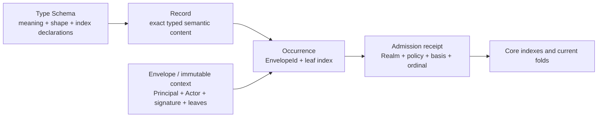

# EFS 2.0 — Core architecture candidate

**Status:** draft — buildable comparison target, not frozen protocol
**Target repos:** planning, contracts, sdk
**Depends on:** [[system-constitution]]
**Supersedes:** —
**Reviewers:** —
**Last touched:** 2026-09-03

#status/draft #kind/design #repo/planning #repo/contracts #repo/sdk #topic/efsv2 #topic/onchain #topic/graph-queries #topic/lenses

## Problem

The constitution says what EFS 2.0 must accomplish. Engineers now need one
small candidate they can implement, attack, measure, and reject without
mistaking it for the final answer. This document names that candidate and the
few seams still capable of changing it.

[[disposable-mvp-profile]] is the bounded implementation overlay for the next
Stage B control, and [[mvp-c0-genesis-manifest]] is its ordered application
bootstrap. Their B0-bundled Type/index, Principal, carrier, result, and
authorization choices are namespaced experimental inputs. They do not settle
the alternatives or open questions in this document.

## Candidate in one picture



The crucial separations are:

```text
RecordId       = what exact typed semantic content is this?
OccurrenceRef  = who published this exact Record in which signed Envelope?
Admission      = what did this Realm accept, under which policy and basis?
Binding head   = what value does one Principal currently select for one slot?
Lens result    = what does this reader/contract accept under one explicit Plan?
```

## Candidate primitives

### Realm

A Realm is one independently ordered Core deployment and policy domain. Keep
its stable identity separate from revisioned implementation and policy:

```text
RealmId       = H(immutable profile + chain reference + genesis/deployment commitment)
RealmRevision = H(RealmId + implementation/code basis + policy + generation)
```

An allowed implementation upgrade does not rename every author, Lens, and
Binding. A semantics-breaking replacement is a new Realm or an explicit
successor. Admission receipts bind the actual RealmRevision and block/state
basis used. The exact descriptor and upgrade boundary remain a bakeoff target.

The same Record can exist in several Realms. An admission, ordinal, current
binding, revocation, and completeness answer is always Realm-qualified.

### Type Schema

Working replacement for the confusing name `TypeRevision`:

```text
TypeSchema {
  bootstrapCodecVersion
  semanticNamespaceOrSpec
  canonicalBodyShape
  constraints
  referenceRoles[]
  indexSpecs[]
  structuralValidationProfile?
}
```

“Schema” is the developer-facing analogue of an EAS Schema, but it is portable
and not identified by a registry transaction. The prototype must use a tiny
closed descriptor language: bounded body and collection sizes, canonical scalar
encodings, statically extractable reference/index fields, and no arbitrary
Type-created callbacks during admission. Optional external validators are
ordinary evidence or explicitly bounded, revisioned Realm modules.

One 50-year identity question is deliberately open. Variant A hashes semantic
meaning, shape, validation, reference roles, and canonical index obligations
into one `TypeSchemaId`, giving portable query guarantees but changing RecordIds
when indexing evolves. Variant B separates semantic `TypeId`, encoding
`ShapeId`, validation/admission profile, and `IndexProfileId`, allowing query
evolution but requiring explicit coverage and compatibility. Both must be
implemented against the same fixtures; this prose does not choose by accident.

Successor/compatibility/equivalence claims between Type Schemas are ordinary
authored evidence. They never mutate the older schema or make a v2 body pretend
to be a v1 body. Shape identity may be derived separately so Types with the same
encoding but different meaning do not collapse.

The bootstrap must avoid a self-typing fixed point: one intrinsic versioned
meta-codec parses Type Schemas. Self-recursive roles use an explicit `SELF` or
stable Type-family reference rather than hashing their own final schema ID into
the preimage.

### Record

```text
Record {
  typeSchemaId
  canonicalBody
}

RecordId = H(domain, typeSchemaId, canonicalBody)
```

A Record is the closest analogue to the semantic data portion of an EAS
attestation. It is immutable, author-neutral exact typed content. It does not
require one owner or subject; the Type Schema declares zero or more typed
reference roles inside the body. This naturally handles n-ary evidence,
comments with target and reply roles, Git multi-ref transactions, provenance,
and achievements.

When stable lineage is needed, an `ObjectGenesis/1` Record explicitly commits
the creation charter—such as publisher Principal plus salt. Its RecordId can be
the stable ObjectId. Exact later Records reference that ObjectId. Topics and
ownerless literals can use separate canonical genesis/value profiles rather
than fake owners.

### Envelope or immutable shared Context

```text
PublicationEnvelope {
  profile
  principalId
  actor/account authority witness
  publication nonce / replay domain / expiry as required
  ordered RecordIds or Record leaves
  signature
}

AdmissionIntent? {
  realmId
  action
  occurrenceRefs
  nonce / expiry
  authorization witness
}
```

The Publication Envelope amortizes repeated author, actor, signature, replay,
and optional batch data. Moving a Record into another Envelope does not change
RecordId. Outside the disposable C0 control, distinct portable authorship and
Realm-bound effect authorization remain one bakeoff arm. The bakeoff must
compare portable and intentionally Realm-bound publication profiles, including
cross-Realm replay and subset carriage; candidate syntax is not allowed to
discard portable signed evidence accidentally.

MVP-C0 tests a narrower one-approval construction: one EIP-712 `WritePlan`
signature commits to both the portable publication digest and the exact
Realm-effect digest. The two meanings and their receipts remain distinct. The
outer signature is Realm/chain/Core-bound, so this arm does not claim
independently detachable realm-neutral authorship; that requires either an
additional publication signature or a prior scoped delegation. The normal EOA
path is relayed after the one signature. Direct EOA fallback uses one
transaction prompt and records weaker transaction-bound authorship evidence.
A bounded revocable smart/session grant targets zero routine wallet prompts
after initial approval. C0 derives the same unsigned Stage A publication
digest, EnvelopeId, and `(EnvelopeId, leafIndex)` OccurrenceRefs, but explicitly
records that its retained composite EOA witness signs the outer WritePlan—not
the chain-free envelope digest directly. Details and success semantics are
normative only for the experiment in
[[disposable-mvp-profile#4. One-approval write law]].

`leafIndex` is simply the zero-based position of one Record inside the signed
Envelope. It distinguishes two occurrences of Records carried together without
forcing an ID into every child:

```text
Envelope E contains [ProjectRecord, ReleaseRecord, LocatorRecord]
Occurrence(ProjectRecord) = (E, 0)
Occurrence(ReleaseRecord) = (E, 1)
Occurrence(LocatorRecord) = (E, 2)
```

The final bakeoff must compare RecordId-list leaves with inline canonical
Record leaves and prove extraction, data availability, and atomicity behavior.
Admitted Record bodies remain state-readable in both variants; only the
Envelope leaf encoding and context-amortization mechanism are under comparison.

### Occurrence

An Occurrence is an authored publication event identified by
`(EnvelopeId, leafIndex)`. It answers who asserted a Record, with which actor
and signature context. Ten curators can independently endorse the same
`GameRelease` Record: the semantic RecordId is shared, while ten Occurrences
preserve ten provenance trails.

Replies, withdrawals, reviews, and authority-sensitive citations may target an
Occurrence when the authored event matters. Pure semantic references target a
Record or stable Object instead. A source Occurrence may be copied unchanged as
source-qualified evidence. Destination admission, authority, order, finality,
revocation, and currentness require a destination receipt or Recognition Record
and never become destination truth merely because the bytes were copied.

### Admission receipt

```text
AdmissionReceipt {
  occurrenceRef
  realmId
  policyAndImplementationRevision
  authorityBasis
  admissionOrdinal
  acceptedStatus
}
```

Finality is observed later at a named block/proof basis; a contract cannot know
the future finality of its own current transaction. The durable receipt records
accepted Occurrences; a reverted or rejected attempt normally leaves no state
and is returned as call error/evidence rather than a permanent receipt.
Admission receipts remain state-readable and never masquerade as portable
unqualified current truth.

### Binding and withdrawal

A generic Binding provides one Principal-qualified answer at one logical
cardinality-one position:

```text
PositionKey = H(purpose, subject, fieldRole)
BindingKey  = H(principalId, PositionKey)
Binding     = {positionKey, targetRef | tombstone,
               predecessorOccurrence, revision}
```

Admission derives `principalId` from the authored Occurrence, so a writer cannot
bind another Principal's key. Realm admission applies compare-and-set against
the previous admitted Binding Occurrence/head, history, tombstone, and
no-resurrection rules. Collections/cardinality-many claims remain independent
Occurrences plus enumeration indexes; they are not forced through one winning
head.

A Withdrawal targets an authored Occurrence and means its issuer no longer
maintains it. It does not delete the Record, retract another issuer's
Occurrence, or rewind a Binding.

### Principal

All semantic authorship, author indexes, and Lens entries use `PrincipalId` at
the API boundary. The MVP candidate supports an intrinsic zero-setup account
Principal derived from an immutable authority reference:

```text
AccountPrincipal/1 = { authorityKind, originIfRequired, accountOrKey }
PrincipalId = H(domain, canonical(AccountPrincipal/1))
```

An EOA authority may be chain-independent; a contract-account authority is
Realm-qualified unless a standard proves equivalent code/control across
Realms. Admission uses a versioned authority verifier rather than the unsafe
shortcut `hasCode ? ERC1271 : ecrecover`, because EIP-7702 accounts may have
code while retaining EOA-key authority. ERC-1271 works locally; ERC-7913 is a
future addressless-actor seam, not stable Principal identity. The author
Principal remains separate from relayer and payer.

Later managed Principals may add portable genesis, multiple actors, delegation,
rotation, recovery, and signature-suite succession behind the same semantic
`PrincipalId` API. Association or succession evidence cannot retroactively
rewrite Account-Principal Occurrences.

Bakeoff baseline: compare this with a tagged `AuthorRef = Account | Principal`,
and test whether one account Principal can graduate to a managed Principal
without rewriting history. Reject uniform Principals if the abstraction adds
setup blocks, hides authority basis, fractures portable EOA authorship, or costs
more complexity than it removes.

MVP-C0 temporarily selects the intrinsic account-Principal arm without closing
that comparison. It persists the exact normal-path WritePlan bytes and accepted
low-s EOA witness so a second implementation can recompute the digest, recover
the signer, derive the Principal, and compare the admission basis from state
alone. Contract-account verdicts remain Realm-and-basis-qualified; direct EOA
fallback remains transaction-bound. Key loss/recovery is unsolved and only
synthetic authorship is permitted.

### Indexes

Baseline automatic indexes distinguish the different evidence sets:

- exact Type, Record, Envelope/Occurrence, and accepted receipt reads;
- globally ordered accepted-admission pages;
- unique Records by Type;
- Occurrences by Type, Record, and Principal; and
- current Binding point reads with complete Realm-local absence at a basis.

A Type creator may additionally declare a small bounded `IndexSpec[]`:

- exact equality on one canonical bounded scalar;
- typed reference equality;
- typed target-first backlink by declared field role; and
- only if a workload proves it, a small exact compound key.

Candidate EVM layout:

1. admit a unique Record to a state-readable Record spine;
2. assign a stable full-width-safe Record ordinal or store full RecordId;
3. append to immutable postings keyed by Type/index/value;
4. append typed reference postings keyed by target and role;
5. keep Binding/current lifecycle state separate from immutable history.

Every declared index is materialized automatically for every admitted item; an
individual writer cannot opt out. Each page pins a Realm/block or admission
high-water mark and returns cursor,
coverage, and completeness. Type authors pay or cause writers to pay declared
fan-out, so limits and gas/state benchmarks are freeze gates. Mutable “add an
index later” cannot imply complete historical absence. Under Type Variant A, a
new canonical index means a new Type Schema. Under Variant B, a new
`IndexProfileId` may preserve the semantic Type and Record IDs, but its start
basis and coverage are explicit and any backfill stays `PARTIAL` until proved
complete.

For MVP-C0 only, the B0 bundled arm is extended at genesis with
`KIND_BINDING_SCOPE` from [[hierarchical-files-and-folders#5. Complete
directory enumeration: BindingScope]]. That capability is committed in the
same namespaced Type/index bundle before any Files Binding. It permits the C0
empty-root and later directory-listing claims to close as complete without
pretending the permanent Type/query-identity bakeoff has been answered.

### Contract Resolution Plan (Lens)

The product term remains Lens. The bounded immutable contract object is a
`ResolutionPlan`:

```text
ResolutionPlan {
  purposeAndScope
  orderedOrTieredPrincipalIds
  boundedPointCombiner
  limits
}
```

Core or one narrow module resolves `(planId, positionKey)` by deriving one
`BindingKey` per Principal and probing admitted Binding heads. Reads consume
historical admission receipts; they do not call arbitrary ERC-1271 accounts for
every Lens entry. The result is typed and may be `UNKNOWN`.

For an authoritative local Binding map, missing at the pinned basis is provable
absence. `UNKNOWN` is reserved for unsupported profiles, partial replicas or
backfills, unavailable imported evidence, exceeded Plan limits, or a missing
required basis—not as a substitute for defining a complete local point index.

Wide directory enumeration, social ranking, moderation composition, and private
personal policy remain OS/client work. A rich Lens can compile to an exact Plan
when a contract needs deterministic public evaluation.

### Content and Locators

Generic application profiles build on Records:

- `Locator/1`: a URI and optional observation basis; the claimant/author is the
  Occurrence, not a duplicated Record field;
- `ByteDigest/1`: algorithm-tagged digest of exact bytes;
- `ArtifactClosure/1`: exact canonical member/chunk closure;
- `RepresentationBinding/1`: evidence connecting a CID/observation to an exact
  closure;
- `ArtifactRelease/1`: publisher-qualified semantic release referencing exact
  closure and, separately, runtime/capability request if applicable.

Core knows none of these names. Their Type Schemas and declared reference
indexes are sufficient.

MVP-C0 adds one separate state-readable small-byte carrier. File Object,
FileRevision, ChunkTree/digest, carrier handle, Locator, and observed
availability remain distinct. Each run records and enforces measured finite
write/range bounds; no C0 number becomes a permanent protocol cap. A missing or
unavailable carrier never changes a `FOUND` File into absence.

### MVP-C0 point-result projection

The experiment's canonical point outcome is exactly
`FOUND | ABSENT_PROVEN | UNKNOWN | CONFLICT`. Domain, committed basis,
coverage, support, validation, authority, currentness, finality, integrity,
availability, bytes, and canonical write effect remain separate dimensions.
Available/returned bytes can still fail integrity. Canonical effect is only
`COMMITTED | NOT_COMMITTED_PROVEN | UNKNOWN | NOT_APPLICABLE`; planned,
authorized, submitted, included, reverted, and read-back-verified are separate
operation/receipt stages. Merged absence is proved only when every input is
complete, supported, valid, and `ABSENT_PROVEN` at the same committed basis and
domain. Any missing/provider failure, partial coverage, unsupported profile,
invalid evidence, or basis mismatch is `UNKNOWN`; material unresolved
disagreement is `CONFLICT`. Files-specific errors remain detail around this law
rather than a competing universal point enum.

## Modular contract shape to prototype

Logical modules should be narrow even if deployment/gas/security favors fewer
physical contracts:

1. `Codex`: canonical decoding, IDs, Type Schema parsing, signatures.
2. `RecordStore`: immutable Type/Record/Envelope/Occurrence state.
3. `Admission`: Realm policy, authority checks, ordinals, receipts, and one EVM
   call boundary whose Core state writes all commit or all revert.
4. `Index`: Type/equality/reference postings and honest pagination.
5. `Binding`: generic CAS current slots, withdrawal/lifecycle overlays.
6. `LensResolver`: bounded public Resolution Plans and point resolution.
7. optional byte stores and adapters, including an EAS projection.

Module count is not contract count. Cross-contract calls, reentrancy, codehash
dependencies, deployment addresses, and partial failure may make one atomic
Core safer. The prototype measures that choice rather than deriving it from an
aesthetic preference.

## Worked example: Arcade without Arcade Core code

This is the **post-verification release lane**. Before exact closure is known,
Arcade may publish a Locator plus a submission/release-intent or immutable
location-observation Record; that evidence is not yet an exact GameRelease or
Artifact. Verification later adds the closure and exact Release without
rewriting the earlier Locator or observation.

```text
GameProject        ObjectGenesis/1 Record -> stable publisher-qualified ID
GameMetadata       Record -> references GameProject
ArtifactClosure    ownerless exact Record -> exact package bytes
GameRelease        Record -> references GameProject + ArtifactClosure
VerifiedLocator    Record Occurrence -> references exact ArtifactClosure
CatalogMembership  curator Occurrence -> references GameProject
SelectedRelease    curator Binding -> GameProject slot points to GameRelease
Comment            Record Occurrence -> references Project/Release and reply
Compatibility      Record Occurrence -> references Release + runner profile
RightsEvidence     Record Occurrence -> references Project/Release/Artifact
```

No global canonical game, no official bit, no game contract, and no private
Arcade index. Typed backlinks answer Project-to-Releases, target-to-comments,
Artifact-to-Locators, and Release-to-evidence. Curator identity plus Realm,
policy, and basis qualifies “official.”

## Worked example: smart-contract configuration through a Lens

```text
Slot: /protocol/fees -> feeBps
Alice Principal binds 25
SecurityCouncil Principal binds 20
ResolutionPlan [SecurityCouncil tier 1, Alice tier 2]
Contract pins the Plan and resolves 20 at Realm basis B
```

If the complete local map proves the Council binding absent, the Plan may use
Alice's fallback. If the Council state comes from a partial replica/import or
the required basis is unavailable, the resolver returns `UNKNOWN`. If the user
merely wants a personalized display, the user may supply a Plan; if a treasury
acts on the value, the treasury must pin or approve the Plan.

## Alternatives in the bakeoff

| Question | Candidate A | Candidate B | Evidence needed |
|---|---|---|---|
| Record shape | self-contained repeated headers | minimal Record + immutable Envelope/Context normalization | calldata, SSTORE, cold reads, extraction, archive closure |
| Author surface | tagged Account or Principal | PrincipalId everywhere + intrinsic account Principal | ABI complexity, setup, gas, smart-account safety, future migration |
| Physical deployment | one atomic Core | several narrow contracts/modules | reentrancy, atomicity, code size, upgrade and call costs |
| Index pointer | full RecordId postings | append-only stable ordinal postings | storage/gas and century exhaustion/layout risk |
| Type schema identity | publisher-qualified namespace | semantic spec commitment with optional qualification | collision of meaning vs convergence of shared standards |
| Type/query identity | index + validator commitments inside Type ID | semantic Type/Shape plus separate validation and index profiles | portability, complete coverage, migration, RecordId stability |
| Envelope leaf | inline Record bytes | RecordId plus separately available Record | one-tx availability and extraction proof |
| Publication domain | portable authored Envelope + Realm AdmissionIntent | deliberately Realm-bound Envelope | replay safety, copyable provenance, destination recognition |

## Falsifiers

Reject or redesign this architecture if:

1. first EOA/smart-account authorship needs a separate registration block;
2. a fresh supported Realm requires Commons or another chain to write or resolve data;
3. moving a Record between Envelopes changes RecordId;
4. identical Records from two issuers lose distinct Occurrences/provenance;
5. a Type creator can make admission or reads unbounded;
6. index incompleteness can appear as absence;
7. smart-account/Core upgrades reinterpret historical admission;
8. contract Lens reads call arbitrary authority callbacks per Principal;
9. an application needs a custom Core contract or private index for ordinary
   typed references, membership, comments, releases, or evidence;
10. state-only reconstruction needs old logs or an EFS-operated database;
11. Type bootstrap or recursive references create hash fixed points;
12. a mutable parent changes already-admitted child meaning;
13. one batch accidentally promises application-level atomicity it cannot
   provide; or
14. aggregate gas/state for the mandatory index bundle is not economically
   credible on the intended L2/L3 profile.

## Open questions

The following are permanent-design questions. None must be answered merely to
run the namespaced [[disposable-mvp-profile|MVP-C0]] control.

- [ ] Finalize the two bakeoff implementations and fixture corpus.
- [ ] Define the Realm descriptor and admission/finality observation split.
- [ ] Decide the developer name (`TypeSchema`, `TypeDefinition`, or another
  term) after the Fable review; `TypeRevision` is not presumed.
- [ ] Specify canonical meta-codec, value canonicalization, recursive Type
  references, and cross-language vectors.
- [ ] Specify the exact minimal index declaration and page-result ABI.
- [ ] Define Binding/Withdrawal authority and no-resurrection state machine.
- [ ] Benchmark public Resolution Plans of 1, 8, 32, and 64 Principals.
- [ ] Decide whether ownerless exact content is a subjectless Record, a generic
  Value profile, or both projections of one Record algebra.
- [ ] Prove the same generic traces for Arcade, Git, EAP, Nanda, Markdown,
  Topics/literals, anonymous browse, privacy, and the mounted filesystem.

## Pre-promotion checklist

- [ ] All `## Open questions` resolved or explicitly deferred (cite where)
- [x] `**Target repos:**` confirmed
- [ ] `**Depends on:**` chain — all dependencies accepted or landed
- [x] No `<!-- AGENT-Q: -->` comments left in the design body
- [ ] At least one round of `#status/review` with another agent or human comment

## Implementation notes

The next implementation is the disposable [[disposable-mvp-profile|MVP-C0]]
control initialized by [[mvp-c0-genesis-manifest]]. It must not deploy
permanent bytes, authorize Web Client/product work, or become a dependency
merely because it is first. Wallet acknowledgement and transaction receipt are
not completion; the run ends each write only after canonical read-back and
independent reconstruction evidence agree.
