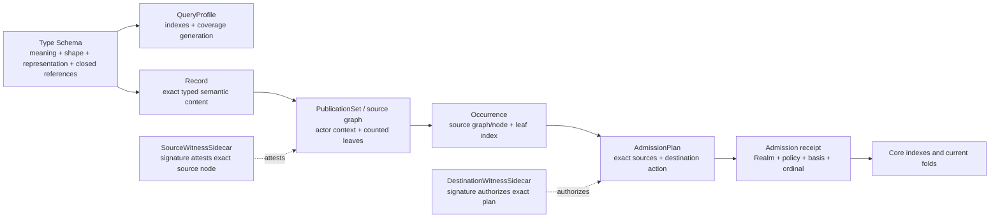

# EFS 2.0 — Core architecture candidate

**Status:** draft — buildable comparison target, not frozen protocol
**Target repos:** planning, contracts, sdk
**Depends on:** [[system-constitution]], [[ethereum-standards-and-execution-profile]]
**Supersedes:** —
**Reviewers:** —
**Last touched:** 2026-08-23

#status/draft #kind/design #repo/planning #repo/contracts #repo/sdk #topic/efsv2 #topic/onchain #topic/graph-queries #topic/lenses

## Problem

The constitution says what EFS 2.0 must accomplish. Engineers now need one
small candidate they can implement, attack, measure, and reject without
mistaking it for the final answer. This document names that candidate and the
few seams still capable of changing it.

## Candidate in one picture



The crucial separations are:

```text
RecordId       = what exact typed semantic content is this?
OccurrenceRef  = which exact source graph/node carried this Record at which leaf?
Source witness = who attested that graph/node under which authority context?
AdmissionPlan  = which exact sources and destination action are authorized?
Admission      = what did this Realm accept, under which policy and basis?
Binding head   = what value does one Principal currently select for one slot?
Lens result    = what does this reader/contract accept under one explicit Plan?
```

## Candidate primitives

### Realm

A Realm is one independently ordered Core deployment and policy domain. Keep
its stable identity separate from revisioned implementation and policy:

```text
RealmId       = H(immutable profile + chain reference + genesis/deployment commitment)
RealmRevision = H(RealmId + implementation/code basis + policy + accepted execution profile + generation)
```

`chain reference` is a versioned origin/lineage commitment, never a bare
current `chainId`. The Realm candidate must distinguish same-chain competing
Core deployments, different genesis states with matching addresses/code, a
contentious split whose branches retain one chain ID, and a chain-ID change on
one continuing lineage. `RealmRevision` commits the accepted execution/fork
profile; later observations confirm the realized chain rules or report a
mismatch. A chain hard fork does not automatically call Core or create a Realm
revision, and a semantics-breaking ambient change may force explicit Realm
succession. A direct onchain read executes against one atomic EVM state and can
expose its Realm revision, execution block number, and high-water, but the
contract cannot know its current block hash. A later/offchain observer envelope
pins the exact block hash and, when proof-bearing, an authenticated state-root
basis. The admitting transaction likewise cannot know its eventual inclusion-
block hash.

An allowed implementation upgrade does not rename every author, Lens, and
Binding. A semantics-breaking replacement is a new Realm or an explicit
successor. Admission receipts bind the actual RealmRevision, execution order,
and verifier basis used; later observer evidence binds exact inclusion block,
state, canonicality, and finality. The exact descriptor and upgrade boundary
remain a bakeoff target.

The same Record can exist in several Realms. An admission, ordinal, current
binding, revocation, and completeness answer is always Realm-qualified.

### Type Schema

Working replacement for the confusing name `TypeRevision`:

```text
TypeSchema {
  bootstrapCodecVersion
  semanticNamespaceOrSpec
  canonicalBodyShape
  canonicalRepresentation
  constraints
  referenceRoles[]
}
```

“Schema” is the developer-facing analogue of an EAS Schema, but it is portable
and not identified by a registry transaction. The prototype must use a tiny
closed descriptor language: bounded body and collection sizes, canonical scalar
encodings, statically extractable reference/index fields, and no arbitrary
Type-created callbacks during admission. `Type-valid` means only that this
closed portable interpreter accepts the canonical body. A revisioned Realm
admission policy may reject an otherwise Type-valid Occurrence, but it cannot
rename its Type/Record or declare it portably invalid. Every receipt retains
the exact policy/verifier profile and result. Rich external validators remain
ordinary evidence.

`EXP-C0` provisionally selects one **flat exact nominal Type** for Core. The
`TypeSchemaId` commits every byte that changes meaning, accepted values,
canonical representation, or closed reference extraction. Index policy is not
intrinsic to the Record value and lives in a separately versioned
`QueryProfile`. SemanticSpec, Shape, Representation, compatibility, projection,
and View descriptors remain useful compiler/catalog outputs and controlled
comparison arms; they are not assumed independent Core identities.

This is a reversible experiment selection, not a freeze. Falsify it if the
same cross-language corpus shows unacceptable Record fragmentation or query
evolution and a layered alternative preserves identical rejection behavior,
bounded work, historical interpretation, and non-self-authorizing Views.

Successor/compatibility/equivalence claims between Type Schemas are ordinary
authored evidence. They never mutate the older schema or make a v2 body pretend
to be a v1 body. Shape identity may be derived separately so Types with the same
encoding but different meaning do not collapse.

The bootstrap must avoid a self-typing fixed point: one intrinsic versioned
meta-codec parses Type Schemas. Self-recursive roles use an explicit `SELF` or
stable Type-family reference rather than hashing their own final schema ID into
the preimage.

### Record

```text
Record {
  typeSchemaId
  canonicalBody
}

RecordId = H(domain, typeSchemaId, canonicalBody)
```

A Record is the closest analogue to the semantic data portion of an EAS
attestation. It is immutable, author-neutral exact typed content. It does not
require one owner or subject; the Type Schema declares zero or more typed
reference roles inside the body. This naturally handles n-ary evidence,
comments with target and reply roles, Git multi-ref transactions, provenance,
and achievements.

When stable lineage is needed, an `ObjectGenesis/1` Record explicitly commits
the creation charter—such as publisher Principal plus salt. Its RecordId can be
the stable ObjectId. Exact later Records reference that ObjectId. Topics and
ownerless literals can use separate canonical genesis/value profiles rather
than fake owners.

### Portable source graph and destination Admission Plan

The current observed G1 carrier evidence is the sealed Task1C corpus at clean
experiment commit `ae9d75bd52d247fe8699475ac1e770fe268efbdb`. It is
`EXPERIMENT_SELECTED`, `protocolConformance=false`, and `notAdopted=true`.
OccurrenceKey conversion, separately reviewed revision literals, one missing
Git closure body, and the independent Task4 comparator remain open. The
experiment oracle is not regenerated here; G0 records it and G1 runs only the
missing profile-placement/comparator delta.

Its load-bearing candidate is an acyclic source/publication and destination
Admission DAG:

```text
PublicationSet {
  semanticAuthor
  sourcePublicationActor
  sourceAuthorityProfileAndEpoch
  publicationNonceAndExpiry
  visibilityDomain
  countedOrderedRecordRootAndCount
  suites
}

portableSourceGraph = f(PublicationSetId)
realmBoundSourceGraph = f(portableSourceGraphId, PlanCoreId)

SourceWitnessSidecar {
  attestedSourceGraphOrNodeId
  exact source witness bytes
  signature
}

PlanCore {
  PublicationSetId
  SelectionSpecId
  EffectGraphId
  applicationProfile
  destination RealmId / RealmRevisionId / Core
  destination authority / nonce / expiry / action
  reviewed expected-revision projection
}

AdmissionPlan {
  exact source OccurrenceIds
  PlanCoreId
}

DestinationWitnessSidecar {
  AdmissionPlanId
  exact destination witness bytes
  signature
}
```

Source and destination witness signatures are sidecars excluded from the
identity they attest. Destination authorization targets the exact
`AdmissionPlanId`. G1 Admission identity contains no future admitted
Occurrence, receipt/result, resulting root/state, inclusion block, or finality.
G2 owns state transitions and receipt outputs; G3 owns signature/verifier
authorization. Binding the standards execution profile through the already-
committed `RealmRevisionId` must not change this publication DAG.

The carrier arms still compare self-contained per-Record witnesses against one
immutable shared Context witness, and portable against deliberately Realm-bound
source graphs, using one `PublicationSet`. Moving a Record between valid
carriage modes does not change `RecordId`, authored node, source Occurrence, or
normalized semantic commitment. Inline carriage can prove available exact
bytes; ID-only carriage remains `UNKNOWN/UNAVAILABLE/UNPROVEN`.

`leafIndex` is the zero-based Record position inside the counted ordered
`PublicationSet`. It distinguishes source Occurrences without forcing an ID
into every child:

```text
PublicationSet P contains [ProjectRecord, ReleaseRecord, LocatorRecord]
Occurrence(ProjectRecord) = sourceNode(P, 0)
Occurrence(ReleaseRecord) = sourceNode(P, 1)
Occurrence(LocatorRecord) = sourceNode(P, 2)
```

The remaining comparator must preserve extraction, data availability, subset
carriage, replay safety, and application atomicity. Admitted Record bodies
remain state-readable; carrier/context encoding remains experimental.

### Occurrence

An Occurrence is a source-authored publication event identified from an acyclic
source graph/node and `leafIndex`. Its identity excludes the witness signature;
the retained sidecar lets G3 establish who asserted the Record, with which
actor and authority context. Ten curators can independently endorse the same
`GameRelease` Record: the semantic RecordId is shared, while ten source
Occurrences preserve ten provenance trails.

Replies, withdrawals, reviews, and authority-sensitive citations may target an
Occurrence when the authored event matters. Pure semantic references target a
Record or stable Object instead. A source Occurrence may be copied unchanged as
source-qualified evidence. Destination admission, authority, order, finality,
revocation, and currentness require a destination receipt or Recognition Record
and never become destination truth merely because the bytes were copied.

### Admission receipt

```text
AdmissionReceipt {
  occurrenceRef
  realmId
  realmRevisionId
  admissionBlockNumber
  admissionHighWater
  policyAndImplementationRevision
  authorityVerifierProfile
  signedDigestAndDomain  // destination verifier transcript; not G1 Admission identity
  verifierCodeAndDependencyBasis
  boundedVerifierResult
  admissionOrdinal
  acceptedStatus
}
```

Exact inclusion hash and finality are observed later at a named block/proof
basis; a contract cannot know the hash or future finality of its own current
transaction. The durable receipt records accepted Occurrences; a reverted or
rejected attempt normally leaves no state and is returned as call
error/evidence rather than a permanent receipt.
Admission receipts remain state-readable and never masquerade as portable
unqualified current truth. If an ERC-1271 call is used, its digest,
signer/account reference, any suite-specific key bytes, signature bytes,
suite/normalization rule, verifier realization, Realm
revision, execution coordinate, later exact inclusion basis, EFS gas/return-
data policy, and success/malformed/revert result remain auditable. Pure suites
must be replayable from retained inputs. A stateful controller result is either
backed by the selected profile's retained witness/dependency law or remains the
recorded historical Realm transition; current ERC-1271 state is never used to
rewrite it. A bounded EFS admission profile is not a claim of unrestricted
compatibility with every possible ERC-1271 contract.

### Binding and withdrawal

A generic Binding provides one Principal-qualified answer at one logical
cardinality-one position:

```text
PositionKey = H(purpose, subject, fieldRole)
BindingKey  = H(principalId, PositionKey)
Binding     = {positionKey, targetRef | tombstone,
               predecessorOccurrence, revision}
```

Admission derives `principalId` from the authored Occurrence, so a writer cannot
bind another Principal's key. Realm admission applies compare-and-set against
the previous admitted Binding Occurrence/head, history, tombstone, and
no-resurrection rules. Collections/cardinality-many claims remain independent
Occurrences plus enumeration indexes; they are not forced through one winning
head.

A Withdrawal targets an authored Occurrence and means its issuer no longer
maintains it. It does not delete the Record, retract another issuer's
Occurrence, or rewind a Binding.

### Principal

All semantic authorship, author indexes, and Lens entries use `PrincipalId` at
the API boundary. The MVP candidate supports an intrinsic zero-setup account
Principal derived from an immutable authority reference:

```text
AccountPrincipal/1 = { authorityKind, originIfRequired, accountOrKey }
PrincipalId = H(domain, canonical(AccountPrincipal/1))
```

An EOA authority may be chain-independent; contract-account authority is
Realm-qualified unless a versioned EFS profile independently proves and
records equivalent code and control at named bases across Realms. Admission
uses a versioned authority verifier rather than the unsafe shortcut
`hasCode ? ERC-1271 : ecrecover`, because EIP-7702 accounts may have code while
retaining EOA-key authority. ERC-1271 works locally. Final ERC-7913 is an
optional address-less verifier interface; its `(verifier, key)` pair is not
stable Principal identity or proof of cross-Realm authority. The author
Principal remains separate from relayer and payer.

Later managed Principals may add portable genesis, multiple actors, delegation,
rotation, recovery, and signature-suite succession behind the same semantic
`PrincipalId` API. Association or succession evidence cannot retroactively
rewrite Account-Principal Occurrences.

Bakeoff baseline: compare this with a tagged `AuthorRef = Account | Principal`,
and test whether one account Principal can graduate to a managed Principal
without rewriting history. Reject uniform Principals if the abstraction adds
setup blocks, hides authority basis, fractures portable EOA authorship, or costs
more complexity than it removes.

### Indexes

Baseline automatic indexes distinguish the different evidence sets:

- exact Type, Record, Envelope/Occurrence, and accepted receipt reads;
- globally ordered accepted-admission pages;
- unique Records by Type;
- Occurrences by Type, Record, and Principal; and
- current Binding point reads with complete Realm-local absence at a basis.

A separately versioned QueryProfile may declare a small bounded `IndexSpec[]`
for one exact Type:

- exact equality on one canonical bounded scalar;
- typed reference equality;
- typed target-first backlink by declared field role; and
- only if a workload proves it, a small exact compound key.

Candidate EVM layout:

1. admit a unique Record to a state-readable Record spine;
2. assign a stable full-width-safe Record ordinal or store full RecordId;
3. append to immutable postings keyed by Type/index/value;
4. append typed reference postings keyed by target and role;
5. keep Binding/current lifecycle state separate from immutable history.

Profile identity does not activate an index or grant authority. `EXP-C0` uses
an explicit Realm-qualified activation state:

```text
QueryProfileActivation {
  queryProfileId
  exactTypeSchemaId
  realmRevision
  generation
  activationHighWater
  coveredHistoricalStart
  coveredThroughHighWater
  state: PENDING | ACTIVE_PARTIAL | TERMINAL_COMPLETE
  activationPolicyBasis
}
```

Only a Realm transition accepted under the named RealmRevision and activation
policy creates or advances this state. The policy must state who may propose an
activation, who bears backfill/future-write cost, and the bounded work and fee
rules; a Type or QueryProfile author cannot self-assert support. Terminal
completion is a state-machine result over the exact covered interval and
postings commitment, independently reconstructible from Core state—not an
author, operator, or indexer attestation.

Every active declared index is materialized automatically for every admitted
item in its covered generation; an individual writer cannot opt out. Each
onchain page returns a Realm revision, execution block number, applicable
admission high-water, QueryProfile generation, cursor, coverage, and
completeness. One call sees atomic state. An offchain observer may bind
dependent pages to one exact block hash/state root; separate ordinary
transactions cannot claim that same exact basis merely because their reported
block numbers match. The activation policy assigns declared fan-out and
backfill costs, so limits and gas/state benchmarks are freeze gates. A later
profile may preserve Type and Record IDs, but its activation basis and coverage
are explicit and any backfill stays `PARTIAL` until the state machine proves
terminal completion.

### Contract Resolution Plan (Lens)

The product term remains Lens. The bounded immutable contract object is a
`ResolutionPlan`:

```text
ResolutionPlan {
  purposeAndScope
  orderedOrTieredPrincipalIds
  boundedPointCombiner
  limits
}
```

Core or one narrow module resolves `(planId, positionKey)` by deriving one
`BindingKey` per Principal and probing admitted Binding heads. Reads consume
historical admission receipts; they do not call arbitrary ERC-1271 accounts for
every Lens entry. The result is typed and may be `UNKNOWN`.

For an authoritative local Binding map, missing at the pinned basis is provable
absence. `UNKNOWN` is reserved for unsupported profiles, partial replicas or
backfills, unavailable imported evidence, exceeded Plan limits, or a missing
required basis—not as a substitute for defining a complete local point index.

Wide directory enumeration, social ranking, moderation composition, and private
personal policy remain OS/client work. A rich Lens can compile to an exact Plan
when a contract needs deterministic public evaluation.

### Content and Locators

Generic application profiles build on Records:

- `Locator/1`: a URI and optional observation basis; the claimant/author is the
  Occurrence, not a duplicated Record field;
- `ByteDigest/1`: algorithm-tagged digest of exact bytes;
- `ArtifactClosure/1`: exact canonical member/chunk closure;
- `RepresentationBinding/1`: evidence connecting a CID/observation to an exact
  closure;
- `ArtifactRelease/1`: publisher-qualified semantic release referencing exact
  closure and, separately, runtime/capability request if applicable.

Core knows none of these names. Their Type Schemas and declared reference
indexes are sufficient.

## Modular contract shape to prototype

Logical modules should be narrow even if deployment/gas/security favors fewer
physical contracts:

1. `Codex`: canonical decoding, IDs, Type Schema parsing, signatures.
2. `RecordStore`: immutable Type/Record/Envelope/Occurrence state.
3. `Admission`: Realm policy, authority checks, ordinals, receipts, and one EVM
   call boundary whose Core state writes all commit or all revert.
4. `Index`: Type/equality/reference postings and honest pagination.
5. `Binding`: generic CAS current slots, withdrawal/lifecycle overlays.
6. `LensResolver`: bounded public Resolution Plans and point resolution.
7. optional byte stores and adapters, including an EAS projection.

Module count is not contract count. Cross-contract calls, reentrancy, codehash
dependencies, deployment addresses, and partial failure may make one atomic
Core safer. The prototype measures that choice rather than deriving it from an
aesthetic preference.

## Worked example: Arcade without Arcade Core code

This is the **post-verification release lane**. Before exact closure is known,
Arcade may publish a Locator plus a submission/release-intent or immutable
location-observation Record; that evidence is not yet an exact GameRelease or
Artifact. Verification later adds the closure and exact Release without
rewriting the earlier Locator or observation.

```text
GameProject        ObjectGenesis/1 Record -> stable publisher-qualified ID
GameMetadata       Record -> references GameProject
ArtifactClosure    ownerless exact Record -> exact package bytes
GameRelease        Record -> references GameProject + ArtifactClosure
VerifiedLocator    Record Occurrence -> references exact ArtifactClosure
CatalogMembership  curator Occurrence -> references GameProject
SelectedRelease    curator Binding -> GameProject slot points to GameRelease
Comment            Record Occurrence -> references Project/Release and reply
Compatibility      Record Occurrence -> references Release + runner profile
RightsEvidence     Record Occurrence -> references Project/Release/Artifact
```

No global canonical game, no official bit, no game contract, and no private
Arcade index. Typed backlinks answer Project-to-Releases, target-to-comments,
Artifact-to-Locators, and Release-to-evidence. Curator identity plus Realm,
policy, and basis qualifies “official.”

## Worked example: smart-contract configuration through a Lens

```text
Slot: /protocol/fees -> feeBps
Alice Principal binds 25
SecurityCouncil Principal binds 20
ResolutionPlan [SecurityCouncil tier 1, Alice tier 2]
Contract pins the Plan and resolves 20 at Realm basis B
```

If the complete local map proves the Council binding absent, the Plan may use
Alice's fallback. If the Council state comes from a partial replica/import or
the required basis is unavailable, the resolver returns `UNKNOWN`. If the user
merely wants a personalized display, the user may supply a Plan; if a treasury
acts on the value, the treasury must pin or approve the Plan.

## `EXP-C0` comparison inventory

`EXP-C0` is the implementation default. Before `RECOMMEND-GO-CODE`, every
ABI-shaping seam gets one minimal sealed comparator; a full losing-arm
implementation is required only if that comparator reopens the seam.

| Question | `EXP-C0` default | Minimal comparator or reopen trigger |
|---|---|---|
| Record/carrier | minimal author-neutral Record + portable PublicationSet | one self-contained-Record trace; reopen on identity, subset-closure, atomicity, or material total-cost failure |
| Author surface | full-width `PrincipalId` + zero-setup account Principal | one tagged-author trace; reopen on setup, hidden authority, portability, truncation, or material complexity/cost failure |
| Physical deployment | one atomic monolithic disposable Core | measure code/gas/state only; compare facets/modules after a named profile ceiling fails |
| Index pointer | full RecordId in semantic traces; ordinals are physical optimization only | prove any ordinal is full-width safe, state-readable, and identity-neutral before using it |
| Type qualification | exact semantic commitment with explicit convergent or qualified mode | same-shape/different-meaning and hostile-republication trace |
| Type/query identity | flat exact Type + separate Realm-activated QueryProfile | one bundled/layered/View trace; reopen on fragmentation, activation/completeness, or required-contract-interop failure |
| Publication leaf | exact RecordId with the Record body state-readable on admission | one inline-body trace; reopen if extraction or atomic availability cannot be proved |
| Publication domain | portable PublicationSet + destination-bound AdmissionPlan | one Realm-bound/replay trace; reopen on ambiguous authorship, replay, or destination-recognition failure |

## Falsifiers

Reject or redesign this architecture if:

1. first EOA/smart-account authorship needs a separate registration block;
2. a fresh supported Realm requires Commons or another chain to write or resolve data;
3. moving a Record between Envelopes changes RecordId;
4. identical Records from two issuers lose distinct Occurrences/provenance;
5. a Type creator can make admission or reads unbounded;
6. index incompleteness can appear as absence;
7. smart-account/Core upgrades reinterpret historical admission;
8. contract Lens reads call arbitrary authority callbacks per Principal;
9. an application needs a custom Core contract or private index for ordinary
   typed references, membership, comments, releases, or evidence;
10. state-only reconstruction needs old logs or an EFS-operated database;
11. Type bootstrap or recursive references create hash fixed points;
12. a mutable parent changes already-admitted child meaning;
13. one batch accidentally promises application-level atomicity it cannot
   provide; or
14. aggregate gas/state for the mandatory index bundle is not economically
   credible on the intended L2/L3 profile.

## Open questions

- [ ] Seal the `EXP-C0` micro-Realm trace corpus and its minimal comparators;
  build no full losing arm unless a named falsifier reopens it.
- [ ] Define the Realm descriptor and admission/finality observation split.
- [ ] Decide the developer name (`TypeSchema`, `TypeDefinition`, or another
  term) after the Fable review; `TypeRevision` is not presumed.
- [ ] Specify canonical meta-codec, value canonicalization, recursive Type
  references, and cross-language vectors.
- [ ] Specify the exact minimal index declaration and page-result ABI.
- [ ] Define Binding/Withdrawal authority and no-resurrection state machine.
- [ ] Benchmark public Resolution Plans of 1, 8, 32, and 64 Principals.
- [ ] Decide whether ownerless exact content is a subjectless Record, a generic
  Value profile, or both projections of one Record algebra.
- [ ] Prove the same generic traces for Arcade, Git, EAP, Nanda, Markdown,
  Topics/literals, anonymous browse, privacy, and the mounted filesystem.

## Pre-promotion checklist

- [ ] All `## Open questions` resolved or explicitly deferred (cite where)
- [x] `**Target repos:**` confirmed
- [ ] `**Depends on:**` chain — all dependencies accepted or landed
- [x] No `<!-- AGENT-Q: -->` comments left in the design body
- [ ] At least one round of `#status/review` with another agent or human comment

## Implementation notes

The next implementation is disposable prototype code. It must not deploy
permanent bytes or become a product dependency merely because it is first.
