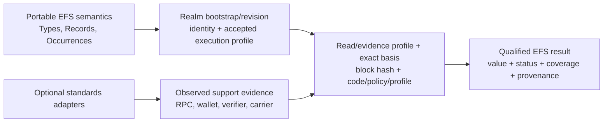

# EFS v2 — Ethereum standards and execution profile

**Status:** draft — Core-facing standards and evidence direction for validation; no profile bytes, ABI, limit, address, fork, verifier suite, or adapter is frozen
**Target repos:** planning, contracts, sdk
**Depends on:** [[README]], [[system-constitution]], [[Designs/web-client-os/ethereum-standards-and-interop]]
**Feeds:** [[core-architecture-candidate]], [[layered-type-system-and-data-abi]], [[v2-contract-readiness-program]]
**Evidence:** [[Reviews/2026-08-23-efs2-core-eip-erc-pressure/README]], [[Reviews/2026-08-22-web-client-os-eip-erc-screen/README]]
**Reviewers:** @eip-exhaustive-audit, @erc-exhaustive-audit, @g1-task1c-impl (2026-08-23)
**Last touched:** 2026-08-23

#status/draft #kind/design #repo/planning #repo/contracts #repo/sdk #topic/efsv2 #topic/ethereum-standards #topic/read-path #topic/identity #topic/reconstruction #topic/onchain

## Problem

EFS v2 is intended to survive for far longer than any current wallet, rollup,
RPC convention, fork, signature algorithm, opcode schedule, or contract
topology. It also needs to be useful to contracts now. “EVM compatible” is too
vague to carry either promise.

Different EVM Realms can share a chain ID while differing in genesis, activated
forks, precompiles, transaction rules, gas ceilings, history retention,
finality, RPC support, or deployed Core code. Proposal status is not deployment
support. An RPC success is not completeness. A current contract-signature
answer is not necessarily the historical answer. A future EIP is not current
execution physics.

This design adds the missing boundary: each candidate Realm commits a finite,
versioned **execution profile**, observers use separate finite read/evidence
profiles, and every dynamic observation names an exact basis. EFS semantics
stay smaller and more durable than the Ethereum environment around them;
adapters expose optional standards without silently importing their authority.

The goal is not to memorialize today's Ethereum surface inside Core. The goal
is to make every dependency on that surface explicit, bounded, replaceable,
and testable.

## Design result

Use Ethereum standards in five distinct ways:

1. **Semantic constraints** — rare rules that shape a Core invariant, such as
   basis-qualified contract-signature verification or exact block-hash reads.
2. **Accepted Realm execution profile** — the finite EVM rules, verifier
   suites, and limits under which a Realm revision claims to run Core.
3. **Read/evidence profile** — how an observer obtains, authenticates, bounds,
   and grades exact reads, history, proofs, and finality.
4. **Observed support evidence** — what a particular RPC, wallet, client,
   contract, or carrier actually demonstrated at a named time and basis.
5. **Versioned adapters** — optional interoperability with external standards
   that never changes EFS identity, grants authority, or manufactures
   completeness.

These layers must not collapse.



## Authority and scope

The official EIP/ERC repositories and EIP-1 establish proposal text and status.
They do not establish EFS adoption, target-chain activation, implementation
quality, safety, availability, or support. A Realm's own exact chain/fork and
deployment evidence establishes its accepted environment. Executable EFS
fixtures establish EFS conformance.

The complete pinned corpus and Core-pressure classification are recorded in
[[Reviews/2026-08-23-efs2-core-eip-erc-pressure/README]]. This design does not
repeat that inventory. It converts the durable findings into EFS boundaries
and readiness tests.

## Standards dispositions

Every standards reference in a promoted EFS specification or public profile
must have at least one explicit context-specific disposition. If one proposal
serves several roles, name the boundary for each rather than collapsing them:

| Disposition | EFS meaning |
|---|---|
| **Required semantic constraint** | The selected EFS profile depends on this behavior; it needs primary-source pinning, independent conformance, and a succession story. |
| **Accepted Realm feature** | A Realm declares this exact feature/revision activated for its Core deployment. The claim is checked against chain/deployment evidence. |
| **Optional adapter** | SDKs or Apps may interoperate with it. Absence cannot break canonical EFS reads, identities, reconstruction, or direct guest access. |
| **Design precedent** | Preserve a useful role, hazard, or test without adopting the proposed object or byte format. |
| **Future scenario** | Model and benchmark a possible environment separately; never advertise it as current support. |
| **Explicit non-dependency** | Core correctness, permanence, or authority must not rely on it. |
| **Application-only** | A domain Type/App may use it without changing generic Core. |

`Final`, `Living`, `Last Call`, `Review`, `Draft`, `Stagnant`, and `Withdrawn`
remain a separate status axis. No automated rule maps proposal status to EFS
disposition.

## Realm identity and profile identity

### Stable Realm identity

A Realm is not a chain ID. The candidate stable identity needs enough immutable
commitment to prevent two distinct execution domains or Core deployments from
colliding. The final preimage remains open, but the G1 candidate must cover:

```text
RealmIdentityCandidate {
  profileVersion
  chainReference       // not just a display name
  genesisCommitment    // or an equivalently collision-resistant origin
  coreBootstrapCommitment
  initialComponentCommitment
  declaredAuthoritySurface
}
```

Which fields belong directly in `RealmId`, which are bound through a bootstrap
commitment, whether the initial execution profile belongs in that bootstrap,
and which facts begin a revision chain is a controlled G1 comparison. The
invariant is that a client cannot swap genesis, Core deployment, initial
revision commitment, or possible authority while presenting the same Realm.

### Realm revisions

A compatible policy, component, verifier, or execution-profile change produces
an attributable `RealmRevision` and an exact activation interval. A change that
violates the Realm's declared succession law is a new Realm or an explicitly
recognized successor; it cannot retroactively rewrite prior admissions.

A chain hard fork is not automatically an EFS state transition. It may alter
opcode, precompile, gas, block, or transaction behavior beneath unchanged
contract code before Core can record anything. A new `RealmRevision` can attest
tested acceptance only after the change; it cannot cause or undo the fork. If
the observed chain rules no longer match the accepted profile, clients report
`PROFILE_MISMATCH/UNKNOWN`, preserve old facts at their historical basis, and
refuse profile-dependent new operations unless the already-frozen Core itself
can enforce that refusal. A semantics-breaking ambient change may require an
explicit successor Realm.

Each revision exposes:

- parent revision or bootstrap basis;
- exact Core component addresses and runtime-code commitments;
- accepted execution profile and activation basis;
- admission-policy and authority-verifier commitments;
- possible admin, upgrade, pause, or emergency powers;
- state-readable definitions or exact retained closures sufficient to
  reproduce historical interpretation; and
- start high-water/block and, when superseded, terminal high-water/block.

### Execution profile

The accepted execution profile is a small manifest, not an encyclopedia of
EIPs. It pins only ambient facts on which Core correctness, resource bounds, or
authority verification depend. The exact encoding is deliberately deferred,
but its logical content must cover:

```text
ExecutionProfileCandidate {
  profileVersion
  chainRulesCommitment      // activated fork/config evidence
  evmRevision
  requiredOpcodeFeatures
  requiredPrecompileSuites
  verifierProfiles
  transactionAndCallLimits
  initcodeAndRuntimeLimits
  calldataAndReturndataLimits
  stateAccessAndGasScheduleClass
  blockAndTransactionGasBounds
  unsupportedFeatureBehavior
}
```

The manifest references exact definitions or retained descriptors. The
execution, read/evidence, and observation structures in this design are
architecture descriptors and commitments; their eventual bootstrap/Record
placement is still open. They are not automatically application Types or
separately admitted/indexed Core records. An EIP number is not executable.
Explicit optional features and adapters fail closed at the operation that
requires them; a Realm may still serve portable
data whose interpretation does not depend on that feature. This is **not** a
claim that immutable EVM bytecode can detect or stop every ambient hard-fork
semantic change. `GO-FREEZE` must restrict correctness to a deliberately small
EVM subset with a reviewed fork-coexistence law and must name changes that force
Realm succession rather than silent continued conformance.

### Read/evidence profile

Observer and transport assumptions are separately versioned because changing
an RPC, proof source, history source, or finality policy must not rename a Realm
or its admitted data. The candidate logical content covers:

```text
ReadEvidenceProfileCandidate {
  profileVersion
  acceptedObservationBasisKinds
  exactBlockReadRequirements
  proofAndSourceAuthentication
  queryCoverageAndCompletionLaw
  historyAvailabilityAssumptions
  finalityObservationProfile
  freshnessPolicy
  unsupportedAndDegradedBehavior
}
```

A Realm may publish or recommend such a profile, but the observer remains
responsible for naming the exact profile and sources actually used. Whether a
minimal read-profile commitment belongs in a Realm revision at all is an open
G1/G4 comparison; it is not smuggled into stable Realm identity through the
combined execution-profile ID.

## Accepted profile versus observed support

The accepted execution profile is the Realm revision's declared contract.
The selected read/evidence profile and observed support describe an observer,
endpoint, or client. They can disagree without changing EFS facts.

Examples:

- the selected `ReadEvidenceProfile` requires exact block-hash calls, but one
  RPC endpoint rejects the parameter: the endpoint observation is
  `UNSUPPORTED`; the Realm is not redefined;
- an RPC advertises an experimental method outside the selected
  `ReadEvidenceProfile`: the method may be used only through an explicitly
  experimental adapter and cannot become required reconstruction input;
- a wallet claims batch support but returns a partial outcome: submission
  evidence is retained, while the canonical EFS effect is read back from the
  Realm;
- a verifier precompile exists on one fork but not another: the suite is
  supported only where the accepted profile and runtime observation agree.

SDKs and clients therefore report at least:

```text
accepted:   REQUIRED | OPTIONAL | FORBIDDEN | UNKNOWN_PROFILE
observed:   SUPPORTED | UNSUPPORTED | DEGRADED | FAILED | NOT_OBSERVED
outcome:    canonical EFS fact or qualified UNKNOWN
basis:      exact Realm revision + block + code/policy/profile evidence
```

No convenience boolean named merely `supported` is sufficient at this layer.

## Exact read and evidence profile

### Coherent dynamic-state basis

All dependent offchain dynamic reads in one result use one exact block hash or
an equally strong authenticated state-root basis. EIP-1898/EIP-234 shapes are
the preferred RPC boundary where supported. Block number and `latest` are
locators, not adequate canonical bases by themselves. One direct onchain call
instead observes atomic current EVM state and can expose its execution block
number and high-water; it cannot know its current block hash. A later observer
may wrap that result in exact block/state evidence. Separate submitted
transactions cannot claim one coherent basis merely from matching block-number
fields.

A qualified offchain observation envelope carries:

```text
ObservationBasisCandidate {
  realmId
  realmRevisionId
  chainReference
  blockHash
  blockNumber            // informational/checkable, not sole identity
  stateRootOrProofBasis?  // when independently available
  coreComponentCommitment
  policyAndVerifierBasis
  executionProfileId
  observedAt
  finalityEvidence       // separate from Core fact
}
```

`observedAt` says when a reader obtained evidence. Realm admission time says
when the Realm accepted an Occurrence. Finality freshness says how stable or
current an observer believes the block. These are different clocks.

### Proof boundary

EIP-1186-style account/storage proofs can support a point value only if the
reader independently authenticates the header/state root and exact address/key
derivation. They do not prove:

- that every matching key was queried;
- that a log range was complete;
- that historical bytes remain available;
- that a proxy or dependency graph was fully traversed;
- that the value is current at another block; or
- that the EFS policy considers it authoritative.

Proof verification, RPC trust, finality, EFS validation, authority, and query
coverage remain distinct result dimensions.

## Query completeness profile

Every enumeration names a finite scope and a completion law. The candidate
query contract retains:

- exact Realm plus either one atomic onchain execution basis or one exact
  offchain block/state basis;
- exact Type/QueryProfile or pinned finite Type inventory;
- range/high-water through which the query claims coverage;
- page limit and maximum result bytes;
- deterministic continuation tied to that same basis and query generation;
- observed source/proof coverage;
- terminal expected count/root or another independently checkable exhaustion
  condition where the profile promises `COMPLETE`; and
- separate result, coverage, conflict, and support states.

At minimum:

```text
result:     FOUND | ABSENT_PROVEN | CONFLICT | UNKNOWN | OPAQUE
coverage:   COMPLETE | PARTIAL
support:    SUPPORTED | UNSUPPORTED | LIMIT_EXCEEDED
```

`ABSENT_PROVEN` requires terminal `COMPLETE` coverage of the declared finite
domain. An empty page, missing log, pruned history, proof-provider failure,
timeout, cursor invalidation, or indexer miss remains `UNKNOWN` or `PARTIAL`.

This law applies equally to QueryProfiles, Binding histories/scopes, Lens
inputs, typed backlinks, reconstruction, SDK pages, and Explorer views.

## Principal and verification profile

### Versioned verifier profiles; pure only where claimed

Each supported signature/authority profile is finite, deterministic, bounded,
and identified. It defines:

- message/preimage domain and canonical encoding;
- key/principal representation;
- signature representation and malleability rule;
- verifier implementation or exact code/dependency commitment;
- allowed precompiles/opcodes and their expected semantics;
- gas and return-data limits;
- success/failure/error interpretation;
- activation interval and unknown-suite behavior; and
- historical transcript, witness, and reproduction requirements.

The initial pressure set includes EOA verification, ERC-1271 contract
Principals, EIP-7702 code-state changes, and at least one second algorithm suite
such as P-256 on a profile where EIP-7951 is actually activated. This is not an
adoption of final suite IDs.

### ERC-1271 historical basis

ERC-1271 is dynamic code execution. A Realm admission records the exact basis
and result under which the bounded call succeeded. The admitting contract can
record its execution coordinate but cannot know the eventual inclusion-block
hash; a later observation binds that hash and finality evidence. Later upgrades,
storage changes, delegation, revocation, or dependency changes may affect
current recognition but do not erase or rewrite the historical admission
result.

Pure suites replay from retained exact inputs. Arbitrary ERC-1271 logic may
depend on state or calls that a later post-block `eth_call` cannot recreate.
Such a profile must either retain an adequate execution witness/dependency law
or treat the stored bounded-call transcript and accepted Realm transition as
the historical fact. It must never substitute a call to current account state.

The verifier harness tests revert, malformed return, oversized return,
gas exhaustion, reentrancy, recursive dependency, code change between
simulation and inclusion, and current-versus-historical disagreement. Unknown
or unavailable verifier semantics produce `UNPROVEN`, never a guessed EOA
fallback.

### Signature layers stay separate

The SDK and contracts must not confuse:

- an EFS semantic publication or operation-plan signature;
- a wallet or EIP-712 presentation encoding;
- an ERC-4337 `userOpHash` or paymaster authorization;
- an EIP-7702 authorization;
- a relayer/payer/submission transaction signature;
- an external delegation or session permission; and
- the Realm's canonical read-back of effects.

Adapters may combine user experiences. They may not combine these identities
or claims.

## Current EVM and future scenarios

### Conservative current profile

Before G5 measurement, select at least one disposable reference EVM environment
and pin its activated rules from primary chain/runtime evidence. Passing this
arm neither declares the environment a qualifying Realm nor selects a product
venue. Record conservative
limits for runtime and initcode, calldata, return data, transaction/block gas,
cold/warm state access, precompiles, call-depth/reentrancy constraints, and
history/read availability.

EIP-170, EIP-3860, EIP-2028/EIP-7623, EIP-2929, EIP-3529, EIP-7825,
EIP-7934, EIP-7823/EIP-7883, and EIP-7951 are inputs only where the selected
profile shows them activated or deliberately supported. Tests use margin below
the exact venue ceilings. A topology that fails a ceiling does not authorize a
silent semantic change.

### Future scenario profiles

Maintain separately named scenario manifests for plausible fork changes such
as larger code, new transaction limits, native account abstraction, block
access lists, delayed execution, or new proof/read features. EIP-7773 and
candidate EIPs may explain why a scenario exists; they do not prove activation.

Each future scenario must answer:

1. Does the existing semantic model remain valid unchanged?
2. Which physical topology, gas, or SDK choices improve or fail?
3. Can old Realm/profile evidence still be interpreted?
4. Does a new capability enter additively through a versioned profile?
5. What exact observation would promote this scenario to accepted support?

Century-scale future-proofing comes from explicit profiles and coexistence,
not assuming today's proposal numbers or limits are permanent.

## Type/Data ABI lessons from Ethereum prior art

The standards corpus reinforces the current layered Type direction:

- exact nominal meaning should not come from a globally governed mutable
  registry;
- structural compatibility does not imply semantic equivalence or authority;
- Type validation must remain bounded and non-executable in Core;
- unknown fields and variants survive round trips;
- changing accepted values, meaning, logical shape, canonical representation,
  or verifier behavior produces an exact successor rather than reinterpretation;
- default values and optional fields are canonicalized explicitly;
- QueryProfile/index coverage evolves separately from Record identity; and
- projections carry source, destination, loss, tool, and basis evidence.

ERC-1900/1921/2157 dType, EIP-7495/7688/7916/8016 evolution patterns, and
ERC-7813/8100 data-description proposals are precedents and fixtures. They are
not adopted Core registries, encodings, or completeness claims.

T2 must add unknown-field, unknown-variant, changed-default, inactive-field,
noncanonical twin, and cross-representation successor vectors. T1–T3 must
confirm that Type callbacks, registry lookups, or mutable external schemas
cannot enter Core validation accidentally; T5 tests only how a surviving
semantic candidate is physically realized.

## Reconstruction and availability

The candidate Realm's authoritative EFS projection must be reconstructible from
one independently authenticated immutable bootstrap, an exact/finalized
block-state basis, and declared public chain and carrier configuration.
The reconstruction contract cannot assume:

- universal historical bodies, receipts, or logs;
- one archival RPC or EFS-operated indexer;
- blob persistence;
- a writer-side database or precomputed hidden index;
- a manually supplied ABI, proxy path, or module list;
- current external registry contents; or
- available content merely because a digest is known.

State-readable inventory, exact component commitments, bounded public pages,
and retained descriptor closures must establish the finite canonical projection
domain and suffice. Historical data may accelerate reconstruction only when its
coverage and basis are explicit; if authoritative state reconstruction requires
it, the candidate fails the state-only promise. Two independent readers prove
projection determinism only after source authenticity and domain completeness
are established separately. Unavailable bytes remain unavailable; they do not
disappear semantically.

## Deployment and contract modularity

Deployment standards are tools, not authority:

- EIP-1014 and `Review` EIP-7997 inform reproducible address/deployment
  evidence;
- EIP-1052/code hashes help observe runtime code but do not prove source,
  dependencies, storage interpretation, or safety;
- ERC-7201-style namespacing helps make storage ownership explicit;
- ERC-2535 facets, minimal proxies, factories, and registries remain measured
  physical comparators or optional adapters.

Every candidate topology consumes the same sealed transition specification and
produces the same public reconstruction projection. A mutable registry,
implementation pointer, selector mapping, helper, or factory may not silently
reinterpret admitted data. Possible administrative powers are exact and
visible even during development.

## Adapter boundary

This Core-facing design owns only the semantic/evidence boundary below.
Wallet, provider, RPC, ENS/URI/resource, browser, account-abstraction, and
client API selection/support matrices remain owned by
[[Designs/web-client-os/ethereum-standards-and-interop]] and the SDK PM. Their
receipts feed G6; they are not duplicated or promoted into G1–G5 here.

Standards adapters sit outside portable EFS semantic identity unless a future
promoted profile explicitly says otherwise. This includes wallets, account
abstraction, typed-signing presentation, ENS and URI/resource resolution,
CCIP Read, contract metadata, table/state schemas, package/module registries,
bridges, agent registries, and reputation systems.

An adapter emits qualified evidence with:

- standard and exact revision/profile;
- source and observation basis;
- original raw bytes or an integrity commitment;
- normalized projection and explicit loss receipt;
- support/coverage/error result;
- no implicit admission, authority, trust, install, grant, call, execution,
  curation, or completeness effect.

Direct guest Core reads and state reconstruction remain available with every
optional adapter removed.

## Correction register

| Prior wording | Correction |
|---|---|
| `EIP-1271`, `EIP-4337`, `EIP-6492`, `EIP-2535`, or `EIP-7617` | These are ERCs in the official split; canonical public URLs still use `/EIPS/eip-N`. |
| EIP-7907 automatically raises deployed runtime code to 64 KiB | No universal activation is established. Use the accepted Realm profile and measure larger-code candidates only as named future scenarios. |
| `ERC-8168-style` or `ERC-8213 shape` as official standards | Neither number exists in the pinned official ERC corpus. Label the external/historical proposal source or describe the shape without laundering official status. |
| “EVM compatible” | Name the exact accepted execution profile and observed support evidence. |
| “proof-backed” or “archive-backed” therefore complete | State the independently authenticated point/range basis and finite completion law. |

Historical documents can retain old wording when clearly bannered as historical
evidence. Active v2 spines should use the corrected terms.

## G0–G6 integration

| Gate | Required profile artifact or test |
|---|---|
| G0 | Pinned standards delta ledger; accepted-current and future-scenario profile drafts; exact primary evidence and support-status vocabulary. |
| G1 | Realm/bootstrap comparison stronger than chain ID; execution/verifier profile candidate IDs; hostile Type-evolution vectors. |
| G2 | Exact basis and bounded result ABI; finite query domain, cursor/high-water, coverage and terminal completeness traces. |
| G3 | EOA/ERC-1271/EIP-7702/second-suite historical verifier matrix with ambient-fallback attacks. |
| G4 | Lens rejection of mixed bases, partial coverage, untrusted point proofs, reorgs, and unavailable history. |
| G5 | Conservative activated profile plus future scenarios; code/gas/state/result measurements; state-only independent reconstruction. |
| G6 | SDK/Explorer accepted-versus-observed support, raw evidence, adapter-loss, unknown feature, and channel-loss UX. |

## Required disposable fixtures

1. **Realm collision:** same chain ID with different genesis/Core bootstrap, and
   same chain with two Core deployments. No identity or cache collision.
2. **Mixed basis:** point calls/pages/logs from two block hashes. Reject the
   combined result; never upgrade it to a coherent Lens answer.
3. **Proof incompleteness:** a valid EIP-1186-style point proof beside missing
   matching keys/pages. Preserve `PARTIAL`; do not infer absence.
4. **History loss:** remove historical bodies/log/archive access while retaining
   current state. Authoritative EFS state must still reconstruct from the
   required state-readable/public basis. Any historical dependency fails this
   candidate promise and records the exact falsifier; it is not an acceptable
   passing `UNKNOWN`.
5. **Verifier time travel:** admit with one ERC-1271 code/storage basis, then
   upgrade or apply EIP-7702 state. Historical and current recognition differ
   without rewriting the admission.
6. **Unknown suite/capability:** present an unknown verifier, precompile,
   method, return shape, and wallet feature. Fail closed with typed evidence and
   zero unintended effects.
7. **Resource ceilings:** run maximum legal Core transition/page/result against
   conservative current limits and each future scenario. Record margin.
8. **Type skew:** add optional/unknown fields, change defaults, insert unknown
   variants, change representation, and attempt noncanonical twins. Preserve
   raw data and exact identity rules.
9. **Reconstruction:** give an independent implementation one authenticated
   bootstrap, exact/finalized block-state basis, and public chain/carrier
   configuration only. It derives and checks the finite inventory/closure/count
   under Core rules; no hidden ABI/index/database.
10. **Adapter removal:** remove wallet, ENS, CCIP, registries, hosted indexers,
    and future-feature support. Canonical direct-guest Core exact reads and
    reconstruction still work. Only facts that actually depend on a removed
    optional adapter or external source may return honest qualified `UNKNOWN`.

## Refresh and freeze rule

Before `GO-CODE`:

- re-pin official EIP/ERC heads;
- diff every A–E candidate and every new proposal;
- pin at least one disposable reference EVM environment's activated execution
  profile from primary chain/runtime evidence without declaring it a venue or
  qualifying Realm;
- run the required profile fixtures; and
- obtain independent EVM/security, query/database, SDK, and reconstruction
  review.

Before `GO-FREEZE`, repeat the complete corpus ingestion, publish exact accepted
profile descriptors and golden vectors, independently implement every required
verifier/read path, prove coexistence/succession, and include the profile
manifest in the owner-ratified freeze packet.

The century-scale rule is: **old admitted data retains the exact semantic,
Realm, profile, policy, code, and observation basis needed to interpret it; new
profiles can be added, but no new standard silently reinterprets old facts.**

## Open questions

- [ ] Which minimum immutable fields make `RealmId` collision-safe without
  over-binding a replaceable implementation or policy revision?
- [ ] Does `RealmRevision` reference a separately versioned
  `ReadEvidenceProfile`, or is that profile entirely observer-owned, and what
  exact activation relation applies if it is referenced?
- [ ] Which activated disposable reference EVM profiles serve the G5
  comparison, and what conservative margins apply below their published
  ceilings without selecting a venue?
- [ ] Which verifier suites must be available in the first Core candidate, and
  which merely need a proved additive path before `GO-CODE`?
- [ ] What state-readable descriptor/closure is sufficient to reproduce
  historical ERC-1271 and policy decisions without preserving arbitrary
  executable dependencies forever?
- [ ] Which completion proofs are affordable for each adopted generic query,
  and which queries must remain explicitly `PARTIAL`?
- [ ] Which future EVM scenarios materially change contract topology rather
  than merely improve cost?

## Pre-promotion checklist

- [ ] G0 standards delta and profile evidence are fresh.
- [ ] Realm/execution/read/verifier identities pass independent vectors.
- [ ] Exact-basis, completeness, verifier-history, resource, and reconstruction
  fixtures pass in independent implementations.
- [ ] Every required standard dependency has a succession and unsupported-path
  story.
- [ ] Active v2 nomenclature corrections are reconciled.
- [ ] At least one independent EVM/security and one query/reconstruction review
  has no unresolved P0/P1.
- [ ] Owner ratification is recorded before any profile or byte freeze.

## Implementation notes

No production implementation is authorized by this draft. Initial artifacts
are disposable manifests, sealed traces, independent state models, and
measurement harnesses. Exact IDs, encodings, addresses, forks, limits, contract
splits, and public SDK names remain open until the readiness gates select them.
