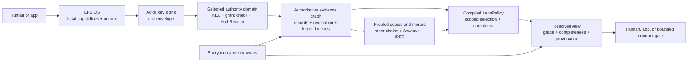

# EFS v2 — the whole system, in plain English

**Status:** draft synthesis and decision guide; not a byte-level specification
**Audience:** James and human reviewers
**Last touched:** 2026-07-22
**Technical sources:** [[assumptions-and-requirements]], [[README]], [[ethereum-first-efs-and-os]], [[mountable-filesystem-semantics]], [[kel]], [[privacy-pass-synthesis]], [[privacy-james-decisions]], [[read-lens-spec]], [lens architecture review](../../Reviews/2026-07-11-efsv2-lens-architecture-and-scale-review.md), [[onchain-completeness]], [[fs-pass-synthesis]], [[freeze-gates]], and the [client v2 design set](../clientv2/README.md)

#status/draft #kind/design #repo/planning #topic/efsv2 #topic/human-overview

> **Bottom line.** EFS v2 is directionally right, but the written design set is not yet coherent enough to freeze. The good core is now visible: permanent evidence, stable identities with replaceable keys, admission-ordered authorization when the strongest historical grade is required, explicit reader policies, honest encryption, and a capability-based local OS. The present per-principal-home/L1-locator/migration topology is one ambitious candidate, not a settled consequence of KEL. Several older documents also implement previous models. Those contradictions must be resolved in one coordinated rewrite before permanent bytes, IDs, or storage layouts are approved.

> **Research posture:** [[ethereum-first-efs-and-os]] records the current attempt to reconcile an Ethereum-native EFS protocol with a potentially broader cypherpunk OS. It keeps several product/profile shapes open and treats “Ethereum-first, not Ethereum-only” as an exploration prior—not an adopted topology.

This document is the simple human map. It deliberately avoids ABI and cryptographic detail. It says what the system is trying to be, which parts are sound, where the designs do not yet join, what James actually needs to decide, and what work should happen next.

Adopted owner rulings govern direction. [[assumptions-and-requirements]] governs classification and blocker status. Exact technical sources govern byte-level detail only where they do not conflict with an adopted ruling, ratified invariant, or explicit reconciliation block. If drafts conflict on an undecided question, neither wins—the joined surface remains blocked.

## 1. The shortest accurate description

EFS v2 is designed to be a permanent, public-by-default graph of files, claims, and provenance.

- Authors sign portable records.
- An immutable protocol-contract set preserves records, receipts, revocations, and the indexes needed for bounded on-chain queries. Exact artifact boundaries remain measured freeze questions.
- A KEL-mode identity is designed to survive device loss, actor-key replacement, wallet changes, tested recovery, and reviewed future cryptographic transitions. A bare EOA has none of those guarantees.
- If EFS requires definitive protection from post-revocation backdating, one explicit authority domain checks whether the actual device or app key was authorized at admission order and stores that basis. The recommended first prototype uses one fixed authority profile, not a different movable home for every principal; adoption depends on James accepting its sovereignty and censorship tradeoff.
- Other chains and storage networks can carry verified copies, but they do not invent a second authoritative history. Clients can query another chain; foreign smart contracts need a bridge, verifier, oracle, or fully specified local commitment.
- A lens is an explicit, reproducible policy that says which valid statements a reader accepts for a particular purpose and how conflicts combine.
- The same resolved EFS view must mount read-only on Linux, macOS, and Windows. Host filesystem adapters expose files, folders, verified reads, and bounded metadata without turning FUSE, FSKit, WinFsp, POSIX, or NTFS rules into canonical EFS identity.
- Sensitive bytes are encrypted before publication. Encryption can hide content; it does not make the public graph anonymous.
- EFS OS is designed to give apps local capabilities, verified packages, reproducible generations, and no ambient network or wallet power.

The constitutional sentence is:

> **EFS preserves objective evidence; KEL defines who may act for a principal; authoritative admission can record when that authority was valid; lenses decide which evidence a reader uses; encryption decides who can read bytes; and the OS decides what running software may do. None of those powers implies another.**

### What “home chain” actually meant

It never meant chains could call one another. It meant one chain would be the source of truth for a principal's KEL order. A client can read Alice's authority state on one chain and her copied file on another. A smart contract cannot perform that two-chain read by itself: someone must deliver a bridge message, verified proof, or a local commitment whose updater, trust, rollback, finality, freshness, and failure rules are explicit.

The current maximal design then added a separate home for every principal, an L1 registry to locate those homes, and a migration protocol to move them. Those are optional sovereignty mechanisms, not requirements of stable identity. The smaller comparison prototype is one named authority profile whose domain contains the complete authoritative record/KEL/slot/index graph, with other chains carrying evidence or explicitly verified snapshots. This centralizes fees, censorship, throughput, and state growth, so it is not adopted architecture. [[assumptions-and-requirements]] contains the sovereignty choice and the alternatives.

## 2. Seven rules that make the system coherent

### 2.1 Evidence is not authority

A valid signature proves that a key signed some bytes. It does not, by itself, prove that the key was still authorized for Alice when those bytes were published.

KEL therefore separates:

- **portable evidence:** structurally valid signed material that anyone can preserve; and
- **authoritative history:** material accepted by the selected authority domain while its KEL grant was live, with an immutable authorization receipt. A zero-setup bare EOA may instead remain signature-only evidence until admitted.

The authority contract can store an `AuthReceipt`, but that receipt alone is not a portable finality proof: the admitting transaction cannot know its own containing block hash. A portable `AuthProof` later combines the receipt with finalized block, state, code, and consensus/finality evidence. A registry proof is needed only if EFS adopts the more complex per-principal locator profile.

This distinction closes the **post-revocation** backdating problem. After the phone's grant is revoked or its authorization epoch is replaced, it cannot sign later, put an old-looking time in the record, and regain full authority. Before that chain-observed cutoff, a stolen live key remains dangerous.

### 2.2 An identity is not a key, wallet, or person record

An EFS principal is a stable 32-byte identity word.

- Control keys are rare and slow.
- Phones, applications, and sessions are narrow actors beneath the principal.
- Ethereum accounts pay, execute, and hold funds; they do not define eternal authorship.
- An organization uses threshold control but normally publishes with one operational actor.
- A persona intended to remain unlinkable is a separate principal with separate KEL, encryption, recovery commitments, execution accounts, and funding/submission routes—not another public child key. This reduces deliberate linkage; it does not guarantee anonymity against correlation.

For an authority-admitted record, the protocol preserves both the durable principal and the actual signing actor/grant. It does not prove that either corresponds to one legal human, nor should it try.

### 2.3 A view is not a capability

A lens says whose statements a reader accepts. It does not grant an application permission to write, decrypt, spend, or use the network.

For example, “use Alice as a curator for `/research/`” does not let Alice's application write to the viewer's files. Conversely, a Notes app may hold a local write handle without becoming a trusted source for operating-system updates.

### 2.4 Private means encrypted, not invisible

EFS can make bytes confidential. The public system still exposes some combination of authors, timing, sizes, update cadence, graph shape, funding, and recipient-pattern metadata.

The privacy pass recommends this product line; James still needs to ratify the positioning batch:

> **Confidential when you choose it. Public by default. Anonymous never.**

The OS sensitivity policy should classify credentials, private messages, health data, drafts, private administration state, and user-selected material as private before signing. Once plaintext or a public relationship is published, no later toggle can make observers forget it.

Private-tier records and public identity/persona records must never share one envelope. Co-batching creates a permanent public correlation even when every payload is encrypted.

### 2.5 Content authority is not transport authority

The system first resolves the trusted DATA/version claim and its basis-pinned content commitment. It then chooses a carrier: on-chain bytes, Arweave, IPFS/Filecoin, or another mirror. The DATA ID itself is owner/salt-derived, not a content hash.

A fast mirror does not become an author. A lens may rank mirrors for availability, but every returned byte stream must verify against the already trusted content hash.

### 2.6 A century promise is a maintenance program

Assuming chains persist simplifies authority. It does not solve log pruning, state layout, cryptographic aging, lost formats, unavailable mirrors, or abandoned implementations.

“Readable in 100 years” therefore means:

- full authoritative bodies and required indexes remain reconstructable from state, not only old logs;
- portable exports include records, receipts, KEL history, proofs, bytes, and format descriptions;
- content has independently checked carriers and health information;
- signatures and evidence are renewed before algorithms age out;
- canonical formats have independent implementations and golden vectors; and
- a clean implementation can rebuild without EFS-operated infrastructure.

### 2.7 A mounted filesystem is a resolved view, not a chain-shaped disk

The “chains are hard drives we mount” metaphor is useful product language, but the mounted tree is actually `resolve(evidence, lens, basis, limits)`. Ethereum/EVM is the first required evidence/authority/query profile; Linux, macOS, and Windows are three projections of the same logical result. Solana/substrate portability is separate research.

Plan 9 is the closest conceptual precedent: each process can construct its own namespace, and ordered unions resemble the simple first-present lens subset. EFS adds signed provenance, typed policies, WHITEOUTs, completeness, a pinned basis, and `UNKNOWN`; those semantics are resolved before the host adapter sees a tree.

EFS properties are metadata, so bounded public scalar properties should be readable as host xattrs/EAs. They are not the whole property system: multi-valued claims, provenance, losing candidates, grades, and unbounded enumeration require a lossless paged EFS control/API surface. The cross-platform mount requirement and exact acceptance gates live in [[mountable-filesystem-semantics]].

## 3. The system, from write to read



### A simple example

Alice uses a Notes application on her phone.

1. Alice has one stable public principal. Her phone has a replaceable actor key. Notes gets a short, app-scoped child grant.
2. EFS OS gives Notes a local handle to one folder. This local handle is not a blockchain credential.
3. Notes drafts changes locally. At flush, its actor signs an envelope naming Alice's principal, the grant, and the current authorization epoch.
4. The selected authority domain checks the exact grant, scope, epoch, and revocation state. If valid, it stores the records and an authorization receipt.
5. The chain kernel updates Alice's slots and the policy-neutral indexes. Full bodies remain state-enumerable so a future client is not dependent on century-old logs.
6. The bytes may live on-chain and/or in hash-verified mirrors. The mirror location never determines Alice's authorship.
7. Bob opens the same path through his Research lens. His compiled policy says which principals may publish in that scope and which combiner to use. He receives a resolved value plus grade, completeness, basis, and an explanation.
8. If the note is sensitive, Alice encrypted it before step 3. Bob also needs a key wrap. His lens can accept the record without granting him plaintext, and a decryption key does not grant him write authority.
9. If Alice loses the phone, she revokes its actor grant. Earlier authority-admitted notes remain attributable; later signatures from the phone are evidence only.

While recovery is pending, the normal OS should queue new work locally instead of publishing it. A user may deliberately force publication, but those records remain disputed evidence and must be reasserted after recovery resolves.

## 4. The layers and their jobs

| Layer | Job | Must never silently become |
|---|---|---|
| **Bytes and mirrors** | Store and serve content by verified hash | content authority |
| **Record envelope** | Bind one principal, actor authority reference, ordering word, and a Merkle batch | wallet-specific or chain-specific identity |
| **Authority kernel/profile** | Preserve bodies, revocation, principal slots, authorization receipts, and policy-neutral indexes | an upgradeable application server |
| **KEL and authority domain** | Rotate/recover control; authorize actors; establish historical authorship | wallet funds recovery or data decryption |
| **Evidence graph** | Preserve objective signed claims and provenance at an explicit basis | one universal social truth |
| **Lens policy** | Select scoped authorities, combiners, discovery, and advisories | a write/decrypt/execute capability |
| **Privacy layer** | Encrypt content, wrap keys, suppress plaintext metadata, and state residual leakage | anonymity or legal erasure |
| **EFS OS** | Verify packages, isolate apps, broker network and capabilities, stage writes, and render honest grades | the protocol's source of truth |
| **Preservation layer** | Export, replicate, monitor, renew evidence, and test walk-away recovery | a one-time backup checkbox |

The exact single-contract versus sibling-contract layout remains unsettled; the table names responsibilities, not an EIP-170 outcome.

## 5. The six different authority questions

Most design confusion came from answering all of these with the word “trust.” They are separate questions.

| Human question | System that answers it | Example |
|---|---|---|
| May this running app touch this local resource? | EFS OS capability table | Notes gets a handle to `/notes/`, not `/*` |
| May this key speak for this EFS principal? | KEL actor/grant state | Alice's phone may publish while `authEpoch == 12`, its authority-domain window is open, and neither the grant nor its ancestry is revoked |
| Was this record authorized when admitted? | Authority-domain `AuthReceipt` | The phone was live at admission ordinal 8,201 |
| Whose valid statements do I use here? | `LensPolicy` | Alice first for names; committee threshold for releases |
| May I see the plaintext? | Encryption/key-wrap capability | Bob has the folder key; Carol sees only ciphertext |
| May something move funds or execute an EVM call? | Wallet/smart-account policy | A paymaster may pay gas; it never becomes the record author |

KEL grants and lens rules must use one canonical, byte-exact scope and attenuation algebra with shared vectors for roots, predicates, kinds, purposes, and time domains. Their credentials and effects remain separate: KEL authorizes publication as a principal; a lens accepts authenticated claims; the OS grants runtime capabilities.

## 6. Where the design is right

### Strong foundations

1. **Native, immutable substrate.** Moving from EAS-carried semantics to an adminless native kernel is the right long-term direction, provided the frozen surface is kept small and independently implemented.
2. **Facts versus things.** Permanent object IDs plus revocable claims is a strong model for files, paths, metadata, links, and history.
3. **Five-kind tag core.** TAGDEF, DATA, LIST, PIN, and TAG are expressive without turning the eternal kernel into a schema engine.
4. **Full bodies plus keyed indexes.** “The data is somewhere in history” is not enough. Core reads need durable bodies and bounded current-state indexes.
5. **Stable principals and scoped actors.** The KEL correction fixes the largest identity problem in the prior design: devices and apps no longer need independent public authors or total-authority keys.
6. **Admission-ordered receipts.** This is the right answer to prospective revocation and historical authorship when signatures have no trustworthy creation time **if D-1 is adopted**.
7. **Typed, scoped lenses.** The fresh lens architecture is much stronger than one ordered author list. Namespace overlays, discovery, moderation, package updates, and quorum gates need different combiners and scopes.
8. **Nix-style identities for views.** A mutable channel, immutable source revision, compiled effective policy, compilation proof, and exact view receipt are different objects. Keeping them separate makes links reproducible without making every subscription immutable.
9. **Honest privacy.** The privacy pass correctly separates content secrecy from graph anonymity, recoverable from shreddable data, and public policy from private personal configuration.
10. **Capability-based OS.** Apps in network-denied workers, local capability handles, verified closures, generations, rollback, a draft-first outbox, and trusted System Chrome are a coherent cypherpunk client direction.
11. **Content-before-carrier resolution.** This makes Arweave, IPFS, on-chain chunks, and future storage systems replaceable availability tools.

### Overall verdict by area

| Area | Verdict |
|---|---|
| Product philosophy | **Right** |
| Record and file model | **Mostly right; identity math and index choices must be re-cut** |
| KEL/account model | **Right direction; highest-risk subsystem; not yet executable or audited** |
| Lens model | **Fresh architecture is right; current normative read spec is obsolete in important places** |
| Privacy | **Threat framing is strong and unusually honest; the custom AEAD/wrap profile, KEM lifecycle, deletion assumptions, and KEL/private-folder joins remain externally unaudited** |
| On-chain graph | **Correct mission and audit; permanent state bundle still needs measurement and reconciliation** |
| EFS OS | **Strong direction; several wallet, persona, update, and lens assumptions are pre-KEL** |
| 100-year storage | **Plausible as an active preservation discipline; not yet demonstrated** |

## 7. The seams that must be closed

These are not all human choices. Most are technical contradictions that must be repaired and tested.

### Blockers before any freeze

#### 1. Full-width identities are being truncated

KEL permits digest-shaped 32-byte principals, but existing `dataId`, `listId`, `slotId`, and proposed posting layouts still cast authors to 160 bits in places. Two principals with the same low 160 bits could collide.

**Required resolution:** use the complete `bytes32` principal through every ID, row, target, index, ABI, lens, and client structure; regenerate all affected vectors. This is a bug fix, not a James choice.

Define a full-width `TARGETKIND_PRINCIPAL` distinct from an Ethereum account endpoint. If Ethereum accounts remain graph targets, identify them by a canonical chain-qualified account reference—not by treating a 20-byte address as an EFS principal.

#### 2. There are two competing envelope identities

The old envelope says its EIP-712 digest is the one canonical ID. KEL introduces one suite-neutral semantic envelope ID plus different signing preparations for secp256k1, raw P-256, WebAuthn, and future PQ suites.

**Required resolution:** choose one suite-neutral envelope identity and make every signature format a witness over an exact purpose-separated transcript. Re-cut `authorityId`, `authEpoch`, `order`, and any `claimedAt` shape together, then regenerate cross-language vectors once.

#### 3. The old kernel and KEL describe different admission systems

The old kernel admits every structurally valid record into one confluent slot graph. Strong KEL historical authority needs state-dependent, admission-ordered authorization at a selected authority domain.

**Required resolution:** specify two explicit lanes:

- an evidence lane that may preserve structurally valid signed artifacts but never changes authoritative slots or live indexes; and
- an authority lane that verifies KEL/grants at the selected domain, stores a complete receipt, and updates authoritative state.

Every index must state which lane it indexes. A foreign venue must say whether a row is raw evidence or a proofed authority snapshot.

#### 4. Revocation semantics are no longer one rule

KEL separates four operations: a session may self-revoke its grant; a parent or control authority may revoke grants; an actor holding explicit `revokeOwnClaims` may revoke only claims canonically admitted under that exact grant and resource ceiling; and `revokePrincipalClaims` is exceptional root-level authority. Principal equality alone grants none of these powers.

**Required resolution:** define whether each operation targets a logical `claimId`, a particular `admissionId`, or both; who may pre-revoke; and how supplemental authorization receipts behave. Claim-wide power must require explicit principal-wide authority.

Because `claimId` excludes actor/grant carriage, two authorized actors may sign the same logical claim. The first-authoritative-admission rule must cover evidence promotion, concurrent carriages, deterministic primary provenance, supplemental receipts, front-running, and basis-specific revocation, with arrival-order vectors.

#### 5. Receipt and per-claim admission binding are incomplete

An `EnvelopeAuthReceipt` is shared across a batch; a `ClaimAdmission` binds one claim and action context. The proposed `receiptId` does not visibly commit the complete canonical receipt body.

**Required resolution:** hash the full receipt body, excluding only its own ID field. Separately, `admissionId` must bind `receiptId`, `claimId`, `leafIndex`, and `actionContextHash`. Test that a receipt cannot transplant across principal, authority domain, envelope, actor, epoch, or implementation basis, and that a claim admission cannot transplant across claims, leaves, or action contexts.

#### 6. The current read spec can manufacture false equivocation and false absence

One envelope intentionally gives several records the same author and `order`. The current reader can treat different digests at that pair as equivocation even when they belong to different semantic slots. Its ordinary author-signed checkpoint also cannot prove that the author did not omit an already authority-admitted record.

**Required resolution:** delete the global same-`(principal, order)` `EQUIVOCAL/CONTESTED` rule. Records at different semantic positions are normal. Under the current baseline, exact-slot alternatives at the current winning order still have one deterministic `(order, recordDigest)` winner and may set an orthogonal `SAME_SLOT_COLLISION` flag. Whether that flag is Etched and gate-visible is a measured choice; do not call every collision equivocation. Absence and completeness come from authority-domain admission ordinals plus kernel/state commitments or proofs—not an author-controlled timestamp or an omissible claim.

#### 7. The current lens object is too weak

The normative read spec still treats a lens as one ordered `bytes32[]` and applies first-present behavior too broadly.

**Required resolution:** adopt the fresh model:

```text
EvidenceGraph + BasisVector + EffectiveLens + Context -> ResolvedView + ViewReceipt
```

Authority is typed and scoped. `PRIORITY_FIRST_PRESENT` remains one valid combiner for exclusive namespace slots; it is not the universal trust rule.

The old reader's grade model also conflicts with KEL. Do not append KEL states into one long dominance list. Model orthogonal axes such as `AuthorizationGrade`, `AuthorSlotState`, `Freshness`, `CurrencyAndCompleteness`, `ResolutionStatus`, `AdvisoryResult`, and availability flags. A gate declares acceptable combinations and otherwise fails closed.

Revocation does not universally mean “try the next author.” Every exclusive rule must declare `FALLTHROUGH_ON_RELINQUISH` or `STOP_ON_FORMER_AUTHORITY`; WHITEOUT and authenticated HANDOFF are separate evidence. Shell-like overlays may fall through. Package, update, security-configuration, and other GATE profiles should stop by default. Otherwise, removing a trusted publisher can silently activate a malicious lower-ranked source.

#### 8. Lens channels duplicate KEL control and recovery

The lens review gives a channel its own control epoch and recovery verifier, while KEL already owns controller rotation, grants, and recovery.

**Recommended v1 ruling:** a principal-owned lens channel reuses KEL control and recovery and keeps only lens-specific generation, fork, tombstone, and rollback state. A KEL principal or scoped channel-admin actor controls it through ordinary authority admission. If independently transferable or independently recoverable channels are a real product requirement, that is a separate human decision and security design—not an accidental second guardian root.

Public or gate-consumed revisions, compilations, and channel states need authority-admitted authorization or a proofed snapshot basis; “someone signed this” is insufficient after actor removal.

#### 9. Bare identities and stealth actors do not yet have an authority-grade rule

KEL calls a bare EOA zero-setup, but its current candidate also requires every principal to have one L1-selected authority home. The privacy pass assumes one-shot stealth EOAs need no kernel change. That is a contradiction in the candidate topology, not proof that bare actors require homes.

**Required decision:** choose among:

- one immutable default authority domain for unregistered bare principals;
- sponsored L1 registration before authoritative use; or
- an explicitly weaker signature-only stealth record class.

A durable private persona should use its own KEL. An ephemeral stealth actor may accept weaker recovery, but its authority grade must be honest. The current recommendation is signature-only evidence until admission, with disposable actors excluded from safety-critical gates.

The broader per-principal-home path is also still a sketch. If adopted, the design must specify how a selected home verifies finalized L1 registry state, which home/finality profiles are supported, how born and legacy activation are ordered, how registry versions succeed without an administrator, how reorgs are handled, and how source/L1/target migration prevents two homes from admitting at once. These are blockers for that optional profile, not requirements of minimum KEL.

The old read spec treats the reserved `home` claim as an authority locator. Under the fixed-domain comparison profile there is no per-principal locator. Under the optional movable-home profile, only the finalized L1 `HomeRegistry` selects the authority home. In either case an ordinary `home` content row is only an advisory cache/UI hint and cannot change authorization or currency.

#### 10. Private folders cannot use public subtree proofs

KEL's proposed `DERIVED_SUBTREE` grant assumes publicly provable deterministic ancestry. Launch private folders are encrypted dirnodes specifically designed to hide that topology.

**Required resolution:** public trees may use on-chain subtree grants. For private dirnodes, the v1 baseline may grant exact visible outer object/container IDs while Guardian attenuates access to decrypted local subpaths. If EFS needs one on-chain grant covering several hidden objects, design and measure a separate committed-set/proof profile; do not assume one exists or claim the authority contract can verify a hidden path it cannot see.

The launch encoding also remains unresolved: the privacy pass could not verify the intended `efs.os/dirnode` PIN-under-`KIND_DATA` shape. Rule that shape before implementation or formally bless the documented extra-record fallback. Encrypted dirnodes are not launch-ready until one encoding has vectors.

#### 11. `privacyClass` is not currently verifiable by KEL

KEL grants contain a privacy-class set and admission checks a privacy class, but the privacy pass deliberately adds no class field to the envelope or kernel and makes sensitivity an iterable OS convention.

**Required resolution:** do not freeze `privacyClassSet` as written. Either remove it from v1 KEL grants, or define an objective signed record/envelope class and kernel validation that cannot be supplied dishonestly by the caller. James's sensitivity-policy ruling governs OS classification; it does not by itself settle whether KEL should enforce a mechanically verifiable encrypted-write constraint.

#### 12. Starter-policy publication is conflated with personal-policy publication

The current read spec requires a client-shipped starter/default policy to be inspectable on EFS; it does not clearly require every person's instantiated policy to be public. The separation must become normative because a personal lens reveals friends, apps, moderators, political associations, and likely attack paths.

**Required resolution:** public starter templates and curator channels are inspectable EFS objects. A person's source/effective policy is local or encrypted by default. Routine links use locatable channel/effective/receipt references, never full `lenses=`/`deny=` arrays. Publishing an effective ID or exact receipt is deliberate disclosure. The reference OS must not send a personal lens's principal set through remote `resolveMany` by default; it should resolve from a local replica or bulk authenticated snapshot. If a remote RPC is used, disclose that the provider or OHTTP gateway learns the queried principals. OHTTP can separate IP from query content, but it does not hide the principal list from the gateway.

No funded, non-colluding OHTTP relay/gateway pair exists in the current plan. Until one does, the strongest read-privacy modes are a local replica or bulk snapshots. A raw RPC is an explicitly observed mode; an embedded light client improves integrity, not privacy.

#### 13. The wallet and encryption-root model is stale

The old client permits a wallet-signature-derived vault root as a fallback and overstates recovery from passkey PRF sync. The privacy and KEL designs require independent random encryption roots.

**Required resolution:** remove signature-derived archive roots. A passkey PRF may unwrap a random local vault key; it is not the archive identity, encryption master, or sole century recovery path. KEL control recovery, wallet/funds recovery, archive-key recovery, and personal-policy recovery are independent outcomes. Shred keys are a fifth, deliberately unrecoverable class—not a recovery path.

Encryption-key lifecycle is also incomplete. Specify KEM/scan-key generations, rotation after compromise, retention of historical private keys, re-wrapping, and total-loss recovery. Accepted inbound shares do not currently survive phrase-only recovery until JD-32's standing recovery-KEM entry and fixture land; the walk-away test must exclude that claim meanwhile.

#### 14. KEL and future algorithms need a real immutable upgrade path

The design wants immutable authority contracts and additive P-256/PQ suites. An old immutable contract cannot learn a new verifier through documentation.

**Required resolution:** define whether a new suite requires same-domain kernel succession, a byte-frozen extension mechanism, cross-domain migration, or remains evidence-only under old authority contracts. No mutable verifier administrator should become a global identity root.

The KEL control commitments also need one exact meaning. Define whether `directAuthorityRoot` is the canonical set of ROOT grants and whether `delegationCeilingRoot` adds an independent restriction. Specify leaves, proofs, replacement, and conflict rules—or remove the duplicate commitment.

### Important measured questions

#### 15. Fifty principals may mean fifty homes only under the maximal profile

`resolveMany` at one contract does not solve a lens whose principals use different authority homes. The fixed-domain comparison profile deliberately removes this ordinary-case fan-out.

If per-principal homes are retained, the client must resolve L1 home locations, group principals by home, query those homes, and carry a non-atomic basis vector. A contract gate should use a small, owner-pinned policy or a proof/materialized root—not recursively query a social graph.

**Test:** benchmark 50, 100, and 256 principals across one, five, and fifty homes, including privacy leakage and RPC round trips. Use this to validate why the maximal profile is rejected or retained, not to assume it is required.

#### 16. The on-chain index bundle is not settled

Core no-indexer behavior requires:

- a full-body spine with no body-elision escape hatch;
- full-width self-enumeration;
- a typed reverse index keyed by `(targetKind, targetId, definitionId)`, or an equivalent predicate-keyed sub-index—merely storing `definitionId` in a target-only posting still scans every posting at a hot target;
- LIST and REDIRECT reverse relations;
- exact-position claimants and per-author child candidates where justified;
- a live-revocation reconciliation story;
- a restored bounded on-chain best-mirror view; and
- a bounded `channelAnchorSummary(controller, channelId)` carrying the current control epoch, unique head when available, last unambiguous state, generation, contested/tombstoned status, an order-independent admitted-state-set root, optional authenticated checkpoint reference, channel-semantics profile, and explicit basis. KEL authorizes transitions; the channel state machine supplies fork/current-state evidence.

Append postings identify applied candidates; current truth must still be checked against authoritative slot/revocation state at the named basis.

The current reservation set both rejects author enumeration in one place and requires it in another. That must be one ruling.

#### 17. Append-only indexes age

Fair cursors stop one source from blocking another, but they do not let a fresh client skip a century of honest tombstones.

Before claiming fast century-scale bootstrap, EFS needs an exact current-live enumerable set, authenticated compaction/snapshot plus non-omission proof, or an explicit promise that first bootstrap is `O(history)`.

#### 18. KEL disclosure needs a privacy budget

The first use of a grant can expose actor key, ancestry, scope, resource, timing, and audience. Rich reverse indexes make public graph relationships cheaper to enumerate.

This may be an acceptable cost of public verifiability, but it must be minimized and previewed. Use opaque IDs, high-entropy audiences, no public device labels, separate principals for unlinkability, and no more receipt detail than contracts actually need.

#### 19. Package/update documents still use the old lens and identity model

OS updates must use a purpose-specific, closed, fail-closed policy with thresholds and rollback protection—not the user's casual social lens. Publishers rotate through KEL, not through lens desertion. The pure package closure pins artifact bytes, interfaces, runtime, and dependencies. A separate update-resolution/activation receipt pins the `EffectiveLens`, authenticated compilation, advisory snapshot, evidence basis, and chosen release. Identical executable bytes should not acquire different closure identities merely because two users resolved them under different trust policies.

## 8. Decisions James has already made

These should be recorded as constraints, not repeatedly reopened by later passes.

1. **Design KEL as the rotation/recovery/delegation path.** Bare EOA remains an entry state. Whether the KEL-aware authority seam must be built before the permanent v2 freeze remains Decision 1 below.
2. **Assume chains persist and remain queryable.** Remove chain-death state machines. Keep replication for reach/composability and full bodies for pruning/state-expiry risk.
3. **Core behavior works on-chain.** The Graph and hosted indexers may accelerate; they are not a hidden requirement for basic files, identity, backlinks, self-recovery, or bounded graph queries.
4. **Public by default, private for sensitive or opted-in material.** Sensitivity policy is an OS/client convention and inherits through sensitive folders.
5. **Storage direction is on-chain plus Arweave, with optional Filecoin/IPFS mirrors.** Do not depend on future scaling to make today's design correct.

## 9. Human decisions still needed

The canonical architecture checkboxes are D-1 through D-16 in [[assumptions-and-requirements]]. The sections below are a human-readable summary plus exact ceremony/measurement choices; where numbering differs, the ledger IDs control status.

### Decisions D-1 through D-7 — Choose how much KEL EFS actually needs

The assumptions ledger separates four choices that the current KEL document bundles together.

**1A — Must revocation prevent later backdated strongest-grade records?**

- **Yes: require canonical admission while the actor is live. Recommended.** This is the reason EFS needs an ordering witness and `AuthReceipt`.
- No: evaluate signed KEL history at read time. This deletes authoritative admission, but a removed key can sign later and create ambiguous old-looking evidence.

**1B — What authority topology and sovereignty model is acceptable?**

- **One fixed, measured authority profile whose domain contains the complete authoritative record/KEL/slot/index graph. Recommended first prototype, not yet recommended adoption.** It preserves stable identity, scoped actors, revocation, and historical authorization without a per-principal L1 locator, heterogeneous home proofs, fifty-home reads, or cross-chain migration. It also privileges one fee, censorship, throughput, and state-growth domain.
- Permissionless independent EFS realms. This preserves deployment sovereignty, but authority/principal semantics must be domain-qualified or another rule must select between two realms claiming current authority for the same principal.
- One immutable home selected by each principal. This keeps venue choice but still creates multi-home clients and foreign adapters; moving creates a successor principal.
- L1 locator plus movable per-principal homes. This is a later sovereignty research profile unless a concrete product requirement justifies its proof and migration system.

The authority venue itself should be selected only after measuring finality, censorship/force inclusion, proof verification, RPC diversity, fees, and complete user journeys. “EVM-compatible” is not a finality profile.

**1C — What does cross-chain authority mean?**

- **Clients can query and verify the authority domain; foreign contracts need an explicit adapter or a local commitment with named updater, trust source, rollback/finality/freshness, and failure rules. Recommended.** Copied artifacts remain portable evidence.
- Every supported foreign contract can verify live remote authority. This commits EFS to a separate bridge/light-client/proof platform for every supported chain profile.

**1D — What may bare and stealth actors do with zero setup?**

- **Publish signature-only portable evidence immediately; strongest grade follows authority-domain admission. Recommended.** Disposable stealth actors never authorize safety-critical gates.
- Give every unregistered EOA an implicit default-domain strongest grade.
- Require registration before any recognized publication, sacrificing zero setup.

Durable private pseudonyms should be separate KEL principals. Disposable stealth addresses are privacy tools, not miniature recoverable identities.

**1E — Does the KEL-aware seam cross the permanent v2 freeze?**

- **Freeze and implement the KEL-aware semantic seam only after the simpler authority profile is modeled, independently implemented, and reviewed. Recommended.** Bare EOA remains a supported degraded zero-state.
- Freeze a completely modeled but initially disabled seam. This still needs exact bytes, proofs, vectors, and review before freeze.
- Freeze bare-only or install a generic mutable upgrade path. The first requires a later break; the second creates a permanent governance root.

Several secondary KEL choices remain after this architectural decision: legacy upgrade commitment behavior, smart-account inception, personal-principal transfer, recovery composition, and exact verifier succession. They are listed with examples and validation consequences in [[assumptions-and-requirements]] and `kel.md`; they should not be used to decide the topology backwards.

### Decision D-13 — Define a lens as a typed compiled policy

**Choice A — `LensPolicy` over evidence, with scoped rules and named combiners. Recommended.** The flat author list remains a convenient editor projection and one execution slice.

**Choice B — keep the ordered author list as the universal primitive.** Simpler encoding, but it conflates files, discovery, moderation, app actors, and update authority and fails the 50+ use case semantically before it fails computationally.

Also approve the user vocabulary: “lens” remains the friendly word; `LensRevision`, `EffectiveLens`, `LensCompilation`, `ResolvedView`, and `ViewReceipt` are the precise objects.

Confirm two related defaults:

- no universal protocol content/advisory tail; app starter policies are labeled, forkable, and opt-in; personal instantiated policy is local or encrypted by default; and
- every exclusive authority rule chooses fallthrough or stop. Packages, updates, security configuration, and gates stop by default; ordinary filesystem overlays may declare fallthrough.

### Decision D-9 — Set the honest on-chain lens promise

**Choice A — bounded candidate pages plus exact venue-local point resolution, with deterministic fixed-basis SDK materialization. Recommended.** Small owner-pinned gates work inside transactions; wide directories resolve in verified clients.

**Choice B — globally sorted/top-N directory pages inside contracts are mandatory.** This needs a separate permanent ordered index, materialized root, or proof system and should be funded as a different design.

### Decision 4 — Approve the on-chain state bundle after measurement

Run one real-kernel gas/state benchmark for the full-body spine, full-width author/self indexes, typed reverse indexes, revocation reconciliation, claimant/child candidates, `channelAnchorSummary` storage/updates, bounded best-mirror resolution, and current-live/compaction alternatives.

**Recommended policy:** accept the aggregate bundle that is needed to meet the already-set no-indexer mission. If the cost is unacceptable, explicitly narrow the product promise. Do not let individual “cheap” omissions silently recreate The Graph as a dependency.

Unless the accepted bundle maintains exact current-live enumeration or counters, all posting/list lengths are advisory and must never gate a contract. If live-citation or live-membership thresholds are a product requirement, fund that invariant now.

### Decisions D-11 and D-16 — Confirm the privacy contract, then make two ceremony choices

First ratify the product boundary: public by default; sensitive or opted-in content encrypted; confidentiality promised, anonymity not promised. Private data then uses separate recoverable and shreddable tiers with independent random roots; wallet signatures never derive the archive root. A recoverable-only launch is coherent if shreddable multi-device behavior is not ready.

**JD-8: canonical announced-stealth feed**

- Reserve one `/.well-known/stealth/announce` line with the epoch/time-bucket field if stranger-to-stranger private invitations are a real EFS product capability.
- Skip it if self-derived persona fleets are sufficient; announced invites can use a noncanonical convention later.

There is intentionally no unconditional recommendation. The real question is whether canonical stranger invitations belong in the product, not whether one manifest line is cheap.

**JD-36: subtree bulk-unlock**

- Drop the broken ceremony math and explicitly promise only single-node disclosure. **Recommended.** Encrypted dirnodes share subtrees by passing child capabilities; a later opt-in tree convention can add bulk unlock.
- Pin the repaired derivation pair now and accept that renaming re-anchors/re-keys the subtree.

Separately review the wider privacy batch. James may bulk-approve its recommendations, edit individual items, or explicitly defer them; the positioning, private-tier split, X-Wing policy, recovery ladder, and related MUSTs are reviewed recommendations, not yet owner-ratified decisions.

Provisionally endorse the ceremony direction: the blinded-name derivation and four open/opaque key-row amendments. Final ratification waits for the KEL/full-width recut and a frozen, self-describing extension frame covering version, lengths, canonical ordering, size bounds, duplicates, and fail-closed handling of unknown critical roles/algorithms. The role and algorithm registries may remain Durable.

### Decision 6A — Rename `seq` to `order`

- Rename it to `order`. **Recommended.** This is wire-breaking but storage-neutral. `order` is honest about its role as an author-controlled ordering/TID word; it is not uniqueness or trusted chronology.
- Keep `seq` and accept that readers will continue to mistake it for uniqueness, a nonce, or trusted chronology.

### Decision 6B — Add performed-at testimony

- Add the always-present `uint64 claimedAt` body word where specified, with zero meaning absent and no authority, freshness, or comparator role. This preserves per-action human timeline testimony inside batches and costs one canonical 32-byte body word per affected claim, plus associated storage and gas. **Recommended.**
- Omit it and accept that the action time becomes an application convention that cannot be promoted into the frozen body later.

### Decision 7 — Decide exact-slot collision support after the prototype

Contracts that must fail closed on competing exact-slot signatures may need bounded collision evidence. The old global `(author, order)` equivocation rule is wrong.

- Keep the deterministic `(order, recordDigest)` winner and add an orthogonal `SAME_SLOT_COLLISION` summary if the measured cost is reasonable. **Current lean.**
- Otherwise state that ordinary on-chain gates with closed authors cannot detect every competing same-slot signature and must use a stronger proof/profile when that matters. Do not label all ordinary same-order records equivocation.

### Decision 8 — Fund monitoring before relying on transparency

KEL recovery delays and package channels need monitors. A public log nobody watches is detection theater.

- Fund a minimal identity/channel observatory plus client-side monitors before selling auto-update or delayed recovery as protective. **Recommended.**
- Or ship without it and remove claims that depend on timely detection.

### Decisions D-12, D-14, and D-15 — Ratify the EFS OS, host, and package boundaries after prototypes

- Apps run in network-denied Workers, receive capability handles, render through Shell-owned surfaces, and cross consequential boundaries only through System Chrome. **Recommended if the cross-browser cage matrix and one real surface-mode app pass.**
- Use ordinary DOM/network-capable web apps. Easier and more expressive, but abandons the strongest cypherpunk confinement claim.
- Make a native wrapper the primary OS. More host control, but changes distribution, portability, and browser-first assumptions.

For packages and updates:

- use reproducible hash-addressed closures, health-gated rollback generations, and a purpose-specific fail-closed update policy; **recommended**;
- accept signed mutable vendor channels with weaker rebuild and compromise guarantees; or
- defer third-party executable packages and ship built-in applications first.

This is an architectural ratification, not approval of the unfinished UI schema, quotas, or product name.

## 10. Product choices that can wait

These matter, but they should not hold the wire-format ceremony hostage.

- Exact sensitivity-classifier defaults and per-app override UX.
- Default recovery composition, session durations, and guardian UI.
- Shreddable multi-device support, gated on a single-writer shred-ring protocol; shared/team content remains recoverable-only.
- Whether a reference live collaboration relay is resourced; async encrypted collaboration can ship first.
- Default starter lenses, curators, endpoints, package quorum constants, and cooldowns.
- EFS OS product name, retention app, generation-retention defaults, and third-party Shell ambitions.
- PIR activation when the database or phone-first use case crosses the named threshold.
- General ZK/privacy accelerators after the public semantics are exact.

## 11. What should happen next

Order matters more than schedule pressure.

> **2026-07-22 sequencing correction:** the steps below remain useful dependency guidance, but the current action is another joined KEL/authority and lens/resolver pass before James answers the open decision packet or the team writes an MVP constitution. The newer Solana/independent-realm, signed local/network, on-chain enumeration, and native-mount cases may change the unanswered options. See [[owner-rulings]] and [[ethereum-first-efs-and-os#11. Research-to-MVP sequence]].

### Step 1 — Validate the assumptions and authority profile

Use [[assumptions-and-requirements]] as the control document. James should ultimately dispose of D-1 through D-16, starting with D-1 through D-3:

- whether post-revocation backdating must be defeated by canonical admission;
- one fixed authority profile versus permissionless realms versus per-principal homes;
- client-resolved cross-chain truth versus foreign-contract adapters; and
- the honest grade for zero-setup bare and stealth actors.

Record adopted answers in [[owner-rulings]]. Then write a short system constitution and rewrite the load-bearing set together:

- [[kel]];
- [[codex-envelope]];
- [[codex-kernel]];
- [[deterministic-ids]] and [[codex-kinds]];
- [[read-lens-spec]];
- [[onchain-completeness]] and the freeze reservations;
- privacy/KEL integration; and
- the client wallet, packages, network privacy, and capability documents.

The output should have one precedence rule, one vocabulary, one state diagram, and no “historical baseline” text mixed into normative sections. Research corpora and handoffs remain history, not normative reading-order dependencies.

### Step 2 — Build the smallest exact identity/admission comparison prototype

Prototype one fixed authority-domain profile first because it is the smallest strong-authority state machine—not because its sovereignty tradeoff is already accepted. Its domain must contain the complete canonical record bodies, KEL/grants, admissions, revocations, slots, and required indexes; a receipt-only chain would recreate the split-authority problem. Do not begin with an L1 per-principal `HomeRegistry` or cross-chain migration. The model must cover:

- the signature-only versus authority-admitted behavior of bare principals;
- born-KEL and legacy inception;
- control rotation and recovery;
- actor grants and revocation;
- evidence-to-authority promotion;
- full receipt hashing and proofs;
- same-domain authority-kernel succession with one active kernel, atomic cutover, and old-receipt verification; and
- the exact foreign-client snapshot and foreign-contract-adapter boundary.

Model-check the state machine, then implement it independently in Solidity and Rust or TypeScript.

Keep per-principal homes, L1 location, and no-dual-admission migration as a separate comparison/research profile. Promote them only if a validated product requirement outweighs the added consensus adapters, privacy leakage, and failure states.

### Step 3 — Build the lens compiler and resolver before finalizing storage

Create canonical source, effective-policy, compilation, channel, and receipt encodings. Test:

- cycles, diamonds, mutable imports, and resource explosions;
- scope intersection and non-widening delegation;
- typed combiners and equal-rank conflicts;
- KEL actor removal and authority receipts;
- private local policy versus deliberate publication;
- exact citations and basis reproduction; and
- 50/100/256 principals across one, five, and fifty homes.

### Step 4 — Price the full graph, not isolated mappings

Use a representative kernel on a real target L2. Measure writes, reads, calldata, state growth, spam, revocation, recovery, and fresh century bootstrap for:

- full bodies;
- full-width principals or lossless ordinals;
- reverse indexes keyed by target kind + target + predicate;
- self-enumeration;
- exact-position claimants;
- per-author child candidates;
- compact exact-slot collision evidence;
- revocation reconciliation;
- current-live/compaction alternatives;
- `channelAnchorSummary` storage and update costs; and
- bounded best-mirror resolution.

Unless the accepted bundle maintains an exact current-live enumerable set or counter, all posting/list lengths are advisory and must not gate contracts. If thresholds over live citations or membership are a product requirement, fund the exact current-state invariant now.

### Step 5 — Run the KEL × privacy reconciliation pass

Resolve:

- bare/admission-grade and stealth behavior;
- public grant/receipt leakage;
- private dirnode scope proofs;
- resolution of `privacyClassSet`: remove it or make it objectively signed and mechanically verifiable;
- distinct random encryption roots and recovery;
- inbound-share recovery and historical KEM rotation;
- shred-ring concurrency; and
- sponsor, RPC, and cross-domain query linkage.

### Step 6 — Re-cut the OS against the new protocol

Keep the capability cage, generations, verified closure, outbox, and System Chrome. Replace:

- per-app public persona authors with KEL actors;
- public personal lens lists with local/encrypted policies;
- casual update lenses with purpose-specific gate policies;
- signature-derived vault recovery with independent random roots; and
- ambiguous link/version fields with effective-policy and receipt references.

Then run the existing cage, surface-mode, cold-boot, journal/flush, and verified-read vertical slices.

### Step 7 — Prove the century claim operationally

From only public state plus an exported bundle, on a clean machine and independent implementation:

1. recover a principal's current KEL state;
2. verify historical authorship receipts;
3. enumerate and resolve files without old event logs;
4. fetch bytes from an independent carrier and verify them;
5. reproduce a pinned lens result and view receipt;
6. recover the intended recoverable private data, and confirm the reference client cannot recover selected shred-tier data from the defined surviving devices, bundles, and key material—without pretending this proves every recipient, plaintext cache, thumbnail, export, platform backup, or external key copy was destroyed; and
7. renew aging evidence under a stronger suite.

Run this as a recurring preservation drill, not a launch-day demo.

### Step 8 — Independent review before freeze

Obtain separate reviews of:

- envelope and ID bytes;
- KEL/recovery/grants/authority proofs;
- WebAuthn and PQ transcripts;
- kernel confluence and authority-lane separation;
- graph/index completeness and gas griefing;
- lens compiler/resolver semantics; and
- privacy/key lifecycle and OS trusted surfaces.

## 12. The freeze test

EFS v2 is ready for the one-final-freeze only when all of these are true:

- every principal remains full-width through every semantic boundary;
- one canonical envelope/receipt/signature story has cross-language vectors;
- evidence and authoritative admission are separate, total, and tested;
- bare authority grade, recovery, authority succession, and future-suite behavior are executable, not prose;
- exact-slot conflict and absence semantics are coherent across kernel and reader;
- the lens source/compiler/resolver/link model is canonical and independently implemented;
- personal lens and private-folder behavior agrees with the privacy model;
- the complete on-chain state bundle has measured, accepted cost;
- 50/100/256-principal and adversarial century-bootstrap tests pass or their limits are stated;
- the public-state-only walk-away drill passes;
- the OS has working security-boundary and verified-read prototypes; and
- independent reviewers sign off on the actual final bytes and code, not an earlier design lineage.

Until then, the correct status is not “almost Etched.” It is **a strong architecture in active reconciliation**.
