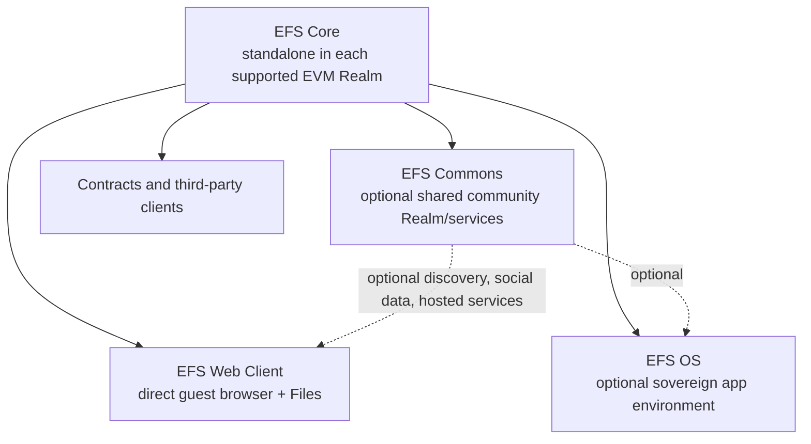

# EFS 2.0 — greenfield system constitution

**Status:** draft — synthesis of owner-ratified direction; exact protocol mechanics remain evidence-gated
**Target repos:** planning, contracts, sdk, client
**Authority input:** [[owner-rulings]]
**Supersedes:** the EFS 1.5 bridge target and the July five-kind/native-envelope architecture as automatic baselines
**Reviewers:** —
**Last touched:** 2026-08-23

#status/draft #kind/spec #repo/planning #repo/contracts #repo/sdk #repo/client #topic/efsv2 #topic/requirements #topic/lenses #topic/onchain

## What this document is

This is the requirements center of EFS 2.0. The shorter phone entry point is
[[README]]. This draft consolidates promises and boundaries that candidate
mechanisms must satisfy; it is not authority merely because it summarizes
them. It does **not** freeze a hash formula, codec, contract layout, kind set,
authority system, Lens grammar, chain, or client architecture. Those earn
permanence through prototypes, independent implementations, benchmarks, and
review.

Source precedence is:

1. attributed rulings in [[owner-rulings]];
2. promoted EFS 2.0 specifications and landed target-repository ADRs;
3. this draft as a requirements synthesis;
4. current candidate designs; then
5. older v1, EFS 1.5, v2-round, product, and review evidence.

When an old mechanism conflicts with an attributed greenfield ruling, the
ruling wins. When this draft conflicts with a ruling or promoted EFS 2.0 spec,
this draft is corrected. Old files remain valuable as records of requirements,
failed approaches, and tests; promoted v1 specifications do not thereby become
active EFS 2.0 specifications.

## The one-sentence model

> EFS Core is a permissionless, EVM-native, typed evidence graph and filesystem substrate that a qualifying EVM Realm can deploy, smart contracts can query in bounded gas, clients can reconstruct without an EFS-operated indexer, and readers can resolve through explicit trust policy without mistaking one Realm's current state for global truth.

## System layers

### EFS Core

The protocol and contracts that make EFS useful to Ethereum applications. A
fresh qualifying L3 must be able to deploy Core, author and read local data, execute
bounded smart-contract queries, and reconstruct the admitted graph without an
EFS Commons account, canonical EFS chain, EFS OS, or EFS-operated indexer.

### EFS Web Client and shared Files modules

A self-hostable direct client can open an explicit Realm or exact EFS link as an
unauthenticated direct guest, show raw and resolved data honestly, verify bytes, and use
the shared File Browser. Wallet detection and the OS boot path must not block
the first read. “Guest” means unauthenticated; it does not promise network
anonymity.

The reader, verifier, File Browser model, presentation router, and artifact
runner should be reusable modules. The Web Client and EFS OS may present them
differently without forking EFS semantics.

### EFS OS

An optional higher layer for local/encrypted state, accounts and recovery,
rich personal Lenses, offline work, capability grants, app installation,
sandboxing, agents, and secure signing. It consumes Core; Core never requires
it.

### EFS Commons

An optional shared Realm and/or replaceable services for public catalogs,
profiles, comments, discovery, search, relaying, endpoints, and other network
effects. No home chain or operator is selected. Any candidate must pass an
explicit cypherpunk/CROPS review of censorship resistance, public source and
state, rule-change capture, independent operation, force inclusion, verifiable
finality, reconstructability, and exit.

Commons never mints semantic identity, becomes the only index, authorizes
software execution, or gates direct Core access. Several Commons-like Realms
may coexist; choosing a default is client policy rather than protocol truth.

## Core constitutional requirements

### Universal identity without false equivalence

- Semantic EFS IDs are deterministic, domain-separated, versioned, and
  generatable without first mining an EAS receipt or transaction.
- Chain, deployment, carrier receipt, block, URL, mirror, submitter, and gas
  payer do not accidentally change portable semantic content identity.
- Stable subjects, exact immutable data or revisions, authored publication,
  and moving selections are distinct concepts.
- A chain-independent ID does not imply globally current authority. Realm,
  policy, and basis qualify admission, order, revocation, and current state.
- A Realm revision commits an accepted execution profile; it does not control
  the underlying chain's future hard forks. Realized-profile mismatch is an
  explicit observer result, and a semantics-breaking ambient change may require
  a successor Realm rather than silent continued conformance.
- External references are self-describing enough to distinguish profile, kind,
  algorithm, and origin where those distinctions matter.

### Minimal typed data

- EFS preserves EAS's good developer outcomes without assuming EAS: reusable
  shared Type definitions; precise shapes; named validation and admission
  policy; records browsable by Type; and application Types that require no Core
  contract upgrade.
- Canonical Records store only the bytes that define their typed semantic
  content. IDs and other derivable fields are not repeated as payload merely
  for convenience.
- Immutable descriptors or batch context may safely share repeated data.
  Mutable ambient parents never retroactively reinterpret children.
- Exact typed content is separable from an authored Occurrence and from the
  Realm's admission receipt. Identical content may be asserted independently
  by several authors without collapsing their provenance.
- A Type may declare zero or more bounded, typed reference roles. Relations
  with no natural single subject must not be forced into a fake owner/object.

### Authorship and authority

- Semantic author, signing actor/account, submitter/relayer, and payer are
  distinct roles.
- EOA and ERC-1271 authorship must work in a fresh supported Realm without another
  chain's identity service.
- Historical admission records the authority and implementation basis used at
  admission. A later smart-account upgrade, controller rotation, or Core
  upgrade does not silently reinterpret an old Occurrence.
- Contract-signature validity is an admission observation pinned to its Realm,
  execution coordinate, account/verifier code and state basis, verifier suite,
  signed digest/domain, bounded-call policy, and result; a later observer adds
  exact inclusion-block hash and finality. Historical Occurrences are never
  reinterpreted by calling the account's current ERC-1271 implementation. Pure
  signature-suite validity is reproducible from retained inputs; stateful
  controller authorization and Realm admission remain separate recorded facts
  unless an exact retained witness/profile makes the controller call itself
  reproducible.
- Key rotation, delegation, recovery, organizations, and future signature
  suites remain extension requirements. A full custom KEL is not frozen into
  the MVP merely to reserve them.
- The current candidate exposes one `PrincipalId` semantic author surface and
  represents an EOA or smart account as a zero-setup account Principal.
  Whether EOA authority can be chain-independent while contract-account
  authority is origin-qualified is part of the prototype, not constitutional
  law.
- Every Principal-bearing ID, ABI, storage key, index key, Binding, and Lens
  preserves the full `bytes32 PrincipalId`. Two Principals with the same low
  160 bits must remain distinct end to end.

### One transaction and honest mutation

- Writers can precompute dependent semantic IDs and submit a bounded dependency
  graph in one EVM call whose admitted Core state writes all commit or all
  revert. No second block is required merely to discover an identifier.
- Retrying identical content is idempotent. Mutable state uses explicit
  predecessor/CAS rules where races matter.
- History is append-only evidence. Withdrawal, revocation, tombstones, and
  replacement do not erase prior bytes or unexpectedly resurrect an older
  value.
- Core durability, currentness, revocation, and reconstruction never depend on
  code erasure, transient/expiring storage, or last-written-block metadata.
  Authored semantic time is explicit typed data; block hash/number, timestamp,
  slot, admission ordinal, and write age are observation coordinates. Biasable
  onchain randomness never defines durable identity or authority.
- A signed Envelope may carry a subset or amortize context and authentication;
  that fact alone does not assert an application-semantic transaction. Git
  multi-ref and similar all-or-nothing meaning lives in one typed transaction
  Record or an explicit bounded profile rule.

### On-chain graph and indexes

- Core is a graph database, not just a data bucket. Required smart-contract
  reads work in bounded gas from Realm state.
- Baseline automatic reads separately cover exact Types, Records, authored
  Occurrences, admission receipts, global admission order, unique Records by
  Type, and Occurrences by Type, Record, and Principal.
- A Type creator selects a bounded set of supported exact typed-scalar equality,
  typed-reference, and backlink indexes. Once that Type/index profile is
  admitted, every matching item is indexed automatically; individual writers
  cannot opt out.
- Typed references provide paginated backlinks by declared role and target.
  Hot values, spam, and history never turn a point read into an unbounded scan.
- Physical storage layout is replaceable until frozen. The semantic query
  contract—typed keys, basis, cursor, coverage, and completeness—is the durable
  part.
- The adopted generic query outcomes—reverse membership/cited-by, content-digest
  lookup, author enumeration, revocation-aware current counts, and deterministic
  best-locator selection from bounded declared evidence—remain costed gates.
  If the aggregate budget fails, return the specific capability to James rather
  than silently deleting it.
- Range, prefix, collation, full text, global ranking, global analytics, and arbitrary
  joins stay off-chain or in replaceable modules until a real contract workload
  proves one belongs in Core.

### Lenses for contracts and people

- Lenses are required: one shared evidence graph must support different
  explicit, attributable reader trust policies.
- Core must support a bounded, deterministic contract Lens profile for point
  resolution over Principal-qualified claims. A separately benchmarked
  bounded-depth path profile may build on it. The resolver returns explicit
  `FOUND`, proved `ABSENT`, conflict, unsupported, or `UNKNOWN` outcomes.
- A rich OS or Commons Lens may compile to an immutable Core-compatible
  Resolution Plan. Core does not run arbitrary policy code or an unbounded
  social graph during a read.
- The party bearing risk selects or approves the Lens. A caller cannot choose
  the trust list that authorizes that caller.
- Contract-visible Lenses are public. Private personal trust policy stays
  local/encrypted unless a later zero-knowledge profile genuinely proves more.

### Honest reads and reconstruction

- Every enumeration is hard-bounded and exposes Realm, policy/code basis,
  high-water mark, cursor, coverage, and `COMPLETE`, `PARTIAL`, `UNSUPPORTED`,
  or `UNKNOWN` status. `UNKNOWN` is never absence.
- An EVM historical/offchain read basis identifies an exact block hash. Block
  number and tags are lookup conveniences, not mergeable truth; canonicality
  and finality remain separate observations. One direct onchain call sees
  atomic current state and can expose its execution block number and high-water,
  but cannot know its current block hash. An empty or shorter transport response
  proves no absence unless the exact requested finite domain and terminal
  cursor/count/commitment establish complete coverage.
- Canonical Type, Record, Occurrence, admission, index, and current-fold bytes
  required to reconstruct authoritative Core state remain state-readable; they
  are never replaced by hash-only body elision, event logs, or private hosted
  databases.
- A second implementation can reconstruct Types, Records, Occurrences,
  admissions, indexes, and current folds from the declared Realm state and
  byte carriers without an EFS-operated service. Source authority and
  completeness are established first from an independently authenticated Realm
  bootstrap and exact/finalized block-state basis, plus the state-readable
  inventory, closure, count, and root commitments required by Core rules. Two
  independently written readers then prove deterministic projection—not source
  authority or completeness—by rejecting missing, duplicate, noncanonical,
  malformed, or trailing inputs and any item falsely included inside the
  declared canonical projection domain, and by reproducing identical bytes.
  Unrelated state outside that declared domain is not “surplus” input.
- Upgradeable early contracts may fix code and add capabilities, but the
  interpretation used for already-admitted data remains identifiable. Semantic
  evolution uses versioned Types/profiles and explicit successor or redirect
  evidence rather than silently changing old meaning.

### Files, bytes, and large content

- A Locator or URL is a claim about where bytes may be found, not content
  identity. A mutable URL can produce several immutable observations over time.
- Exact content identity exists only after the exact representation or closure
  commitment is known. A pasted 50 GB URL may begin as a Locator; it need not
  block on a phone hashing the entire object.
- Exact byte digests, sizes, media types, CIDs, manifests, provenance, rights,
  compatibility, and availability are distinct facts. Size or media type is not
  forced into identity unless an exact profile requires it.
- Executable bytes verify before execution. Large passive content may use a
  versioned chunk/Merkle closure and verify each consumed arbitrary range before
  use. Partial/resumable acquisition exposes verified coverage and never claims
  a complete Artifact early.
- Content identity is independent of storage provider. Locators are plural;
  multiple gateways for one CID do not pretend to be independent custody.

### Privacy, safety, and execution

- Public on-chain metadata is public. Encryption may protect payload bytes but
  does not erase authorship, timing, graph, endpoint, or traffic leakage.
- Public is the default. Client/OS sensitivity policy encrypts sensitive or
  explicitly private plaintext before signing or publication and warns about
  permanent metadata exposure. Contracts consume public values, not secrets.
- Opaque/ciphertext bodies remain legal. Private profiles use distinct domains
  and may commit salted or ciphertext canonical bodies so a public
  plaintext-derived ID does not create a dictionary oracle. Graph-hiding,
  key-management, and proof profiles remain additive research seams.
- A supported encrypted-body profile separates signing, encryption, scanning,
  recovery, wrapping, and shredding key roles; pins a versioned canonical AEAD
  and associated-data transcript; and resists ciphertext transplantation.
  Signature-derived archive encryption keys are forbidden.
- Sensitivity defaults, opt-in privacy, and any inherited privacy label are
  explicit client policy. Public and private material must not share a signed
  batch or context when that structure would create a permanent linkage.
- Retrieval integrity never implies interest privacy. Clients disclose whether
  the RPC, carrier, gateway, relay, or local replica can observe the object or
  query being retrieved.
- Discovery and presentation metadata never authorize execution. Untrusted app
  code receives no ambient signing, wallet, secrets, network, decryption, or
  EFS-write authority.
- Permanent-public-data tools warn and may refuse obvious hazard classes at the
  client edge; Core remains neutral evidence infrastructure.

### Filesystem and application expressibility

- The same pinned, resolved EFS view must be projectable read-only through
  Linux, macOS, and Windows adapters with honest absence, stable handles,
  verified reads, portable names, and bounded metadata.
- Bounded public scalar properties may project to read-only xattrs/EAs, while
  a lossless paged control/API surface exposes the complete graph, provenance,
  grades, losing candidates, and unsupported metadata.
- Generic Core Types and indexes must express Arcade, Git/Markdown history,
  EAP achievements, Nanda skills/providers, comments and collaboration,
  anonymous dataset browsing, contract configuration, shared Topics, and
  large-file Locators without app-specific Core contracts or private indexes.
- Git keeps native Git OIDs and Software Heritage identifiers where relevant;
  EFS adds stable repository identity, authored collaboration, placement,
  authority, availability, and bounded query semantics rather than renaming Git
  objects.

## What is deliberately not frozen

- EAS as carrier or adapter;
- exact Record, Occurrence, Envelope/Context, receipt, binding, or withdrawal
  bytes;
- the name `TypeRevision` or any exact Type schema;
- Principal/account/KEL formula and succession mechanism;
- Lens grammar, limits, encoding, or contract split;
- hash suite, canonical structured-data codec, and external URI spelling;
- physical index layout, ordinal width, compaction, or module addresses;
- a Commons chain, operator, account model, or brand;
- Web Client versus OS packaging details;
- Arcade, EAP, Git, Nanda, or other application Types.

## Architecture-level acceptance tests

The design cannot freeze until at least these traces pass:

| Trace | Required result |
|---|---|
| Fresh qualifying L3 | Deploy Core and generic fixtures; a clean, self-hosted Web Client opens an explicit supported Realm as a guest with no Commons, account, wallet prompt, OS profile, or hosted indexer. |
| Type and admission validation | A malformed body fails deterministic structural validation. A bounded, version-identified Realm validator accepts or rejects a validly shaped Record without changing the portable Record ID, and the admission receipt exposes the validator/policy basis. |
| One-transaction graph | Precompute IDs offline and atomically publish related typed Records and authored Occurrences; retries are idempotent and races are explicit. |
| Independent rebuild | Delete all EFS project caches/databases and reconstruct from Realm state plus declared byte carriers with a second implementation. |
| Honest query | Type, exact scalar, typed backlink, set enumeration, and Lens point reads paginate at a pinned basis; truncation or missing coverage returns `PARTIAL/UNKNOWN`, never empty. |
| Authority history | EOA and ERC-1271 writes preserve author/actor/payer separation; later account/Core upgrades do not alter the recorded historical basis. |
| Contract Lens | A contract resolves one slot through 1/8/32/64-Principal plans in bounded gas; a beneficiary-supplied plan cannot authorize the beneficiary. |
| Arcade | Project, Release, exact closure, two locators, curator selection, rights/compatibility evidence, tampered-primary rejection, verified fallback, and guest play need no Arcade Core primitive. |
| Git/Markdown | Stable repository identity, native Git OIDs, stock clone/fetch, authenticated replay-safe push/intake, atomic multi-ref semantics, guest file/commit/diff browsing, wiki history, plural availability, ordinary import/export, and opted-in EFS workspaces need no Git Core primitive. Issues, patches/PRs, reviews, releases, comments, reactions, teams, and edit history remain clonable and reconstructable with the code. |
| EAP proposed fixture | Achievement definition, award, lifecycle, and local game gate use generic Types/indexes; hostile subject-targeting spam cannot make the authoritative point check unbounded. This task-derived fixture must be backed by a durable EAP brief before freeze. |
| Nanda | Provider, service, skill/release and exact closure; plural catalogs/evidence; yanking/rotation; and guest inspection remain generic. Discovery or reputation never grants execution or authorization. |
| Large content | A 50 GB Locator can be published before whole-file hashing; later exact closure/equivalence evidence is additive. Partial/resume, funding and durability grades, gateway fallback, and arbitrary-range proof remain honest; unverified executable bytes never run. |
| Cross-Realm | The same portable Record and, if that profile survives, source authored Occurrence may be copied into two Realms while admissions/bindings differ; clients display source and destination authority/basis rather than inventing global current state. |
| Three-host mount | One golden pinned view works through shell and normal GUI on Linux, macOS, and Windows with portable collision-safe names, exact enumeration, stable handles, verified ranges, visible `UNKNOWN`, bounded read-only xattrs/EAs, a lossless control/API surface, and every mutation failing read-only. |
| Files/Web/OS parity | Web Client Files and OS Files produce the same canonical resolved manifest for the same Realm, policy, and basis. |
| Privacy | A sensitive plaintext fixture is encrypted before signing/publication; public indexes reveal only the explicitly accepted metadata; equal low-entropy plaintext across public/private profiles does not silently share an oracle-friendly ID. Key-role misuse, AEAD transplant, mixed public/private batch linkage, and retrieval-observer disclosure are tested explicitly. |

## Freeze discipline

1. Freeze the smallest canonical encoding, domain, and semantic identity rules
   first, with Solidity, TypeScript, and Rust golden vectors.
2. Prototype self-contained Records versus immutable shared Context/Envelope
   normalization on the same fixtures; benchmark calldata, storage, cold reads,
   extraction, and reconstruction.
3. Prototype the minimal native Core and mandatory indexes. Keep EAS as an
   optional adapter experiment, not a hidden dependency.
4. Run the focused Fable 5 engineering pass and independent long-horizon,
   database, EVM-security, and standards review.
5. Pin each required standard's official source revision/status/dependencies,
   its EFS disposition, the accepted Realm execution/read profile, and actual
   target support separately. Proposal status, venue support, safety, and owner
   adoption never collapse into one claim.
6. Freeze only after all surviving ambiguity is either resolved or explicitly
   versioned for coexistence. The goal is the last change to EFS 2.0's initial meaning,
   not the last EFS implementation.

## Candidate defaults and later gates

The early questions below now have an explicit disposition. These are
replaceable `EXP-C0/v0` defaults, not owner-ratified protocol bytes:

| Seam | Candidate disposition | What can still change it |
|---|---|---|
| Author API | Uniform full-width `PrincipalId` with zero-setup account Principals. | Integrated verification/persistence cost or a concrete migration/security failure. |
| Contract Lens | Immutable bounded point `ResolutionPlan`; proved absence alone permits fallback; measure 1/8/32/64 Principals. | Integrated gas/result ceilings or a real contract consumer that cannot be expressed. |
| Type and indexes | Exact nominal Type identity includes meaning, value shape, representation, intrinsic validation, and closed references. Separately identified QueryProfiles carry index and coverage obligations. | Hostile-value/state-growth measurements may reduce automatic obligations or caps, but may not manufacture completeness. |
| Artifact normalization | Author-neutral Record, portable authored PublicationSet, per-leaf Occurrence, and destination-bound AdmissionPlan/receipt. | A literal application trace showing lost identity, provenance, atomicity, or materially worse aggregate cost. |
| Realm bootstrap | Self-authenticating bootstrap and append-only revisions disclose powers and exact execution/read profiles; attributed source/finality observations remain separate. No registry or Commons is required. | A bootstrap/reconstruction control exposing an identity-bearing omission. |
| Query breadth | Exact scalar/reference/backlink and bounded point/Lens reads are in the candidate. Wide ranking, global sorted enumeration, and search remain application/index layers. | Candidate benchmarks determine caps and whether any promised automatic posting is unaffordable. |
| Commons | Venue criteria and comparison remain later deployment work. | No venue decision blocks Core, SDK, or direct guest Explorer candidate engineering. |
| First product loop | Direct no-wallet raw Explorer plus minimum read-only Files profile. Writes, Arcade polish, extensions, and OS mount integration follow the lossless Reader seam. | Fall back to Core/SDK-only only on a named integration blocker. |

The remaining uncertainty is therefore either an engineering measurement, an
explicit freeze/deployment choice, or a falsifier—not an invitation to reopen
the whole architecture while beginning the candidate.

## Pre-promotion checklist

- [x] Former open questions classified as candidate defaults, engineering work,
  or later gates in this document and [[mvp-build-start-packet]]
- [x] `**Target repos:**` confirmed
- [x] No design lifecycle dependencies; [[owner-rulings]] is an authority input
- [x] No `<!-- AGENT-Q: -->` comments left in the design body
- [ ] At least one round of `#status/review` with another agent or human comment

## Implementation notes

No permanent contract implementation is authorized by this draft. Throwaway
prototypes, conformance fixtures, the direct-reader client slice, and product
adapters may proceed to generate the evidence needed to finish it.
