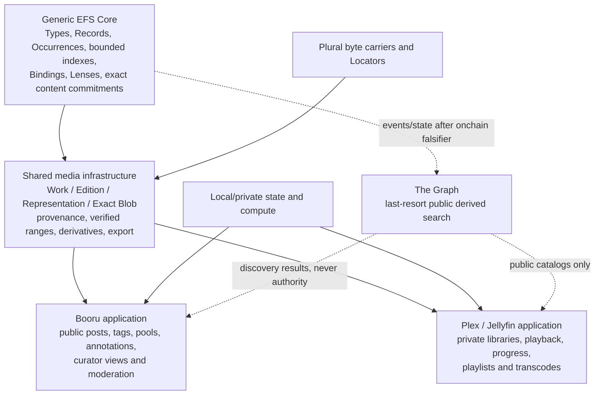

# EFS Media Library — design set

**Status:** draft set — owner-directed product decomposition; application and query mechanisms remain provisional
**Target repos:** planning, contracts, sdk, client
**Depends on:** [[Designs/efsv2/README]], [[Designs/clientv2/README]]
**Reviewers:** 2026-08-14 — independent authority/architecture pass; no Critical or Important finding after repair
**Last touched:** 2026-08-14

#status/draft #kind/design #repo/planning #repo/contracts #repo/sdk #repo/client #topic/media-library #topic/content #topic/gallery #topic/onchain

## Product direction

Build one shared, durable media foundation and expose it through two distinct
products:

1. a **Booru / Sankaku-style public gallery** for dense tagged discovery,
   plural curation and community knowledge; and
2. a **Plex / Jellyfin-style personal media library** for private organization,
   direct playback, playlists and watch continuity.

The products share identity, verified bytes, provenance, derivatives,
collections, import/export and query adapters. They do not share one blended
interface or one privacy model. Booru is primarily public discovery and
curation; Plex/Jellyfin is primarily private library management and playback.

## Authority register

### Owner direction carried by this set

- **Three durable tracks:** media infrastructure, Booru/Sankaku-style app and
  Plex/Jellyfin-style app. The shared foundation must serve more media uses
  without turning either application into Core.
- **Onchain first:** attempt and measure the smallest generic onchain solution
  for every public query before classifying it offchain.
- **The Graph last:** if a public derived query genuinely cannot meet bounded
  onchain cost, state or read requirements, the first reference escape hatch is
  an independently deployable The Graph subgraph. It is not the default read
  path or semantic authority.

This restates the adopted EFS stance to “lean hard on-chain” and reserve The
Graph for genuinely heavy search in [[Designs/efsv2/owner-rulings#On-chain sign-off — partial rulings (the 18-item list, onchain-completeness §3)]].
The media-specific decomposition and fallback implementation are product
direction recorded here; they do not freeze Core bytes or a subgraph schema.

“Use The Graph offchain” is scoped to **public derived query/search**. The Graph
is not a media store, range server, transcode worker, offline cache, folder
watcher or private household database. Private tags, blacklists, watch state,
server paths and unpublished libraries remain local unless deliberately
published through a separate ceremony.

### Adopted EFS-wide inputs

- EFS 2.0 is the greenfield successor; v1/EAS and old v2 mechanisms are
  evidence, not automatic requirements.
- A fresh qualifying Realm, direct client and independent reconstruction cannot
  require an EFS-operated indexer or canonical Commons.
- Useful exact Type, scalar, digest, typed-reference, backlink and current reads
  remain onchain acceptance obligations, with automatic indexing after a Realm
  admits a Type/index profile.
- Ranked/full-text/global aggregate search may be offchain; an offchain result
  never becomes identity, authorization or canonical truth.
- Published material is public by default. Local/private state is a deliberate
  non-publication path, not encrypted public-chain magic.

See [[Designs/efsv2/README]], [[Designs/efsv2/system-constitution]],
[[Designs/efsv2/owner-rulings]] and
[[Designs/efsv2/owner-decision-inbox#V2-E4 — Type and index budget]].

### Proposal-only in this set

- Application profile names and fields.
- Exact Type, Record, Occurrence, Binding and Lens encodings.
- Media-query indexes, compound keys and view contracts.
- The Graph entity and event schema.
- Storage venue, public Realm, seed corpus and serving operator.
- Client, SDK and home-server implementation technologies.

Stage A is a coherent proposal package, not frozen protocol bytes; Stage B has
not produced the aggregate media query gas/state evidence. See
[[Reviews/2026-08-13-efs2-stage-a-corpus/STATUS]].

## Documents in this set

| Document | Owns |
|---|---|
| [[media-infrastructure]] | Shared identity, exact bytes, provenance, privacy, import/export, resolver and service boundaries |
| [[booru-app]] | Public posts, tag vocabulary and claims, gallery UX, pools, moderation and crowdsourcing |
| [[plex-jellyfin-app]] | Personal libraries, scanning, metadata, direct play, verified seeking, progress and transcoding |
| [[query-and-indexing]] | Onchain-first placement ladder, The Graph escape hatch, completeness contract and benchmarks |
| [[owner-rulings]] | Dated media-product rulings without duplicating later Core mechanism history |
| [[owner-decision-inbox]] | The set's deliberately small, evidence-gated owner queue |

## Existing evidence — link, do not duplicate

Start with the completed [[Reviews/2026-08-14-media-library-intake/README|media-library intake]]. Its linked documents already provide:

- the durable product charter and staged M0–M6 roadmap in
  [[Reviews/2026-08-14-media-library-intake/product-charter-and-roadmap]];
- the authority-aware `ML-*` requirement ledger in
  [[Reviews/2026-08-14-media-library-intake/evidence-and-requirements]];
- the exact fixture and generic-Core pressure map in
  [[Reviews/2026-08-14-media-library-intake/fixture-pressure-map]];
- standards and loss-preserving adapter rules in
  [[Reviews/2026-08-14-media-library-intake/standards-and-adapters]]; and
- exact retained fixture, range, fallback, BagIt and reconstruction evidence in
  [[Reviews/2026-08-14-media-library-intake/candidate-fixture-evidence]].

The earlier gallery corpus remains the deeper booru source:

- [[Reviews/2026-07-29-target-communities/visual-gallery-and-booru-ecosystems]]
  explains the product anatomy and rights contradiction;
- [[Reviews/2026-07-29-target-communities/requirements-and-first-apps]] carries
  the concrete gallery acceptance requirements; and
- [[Reviews/2026-07-29-target-communities/gallery-opportunity-ranking-and-launch-plan]]
  defines the 10k/1m fixtures, five-minute journey, success metrics and kill
  criteria.

There was no prior Plex/Jellyfin/Kodi/Emby design in this workspace. This set
now adds dated official-source baselines for
[[booru-app#Primary-source Sankaku follow-up, 2026-08-14|Sankaku]] and
[[plex-jellyfin-app#Primary-source Plex follow-up, 2026-08-14|Plex]] /
[[plex-jellyfin-app#Primary-source Jellyfin follow-up, 2026-08-14|Jellyfin]].
They justify requirements; they do not prove adapter compatibility or parity.

## Parked workload pressure tests

Adjacent media lifecycles are parked in
[[Ideas#Media lifecycle workload pressure-test portfolio]]. They are candidate
fixtures for falsifying the shared identity, byte, privacy, provenance,
collection and query requirements only. This design set does **not** add a
family archive, creator-release system, scholarly viewer, production review
graph, field notebook, live channel, scientific viewer, NVR or medical-media
system as an application track, roadmap commitment or authorized corpus.

A parked workload should enter an experiment only with an exact minimal
fixture, a requirement it can falsify, a safe rights/privacy boundary and a
clear stop condition. A useful result may strengthen or correct the shared
foundation without implying that EFS should ship the example application.

## Shared boundary

| Concern | Shared infrastructure | Booru | Plex / Jellyfin |
|---|---|---|---|
| Identity | Work, Edition, Representation, Exact Blob and typed relationships | public Post/Submission and curator claims | library match, movie/episode/track profiles and local corrections |
| Bytes | digest, length, chunk commitments, verified reader, Locators | thumbnails, previews and explicit originals | direct play, seek, remux and transcode outputs |
| Collections | attributable ordered membership | pools, galleries, comics and sets | seasons, albums, playlists and queues |
| Search | common query AST, onchain adapter, The Graph adapter | dense public Boolean/metatag discovery | mostly private local search; Graph only for deliberately public catalogs |
| Authority | authored evidence plus explicit Realm/basis | plural curator and moderation views | library owner/household policy, usually unpublished |
| Personal state | separate local/private overlay | blacklists, private tags, favorites and saved searches | watch progress, history, playback choices and household permissions |
| Exit | normalized records, exact fixity, adapters and reconstruction | portable public catalog and moderation history | local library export plus public editions explicitly selected for publication |

## Proposed build order

This is a recommendation, not an implementation authorization:

1. **Foundation Slice 0:** implement the fixed two-work offline proof in the
   local no-remote experiment described by
   [the offline-loop specification](../../../experiments/efs-media-library-offline-loop/docs/superpowers/specs/2026-08-14-offline-personal-library-loop-design.md).
2. **Booru Slice 1:** read-only guest gallery with real tag concepts,
   alias/implication expansion, negative filters, competing curator views,
   ordered pools, safety-before-fetch and a disposable search provider.
3. **Query Lab:** measure single-tag, hot-tag and selective 2/3/5-tag traces
   through Core and a redeployable bounded view before building the reference
   subgraph.
4. **Plex Slice 0:** private local media agent with one direct-play video,
   verified mid-file seek, one playlist and offline resume; no transcode yet.
5. **Public/community scale:** submissions, signing, adapters, moderation,
   Graph fallback where proven necessary, 10k and synthetic 1m workloads, then
   social/community features.

No step authorizes a public corpus, permanent contract, deployment, scrape,
external communication or public serving operation.

## Cross-cutting limitations

- No current EFS application profile or media Type bytes are canonical.
- The current fixture is tiny; it proves semantics and reconstruction, not
  performance or adoption.
- The Graph improves query availability only when Indexers actually serve the
  chosen subgraph; it cannot prove global completeness across unknown Realms.
- Metadata durability does not make media bytes available. Locators, custody,
  repair and funding remain separate operational facts.
- Public-chain encryption cannot hide a public relationship graph. Strong
  privacy normally means not publishing the relationship.
- A moderation Lens controls presentation, not deletion, legal truth or the
  conduct of every independent gateway.
- Creator/steward authorization is required for a public proof corpus. Existing
  boorus are product and adapter teachers, not automatic acquisition sources.

## Pre-promotion checklist

- [ ] Every application requirement traces to the retained `ML-*` ledger or a
      clearly labeled new Plex requirement.
- [ ] Stage B measures the aggregate mandatory index bundle plus media query
      additions; no operation is approved from isolated happy-path gas.
- [ ] Booru Slice 1 and Plex Slice 0 each pass an independent implementation
      review without requiring a media-specific Core primitive.
- [ ] The Graph fallback has exact deployment, basis, coverage, error and
      Core-verification behavior, plus a useful no-Graph client state.
- [x] Dated primary-source Sankaku, Plex and Jellyfin passes establish a
      requirements baseline and explicitly inventory what they do not prove.
- [ ] Authorized/live adapter fixtures close the remaining compatibility,
      export, governance and parity gaps named in the application designs.
- [ ] All open questions are resolved or explicitly deferred.
- [ ] At least one `#status/review` pass receives another agent or human review.
