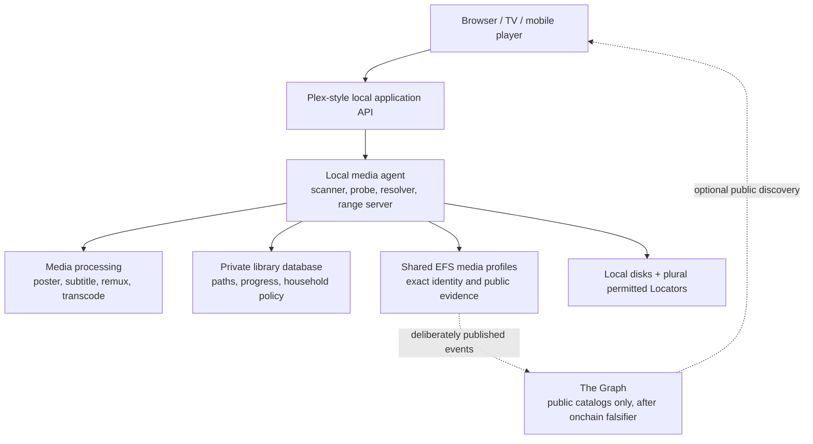

# Plex / Jellyfin-style application on EFS

**Status:** draft
**Target repos:** planning, contracts, sdk, client
**Depends on:** [[media-infrastructure]], [[query-and-indexing]], [[Designs/efsv2/mountable-filesystem-semantics]]
**Reviewers:** 2026-08-14 — independent authority/architecture pass; no Critical or Important finding after repair
**Last touched:** 2026-08-14

#status/draft #kind/design #repo/planning #repo/contracts #repo/sdk #repo/client #topic/media-library #topic/content #topic/privacy #topic/read-path

## Problem

A Plex/Jellyfin-style product is not a public booru with a different grid. Its
center is a person's or household's private files, metadata correction,
device-aware playback, progress and local compute. It needs persistent folder
watching, media probing, range serving, subtitle/audio selection and sometimes
remuxing or transcoding. Most of that work belongs on a trusted local media
agent or home server, not in a browser, EVM contract or public index.

EFS can improve the foundation: stable media identity, exact verification,
plural Locators, derivative provenance, portable collections, public edition
selection and walk-away reconstruction. It should not make watching one's own
library contingent on publishing filenames, interests or progress.

There was no prior Plex, Jellyfin, Kodi or Emby teardown in this workspace.
This design now includes dated official-source Plex and Jellyfin baselines, but
remains a requirements/prototype frame rather than a parity claim. It reuses
the media intake, large-content, mount, player and offline research named below.

### Primary-source Plex follow-up, 2026-08-14

Current official Plex material supports several important distinctions:

- Plex calls a different release such as a director's cut an **Edition**, and
  a different encoding/resolution of that edition a **Version**. Both can
  coexist, matching the proposed Work → Edition → Representation → Exact Blob
  split ([multi-version movies](https://support.plex.tv/articles/200381043-multi-version-movies/)).
- Library scanning separates filesystem discovery and technical analysis from
  a correctable metadata-agent match. External IDs and filenames are matching
  hints, not durable identity
  ([matching process](https://support.plex.tv/articles/200889878-matching-process/)).
  Television libraries also support several aired/DVD/absolute orderings, so
  one sequence cannot be silently canonical
  ([TV naming and ordering](https://support.plex.tv/articles/naming-and-organizing-your-tv-show-files/)).
- Playback distinguishes unchanged Direct Play, stream-preserving container
  repackaging/Direct Stream and codec Transcode
  ([streaming overview](https://support.plex.tv/articles/200430303-streaming-overview/),
  [Direct Play/Stream](https://support.plex.tv/articles/200250387-streaming-media-direct-play-and-direct-stream/)).
  Persisted optimized versions are a fourth, durable derivative case
  ([Media Optimizer](https://support.plex.tv/articles/214079318-media-optimizer-overview/)).
- The current versioned server API exposes hierarchical libraries, playlists,
  playback decisions, HLS/DASH sessions, tracks, history and pagination
  ([Plex Media Server API](https://developer.plex.tv/pms/)). The reviewed
  documentation did not promise arbitrary HTTP Range behavior; that remains a
  live adapter-conformance test rather than a Plex invariant.
- Watched state, in-progress resume position, rating, event history and active
  sessions are different data. Plex's optional account sync intentionally does
  not sync all of them
  ([watch state](https://support.plex.tv/articles/201018487-mark-as-watched-or-unwatched/),
  [sync limits](https://support.plex.tv/articles/sync-watch-state-and-ratings/)).

Plex documents database/server-directory backup and migration, but not a
general implementation-neutral export of every match, ordering, playlist,
permission and presentation choice. EFS therefore treats lossless exit as a
requirement, not inherited evidence.

### Primary-source Jellyfin follow-up, 2026-08-14

The current stable Jellyfin baseline checked here is
[10.11.11](https://github.com/jellyfin/jellyfin/releases/tag/v10.11.11), commit
`1fbd8739292cce610231be93daf43368733edf63`.

- Stable Jellyfin derives many scanned item IDs from type plus path/key. A
  rename can therefore change server-local identity, which confirms that EFS
  must reconcile paths through exact bytes and scan receipts instead of
  adopting Jellyfin IDs
  ([stable source](https://github.com/jellyfin/jellyfin/blob/1fbd8739292cce610231be93daf43368733edf63/Emby.Server.Implementations/Library/LibraryManager.cs#L631-L657)).
- Jellyfin's playback labels differ from Plex's: its documentation separates
  unchanged Direct Play, container-only Remux, audio-transformed Direct Stream
  and video Transcode. The portable decision must describe changed streams,
  not depend on a vendor label
  ([transcoding](https://jellyfin.org/docs/general/post-install/transcoding/)).
- Jellyfin serves ordinary byte ranges for direct local files, but progressive
  transcoded output may reject ranges. Neither behavior proves cryptographic
  membership, so verified ranges are an EFS addition rather than a parity
  claim
  ([stable range helper](https://github.com/jellyfin/jellyfin/blob/1fbd8739292cce610231be93daf43368733edf63/Jellyfin.Api/Helpers/FileStreamResponseHelpers.cs#L29-L135)).
- Jellyfin backup and NFO facilities are implementation-specific or partial;
  they do not replace an EFS exit capsule
  ([backup/restore](https://jellyfin.org/docs/general/administration/backup-and-restore/),
  [NFO limits](https://jellyfin.org/docs/general/server/metadata/nfo/)).
- Jellyfin explicitly warns that cleanup while media is unavailable can lose
  playlist data. Temporary source loss must therefore be a first-class state,
  never an inferred deletion
  ([scheduled tasks](https://jellyfin.org/docs/general/server/tasks/)).

Jellyfin can operate without Internet access apart from external enrichment,
which is the right local-first baseline. Remote access remains a separately
authorized transport/security profile; no secret may enter a Locator, public
record, Graph entity or URL log
([networking](https://jellyfin.org/docs/general/post-install/networking/),
[reverse-proxy notes](https://jellyfin.org/docs/general/post-install/networking/reverse-proxy/)).

## Product promise

A user can import a local library, preserve and verify originals, browse it
privately, directly play compatible representations with verified seeking,
continue offline, retain playlists and watch state, and export enough exact
metadata to move to another implementation. Publishing an edition or public
catalog is an explicit separate action.

## Requirements

| ID | Requirement | First proof |
|---|---|---|
| PLEX-01 | Local folder/API discovery is resumable and reconciles additions, moves, changes and disappearance without silently minting a new Work for every pathname. | Rerun a scan after rename, replacement and partial failure; receipts distinguish every outcome. |
| PLEX-02 | Movie, Series, Season, Episode, Album, Disc, Track, Person, Credit and selectable Media Track metadata are application profiles over shared Work/Edition/Representation/Blob identity. | One episode with multiple encodes and audio/subtitle tracks keeps one Work lineage, several exact blobs and independently selectable track observations. |
| PLEX-03 | Metadata-provider matches are candidates with source/basis; manual correction does not overwrite exact file or upstream evidence. | Choose and later revise one match while preserving both observations. |
| PLEX-04 | Playback records unchanged Direct Play, container-only remux, partial-stream transform, video transcode and persisted optimization as distinct decisions with device/capability evidence; vendor labels are adapter metadata. | A compatible client receives the exact original; every incompatible path declares exactly which container/tracks changed. |
| PLEX-05 | Direct/retained media ranges verify before decoder consumption. An ephemeral transform instead verifies committed inputs before processing and discloses its worker/session trust because its output is not yet an Exact Blob. | Direct seek rejects a tampered range; live transform rejects corrupt input and is never labeled an exact EFS Representation before closure/hash. |
| PLEX-06 | Stable posters, thumbnails, waveforms, subtitles, remuxes and transcodes are new representations/exact blobs with derivation evidence. | No generated output overwrites its input or masquerades as exact equivalence. |
| PLEX-07 | Watch position, watched state, play history, per-user queues, favorites, chosen tracks and household policy remain private/local by default. | Public records, Graph entities and logs contain none of the private fixture values. |
| PLEX-08 | Playlists, queues, albums and alternative season/episode orderings preserve target version, position, author, ordering source and history. | Export/import retains multiple orderings and does not imply unrelated files share Work identity. |
| PLEX-09 | Offline availability is reported per exact representation and generation, not inferred from catalog metadata. | Cache loss shows unavailable; it never claims the file is absent from EFS or the source library. |
| PLEX-10 | The library remains useful without The Graph, a public Realm, Commons, a wallet or an external metadata provider. | Cold local direct-play loop succeeds with network disabled after import. |
| PLEX-11 | Public sharing is deliberate and exposes the exact edition, rights/source evidence, Locators and privacy consequences before signing. | A local item remains unchanged while one selected public edition is exported/admitted separately. |
| PLEX-12 | Exit preserves originals, identity mappings, application metadata, playlists and disclosed private-state limitations. | A second implementation rebuilds a usable library from exported inputs without the first server database. |
| PLEX-13 | The system reports codec, color/HDR, subtitle, audio, range, storage and transcode limitations honestly. | Unsupported and resource-exhausted cases fail to explicit states rather than generic playback failure. |
| PLEX-14 | Temporary source, mount, share or Locator unavailability never implies deletion of portable identity, metadata, playlist membership or private progress. | Unmount during startup, scan and cleanup; remount and recover the same Work, exact blobs, playlist order and two users' private state. |
| PLEX-15 | Remote access is disabled unless explicitly configured, keeps credentials out of URLs/public data/logs, and uses replaceable authenticated transport with accurate local/remote classification and resource limits. | Remote-disabled fixture has no externally reachable listener while local loopback works; authorized fixture survives proxy misclassification, leaked-URL and rate-exhaustion negatives. |
| PLEX-16 | A normal local UI can browse by library/type/folder/hierarchy, search/filter/sort, inspect editions/versions/tracks and continue playback without a wallet, public Realm or Graph endpoint. | Movie, episode and music journeys retain position, selected tracks and private resume state across restart/offline mode. |

## Shared versus Plex-specific model

[[media-infrastructure]] owns Work, Edition, Representation, Exact Blob,
Locators, provenance, derivation, collections, verified reads and export.

This application adds tentative profiles and local state for:

```text
Library
  ├─ Movie / Series / Season / Episode
  ├─ Album / Disc / Track
  ├─ Person / Credit / Role
  ├─ MediaTrack (video / audio / subtitle / chapter)
  ├─ MetadataMatchCandidate + LocalCorrection
  ├─ DeviceCapabilityProfile
  ├─ PlaybackDecision
  ├─ PlaybackSession
  ├─ WatchState / ResumePoint / Rating / ViewingEvent
  ├─ HouseholdUser / Policy
  └─ LocalPathObservation / ScanReceipt
```

These names are not proposed Core Types. Most are local application rows. Only
deliberately portable/public evidence becomes a media-profile Record and
authored Occurrence.

### Filesystem and identity

A pathname is an observation, not identity. Import should use exact digest,
length, file identity where available, technical metadata and prior scan
receipts to reconcile:

- same path, same bytes;
- renamed/moved same bytes;
- same path, replacement bytes;
- hard link or duplicate copy;
- edited metadata or container;
- derived file; and
- missing/unmounted source.

The adopted three-host read-only mount is an optional adapter over the same
resolved manifest and verified-range reader. Plex must not invent a competing
EFS file identity or interpret `UNKNOWN` as `ENOENT`. See
[[Designs/efsv2/mountable-filesystem-semantics]].

### Metadata matching

Filename parsing, embedded metadata and external provider responses produce
versioned candidates. A local user chooses or corrects a match. The application
retains:

- provider and provider item ID;
- retrieval time/basis and raw-evidence digest;
- confidence and parser version;
- user correction history; and
- the exact Work/Edition/Representation being described.

Provider metadata cannot redefine the Exact Blob. Licensing and export terms
for provider artwork/text must be reviewed separately.

## Tentative technical shape

A credible first architecture uses a local media agent/home server above the
shared EFS layer:



The browser-only Foundation Slice 0 is still valuable for verification,
public/private separation and offline-loss behavior, but it cannot credibly
provide persistent directory watching, broad codec support or dependable live
transcoding.

### Local media agent responsibilities

- descriptor-safe filesystem scanning and change reconciliation;
- exact hashing and chunk-tree generation;
- media probing and retained technical observations;
- preview/poster/subtitle/chapter extraction;
- range-serving verified bytes;
- device capability negotiation;
- remux/transcode job isolation, limits and provenance;
- private library, user and playback state;
- cache/storage quotas and eviction; and
- explicit publish/export ceremony.

Implementation language, database, media toolchain and deployment packaging are
open. The agent should have a narrow API so a later desktop app, NAS package,
container or EFS OS service can replace it without changing portable media
identity.

## Playback decision ladder

For one requested item and client capability profile:

1. **Direct Play:** serve the selected exact Representation unchanged when
   container, codecs, profile, tracks and transport are supported.
2. **Container-only Remux:** repackage compatible encoded streams when only
   the container/transport is unsuitable. A retained stable remux is a new
   Representation and Exact Blob.
3. **Partial stream transform:** copy compatible video while transforming an
   audio or subtitle stream. Record every copied and changed track. Plex and
   Jellyfin use “Direct Stream” differently, so adapters expose their native
   label separately from this transformation fact.
4. **Video Transcode:** decode/transform/re-encode video only when required.
   Record input, output, tool/recipe/version and quality/color/audio decisions.
5. **Persisted Optimized Representation:** retain an intentionally generated
   alternative as its own Representation/Exact Blob with recipe and provenance.
6. **Unsupported:** fail explicitly when policy, codec, compute, storage or
   verification requirements cannot be met.

### Range verification and seeking

The player asks for a byte/time interval. The local agent maps it to committed
chunks, fetches enough proof material, verifies the range and releases only the
verified interval for a direct or already retained Representation. It tracks
verified coverage so a later seek can reuse covered chunks without claiming the
whole file is complete.

For a live remux/transcode, the worker verifies committed source chunks before
they enter the parser/decoder. Temporary output is authenticated session data,
not a precommitted Exact Blob. A player must not display it as exact EFS output;
only a deliberately closed, hashed and retained result receives that identity.

Required states include:

```text
not-requested → fetching → verifying → playable
                         ↘ unavailable
                         ↘ mismatch
                         ↘ unsupported
                         ↘ resource-exhausted
```

An HTTP range response is transport evidence only. The Stage A ChunkTree and
range-machine work in
[[Reviews/2026-08-13-efs2-stage-a-corpus/chapters/b0-content-locators]] is the
candidate proof model, not adopted protocol.

### Stable versus ephemeral derived output

- A poster or transcode referenced after the session is a stable derived
  Representation/Exact Blob with provenance.
- Temporary segments and buffers may be disposable, but their session must
  name input identity, recipe/capability policy and loss behavior.
- “Direct stream” must not be modeled as exact-byte equivalence when container
  bytes changed.
- `RepresentationBinding/1` in Stage A means external digest/CID equivalence to
  the same exact bytes; it must not encode transcode or remux lineage.

## Privacy and publication

Private/local by default for this product means **do not sign or publish**:

- paths, mount names and local Locator addresses;
- library membership and collection contents;
- household users and authorization;
- searches, watch history, progress and play counts;
- device fingerprints and capability profiles;
- subtitle/audio preferences; and
- remote-access details.

The adopted EFS public-by-default rule still applies after deliberate
publication. A public edition or catalog therefore needs a preview of every
relationship and metadata field that will become public. Encryption on a
public graph does not conceal the indexed relationship or access pattern.

The Graph is not used for private library search. It can index only deliberately
published public catalog evidence after [[query-and-indexing]] proves that an
onchain query is unsuitable. Private title/technical/tag search remains local
because unpublished data has no public chain source for a subgraph to index.

## Application surfaces

### Local browse and search

- switch among libraries and type, folder and semantic-hierarchy views;
- grid/list navigation with stable selection, scroll and back behavior;
- local title, person, tag, technical, availability and watched-state filters;
- explicit ordering with the selected episode/album ordering source visible;
- item detail showing Work, Edition, versions, exact availability, tracks,
  chapters, provenance, match/correction history and playback limitations;
- continue-watching, next/previous episode or track and playlist navigation;
- manual metadata correction without changing exact-file identity; and
- no wallet, public provider request or Graph disclosure for this private UI.

### Player

- explicit edition/version and audio/subtitle selection;
- visible Direct Play/remux/partial-transform/transcode decision and reason;
- verified direct seek state or honest authenticated-session state;
- resume, watched and history controls kept distinct; and
- explicit unsupported, unavailable, mismatch and resource-exhausted outcomes.

## Application API boundary

Tentative client-facing operations:

```text
scanLibrary(generation, roots, policy) -> receipts
searchLocal(queryAst, user, page) -> results + localCoverage
getPlayable(item, clientCapabilities, policy) -> PlaybackDecision
openVerifiedRange(blobId, offset, length) -> verified stream | explicit failure
updateProgress(user, item, generation, position) -> local receipt
exportLibrary(scope, privacyProfile) -> manifest + records + warnings
preparePublicEdition(item, selection, evidence) -> exact preview only
```

`preparePublicEdition` does not sign, submit or publish. Those remain separate
authorized SDK operations.

## Product slices

### Plex Slice 0 — direct-play loop

- import/select one local fixture generation;
- verify one video and poster-like derived image;
- browse one private library without network;
- Direct Play the supported Representation;
- verify startup and one mid-file seek;
- persist one playlist, progress and watched state locally;
- restart offline and continue; and
- report cache loss, unavailable bytes and unsupported codec honestly.

No transcoding, remote access, household sharing or public publication.

### Plex Slice 1 — one deterministic conversion

- add one remux or transcode as a new Representation/Exact Blob;
- retain exact input/output/tool/recipe evidence;
- compare two production runs and disclose reproducibility limits;
- select Direct Play versus derived output from a fixture capability profile;
- exercise storage pressure and derived-cache eviction; and
- export/rebuild the item and playlist through a second implementation.

### Plex Slice 2 — real personal-library trial

- resumable folder scan and watch/reconciliation;
- rename a movie, unmount its root during scan/cleanup, then remount without
  losing identity, playlist order, private progress or direct-play eligibility;
- series/season/episode plus movie metadata;
- subtitles, chapters and multiple audio tracks;
- two users with isolated private progress;
- one offline client and one remote client;
- restore after cache/database loss from the declared backup/export; and
- optional explicit public edition over the shared media profile.

## Acceptance and measurements

- import 10k mixed local files with rename/replacement/duplicate/missing cases;
- time to first card, first frame and mid-file seek;
- exact bytes read before and after seek;
- direct-play/remux/transcode selection correctness across fixture devices;
- CPU, memory, temporary storage and time-to-start under one transcode;
- bad/missing subtitle, unsupported audio, color/HDR and corrupt-container cases;
- Locator failure and verified fallback without decoder exposure;
- offline restart with and without cached media;
- per-user progress isolation and private export leakage scan;
- second-implementation identity, playlist and selected-public-edition rebuild;
- Linux, macOS and Windows read-only mount parity where the mount is used; and
- public catalog query parity across Core and any justified Graph fallback.

## Evidence reused

- Shared media requirements and roadmap:
  [[Reviews/2026-08-14-media-library-intake/evidence-and-requirements]] and
  [[Reviews/2026-08-14-media-library-intake/product-charter-and-roadmap]].
- Identity and generic-Core mapping:
  [[Reviews/2026-08-14-media-library-intake/fixture-pressure-map]].
- Verified player behavior and local continuation analogue:
  [[Designs/efsv2/playable-archive-requirements]].
- Offline cache/loss hypotheses:
  [[Designs/clientv2/persistence-and-sync]].
- Folder ingest and File Browser acceptance evidence:
  [[Designs/clientv2/file-browser-requirements]].
- Cross-platform host contract:
  [[Designs/efsv2/mountable-filesystem-semantics]].
- Current tiny local proof:
  [offline personal-library loop](../../../experiments/efs-media-library-offline-loop/docs/superpowers/specs/2026-08-14-offline-personal-library-loop-design.md).

Client-v2 documents are historical evidence under the current direct Web
Client/optional OS reset; their databases and implementation choices are not
selected by this design.

## Limitations and required research

- The 2026-08-14 Plex and Jellyfin primary-source passes above establish
  current product baselines, not parity. Emby and Kodi still lack comparable
  passes; both Plex and Jellyfin adapters need live conformance fixtures.
- No library scanner, player server, codec matrix or transcode pipeline has
  been implemented.
- Browser-only tests do not prove TV/mobile clients, persistent background work
  or NAS packaging.
- Byte verification does not prove a codec parser/decoder is safe.
- Exact transcode reproducibility may fail across platforms and dynamic media
  libraries; exact retained output can still be portable with honest recipe
  limits.
- Remote household access adds authentication, key management, NAT/relay,
  traffic analysis and abuse surfaces not designed here.
- Metadata providers may restrict reuse/export of artwork and descriptions.
- DLNA, casting, live TV/DVR, hardware transcoding, HDR tone mapping and intro
  detection are out of the first two slices.

Before parity claims, finish current conformance and compatibility work for:

- exact Plex/Jellyfin import/API compatibility rather than UI resemblance;
- HLS/DASH versus direct HTTP-range delivery;
- subtitle, chapter, multiple-audio and HDR/color behavior;
- codec/device compatibility and hardware-acceleration boundaries;
- metadata-provider matching, licensing and manual correction;
- household authorization and remote access;
- export/import loss; and
- time-to-first-frame, seek, fallback and transcode-start benchmarks.

## Open questions

- [ ] Which local media-agent API is small enough to support browser, desktop,
      NAS and EFS OS clients without becoming a second protocol?
- [ ] Which media hierarchy fields should be portable public profiles versus
      local provider-specific metadata?
- [ ] When does a derived stream become a retained Representation rather than
      disposable session output?
- [ ] Which chunk size/proof/cache strategy meets both direct-play and mounted
      random-read workloads?
- [ ] What encrypted backup/recovery design can carry private playlists and
      progress without overstating metadata privacy or secure deletion?

## Pre-promotion checklist

- [ ] All `## Open questions` resolved or explicitly deferred (cite where)
- [ ] `**Target repos:**` confirmed
- [ ] Dependencies are accepted/landed or explicitly treated as provisional
- [ ] No `<!-- AGENT-Q: -->` comments remain
- [ ] At least one `#status/review` pass receives another agent or human review
