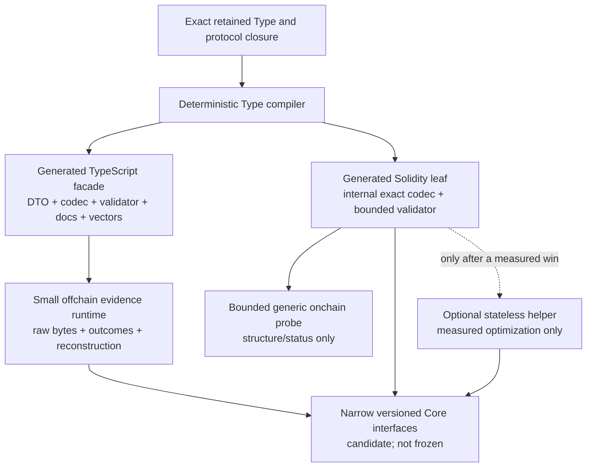

# EFS v2 SDKs — current design spine

**Status:** draft set — founder-authorized SDK experience and experiment program; no protocol bytes, package names, implementation, deployment, or release is adopted
**Target repos:** planning, sdk, contracts, client
**Depends on:** [[../efsv2/README]], [[../efsv2/system-constitution]], [[../efsv2/core-architecture-candidate]], [[../efsv2/layered-type-system-and-data-abi]], [[../web-client-os/README]], [[../web-client-os/type-data-abi-boundary-pressure]]
**Inputs:** the existing `sdk/` repository and older SDK designs as historical evidence only; Data Explorer draft at local-only planning commit `08bb5f2906191f0d87624d9a6ecc6788a8b2754d` on `codex/data-explorer-pm` (`Designs/data-explorer/`)
**Last touched:** 2026-08-22

#status/draft #kind/design #repo/planning #repo/sdk #repo/contracts #repo/client #topic/efsv2 #topic/read-path #topic/onchain

## Read this on a phone

**Verdict:** experiment with a hybrid SDK, not a production API.

- Offchain, keep exact raw evidence and qualified outcomes in a small runtime;
  generate Type-specific DTOs, codecs, validators, reference extractors,
  builders, docs, vectors, and compatibility reports.
- Onchain, generate small exact-Type `internal` Solidity libraries over narrow,
  versioned Core interfaces. Keep a bounded generic probe structural only.
- Do not require a deployed helper. Test one only as a stateless,
  direct-code/dependency/basis-pinned read optimization after inline code has a
  measured size or gas problem.
- Package names, Type bytes and IDs, View and QueryProfile grammar, limits,
  Core module topology, contract ABI, helper deployment, and release topology
  all wait for evidence and the normal owner freeze ceremony.

The durable idea is not “a TypeScript library.” It is a reproducible contract
between exact evidence and replaceable tools: historical bytes remain usable
after today’s npm packages, RPC providers, indexers, build systems, and EFS
maintainers disappear. No current v2 bytes are frozen; the design obligation is
that once the protocol is frozen, its evidence and independent implementation
path remain usable across the full 100-year / century horizon.

### App teams may safely design now

This means reversible interface design and pressure fixtures only. It does not
authorize product implementation, durable data, or a public dependency on the
candidate SDK.

1. Exact-Type-first boundaries with raw canonical evidence retained beside any
   decoded value.
2. Exhaustive read results that keep `UNKNOWN`, `PARTIAL`, `ABSENT`,
   `CONFLICT`, `INVALID`, `UNSUPPORTED`, byte availability, authority, basis,
   completeness, and currentness separate.
3. Explicit read capabilities, signers, submitters, payers, Realm admission,
   and policy inputs; no ambient wallet, indexer, Commons, or OS dependency.
4. Offline reconstruction from an exact retained closure and deterministic
   regeneration from pinned compiler inputs.
5. Generated application façades behind adapters, so experiments can change
   bytes and contract calls without changing every product component.
6. Separate accepted and observed Ethereum execution/RPC/account capability
   profiles, block-hash-qualified read bases, basis-aware signature-verification
   and account-authorization/submission receipts, and exact deployment
   manifests. These are candidate evidence contracts, not frozen public names
   or bytes.

The Web Client/OS and Data Explorer are now two distinct first-party product
consumers of that common seam. Web Client/OS owns the direct Files/shell path;
Data Explorer owns the independent general typed-data workspace and views; the
SDK owns the lossless semantic adapter beneath both, with consumer-specific
generated façades above it.

### App teams must wait for freeze

- Canonical Type, Record, Occurrence, Realm, Binding, Lens, Principal, View, or
  QueryProfile bytes and IDs.
- The exact signature and authorship model, index limits, page/completeness
  proofs, module ABI, deployment addresses, upgrade rules, or first Commons.
- Permanent generated package names, public exports, Solidity interfaces,
  helper addresses, exact supported chain/fork/provider/wallet/account matrix,
  media types, conformance claims, migration guarantees, or a promise that the
  current layered Type proposal will ship.

### Highest-leverage disposable work proposed after this review

1. **One compiler fixture:** compile one small Type and one additive revision
   to TypeScript, Solidity, docs, vectors, bounds, and a reproducibility
   manifest; compare two independent encoders and retain unknown raw bytes.
2. **One Solidity three-arm measurement:** compare generated inline code, a
   bounded structural reader, and a stateless helper against the same three
   workloads, including cold calls and adversarial inputs.
3. **One evidence/reconstruction harness:** inject missing pages, stale or
   dishonest indexers, tampered bytes, an unavailable publisher, and an
   unknown profile; prove none becomes absence or success and reconstruct with
   zero mutable network requests.

The three packets also carry the Ethereum standards corpus in
[[ethereum-standards-census]]: liar providers, pinned-read fork changes,
EOA/contract/counterfactual/delegated-account transitions, clear-signing
substitution, returndata bombs, history expiry, absent precompiles/opcodes, and
deterministic-deployment dependency drift.

Exact fixtures, gates, and stop conditions are in [[experiment-program]].

## Current recommendation

This is architecture arm C in [[architecture-candidate]]. It combines the
safe parts of generated bindings with the raw-preserving behavior required for
unknown Types, future runtimes, evidence forwarding, and clean-room recovery.
Its common semantic adapter serves both the direct Web Client/OS Files shell
and the independent Data Explorer product without forcing either product's DTO
or navigation model onto the other.

## Authority map

| Standing | SDK consequence |
|---|---|
| **Owner-ratified** | EFS v2 is greenfield; Core is standalone in a qualifying Realm; Commons is optional; contract-readable bounded Lenses, declared automatic indexes, full state-readable Records, a direct guest File Browser, and cross-platform read-only mounts are required outcomes. |
| **Owner-directed product baseline** | The guest path does not wait on wallet, profile, Commons, hosted indexer, or OS boot. The Web Client uses one `PrincipalId` product surface and targets a 64-Principal Lens if measurement supports it. This does not freeze the Core authority mechanism. |
| **Instantiated product coordination input** | Data Explorer is an independent general-purpose typed-data product, not a File Browser panel. Its exact local-only draft input is planning commit `08bb5f2906191f0d87624d9a6ecc6788a8b2754d`; it remains `#status/draft` and does not freeze SDK or protocol mechanisms. |
| **Current candidate** | Realm, TypeSchema/TypeRevision, Record, Envelope/Context, Occurrence, admission, Binding, ResolutionPlan, layered Types, Views, QueryProfiles, exact-Type generated adapters, and accepted-versus-observed execution/RPC/account/signature/deployment profiles are comparison vocabulary and experiment inputs. |
| **Historical evidence** | The current `sdk/` monorepo, its viem seam, source injection, profile stamps, typed errors, compile-in Solidity choice, and EAS integration can inform experiments. Its EAS identities, attester defaults, write graph, and package/API shape do not carry into v2. |
| **Unknown / owner-frozen later** | Exact bytes, IDs, codecs, limits, authority model, validator grades, indexes, contract split, deployment and upgrade form, helper policy, package topology, compatibility promise, migration promise, and release scope. |

Source precedence is the one in [[../efsv2/system-constitution]]: dated owner
rulings first, then promoted specifications and ADRs, then current draft
constitution/candidates, then older evidence. This set cannot override Core.

## Documents in this set

| Document | Owns |
|---|---|
| `README.md` | Phone checkpoint, authority map, current recommendation, and routing |
| [[research-precedents]] | Official-source SDK, schema, codegen, Ethereum, and negotiation precedents; evidence only |
| [[ethereum-standards-census]] | Exact dated EIP/ERC registry snapshot, integration classifications, requirements, falsifiers, exit paths, and cross-PM routing |
| [[developer-journeys]] | Exact developer flows and their non-loss invariants |
| [[architecture-candidate]] | Three arms, recommended experiment, generation/runtime/onchain split, logical modules, topology candidates, compatibility, result model, and security invariants |
| [[sdk-pm-charter]] | Durable SDK PM mandate, ownership boundaries, coordination contracts, and release discipline |
| [[experiment-program]] | Adversarial matrix, proposed measurement tripwires, kill criteria, and production stop conditions |
| [[web-client-os-boundary-pressure]] | Web Client/OS direct Files/shell, independent Data Explorer, confined-app consumption, their common semantic adapter, and runtime-neutral CapabilityRPC assessment |
| [[owner-rulings]] | Dated founder mandate and retained authority boundaries |
| [[owner-decision-inbox]] | Evidence-gated choices; nothing needs an immediate founder answer |

## Hard boundaries

- Friendly APIs may simplify syntax, never evidence. A decoded DTO is a view
  over retained bytes, not their replacement.
- An indexer, cache, GraphQL response, generated package, catalog, registry,
  EAS schema, ERC-165 answer, helper address, or npm version is never Core
  truth or proof of completeness.
- Protocol/profile versions, Type revision, generator version, runtime package
  version, contract code identity, Realm, and observation basis are different
  clocks and remain separately named.
- Durable reads do not resolve `latest` silently. State-changing paths fail
  closed on unknown required capabilities, mismatched bytes, incomplete basis,
  or unsupported versions.
- No generic onchain schema VM, arbitrary validator callback, `delegatecall`
  extension, global mutable codec registry, or proxy helper is in the
  recommended experimental lane.
- An EIP/ERC's `Final` status, a provider's `eth_config`, wallet capability,
  interface answer, registry entry, address, code presence, receipt, or
  successful call never proves chain support or EFS truth on its own.
- No implementation may present this draft's illustrative names or result
  shapes as an adopted EFS API.

## Current phase

This first pass writes research and an experimentable design. The founder
mandate permits later bounded experimentation, but no experiment is executed
until this first-pass architecture receives review and a run packet fixes its
profile, closure, gates, and destruction conditions. This pass does not
claim a Kanban card, alter the historical SDK, publish packages, compile
generated artifacts, deploy contracts, promote a design, or adopt protocol
choices. The next gate is owner review of the recommended experimental arm,
followed by a bounded disposable-experiment packet.
