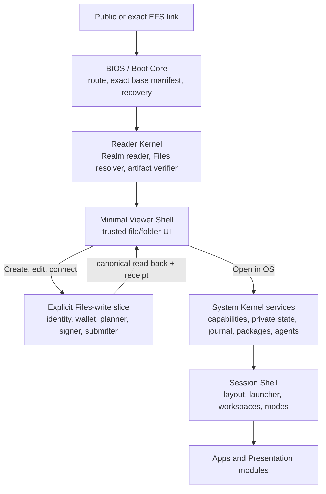

# EFS Web Client and modular Web OS — current design spine

**Status:** draft set — owner-directed working baseline for iteration; no repository, runtime ABI, module profile, wallet stack, or product implementation is authorized
**Target repos:** planning, client, sdk
**Depends on:** [[Designs/efsv2/README]], [[Designs/efsv2/hierarchical-files-and-folders]], [[Designs/open-web-app-store/README]]
**Inputs:** [[Designs/clientv2/README]] (historical requirements and mechanism evidence)
**Reviewers:** @current-v2-read-path (2026-08-14), @historical-client-architecture (2026-08-14), @web-platform-standards (2026-08-14), @open-web-app-store-pm boundary review (2026-08-14), @os-drives-pm boundary review (2026-08-14)
**Last touched:** 2026-08-14

#status/draft #kind/design #repo/planning #repo/client #repo/sdk #topic/efsv2 #topic/cypherpunk-os #topic/app-model #topic/privacy #topic/read-path

## Product direction

Build a cypherpunk and CROPS Web Client that grows into a user-owned,
extensible Web OS without making ordinary links pay the cost of booting that
OS. A person following a link to a file or folder should get useful verified
data quickly, without a wallet prompt, account, Commons, hosted EFS indexer, or
full-system startup. The same codebase and interfaces should then promote that
session into a write-capable File Browser and, later, a full personal OS.

The OS is deliberately modular. Retrieval methods, Realm transports, Files
resolution, presentation handlers, wallet connectors, signers, storage,
search, synchronization, inference providers, agent bridges, Shell policy, and
applications should be replaceable behind versioned interfaces wherever doing
so does not enlarge or confuse the root of trust. The default EFS experience is
one configured system assembled from those interfaces, not a permanently
privileged monolith.

Humans and agents are peer users of the same resources and actions. Anything a
human can do through official UI should have a structured, inspectable action
path an authorized agent can use. Agents receive no ambient authority, but
they are not confined to a second-class read-only product.

## Direct owner direction recorded for this round

The following product requirements were supplied directly by James on
2026-08-14. They guide this draft but do not freeze protocol bytes or bypass
the normal design promotion ceremony.

1. Loading speed is a core product requirement. A linked file or folder must
   load only the bare requirements; cached account/profile state and unrelated
   OS services may hydrate later without blocking useful data.
2. The first MVP must be an official write-capable File Browser, not a read
   product plus a substitute debug page. It needs deliberately basic folder
   and file creation/writes so the client can also debug the evolving
   contracts. Guest reading remains independent of that path.
3. The system should preserve an understandable
   `BIOS -> Kernel -> Shell -> Apps` structure, optimized for route-shaped lazy
   boot and long-term extension rather than a mandatory full-OS sequence.
4. Replaceable modules are the default design instinct. A user should be able
   to bind an interface such as data retrieval for torrent/magnet content to a
   selected implementation, potentially represented in a user-owned EFS
   configuration namespace.
5. Privacy seams must be reserved now. Public protocol data, local/private
   state, encrypted data, link capabilities, network interest, module
   telemetry, and inference-provider disclosure must not be collapsed.
6. Agents need first-class resources, tools, events, plans, permissions,
   receipts, and error states. WebMCP, local inference standards, and other web
   standards are adapters to track, not unexamined kernel dependencies.
7. The client uses one uniform `PrincipalId` surface. A Principal may have a
   mutable default/main controller account for ordinary workflows, but the
   Principal is stable identity and every operation still names and
   historically verifies its actual signer account. Owner-supplied example:
   `JamesCarnley.eth` may have three controller keys while preferring
   `0xaCf4C2950107eF9b1C37faA1F9a866C8F0da88b9` for routine routing; another
   authorized signer remains possible and must be recorded exactly.
8. The contract Lens target is 64 Principal entries if measurement supports
   it. Multiple controller keys do not consume multiple Lens positions; key
   authorization belongs inside Principal verification.
9. Canonical Files names use rich Unicode with NFC normalization. URI-safe
   serialization and reversible Linux/macOS/Windows aliases must not redefine
   permanent filenames.
10. Sepolia is the first development Commons because it is the active
    near-free shared venue. It is neither a Core dependency nor a ruling for a
    permanent/canonical Commons venue.
11. The eventual repository direction is to rename legacy repos to `*-v1` and
    reclaim `contracts`, `sdk`, `webclient`, and `drive` for active v2. No
    rename or repository creation is authorized in this pass.
12. The Type/query-identity axis remains open. The latest owner response was
    not interpretable, so this set infers no choice.

## Current recommendation

Use **one layered, versioned module graph with several boot profiles**, not a
full OS boot for every link and not two independently implemented products.

- The **guest critical path** contains only link ingress, the Boot Core, Reader
  Kernel, and Minimal Viewer Shell.
- **Write promotion** is explicit. An external link starts in `GuestRead`;
  wallet and action modules are lazy-loaded only after GuestRead establishes a
  pinned useful context and a person or authorized agent asks to create or
  change something. Visual sessions cross that gate after the trusted guest
  frame; headless sessions expose equivalent structured progress. The write
  slice returns to the Minimal Viewer/action result after canonical read-back
  and does not imply a full OS boot.
- The **full OS** reuses the same pinned read context and verified handles. It
  does not re-resolve the resource under a hidden policy.
- Module discovery or recommendation never activates code or grants authority.
- A small built-in rescue configuration remains usable when custom modules,
  catalogs, caches, or user profiles fail.

The detailed layer and extension contracts are in [[architecture-and-modules]].
The first product slice and acceptance tests are in [[mvp-and-acceptance]].

## Documents in this set

| Document | Owns |
|---|---|
| `README.md` | Authority map, current recommendation, ownership, routing, and iteration state |
| [[product-constitution-and-roadmap]] | Product constitution, complete requirement ledger, feature horizons, non-goals, and staged roadmap |
| [[architecture-and-modules]] | Boot layers, logical package boundaries, module interfaces/configuration, lazy loading, fallback, security classes, and repository/tooling recommendation |
| [[mvp-and-acceptance]] | Fast guest read plus official basic File Browser writes over proposal-labelled adapters, user and agent journeys, threat boundaries, performance budgets, acceptance tests, and EFS v2 pressure |
| [[privacy-and-agents]] | Privacy architecture reserves and first-class human/agent interaction model, including current web-standards posture |

Future mechanism research, experiments, schemas, and reviews should be linked
from this set rather than expanding one permanent mega-document.

## Implementation guidance leads

### Modern Web Guidance and modern CSS agent skills

James routed a 2026-08-21 Hacker News observation that coding models can lag
newly Baseline web-platform features or incorrectly treat them as unavailable.
Before Web Client / OS implementation begins, evaluate agent guidance that
explicitly prefers modern CSS and current platform primitives while retaining
the compatibility discipline in WCOS-R42:

- [Paul Irish's `modern-css` Agent Skill](https://www.skills.sh/paulirish/dotfiles/modern-css)
- [Google Chrome's Modern Web Guidance](https://developer.chrome.com/docs/modern-web-guidance/get-started)

This is an implementation-tooling lead, not an adopted dependency or license,
browser-support, accessibility, performance, or security conclusion. An
implementation agent should inspect and pin the exact guidance version,
review its rules against the EFS browser matrix and threat model, and record
which rules are adopted, overridden, or rejected before using it in generated
code. “Modern” never overrides semantic fallbacks, measured browser support,
or the no-hidden-network and useful-pixels budgets.

## Authority map

### Owner-adopted EFS-wide inputs

- EFS 2.0 is the one greenfield successor. V1, EFS 1.5, and the July
  Client/OS architecture are evidence rather than inherited mechanisms.
- Core stands alone in a qualifying EVM Realm. Commons is optional. Sepolia is
  the first development Commons; no permanent or canonical Commons venue is
  selected.
- A direct, self-hostable, unauthenticated guest Web Client must read Core and
  useful Files data without wallet detection, account creation, Commons,
  hosted EFS indexing, or OS boot.
- The official MVP is also a write-capable File Browser. Its public action
  surface uses `PrincipalId`, while a mutable default controller account and
  the actual historically verified signer remain separate.
- Rich Unicode/NFC names plus reversible host aliases are the Files naming
  direction. A 64-Principal contract Lens is the measurement target; Lens
  entries are Principals rather than underlying controller keys.
- Shared reader, Files, artifact, and projection semantics must support the Web
  Client, optional OS, and later Linux/macOS/Windows adapters without hiding
  basis, completeness, or `UNKNOWN`.

See [[Designs/efsv2/owner-rulings]],
[[Designs/efsv2/system-constitution]], and
[[Designs/efsv2/owner-decision-inbox]].

> **Upstream synchronization note (2026-08-14):** the owner directions recorded
> above arrived after several EFS v2 spine/candidate passages were written.
> Some still present the uniform Principal surface, MVP writes, and rich-name
> posture as open or use older recommendation text. The EFS v2 PM has the exact
> reconciliation handoff. This product set follows the newer owner direction;
> the actual Principal/Lens/Files bytes remain proposal-stage until that lane's
> evidence and freeze process completes.

### Proposal-only EFS inputs

The current Core and Files candidates propose Type Schemas, Records,
Occurrences, Realm Admission, Principals, Bindings, bounded ResolutionPlans,
stable File/Directory Objects, immutable file revisions, exact content trees,
plural Locators, complete `BindingScope` enumeration, and certified Files
writes. Their names, bytes, contracts, indexes, Principal model, Lens grammar,
Router, and storage limits are not frozen. Stage B implementation and
conformance have not run.

This design therefore depends on **interfaces and outcomes**, not those exact
mechanisms. Adapters and shims must isolate the product from prototype churn.

### Historical evidence retained

The July [[Designs/clientv2/README|Client/OS evidence set]] remains the deep
source for capabilities, secure ceremonies, offline journals, package
generations, network privacy, accessibility, internationalization, agents,
threats, SDK boundaries, and exit. This set reuses those hard-won requirements
selectively while replacing the assumption that every useful page boots one
fixed Web OS.

### Working recommendations in this draft

The layered boot graph, module-slot model, service lifecycle, performance
budgets, Files-write profile, privacy zones, agent tool contract, repository
shape, and named interfaces in this set are recommendations for iteration. They
are not owner rulings or implementation authorization.

## Historical Client/OS audit

This table is the current disposition of the July `clientv2/` corpus. “Retain”
preserves a requirement, not necessarily its old mechanism.

| Historical area | Disposition | Current treatment |
|---|---|---|
| Cypherpunk/user-first constitution, static hosting, exact releases, exit, accessibility, i18n, privacy, and agents | **Retain** | Product law in [[product-constitution-and-roadmap]] and [[privacy-and-agents]] |
| One coherent Web-OS thesis for every entry | **Revise** | One semantic module graph, but route-shaped guest, Files-write, full-session, agent, and recovery boot profiles |
| `Bootstrapper -> Kernel -> System Chrome -> Shell -> Apps` roles | **Simplify and retain** | Browser `BIOS -> Reader Kernel -> Minimal Viewer Shell` is the guest path; privileged services/System Chrome/Session Shell load only on promotion |
| System Chrome versus replaceable Session Shell | **Retain** | Security ceremonies stay conserved; layout and ordinary presentation remain replaceable policy |
| Capability ports, explicit grants, no ambient authority, typed plans/receipts | **Retain** | One service/action model for UI, apps, modules, and agents; capabilities are scoped, revocable, and budgeted |
| Fixed rings and one mandatory runner/cage set | **Retire as architecture** | Use trust classes and named runner profiles; Workers, Wasm, opaque iframes, SES, CSP, and the WebAssembly Component Model/WIT must each prove their actual boundary |
| July package/channel/catalog model | **Replace at the generic boundary** | Consume the Open Web App Store's runtime-neutral `PackageHandoff`; runtime grants/activation remain local and one-way |
| Immutable generations, optional updates, rollback, and retained releases | **Retain** | Split base, handler, system-profile, install, and session generations so unrelated modules need not update atomically |
| Full profile/private-store/package hydration before useful UI | **Retire** | Useful guest pixels precede all optional account, private, package, agent, and Shell hydration |
| Cache, journal, offline, migrations, and recovery requirements | **Retain, defer mechanisms** | Cache is disposable; irreplaceable local/private state needs separate versioned migration/export/recovery proof before OS claims |
| Persona/wallet/action separation | **Revise** | Uniform `PrincipalId`; mutable default account remains preference; actual signer/controller history, requester, submitter, and payer stay explicit |
| Agent sessions with plans, budgets, taint, and receipts | **Retain and broaden** | Agents are peer users. High-risk human checkpoints are default policy, not a permanent ban on explicitly delegated agent workflows |
| Network broker and privacy-center requirements | **Retain, simplify MVP** | Start with audited explicit endpoints and zero hidden traffic; evolve toward capability-scoped network services without claiming anonymity |
| Fragment grammar, handler grammar, exact package schema, and surface schema | **Retire as inherited bytes** | Recover use cases and fixtures, then derive the smallest versioned route/module/action schemas from current EFS v2 |
| Lit, Vite, Web Awesome, HTMX, import maps, native Signals | **Retire as constitutional choices** | Reversible implementation candidates only; native Web Components are the proposed public UI seam |
| `os/` repository and historical SDK split | **Retire as assumed topology** | Logical Protocol SDK, Reader/Files modules, Web Client, OS runtime SDK, apps, and Drive adapters precede physical repository choices |
| Built-in Rescue Shell inside the browser origin | **Revise** | Keep last-known-good in-origin recovery and add an independently retained viewer/CLI/native rescue path for origin loss |
| Apps, folder Presentations, renderers, resolvers, storage/retrieval providers, Shells, and agents as extension points | **Retain** | Exact modules fill explicit user-controlled service slots with safe built-in fallback and no self-activation |

Nothing is retained merely because the old set was detailed. Conversely,
deferring a feature from the MVP does not discard its requirement; the feature
horizons and falsifiers show which seams must remain open.

## Ownership boundaries

| Concern | This set owns | Neighbor owns |
|---|---|---|
| Core and Realm | How the client supplies, pins, displays, and preserves read/write context | EFS v2 owns Core semantics, Realm bootstrap, Principal, admission, indexes, Bindings, and Lens mechanics |
| Files | Web/OS consumption, File Browser UX, module interfaces, semantic opened-file/view pinning, action planning, and honest states | Files design owns stable objects, paths, enumeration, revisions, content, resolver contracts, and certified write semantics |
| Packages/catalogs | Installation, activation, local grants, runtime selection, lazy loading, rollback UI, and configured defaults | [[Designs/open-web-app-store/README|Open Web App Store]] owns generic Project/Release/package/dependency/catalog/trust/update evidence and the runtime-neutral `PackageHandoff` |
| Native mounts | Consumption of shared resolver results only as needed for Web UI parity fixtures | OS Drives owns native handles, host aliases, projection behavior, errors, metadata projection, daemons, packaging, and three-host validation |
| Product modules | Safe consumption and execution boundaries | Arcade, Media, Git/Forge, EAP, Nanda, and other PMs own their domain semantics and pressure fixtures |

The App Store dependency is deliberately one-way: `PackageHandoff` may carry
exact artifacts and resolved sets, scoped `RuntimeRequest`s, provenance,
compatibility, completeness, availability, and update evidence. It never
carries effective grants, activation state, local secrets, or execution
authority.

## Design principles

1. **Useful pixels before system hydration.** Resolve the route and paint
   trusted, honest progress immediately; load only the selected data path.
2. **One semantic substrate, multiple boot profiles.** Guest, Files-write,
   full OS, recovery, and agent sessions reuse Reader Kernel contracts.
3. **Modularity is the default test, not dogma.** Every replaceable concern
   needs a narrow interface, but the non-replaceable trust root stays small and
   explicit.
4. **Selection is not authority.** A link, EFS path, catalog, file extension,
   MIME hint, module declaration, or agent suggestion can nominate a module;
   only local policy and explicit grants may activate it.
5. **Exact releases and reversible change.** Module graphs, dependencies,
   configuration, and updates are inspectable, immutable, rollbackable, and
   exportable.
6. **No semantic forks.** Web, OS, agents, and native adapters consume the same
   basis-qualified resolver outputs and action plans.
7. **Privacy is an architectural dimension.** Integrity, authority,
   availability, storage privacy, identity privacy, interest privacy, and
   telemetry are separate indicators.
8. **Human and agent parity.** UI-only actions and agent-only authority paths
   are both design failures.
9. **Standards where shipped; adapters where emerging.** Native Web
   Components, ES modules, Workers, and core Wasm are available foundations.
   WebGPU and Trusted Types are conditional profiles; WebMCP, WebNN, native
   Signals, WASI, and the WebAssembly Component Model/WIT remain optional
   adapters or tooling lanes.
10. **Exit is tested.** A user can pin, export, reconstruct, replace defaults,
    and recover without the original operator or catalog.

## Current work sequence

1. Review and iterate these design files with James and adjacent PMs.
2. Convert the guest read and official wallet-owned File Browser write
   journeys into disposable fixtures against the current Core/Files
   candidates. An earlier empty-directory debugger is only a bring-up step.
3. Measure critical-path bytes, main-thread work, RPC waterfalls, complete
   listing, corrupt fallback, read-after-create, and module lazy loading.
4. Run security/privacy, accessibility/i18n, browser, agent, independent
   implementation, and repository-boundary reviews.
5. Return only measured Core gaps or mature product/permanence choices.
6. Design any greenfield repository before creation; do not scaffold or begin
   product implementation without explicit authorization.

## Explicit non-authorizations

This draft does not authorize:

- a new `webclient`, `os`, `sdk`, `core`, or `drive` repository;
- contract, SDK, or product implementation;
- protocol/profile bytes, public module packages, a default catalog, a public
  extension tree, a wallet dependency, or a selected Realm;
- remote code activation, install/build hooks, ambient network, automatic
  wallet detection, automatic updates, or forced upgrades;
- SES, Lit, Vite, Web Awesome, HTMX, WebMCP, WebNN, WebGPU, Wasm/WASI/WIT,
  the WebAssembly Component Model, iframe profiles, or any other mechanism as constitutional
  architecture; or
- absorbing the App Store, native Drive, Arcade, Media, Git/Forge, EAP, Nanda,
  or other product lanes.

## Open questions

- [ ] Measure and revise the provisional guest critical-path budgets in
      [[mvp-and-acceptance]] on an agreed mid-tier phone, desktop, static host,
      IPFS gateway, and qualifying Realm fixture.
- [ ] Prove whether complete Realm-local directory enumeration and
      read-after-create require `BindingScope` exactly or a smaller generic
      declared-index contract.
- [ ] Compare FilesRouter certification with the explicitly labelled
      wallet-owned direct-Core debugging profile before selecting any product
      write mechanism.
- [ ] Validate module dependency locks, capability attenuation, failure
      containment, and configuration recovery with at least two independent
      module implementations.
- [ ] Determine which security-critical modules may update independently and
      which must activate atomically with the conserved boot generation.

No item currently needs an owner ruling; these are evidence and engineering
questions for the next pass.

## Pre-promotion checklist

- [ ] James reviews the written baseline and requested corrections are folded
      in.
- [ ] Every requirement traces to owner direction, an adopted EFS outcome,
      retained historical evidence, current primary-source capability, or an
      explicit design inference.
- [ ] Guest read and basic create/write both pass fixed clean-browser fixtures
      without conflating the experimental write adapter with frozen Files
      semantics.
- [ ] Performance budgets have measured device/network definitions and
      regression enforcement.
- [ ] Module selection, installation, activation, grants, and execution remain
      separate in every trace.
- [ ] Privacy and human/agent parity acceptance suites pass across official
      surfaces.
- [ ] App Store, Files/Core, Drives, Arcade, Media, Git/Forge, EAP, and Nanda
      owners have reviewed their boundary slices.
- [ ] Any proposed Core change has a generic multi-consumer failing fixture,
      alternatives, cost of deferral, and falsifier.
- [ ] At least one `#status/review` round receives another agent or human
      review.
