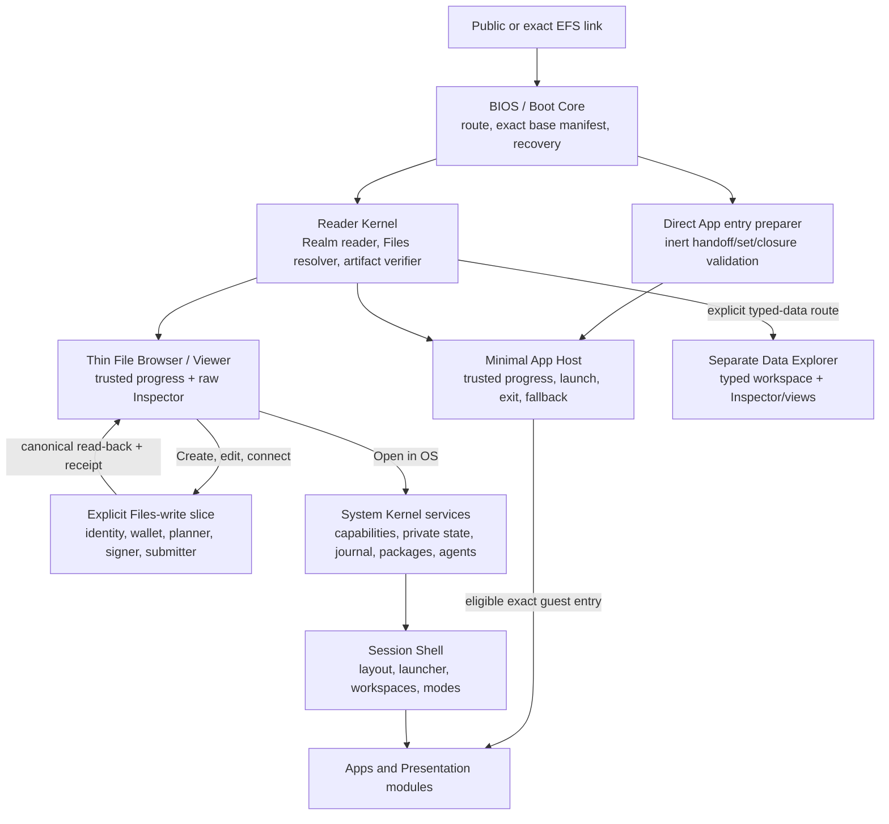

# EFS Web Client and modular Web OS — current design spine

**Status:** draft set — owner-directed working baseline for iteration; no repository, runtime ABI, module profile, wallet stack, or product implementation is authorized
**Target repos:** planning, client, sdk
**Depends on:** [[Designs/efsv2/README]], [[Designs/efsv2/hierarchical-files-and-folders]], [[Designs/sdkv2/mvp-interface]], [[Designs/open-web-app-store/README]]
**Inputs:** [[Designs/clientv2/README]] (historical requirements and mechanism evidence)
**Reviewers:** @current-v2-read-path (2026-08-14), @historical-client-architecture (2026-08-14), @web-platform-standards (2026-08-14), @open-web-app-store-pm boundary review (2026-08-14), @os-drives-pm boundary review (2026-08-14)
**Last touched:** 2026-09-03

#status/draft #kind/design #repo/planning #repo/client #repo/sdk #topic/efsv2 #topic/cypherpunk-os #topic/app-model #topic/privacy #topic/read-path

## Product direction

Build a cypherpunk and CROPS Web Client that grows into a user-owned,
extensible Web OS without making ordinary links pay the cost of booting that
OS. A person following a link to a file, folder, or specific App plus resource
should get useful verified data quickly, without a wallet prompt, account,
Commons, hosted EFS indexer, catalog search, Data Explorer intermediary, or
full-system startup. The same codebase and interfaces should then promote that
session into a write-capable File Browser and, later, a full personal OS.

For MVP0, File Browser is the first thin direct guest and write-capable
journey. [[Designs/data-explorer/README|Data Explorer]] is a separate general
typed-data workspace and Inspector/view consumer over the same SDK seams. It is
not a route gateway, and it owns no second write stack.

The OS is deliberately modular. Retrieval methods, Realm transports, Files
resolution, presentation handlers, wallet connectors, signers, storage,
search, synchronization, inference providers, agent bridges, Shell policy, and
applications should be replaceable behind versioned interfaces wherever doing
so does not enlarge or confuse the root of trust. The default EFS experience is
one configured system assembled from those interfaces, not a permanently
privileged monolith.

Humans and agents are peer users of the same resources and actions. Anything a
human can do through official UI should have a structured, inspectable action
path an authorized agent can use. Agents receive no ambient authority, but
they are not confined to a second-class read-only product.

## Direct owner direction recorded for this round

The following product requirements were supplied directly by James from
2026-08-14 through 2026-08-23. They guide this draft but do not freeze protocol
bytes or bypass the normal design promotion ceremony.

1. Loading speed is a core product requirement. A linked file or folder must
   load only the bare requirements; cached account/profile state and unrelated
   OS services may hydrate later without blocking useful data.
2. The first MVP must be an official write-capable File Browser, not a read
   product plus a substitute debug page. It needs deliberately basic folder
   and file creation/writes so the client can also debug the evolving
   contracts. Guest reading remains independent of that path.
3. The system should preserve an understandable
   `BIOS -> Kernel -> Shell -> Apps` structure, optimized for route-shaped lazy
   boot and long-term extension rather than a mandatory full-OS sequence.
4. Replaceable modules are the default design instinct. A user should be able
   to bind an interface such as data retrieval for torrent/magnet content to a
   selected implementation, potentially represented in a user-owned EFS
   configuration namespace.
5. Privacy seams must be reserved now. Public protocol data, local/private
   state, encrypted data, link capabilities, network interest, module
   telemetry, and inference-provider disclosure must not be collapsed.
6. Agents need first-class resources, tools, events, plans, permissions,
   receipts, and error states. WebMCP, local inference standards, and other web
   standards are adapters to track, not unexamined kernel dependencies.
7. The client uses one uniform `PrincipalId` surface. A Principal may have a
   mutable default/main controller account for ordinary workflows, but the
   Principal is stable identity and every operation still names and
   historically verifies its actual signer descriptor and, when applicable,
   the account it used. Owner-supplied example:
   `JamesCarnley.eth` may have three controller keys while preferring
   `0xaCf4C2950107eF9b1C37faA1F9a866C8F0da88b9` for routine routing; another
   authorized signer remains possible and must be recorded exactly.
8. The contract Lens target is 64 Principal entries if measurement supports
   it. Multiple controller keys do not consume multiple Lens positions; key
   authorization belongs inside Principal verification.
9. Canonical Files names use rich Unicode with NFC normalization. URI-safe
   serialization and reversible Linux/macOS/Windows aliases must not redefine
   permanent filenames.
10. Sepolia is the first development Commons because it is the active
    near-free shared venue. It is neither a Core dependency nor a ruling for a
    permanent/canonical Commons venue.
11. The eventual repository direction is to rename legacy repos to `*-v1` and
    reclaim `contracts`, `sdk`, `webclient`, and `drive` for active v2. No
    rename or repository creation is authorized in this pass.
12. The Type/query-identity axis remains open. The latest owner response was
    not interpretable, so this set infers no choice. The exact-Type-first
    consumer boundary in [[type-data-abi-boundary-pressure]] is a reversible
    adapter recommendation and pressure fixture, not an inferred selection.
13. The application should be maintainable on a roughly 50-year horizon by
    making open Web standards the durable surface. A 2026 library or builder
    may help internally, but must remain replaceable without changing public
    routes, component contracts, data, capabilities, storage, or actions.
14. The official TC39 Signals model and compatible polyfill are the selected
    application-state primitive now. Treat Signals as future JavaScript rather
    than inventing an interim EFS state framework.
15. Use modern and forward Web standards deliberately. A current lag in one
    browser—especially iOS/Safari—does not veto the architecture; unsupported
    engines receive an explicit reduced/unsupported outcome or rescue path
    rather than forcing a lowest-common-denominator product.
16. The same static SPA must be responsive across desktop, phone, tablet,
    installed windows and changing input modes, and be installable as a PWA.
    Online, offline-shell, retained-resource, stale-evidence and queued-write
    states remain qualified rather than collapsed.
17. Internationalization, Unicode/IRI safety, bidirectional layout, native
    IME, accessibility, locale packs and global input/format behavior are
    foundations from the first slice, not post-launch translation work.
18. Build a sophisticated dynamic application from Signals, Web Components
    and modern browser techniques. Seriously evaluate Web Awesome—including
    its Page component—and Lit, but make each earn its bounded place through
    performance, accessibility, privacy, failure and replacement evidence.
19. For an installed stable-origin client, application upgrades are opt-in.
    A returning browser should continue launching its locally accepted exact
    release after the host advertises a newer release, until a person or
    authorized agent explicitly accepts the new release. This policy is
    domain-neutral and uses relative/scope-derived URLs rather than hard-coded
    EFS hosts. Its honest Web guarantee is conditional on the origin's
    persisted state and complete verified release closure remaining intact;
    site-data loss or a malicious same-origin bootstrap is outside that
    guarantee. A stronger pin against a compromised origin is a separate
    sovereign-client research problem, not something ordinary PWA APIs prove.
20. Recover Nix/Guix-style immutable closures, exact locks, generations,
    rollback, GC roots, export and reproducibility evidence as foundational OS
    requirements, adapted to browser and EFS realities rather than by embedding
    the Nix evaluator or copying flakes.
21. A hyperlink to another person's exact OS setup opens as inert read-only
    inspection. `Try`, `Adopt`, `Fork`, attaching personal resources and
    `Activate` are separate explicit operations. Shared configuration carries
    no effective grants, secrets, identities, wallet state, private data,
    handles, sessions or agent mandates.
22. A trusted System Configuration Manager should retain and switch coherent
    whole-system generations, stage and health-check candidates, keep prior
    healthy generations, manage rollback/GC/export and remain reachable when a
    candidate Shell or profile is broken. This is the foundation for experts
    to build and share media, gaming, accessibility, development and other
    specialized OS configurations.
23. Core WebAssembly and WIT-shaped interfaces are a selected foundational
    direction for portable non-DOM modules. The Component Model is the target
    composition ABI through replaceable adapters; WASI interfaces are granted
    selectively rather than becoming ambient POSIX or replacing EFS authority.
    Native HTML/CSS/JavaScript and Web Components remain the trusted Shell and
    fast Files path.
24. Every authorized Web Client/OS implementation task must use the pinned
    modern-Web guidance and standards-evidence gate in
    [[technology-foundation]]. Semantic HTML, CSS and browser APIs are tried
    before a library; current and experimental standards are welcome when the
    selected EFS Web Profile names their full, reduced, unsupported and rescue
    behavior. Guidance is build-time evidence, never runtime code or product
    authority.
25. Any exact App can be a first-class deep-link target. App selection,
    critical executable verification and the initial qualified resource read
    should take the shortest generic path and overlap where safe. Exact File
    Browser routes open File Browser directly; general typed-data routes may
    select Data Explorer and its raw Inspector. Neither is a gateway through
    which the other or any exact App must launch.
26. The OS needs a good practical third-party App path without waiting for
    perfect browser isolation. SES in a dedicated Worker is the leading
    confined JavaScript candidate; LavaMoat/Endo dependency isolation is an
    active inner hardening candidate; opaque iframes remain the full-DOM lane;
    and Wasm/WIT remains foundational. Exact profiles and claims must be
    measured, and none receives ambient authority by optimism.
27. Use current Ethereum EIPs/ERCs deliberately at replaceable client, SDK,
    wallet, read, signature, content, contract and agent boundaries. Proposal
    status is not deployment/support/safety evidence; chain is not Realm;
    Locator, registry, interface, metadata, provider announcement and agent
    score are never authority. Guest boot performs no wallet discovery. The
    complete pinned corpus screen and dispositions are in
    [[ethereum-standards-and-interop]].
28. Screen the whole Web standards surface with the same seriousness as the
    EIP/ERC pass. Useful modern or emerging HTML, CSS, JavaScript, browser,
    accessibility, internationalization, WebAssembly, WASI, media, compute and
    agent standards are first-class design inputs even before universal
    shipment. Standards maturity selects an exact adapter, build target and
    full/reduced/unsupported/rescue outcome; it is not a conservative veto.
    The reproducible census and current dispositions are in
    [[web-platform-standards-and-forward-profile]].

## Current recommendation

Use **one layered, versioned module graph with several boot profiles**, not a
full OS boot for every link and not two independently implemented products.

- A File Browser **guest critical path** contains only link ingress, the Boot
  Core, Reader Kernel, and thin File Browser/viewer. A general typed-data route
  may open the separate Data Explorer workspace over the same Reader result.
  A specific-App route instead adds only the pure direct-entry preparer,
  Minimal App Host and that exact entry's verified critical runner closure. No
  exact route boots the installer, catalog, full Shell, or another product.
- **Write promotion** is explicit. An external link starts in `GuestRead`;
  wallet and action modules are lazy-loaded only after GuestRead establishes a
  pinned useful context and a person or authorized agent asks to create or
  change something. Visual sessions cross that gate after the trusted guest
  frame; headless sessions expose equivalent structured progress. The write
  slice returns to the Minimal Viewer/action result after canonical read-back
  and does not imply a full OS boot.
- The **full OS** reuses the same pinned read context and verified handles. It
  does not re-resolve the resource under a hidden policy.
- Module discovery or recommendation never activates code or grants authority.
- A small built-in rescue configuration remains usable when custom modules,
  catalogs, caches, or user profiles fail.
- An exact system-profile link enters the same trusted Reader/Minimal Viewer as
  an inert profile Inspector. Its package graph, executable closure, private
  overlays and full Shell remain lazy until an explicit deeper operation.

The detailed layer and extension contracts are in [[architecture-and-modules]].
The bounded first product gate is in [[mvp0-acceptance]]. The larger
[[mvp-and-acceptance]] document is retained as the broader roadmap and freeze
catalog, not the MVP0 pass/fail surface.
The selected standards surface and dated library/build recommendations are in
[[technology-foundation]].
The pinned Web-platform catalog index, primary-family review, forward feature dispositions and
versioned browser/profile contract are in
[[web-platform-standards-and-forward-profile]].
The Ethereum read, wallet, signature, URI/content, contract-introspection,
privacy and agent interoperability boundary is in
[[ethereum-standards-and-interop]].
The finite generated-code and app-facing boundary against the draft layered
Type/Data ABI is in [[type-data-abi-boundary-pressure]].
Generic specific-App links, minimum-time-to-data rules, practical SES/LavaMoat,
iframe/Wasm runner lanes, instance leases and the Data Explorer fallback
boundary are in [[app-runtime-and-direct-launch]].
The pinned DeepSeek Harness/Cordis paper and implementation review, mature
plugin-system comparison, owned-resource/dependency laws and hostile fixture
queue are in
[[Reviews/2026-08-26-module-plugin-systems-pressure/README]]. Its current disposition
is to adopt the lifecycle/composition requirements in the trusted host control
plane without selecting Cordis or another plugin framework as the EFS ABI,
configuration language, security boundary or runtime.

## Documents in this set

| Document | Owns |
|---|---|
| `README.md` | Authority map, current recommendation, ownership, routing, and iteration state |
| [[product-constitution-and-roadmap]] | Product constitution, complete requirement ledger, feature horizons, non-goals, and staged roadmap |
| [[architecture-and-modules]] | Boot layers, logical package boundaries, module interfaces/configuration, lazy loading, fallback, security classes, and repository/tooling recommendation |
| [[app-runtime-and-direct-launch]] | Generic exact/follow App deep links, direct minimum-time-to-data launch, start classes, SES/LavaMoat/Endo, opaque iframe and Wasm lanes, instance leases, App SDK and fallback contracts |
| [[technology-foundation]] | Standards-first dynamic SPA, Signals state, Web Components/Lit/Web Awesome boundary, EFS design language, responsive/installable/offline delivery, i18n/accessibility, app lifecycle, and build/release posture |
| [[web-platform-standards-and-forward-profile]] | Reproducible four-catalog Web/ECMAScript/Wasm/WASI index plus primary-family review, non-conservative feature dispositions, named delivery/runtime profiles, negative selections and conformance program |
| [[ethereum-standards-and-interop]] | Complete pinned EIP/ERC synthesis; exact-read, wallet, signature, URI/content, contract, privacy, cross-chain and agent adapter dispositions; SDK pressure and acceptance fixtures |
| [[system-profiles-and-generations]] | Nix/Guix recovery, exact and follow profiles, safe social sharing, deterministic composition, System Configuration Manager, local activation/state/grant generations, rollback/GC/export, and the foundational Wasm/WIT/Component/WASI module direction |
| [[mvp0-acceptance]] | Thirteen observable tests for the bounded clean-guest, folder/file/revision write, prompt, tamper, qualification, canonical read-back, and clean-reopen gate |
| [[mvp-and-acceptance]] | Broader product roadmap and freeze catalog: future journeys, performance, delivery, global-use, OS-preservation, security, and compatibility gates; not the MVP0 gate |
| [[type-data-abi-boundary-pressure]] | Finite exact-Type consumer adapter, generated codec/domain-DTO boundary, exhaustive read/byte outcomes, one Type-evolution fixture, and two generic Core pressure packets |
| [[privacy-and-agents]] | Privacy architecture reserves and first-class human/agent interaction model, including current web-standards posture |

Future mechanism research, experiments, schemas, and reviews should be linked
from this set rather than expanding one permanent mega-document.

## Mandatory modern-Web guidance gate

### Pinned guidance, current evidence and native-first review

James routed a 2026-08-21 Hacker News observation that coding models can lag
newly Baseline web-platform features or incorrectly treat them as unavailable.
That risk is now a required implementation control, not a bookmark for a later
agent. Before any authorized HTML, CSS, client JavaScript, custom-element,
browser-API, PWA, accessibility or performance change is designed or reviewed,
the contributor must consult an exact retained guidance snapshot and the
applicable primary standards/profile evidence:

- [Google Chrome's Modern Web Guidance](https://developer.chrome.com/docs/modern-web-guidance/get-started)
  is the initial broad agent guidance candidate.
- [Paul Irish's pinned `modern-css` skill](https://github.com/paulirish/dotfiles/blob/b91fbe2b302e28ec4e9ea36830ed2e7f0a30e2c3/agents/skills/modern-css/SKILL.md)
  is a linked external CSS discovery reference. CSS work consults it while it
  remains accessible and records unavailability honestly, but it is not part
  of the required retained/offline guidance set unless its redistribution
  license is resolved.

The decision order is semantic HTML, then native CSS, then a standard browser
API, then the smallest library that earns its retained bytes and maintenance
surface. EFS's forward Web Profile overrides a guide's conservative browser
default: limited or experimental standards may be selected deliberately, but
must have feature detection or a profile-selected negative outcome and an
honest reduced, unsupported or rescue path. Existence detection alone never
proves support; the recorded fixture/profile result does. Each change records
the exact guidance identity, matched guide IDs or no-match result, primary
specification and compatibility evidence, profile outcome, native/library
decision, overrides, and relevant accessibility, performance and privacy
results.

The required retained guidance and standards-evidence closure is pinned,
offline, telemetry-disabled and deliberately refreshed; external discovery
references remain non-gating and outside it. Guidance is never fetched through
`@latest`, shipped in the SPA, contacted at runtime or treated as normative
over EFS requirements and primary specifications. The complete source/evidence
hierarchy, required future-repository artifacts and acceptance fixture are
defined in [[technology-foundation]]. Protocol-only work is exempt until it
crosses a Web/client integration surface.

## Authority map

### Owner-adopted EFS-wide inputs

- EFS 2.0 is the one greenfield successor. V1, EFS 1.5, and the July
  Client/OS architecture are evidence rather than inherited mechanisms.
- Core stands alone in a qualifying EVM Realm. Commons is optional. Sepolia is
  the first development Commons; no permanent or canonical Commons venue is
  selected.
- A direct, self-hostable, unauthenticated guest Web Client must read Core and
  useful Files data without wallet detection, account creation, Commons,
  hosted EFS indexing, or OS boot.
- The official MVP is also a write-capable File Browser. Its public action
  surface uses `PrincipalId`, while a mutable default controller account, the
  actual historically verified signer descriptor, and every execution/payer
  account remain separate.
- Rich Unicode/NFC names plus reversible host aliases are the Files naming
  direction. A 64-Principal contract Lens is the measurement target; Lens
  entries are Principals rather than underlying controller keys.
- Shared reader, Files, artifact, and projection semantics must support the Web
  Client, optional OS, and later Linux/macOS/Windows adapters without hiding
  basis, completeness, or `UNKNOWN`.

See [[Designs/efsv2/owner-rulings]],
[[Designs/efsv2/system-constitution]], and
[[Designs/efsv2/owner-decision-inbox]].

> **Upstream synchronization note (2026-08-14):** the owner directions recorded
> above arrived after several EFS v2 spine/candidate passages were written.
> Some still present the uniform Principal surface, MVP writes, and rich-name
> posture as open or use older recommendation text. The EFS v2 PM has the exact
> reconciliation handoff. This product set follows the newer owner direction;
> the actual Principal/Lens/Files bytes remain proposal-stage until that lane's
> evidence and freeze process completes.

### Proposal-only EFS inputs

The current Core and Files candidates propose Type Schemas, Records,
Occurrences, Realm Admission, Principals, Bindings, bounded ResolutionPlans,
stable File/Directory Objects, immutable file revisions, exact content trees,
plural Locators, complete `BindingScope` enumeration, and certified Files
writes. Their names, bytes, contracts, indexes, Principal model, Lens grammar,
Router, and storage limits are not frozen. Stage B implementation and
conformance have not run.

This design therefore depends on **interfaces and outcomes**, not those exact
mechanisms. Adapters and shims must isolate the product from prototype churn.

### Historical evidence retained

The July [[Designs/clientv2/README|Client/OS evidence set]] remains the deep
source for capabilities, secure ceremonies, offline journals, package
generations, network privacy, accessibility, internationalization, agents,
threats, SDK boundaries, and exit. This set reuses those hard-won requirements
selectively while replacing the assumption that every useful page boots one
fixed Web OS.

### Working recommendations in this draft

The layered boot graph, module-slot model, service lifecycle, performance
budgets, Files-write profile, privacy zones, agent tool contract, repository
shape, and named interfaces in this set are recommendations for iteration. The
standards-first surface, Signals direction, forward-browser posture,
installability, responsive/global use and offline/online outcome separation are
owner-directed product requirements; the exact Lit, Web Awesome, Vite,
polyfill, package and version choices remain dated recommendations. None is
implementation authorization.

## Historical Client/OS audit

This table is the current disposition of the July `clientv2/` corpus. “Retain”
preserves a requirement, not necessarily its old mechanism.

| Historical area | Disposition | Current treatment |
|---|---|---|
| Cypherpunk/user-first constitution, static hosting, exact releases, exit, accessibility, i18n, privacy, and agents | **Retain** | Product law in [[product-constitution-and-roadmap]] and [[privacy-and-agents]] |
| One coherent Web-OS thesis for every entry | **Revise** | One semantic module graph, but route-shaped guest, Files-write, full-session, agent, and recovery boot profiles |
| `Bootstrapper -> Kernel -> System Chrome -> Shell -> Apps` roles | **Simplify and retain** | Browser `BIOS -> Reader Kernel -> Minimal Viewer Shell` is the guest path; privileged services/System Chrome/Session Shell load only on promotion |
| System Chrome versus replaceable Session Shell | **Retain** | Security ceremonies stay conserved; layout and ordinary presentation remain replaceable policy |
| Capability ports, explicit grants, no ambient authority, typed plans/receipts | **Retain** | One service/action model for UI, apps, modules, and agents; capabilities are scoped, revocable, and budgeted |
| Fixed rings and one mandatory runner/cage set | **Retire as architecture** | Use trust classes and named runner profiles. [[app-runtime-and-direct-launch]] makes SES Worker an active ordinary JavaScript candidate, opaque iframe the full-DOM lane and Wasm/WIT the portable-service foundation; each proves its actual boundary without pretending one cage solves every App. |
| July package/channel/catalog model | **Replace at the generic boundary** | Consume the Open Web App Store's runtime-neutral `PackageHandoff`; runtime grants/activation remain local and one-way |
| Immutable generations, optional updates, rollback, and retained releases | **Retain** | Split base, handler, system-profile, install, and session generations so unrelated modules need not update atomically |
| Nix/Guix closure/profile analogy and hyperlinkable exact OS | **Retain requirements, replace mechanisms** | [[system-profiles-and-generations]] separates editable recipe, exact public profile lock/occurrence, package handoff, local install/state/grant generations and one coherent local selection tuple; it does not inherit Nix store paths, flakes, evaluator or July profile bytes |
| Historical `gx` link auto-boots another person's generation | **Retire** | Every shared setup enters inert Inspect; Try, Adopt, Fork, personal-resource attachment and Activate are explicit independent transitions |
| Full profile/private-store/package hydration before useful UI | **Retire** | Useful guest pixels precede all optional account, private, package, agent, and Shell hydration |
| Cache, journal, offline, migrations, and recovery requirements | **Retain, defer mechanisms** | Cache is disposable; irreplaceable local/private state needs separate versioned migration/export/recovery proof before OS claims |
| Persona/wallet/action separation | **Revise** | Uniform `PrincipalId`; mutable default account remains preference; controller authorization, signer descriptor, account sender, requester, submitter/bundler/relayer, 7702 roles, and payer stay explicit |
| Agent sessions with plans, budgets, taint, and receipts | **Retain and broaden** | Agents are peer users. High-risk human checkpoints are default policy, not a permanent ban on explicitly delegated agent workflows |
| Network broker and privacy-center requirements | **Retain, simplify MVP** | Start with audited explicit endpoints and zero hidden traffic; evolve toward capability-scoped network services without claiming anonymity |
| Fragment grammar, handler grammar, exact package schema, and surface schema | **Retire as inherited bytes** | Recover use cases and fixtures, then derive the smallest versioned route/module/action schemas from current EFS v2 |
| Lit, Vite, Web Awesome, HTMX, import maps, native Signals | **Revise and separate by permanence** | Signals and Web Components become selected standards-shaped application surfaces. Thin Lit, Web Awesome Core and Vite are bounded replaceable recommendations; HTMX and inherited loader choices are not selected architecture. See [[technology-foundation]]. |
| `os/` repository and historical SDK split | **Retire as assumed topology** | Logical Protocol SDK, Reader/Files modules, Web Client, OS runtime SDK, apps, and Drive adapters precede physical repository choices |
| Built-in Rescue Shell inside the browser origin | **Revise** | Keep last-known-good in-origin recovery and add an independently retained viewer/CLI/native rescue path for origin loss |
| Apps, folder Presentations, renderers, resolvers, storage/retrieval providers, Shells, and agents as extension points | **Retain** | Exact modules fill explicit user-controlled service slots with safe built-in fallback and no self-activation |

Nothing is retained merely because the old set was detailed. Conversely,
deferring a feature from the MVP does not discard its requirement; the feature
horizons and falsifiers show which seams must remain open.

## Ownership boundaries

| Concern | This set owns | Neighbor owns |
|---|---|---|
| Core and Realm | How the client supplies, pins, displays, and preserves read/write context | EFS v2 owns Core semantics, Realm bootstrap, Principal, admission, indexes, Bindings, and Lens mechanics |
| SDK | File Browser inputs, trusted preview/prompt UX, and presentation of qualified outcomes | [[Designs/sdkv2/mvp-interface|SDK MVP-C0]] owns exact codecs, the five shared seams, deterministic planning, authorization verification, submission evidence, and canonical read-back |
| Files | Web/OS consumption, File Browser UX, module interfaces, semantic opened-file/view pinning, and honest states | Files design owns stable objects, paths, enumeration, revisions, content, resolver contracts, and certified write semantics |
| Data Explorer | Direct routing remains optional; File Browser may reuse the shared Inspector presentation | [[Designs/data-explorer/README|Data Explorer]] owns its separate typed-data workspace, navigation, selection, layout, and later projections; it owns no route gateway or write machinery |
| Packages/catalogs | Installation, activation, local grants, runtime selection, lazy loading, rollback UI, and configured defaults | [[Designs/open-web-app-store/README|Open Web App Store]] owns generic Project/Release/package/dependency/catalog/trust/update evidence and the runtime-neutral `PackageHandoff` |
| Native mounts | Consumption of shared resolver results only as needed for Web UI parity fixtures | OS Drives owns native handles, host aliases, projection behavior, errors, metadata projection, daemons, packaging, and three-host validation |
| Product modules | Safe consumption and execution boundaries | Arcade, Media, Git/Forge, EAP, Nanda, and other PMs own their domain semantics and pressure fixtures |

The App Store dependency is deliberately one-way: `PackageHandoff` may carry
exact artifacts and resolved sets, scoped `RuntimeRequest`s, provenance,
compatibility, completeness, availability, and update evidence. It never
carries effective grants, activation state, local secrets, or execution
authority.

## Design principles

1. **Useful pixels before system hydration.** Resolve the route and paint
   trusted, honest progress immediately; load only the selected data path.
2. **One semantic substrate, multiple boot profiles.** Guest, Files-write,
   full OS, recovery, and agent sessions reuse Reader Kernel contracts.
3. **Modularity is the default test, not dogma.** Every replaceable concern
   needs a narrow interface, but the non-replaceable trust root stays small and
   explicit.
4. **Selection is not authority.** A link, EFS path, catalog, file extension,
   MIME hint, module declaration, or agent suggestion can nominate a module.
   A trusted host `OPEN`, retained exact policy, or matching agent mandate may
   be the explicit Launch intent for an eligible confined guest; a URL can
   only request it. The OS still records an exact all-denied local grant
   decision, and every host authority requires a separate explicit grant.
5. **Exact releases and reversible change.** Module graphs, dependencies,
   configuration, and updates are inspectable, immutable, rollbackable, and
   exportable.
6. **No semantic forks.** Web, OS, agents, and native adapters consume the same
   basis-qualified resolver outputs and action plans.
7. **Privacy is an architectural dimension.** Integrity, authority,
   availability, storage privacy, identity privacy, interest privacy, and
   telemetry are separate indicators.
8. **Human and agent parity.** UI-only actions and agent-only authority paths
   are both design failures.
9. **Standards-first and forward, with honest capability profiles.** Semantic
   HTML/CSS, ES modules, Web Components, standard browser services and the TC39
   Signals shape are the application foundation. EFS may design against a
   forward standard before universal implementation, using a narrow polyfill,
   explicit reduced/unsupported result, or rescue reader rather than a legacy
   application fork. A standards label never supplies a threat model.
10. **Exit is tested.** A user can pin, export, reconstruct, replace defaults,
    and recover without the original operator or catalog.
11. **Systems are shareable; authority and private state are not.** Exact
    profiles are inspectable, forkable and carrier-independent. Local grants,
    identities, secrets, data and activation remain recipient-owned overlays.

## Current work sequence

1. Review and iterate these design files with James and adjacent PMs.
2. Before any authorized Web experiment or implementation, retain the selected
   guidance snapshot, reproduce or deliberately refresh the pinned standards
   census, instantiate the EFS feature/profile evidence ledgers and put the
   native-first review fields in the repository contribution path.
3. **MVP0 critical path:** after explicit implementation authorization, run
   [[mvp0-acceptance]] through the five seams in
   [[Designs/sdkv2/mvp-interface]] against one exact local
   [[Designs/efsv2/disposable-mvp-profile|MVP-C0]] run. This is a disposable
   product-pressure fixture, not a Type/result/route/package freeze. Data
   Explorer packaging and finite/rich View comparators require separate later
   gates.
4. **OS-preservation track in parallel:** validate exact profile/lock/follow
   identity, the inert Inspector header and deletion/non-regression fixture.
   Only those interface and zero-guest-cost seams gate the Files skeleton.
   Full Try, whole-system activation/rollback, thousand-module and
   Component/WASI execution experiments gate their later product lanes, not
   the Files MVP.
5. Run the fixed native-versus-Lit viewer, Web Awesome/Fluent/Lion control-pack,
   native-versus-`<wa-page>` shell, static/PWA generation, storage-recovery,
   and global-use fixtures in [[technology-foundation]] before freezing an
   implementation closure.
6. Measure critical-path bytes, main-thread work, RPC waterfalls, complete
   listing, corrupt fallback, read-after-create, and module lazy loading.
7. Run security/privacy, accessibility/i18n, browser, agent, independent
   implementation, and repository-boundary reviews.
8. For the later OS lane, run deterministic profile evaluator, disposable Try,
   activation/crash/rollback, revocation, large-graph and browser/native
   Wasm/WIT fixtures in [[system-profiles-and-generations]].
9. Return only measured Core gaps or mature product/permanence choices.
10. Design any greenfield repository before creation; do not scaffold or begin
   product implementation without explicit authorization.

## Explicit non-authorizations

This draft does not authorize:

- a new `webclient`, `os`, `sdk`, `core`, or `drive` repository;
- contract, SDK, or product implementation;
- protocol/profile bytes, public module packages, a default catalog, a public
  extension tree, a wallet dependency, or a selected Realm;
- remote code activation, install/build hooks, ambient network, automatic
  wallet detection, automatic updates, or forced upgrades;
- a frozen system-profile/recipe/evaluator encoding, public profile catalog,
  automatic shared-profile execution, grant/state inheritance, generic
  full-authority WASI/POSIX world, or browser Nix evaluator;
- installing or freezing an exact Signals polyfill, Lit, Web Awesome, Vite,
  pnpm, TypeScript, test, i18n, PWA, runner or other dependency/profile. The
  product direction and bounded roles in [[technology-foundation]] constrain a
  later selection but do not authorize dependencies or implementation;
- installing, auto-updating or executing a guidance package, creating a
  repository, or treating a linked guide as permission to write product code;
- packaging or making Data Explorer a default route, or creating a second
  product-local read/write stack;
- freezing Type/package bytes, running a code generator or executable
  Type/Data-ABI fixture, publishing a public test Record, or making a
  protocol-conformance claim; or
- absorbing the App Store, native Drive, Arcade, Media, Git/Forge, EAP, Nanda,
  or other product lanes.

## Open questions

- [ ] Measure and revise the provisional guest critical-path budgets in
      [[mvp-and-acceptance]] on an agreed mid-tier phone, desktop, static host,
      IPFS gateway, and qualifying Realm fixture.
- [ ] Prove whether complete Realm-local directory enumeration and
      read-after-create require `BindingScope` exactly or a smaller generic
      declared-index contract.
- [ ] Compare the exact-Type control with the finite pinned Data View arm in
      [[type-data-abi-boundary-pressure]] without changing the UI/agent
      contract, result law, authority, or raw-preservation behavior.
- [ ] Compare FilesRouter certification with the explicitly labelled
      wallet-owned direct-Core debugging profile before selecting any product
      write mechanism.
- [ ] Validate module dependency locks, capability attenuation, failure
      containment, and configuration recovery with at least two independent
      module implementations.
- [ ] Determine which security-critical modules may update independently and
      which must activate atomically with the conserved boot generation.
- [ ] Prove the exact profile graph, inert Inspector, disposable Try,
      state/grant attachment, activation transaction, rollback, GC/export and
      public-profile privacy model in [[system-profiles-and-generations]].
- [ ] Select initial WIT worlds and Core/WASI feature profiles only after the
      same exact component passes browser/native conformance, budget,
      revocation and ambient-authority attacks.

No item currently needs an owner ruling; these are evidence and engineering
questions for the next pass.

## Pre-promotion checklist

- [ ] James reviews the written baseline and requested corrections are folded
      in.
- [ ] Every requirement traces to owner direction, an adopted EFS outcome,
      retained historical evidence, current primary-source capability, or an
      explicit design inference.
- [ ] Guest read and basic create/write both pass fixed clean-browser fixtures
      without conflating the experimental write adapter with frozen Files
      semantics.
- [ ] The finite Type/Data-ABI consumer adapter passes the browse, Binding/Lens,
      write, tampered-fallback and Type-evolution matrix without leaking
      semantic layers or executable generators into the guest/UI surface.
- [ ] Performance budgets have measured device/network definitions and
      regression enforcement.
- [ ] Module selection, installation, activation, grants, and execution remain
      separate in every trace.
- [ ] Privacy and human/agent parity acceptance suites pass across official
      surfaces.
- [ ] Exact/follow profiles and Inspect/Try/Adopt/Fork/Activate remain separate
      across human and agent traces; shared objects carry no local authority or
      private state.
- [ ] App Store, Files/Core, Drives, Arcade, Media, Git/Forge, EAP, and Nanda
      owners have reviewed their boundary slices.
- [ ] Any proposed Core change has a generic multi-consumer failing fixture,
      alternatives, cost of deferral, and falsifier.
- [ ] At least one `#status/review` round receives another agent or human
      review.
- [ ] The future repository carries the pinned guidance lock, feature/profile
      evidence ledgers, native-first contribution fields and zero-runtime-
      guidance fixture required by [[technology-foundation]].
