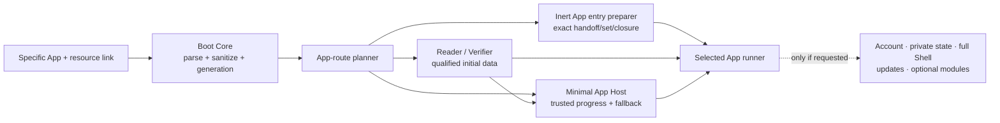

# Direct app launch and practical third-party runtime

**Status:** draft — owner-directed product architecture and researched runtime candidate; route bytes, runner profiles, package format, capability IDL, security claims, performance budgets, and implementation remain evidence-gated
**Target repos:** planning, client, sdk
**Depends on:** [[Designs/web-client-os/README]], [[Designs/web-client-os/architecture-and-modules]], [[Designs/web-client-os/system-profiles-and-generations]], [[Designs/open-web-app-store/architecture]]
**Inputs:** [[Designs/clientv2/fable-third-party-app-model-handoff]], [[Designs/clientv2/sdk-boundaries]]
**Reviewers:** @direct-app-architecture (2026-08-22), @runtime-security (2026-08-22)
**Last touched:** 2026-08-22

#status/draft #kind/design #repo/planning #repo/client #repo/sdk #topic/cypherpunk-os #topic/app-model #topic/read-path #topic/privacy #topic/wasm #topic/wasi

## Outcome

Any exact EFS application should be directly linkable. A person or agent who
opens that link should reach the named app and its useful data without first
opening Data Explorer, hydrating a personal profile, searching a catalog,
connecting a wallet, or booting the full OS. The same generic path must serve
built-in Apps, independently published Apps, read-only guest entries, retained
offline Apps, and later authorized sessions.

The recommended practical runtime is **several explicit lanes behind one App
Host contract**, not one purported universal sandbox:

1. a trusted native-Web lane for the conserved client and deliberately
   accepted base Apps;
2. a **SES Worker App lane** for capability-confined third-party JavaScript
   Apps and services, with LavaMoat/Endo dependency isolation as an active
   integration candidate;
3. an opaque-origin iframe lane for Apps that need their own full DOM and Web
   runtime;
4. Core Wasm and Wasm Component service lanes for portable non-DOM work; and
5. inert descriptors and host-owned semantic surfaces wherever executable
   code is unnecessary.

This is intentionally a useful, buildable security gradient. It does not wait
for perfect browser process isolation or a native standard Compartment before
supporting third-party Apps, and it does not call a same-process library an OS
process, a complete network sandbox, or a renderer-DoS defense.

## Direct owner direction recorded for this slice

James directed on 2026-08-22 that:

- the application infrastructure is generic, and a link may target a specific
  App directly;
- minimum time to useful data is a first-order requirement on that path;
- the App must not be forced through Data Explorer or the full Shell merely
  because those products also use the same Reader and runtime services;
- third-party App execution needs a good practical path now; and
- SES and LavaMoat are promising active candidates. The design should not make
  perfect isolation a prerequisite for useful extensibility.

These are product requirements. They do not freeze an EFS URL grammar, SES or
LavaMoat version, package encoding, runner set, default autostart policy, or
security certification.

## Product laws

1. **An App link is a first-class boot route.** It is not a file link with an
   optional detour through Data Explorer.
2. **The link nominates; the host decides.** Route fields, package metadata,
   catalogs, Types, Presentations, and App output never install code, create a
   grant, attach private data, or authorize an action.
3. **Exact before execute.** Every executable member needed by the selected
   entry and runner is fetched and verified before it reaches a compiler,
   module loader, iframe, Worker, or evaluator. A profile that can acquire and
   execute mutable remote code is a separately labelled remote-code session,
   not an exact-qualified App launch, offline candidate, or autostart class.
4. **Data and code may race safely.** The Reader may resolve the named public
   resource while the App closure is fetched. The same qualified result is
   then handed to the App; parallelism never licenses unverified code or
   unqualified data.
5. **A guest App is not an account session.** Direct guest operation requires
   no wallet, identity hydration, Commons, default catalog, private store, or
   full OS.
6. **Zero EFS grants is not zero risk.** CPU, memory, renderer bugs, browser
   side channels, direct iframe egress, visual spoofing, and bootstrap-origin
   compromise remain runner/platform residuals.
7. **The resource survives the App.** App failure never changes resource
   truth. While the host remains responsive, trusted raw and Data-Explorer
   fallback stays reachable; after renderer/process/origin compromise, browser
   restart or crash, the independent rescue path reconstructs it without the
   failed App.
8. **An update is a new launch subject.** Exact Release, dependency set,
   runner realization, grant decision, state attachment, and instance lease
   never silently follow a channel or inherit across an update, fork, or
   publisher succession.
9. **Humans and agents share the launch law.** Both receive structured plans,
   progress, outcomes, revocation, and receipts. An agent mandate may permit a
   launch; hostile content cannot create that mandate.
10. **Runner choice is replaceable, not invisible.** Every session records the
    exact runner profile/realization and its measured residuals. A future
    native Compartment, stronger iframe, Isolated Web App, or native host can
    replace a current adapter without redefining App or resource identity.

## Generic App route

### Route intent

Illustrative hash routes are:

```text
#/app/exact/<AppReleaseRef>/<ResolvedPackageSetRef>/<EntryRef>/<ResourceRef>
#/app/follow/<AppProjectAndChannelRef>/<EntryRef>/<ResourceRef>
```

The grammar and serialization are deliberately unfrozen. The semantic route
needs at least:

```text
AppRoute
  appSelector:
    EXACT { publisherQualifiedProject, exactRelease, exactResolvedPackageSet }
    | FOLLOW { publisherQualifiedProject, channelBinding, resolutionPolicy }
  requestedEntry: guest | session | agent | headless | { named: entryId }
  appReadContext {
    chain + Core + Realm + Realm/admission basis
    Lens/ResolutionPlan/policy + freshness/finality intent
  }
  resourceRef? + resourceReadContext? {
    chain + Core + Realm + Realm/admission basis
    Lens/ResolutionPlan/policy + freshness/finality intent
  }
  routeMode: INSPECT | REQUEST_LAUNCH
  package/Locator/cache hints[]
  non-secret presentation hints?
```

An exact launch route avoids catalog discovery and names the complete exact
`ResolvedPackageSet`; an exact inspection route may stop at package evidence,
but it is not launchable until that finite set is resolved. A follow route
adds one explicitly qualified selection step and freezes its result into an
exact App-scoped `AppFollowResolutionReceipt` before preparation or execution.
For launch, that receipt must resolve to an exact Release and exact
`ResolvedPackageSet` at the required freshness; a stale result remains
inspectable but is not executable. Neither route may
depend on global search, “latest,” a bare package slug, an ambient registry, or
a default Commons. Locator and cache fields are retrieval hints, never Release
identity or authority.

App/package selection and the target resource have separately pinned read
contexts. They may deliberately be identical, but the route never assumes one
chain/Realm/Lens/basis for both or launders a foreign resource through the
App's admission context.

The App-scoped follow receipt has a narrower launch law than the similarly
named system-profile receipt:

```text
AppFollowResolutionReceipt
  RESOLVED_FRESH {
    selector + Realm/Lens/Plan/policy + basis/finality/freshness/coverage
    channelHeadRevision + exact Project + Release + ResolvedPackageSet
    publisher/catalog/admission evidence
  }
  | INSPECT_ONLY_STALE { same qualified fields + exact candidate + reason }
  | UNRESOLVED { PARTIAL | EQUIVOCAL | BACKWARD | UNKNOWN, evidence, candidates? }
```

Only `RESOLVED_FRESH` can feed a follow-route launch. This avoids reusing a
system-profile acceptance policy that may deliberately allow an inspected
stale candidate. A person can always turn an inspected candidate into a new
explicit exact route without pretending it is the current channel result.

Query and fragment fields are inert requested configuration. The Boot Core
sanitizes them before logging or dispatch, and they cannot carry a wallet,
signer, storage handle, effective grant, private profile, or secret. A link
that genuinely conveys a bearer capability uses a separately defined
non-leaking capability route and ceremony; it is not smuggled into ordinary
App configuration.

`REQUEST_LAUNCH` is a request, not proof of a user gesture or intent. The host
maintains a separate non-URL launch-intent input:

```text
NONE | HOST_CONFIRMED_OPEN | AGENT_MANDATE | RETAINED_EXACT_POLICY
```

`HOST_CONFIRMED_OPEN` comes from a trusted client Launch/Open action, not from
the destination URL. Because an ordinary landing page cannot reliably
distinguish a typed URL or bookmark from redirect, `window.open`, hostile
cross-origin navigation, prerender, browser/session restore or BFCache
traversal, those cases default to trusted data/Ready display with
`ACTION_REQUIRED`; they do not create a fresh App instance. A configured
installed shortcut or prior exact local policy may use
`RETAINED_EXACT_POLICY`. BFCache or session restore may resume an already
authorized suspended lease under its lifecycle policy, never synthesize a new
Launch. This keeps external links fast to qualified data while preserving a
real execution boundary. `ACTION_REQUIRED` does not serialize data and package
work: safe initial rendering, exact retrieval, verification and preparation
continue, so an eventual Launch starts from Ready bytes rather than beginning
a second network waterfall.

### `DirectAppLaunchPlan`

The name is conceptual, not a frozen public type. The trusted App Host derives
one launch plan only after preparation succeeds. Before then, the route planner
holds a non-executable preparation attempt over the exact candidate and emits
mutable progress to its ledger; that attempt is not launch identity and cannot
construct a runner:

```text
DirectAppLaunchPlan
  routeReceipt + pinned app and initial-resource ReadContexts
  exact Project + Release + ResolvedPackageSet
  exact selected entrypoint
  exact RunnerProfile + RunnerRealization
  eagerActivationUnit: selected entry's full locked executable closure
  optionalActivationUnitRefs[]: exact separate units, not launch members
  required passive/config/rights members
  InitialDataContract + initial qualified read plan
  PackageHandoff evidence + exact complete PreparedPackageSet evidence
  requested capability/privacy/network/storage ceilings
  exact local GrantDecisionGeneration, including an all-denied guest decision
  immutable construction policy committed by RunnerRealization
  startClass + reasons + residual labels
  fallback resource/app route
```

`PackageHandoff` remains inert App Store output. This launch plan is OS-local,
does not flow back into it, and cannot be reconstructed from publisher strings
alone. A prepared set proves exact retained bytes; it neither grants authority
nor starts code.

Mutable fetch/retention progress, availability, health, failures and teardown
remain in their status ledgers and never enter the launch-plan or install-
binding identity. The host freezes a launch plan only over the exact required
sets and complete prepared/verification evidence; a mutable `COMPLETE` label
cannot unlock execution without those exact proofs.

The canonical `PackageManifest` owns entrypoint identities, member roles and
their exact closure relation. `AppEntryDescriptor` below is the OS-facing,
validated projection of that manifest for one selected entry; it is not a
second publisher-authored manifest or an independent source of package truth.

### Start classes

Direct routing does not require one globally conservative click rule:

| Class | Default behavior | Boundary |
|---|---|---|
| `INERT_HOST_DISPLAY` | Render immediately in trusted client UI | Signed/verified text and passive assets remain untrusted presentation data; no package code runs |
| `CONFINED_GUEST` | May start after a trusted host `OPEN`, complete verification and an exact local all-denied `GrantDecisionGeneration` | No live data/EFS/host-service capabilities, account/private state, signer, EFS write, persistent host storage, device authority, or general network; only the fixed lease/surface lifecycle channel exists and the bounded initial qualified result is passed by value |
| `PREVIOUSLY_AUTHORIZED` | May start under an exact retained local install/grant policy | Link creates no new grant; live calls still check revocation, session epoch, basis, budget, browser support, and fresh-gesture requirements |
| `EXPLICIT_LAUNCH` | Show a trusted ready/launch surface and wait for a human action or agent mandate | Required for a new grant, private/state attachment, wallet/signing/write, device/sensor, general direct egress, full-Web residual not accepted for autostart, or profile-specific Play |

Arcade remains explicit Play even when its detail route is direct. A read-only
SES/Wasm App whose selected profile consumes only one bounded immutable
validated initial DTO/snapshot by value may qualify for `CONFINED_GUEST`. Any
live/resumable paging, range, Reader, subscription or service handle is a
capability under a nonzero exact grant or previous authorization. An opaque
full-Web App with direct
network egress does not qualify merely because its host RPC grant set is
empty. A person may deliberately configure a stronger local autostart policy;
that policy is exact, inspectable, revocable, and never published in the link.

Execution begins only from `HOST_CONFIRMED_OPEN`, an exact retained policy, or
an agent mandate recognized by the host, and produces a start-decision
receipt. For an eligible confined guest, that trusted `OPEN` is the explicit
Launch intent and the OS records the exact all-denied grant decision; it does
not ask for a redundant second confirmation. Passive
unfurl, embed, discovery, fetch, inspection, preparation and background
prefetch remain `INSPECT` and execute nothing. This preserves the App Store's
separation between discovery/fetch/install and Launch while avoiding a second
confirmation prompt for a measured all-denied confined guest profile.
Profiles with new authority or material residuals still require the separate explicit
Launch/Play ceremony.

Browser transient user activation is neither stored nor transferred. Actions
such as fullscreen, pointer lock, clipboard, chooser, or wallet interaction
that require a current gesture remain Shell/System-Chrome operations or use a
runner profile fixed at construction and tested for that gesture.

## Fast route-shaped launch

### Boot graph



The App route branches directly after Boot Core. `Minimal App Host` is a small
trusted Shell role, not Data Explorer and not the full Session Shell. It owns
progress, identity, failure, launch/exit, permission escalation, provenance,
focus return, and the raw/Data-Explorer fallback. The selected App owns its
ordinary product surface only after the relevant start gate.

### Minimum-time-to-data rules

- Parse the App selector and resource before importing product Apps, wallet
  connectors, profile managers, catalogs, update clients, or full Shell code.
- Start exact package-resolution/critical-closure retrieval and the initial
  qualified resource read in parallel. A dependency between them must be
  demonstrated by the selected `InitialDataContract`, not assumed globally.
- Render trusted route identity and honest progress immediately. Render safe
  generic data/provenance as soon as the Reader has it; do not keep useful
  verified data blank merely because custom App code is still arriving.
- Give the App the same pinned qualified result already obtained by the host:
  by-value data for an all-denied confined guest, or exact scoped handles when
  a separate grant permits them. It must not re-resolve under a hidden Realm,
  Lens, basis, or transport policy.
- Freeze the complete `ResolvedPackageSet`, allowed import graph, and selected
  entry's eager activation unit as its full locked executable closure before
  preparation. Separately committed optional activation units are distinct
  closures, not deferred holes in that selected entry. Each eager member may
  enter its parser/compiler after
  that member's bytes verify; the full eager transitive closure and policy must
  be complete before linking, instantiation, evaluation or entry. Unknown
  dynamic specifiers fail before retrieval. An optional unit may remain absent
  only when the manifest proves it is outside the selected entry's required
  closure; invoking it requires a new frozen preparation/launch sub-plan and
  stays blocked until that separate exact unit is complete and verified. Full
  install/offline status requires every member promised by that install
  profile, not merely the initial activation unit.
- A content-bound trusted preparation/App Worker may be constructed after its
  exact runner bootstrap verifies, before the remaining closure arrives, only
  with zero capabilities and no publisher module/namespace/hook/evaluation.
  Worker construction is then preparation, not App start; full eager closure
  and policy still gate linking, instantiation, publisher evaluation and entry.
- A package's signed title, icon, localized launch text, skeleton descriptor,
  and `InitialDataContract` are inert inputs. They may improve the trusted
  resolving frame but cannot render active HTML, register elements, contact a
  network, or author authority UI.
- Cache portable executable/passive **bytes** by exact member commitment,
  length/media profile and closure membership. Key derived code by the exact
  input digest and exact `RunnerRealization`, including parser/transform/
  compiler/loader versions and options, import graph/map, policy/configuration
  digests, and engine build/features. Key semantic results by semantic resource
  identity, exact operation/query, chain/Core/Realm, basis, Lens/Plan/policy,
  adapter/decoder version, freshness/finality/coverage and any private
  installation/Principal partition. Negative entries require proven absence
  under the identical qualification. Parsed JavaScript, compiled Wasm and
  engine code caches are optional in-memory/engine-specific optimizations, not portable Cache API
  artifacts. Never key correctness by URL, channel, slug, catalog or Locator.
- A warm/offline launch reuses only complete critical bytes that are still
  present and verify. Browser storage begins best-effort, may be evicted, and
  becomes persistent only under the measured storage profile; retained status
  records persistence/eviction honestly. Seeing a newer channel candidate does
  not delay, mutate, or force-upgrade the locally accepted exact App.
- Background prefetch is a local privacy and resource decision. It must not
  expose link interests, contact arbitrary App origins, or consume metered
  bandwidth by default.
- Heavy verification, archive, decode, dependency analysis, and compilation
  uses Workers when measurement earns the transfer/start cost. Worker startup
  is not added mechanically to a tiny path.
- Import maps, `modulepreload`, Fetch Priority, Service Worker navigation
  preload, code splitting, and speculative loading are implementation tools,
  not route or package contracts. Each must prove a net cold/warm/offline gain
  on static HTTPS and IPFS profiles.

### Performance evidence, not one magic number

Every direct-App fixture records at least:

```text
navigation start
  -> trusted route/progress frame
  -> first qualified data
  -> critical executable set verified
  -> App surface visible
  -> App interactive
  -> optional full-session hydration complete
```

It records host-observable request count, transferred/retained/compiled bytes,
main-thread long tasks, Worker startup, verification/parse/instantiate time,
failed Locator attempts, cache state, and qualified privacy-relevant requests.
Lab/browser instrumentation records otherwise opaque memory, iframe egress and
engine events separately; unsupported observations remain `UNKNOWN` rather
than becoming zero. Measure clean
cold, accepted warm, complete offline, corrupt-primary fallback, partial data,
and unsupported-runner cases on representative desktop and mobile hardware.
Budgets are selected only after the disposable cross-browser fixture; the
architectural pass/fail condition is already firm: unrelated OS and account
work contributes zero critical requests, executable bytes, evaluation, or
memory.

## App package and entry contract

The generic App Host needs inert, exact package evidence sufficient to derive:

```text
AppEntryDescriptor
  entryId + entryKind
  supported route/resource profiles
  InitialDataContract
  critical executable/passive member roots
  deferred exact member sets
  supported RunnerProfile/version ranges
  requested capability/privacy/network/storage ceiling
  construction-time browser requirements
  lifecycle + health + teardown contract
  semantic surface protocol? + agent/headless protocol?
  compatibility, accessibility, localization, rights and provenance evidence
```

This descriptor is a deterministic validated projection of the canonical
exact `PackageManifest` and authored Package/Release evidence. The manifest,
not this projection, owns entry identity and member roles. The descriptor is
not an effective grant, runner realization, compatibility verdict,
installation record, or health statement. Unknown
entry/profile/capability versions are `UNSUPPORTED`, not silently
approximated.

The `InitialDataContract` should normally be a bounded host-understood request:
an exact resource, finite page, artifact manifest, or named reducer input. It
may say which qualified shapes the App accepts and which outcomes it can
render. It cannot execute a query program, demand an unbounded scan, auto-fetch
untrusted media, or claim completeness/authority. App-specific reducers remain
versioned modules over the generic Reader result law rather than new Core
nouns.

## Execution lanes

| Lane | Useful for | Default authority / surface | Honest residual |
|---|---|---|---|
| Trusted native Web | Boot, Reader, System Chrome, built-in/reviewed base Apps and shared accessible components | Same-origin DOM and browser APIs inside accepted exact base generation | Broad origin authority; supply chain and base review are load-bearing |
| Inert descriptor | themes, locale data, layout/view recipes, launch metadata | Validated data interpreted by trusted host | Expressiveness and descriptor-interpreter bugs; never active markup/actions |
| **SES Worker App** | integrated third-party JS Apps, reducers, agents, services and host-semantic UI logic | One dedicated Worker; powerless Compartment plus hardened async capability stubs | SES/runner/engine TCB, CPU/memory DoS until terminated, compatibility, side channels |
| Core Wasm / Component Worker | portable parsers, transforms, indexes, media/Git/inference kernels and service Apps | Exact imports/WIT resources only; host-owned UI | Adapter/glue TCB, browser resource controls, no DOM, host can observe inputs |
| Opaque full-Web iframe | rich custom DOM Apps, games, legacy HTML, arbitrary internal framework | Opaque origin, frozen sandbox/Permissions-Policy/CSP profile, typed host ports | Direct HTTP/WebSocket/WebRTC/subresource egress unless independently blocked; renderer DoS and Web bugs |
| Native host adapter | later Drive/device/high-assurance or resource-controlled lanes | Same semantic interfaces through native capabilities | Different TCB/distribution; never silently stronger identity or portable grant |

There is no third-party same-origin custom-element lane. Giving publisher code
the Shell's `document`, custom-element registry, origin storage, Service Worker,
wallet globals, or trusted component tree makes it part of the accepted base
TCB. A user may choose that high-risk base replacement through the System
Configuration Manager, but it is not an ordinary App install.

### Practical first JavaScript lane: SES in a dedicated Worker

SES is promoted from “exceptional fallback” to the leading confined
JavaScript App/service candidate. The initial realization should test:

1. Create one dedicated Worker per App instance. The host gives it no resource
   handles until the instance lease and launch plan are frozen.
2. The tiny exact runner bootstrap loads the pinned SES implementation and
   invokes `lockdown()` **before any publisher or dependency code executes**.
   All code that runs before lockdown is part of the exact trusted
   `RunnerRealization` and is kept minimal.
3. Capture only the host powers the trusted runner itself needs, then create a
   fresh `Compartment`, install only hardened endowments/module hooks, and
   freeze `compartment.globalThis` **before publisher code evaluates**. SES
   lockdown freezes shared intrinsics; it does not by itself freeze a new
   Compartment's mutable global. Publisher code does not see Worker `fetch`,
   `WebSocket`, `indexedDB`, `caches`, `crypto`, timers, `postMessage`, the
   native module loader, or other host globals unless the selected profile
   explicitly supplies an attenuated replacement.
4. Treat publisher archives and compartment maps only as inert serialized
   bytes. Publishers cannot supply live module namespaces, virtual-module
   `execute` functions, `__syncModuleFunctor__`, `Compartment` objects,
   transforms, hooks, or host-realm functions. The exact trusted runner alone
   constructs finite `resolveHook`/`importHook` behavior over the verified
   module map. Resolution rejects external/unknown specifiers, never reaches
   ambient network/npm/a URL import/live channel, and never evaluates
   publisher material in the initial Worker realm.
5. Endow hardened asynchronous stubs that speak the common capability
   protocol. Copy plain validated values across the Worker boundary; do not
   share mutable host objects, typed arrays, `SharedArrayBuffer`, raw
   `MessagePort`, or synchronous re-entrant host objects into the Compartment.
6. Use a host-owned semantic UI protocol for integrated accessible surfaces.
   App output is data; the host creates semantic HTML, focus behavior,
   localization boundaries, trusted chrome, and event capabilities. Apps that
   need arbitrary DOM/CSS/Canvas/WebGL use the iframe lane instead. A narrowly
   granted `OffscreenCanvas` profile may be tested later without implying DOM
   or accessibility parity.
7. Enforce broker budgets and deadlines outside the Compartment. Revocation
   fences late messages and `Worker.terminate()` is the coarse kill path for
   CPU or allocation abuse. Persistent state and retained exact bytes are
   separately owned and are not deleted by instance teardown.

SES's documented claim is fine-grained object-capability isolation after
correct lockdown and careful endowment. Its own documentation also states
that guest code can execute indefinitely, allocate arbitrary memory, and on
JavaScriptCore may observe stack contents that V8/SpiderMonkey obscure. The
host remains responsible for hardened endowments and reentrancy. EFS therefore
labels this `SES_WORKER_CONFINED`, not “process isolated,” “constant time,”
“side-channel free,” or “safe JavaScript.”

The TC39 Compartments proposal is only Stage 1 as of this evidence pass. EFS
targets its capability and module-virtualization model through an exact SES
adapter now; it does not pretend the shim is already a native browser
standard. If a conforming native Compartment ships, a new
`RunnerRealization` can use it without changing App identity, the App SDK, or
the capability law.

### LavaMoat and Endo boundary

LavaMoat is an active candidate for two different jobs that must remain
distinct:

1. **publisher dependency isolation:** generate and enforce a per-package
   policy over the exact JavaScript dependency graph so a compromised nested
   dependency receives only its declared packages/globals; and
2. **EFS build supply-chain hardening:** disable or explicitly allow dependency
   lifecycle scripts, run policy/diff review, and reduce ambient powers in the
   trusted Web Client build.

LavaMoat is **not the outer boundary against a malicious App publisher**. Its
current Webpack runtime treats the root application differently from nested
dependencies, including implicitly unrestricted root imports and host-global
endowments copied/wrapped from the real global. That is appropriate to its
supply-chain threat model and insufficient for EFS. The OS-owned zero-ambient
outer SES Compartment in a dedicated Worker confines the publisher;
LavaMoat/Endo compartments then attenuate dependencies *inside* that boundary.
Static policy analysis can also miss dynamic access, so a generated policy is
never proof of least authority.

For the App lane, the exact LavaMoat version, policy, overrides, dependency
canonicalization, loader/prelude, SES version, transforms, shims, and output
graph are part of `RunnerRealization` or the exact derived executable closure.
Generated policy is reviewable evidence, not authority: EFS still computes

```text
requested ceiling
  ∩ runner ceiling
  ∩ client/admin policy
  ∩ exact local grant decision
  ∩ live revocation/session/budget
  ∩ platform support
```

The policy must be deterministic, schema-validated, stable-diffable, and fail
closed on unknown package/global/capability names. An update displays both the
App capability diff and dependency-policy diff. Discovery, fetch, inspection,
and preparation execute no lifecycle/build/start hooks.

Current evidence does **not** support declaring LavaMoat a native Vite/Rollup
runtime plugin. The project documents Browserify and an active/experimental
Webpack path; its 2026 roadmap still lists performance benchmarking, policy
diagnostics/diffs, compatibility work, and several policy enhancements as in
progress or planned. The EFS host may still use Vite because host build tooling
and an installed App's normalized runner artifact are different seams.

The first comparison therefore tests, rather than assumes:

- an Endo `endoZipBase64`/compartment-map-style exact archive loaded into SES;
- a LavaMoat Browserify or Webpack protected graph normalized as an exact EFS
  runner artifact;
- a small EFS-owned SES module-map adapter over already verified ESM module
  records; and
- an unconfined control bundle.

The delivery sequence deliberately allows usefulness before perfect
dependency isolation:

```text
ses-worker-bundle-v0
  one exact publisher bundle in one outer OS Compartment;
  all bundled dependencies share the App's already bounded authority

ses-worker-compartment-map-v1
  the same outer boundary plus one exact per-package compartment map/policy;
  nested dependencies receive narrower package/global powers
```

`v0` is acceptable only if the hostile App-level fixture and exact closure
rules pass. `v1` is a defense-in-depth improvement, not a reason to postpone
the first practical JavaScript App indefinitely.

Endo archive, compartment map, precompiled module record, or LavaMoat policy
may become one derived runner representation. None becomes the EFS package
identity, canonical authored Release, universal source format, or reason to
replace the standards-first Vite recommendation for the trusted SPA. If the
integration cost or startup weight fails the fixture, retain SES with a
smaller exact loader or use the iframe/Wasm lane; do not abandon third-party
Apps and do not contort all Web Client code around one bundler.

The SES distribution itself should be retained as an exact runner member and
loaded without a transform/minifier that could change its security behavior.
A scope-relative URL is not content-bound merely because the client previously
fetched matching bytes: `Worker`/`importScripts` has no integrity parameter and
a same-origin Service Worker remains in the delivery TCB. An admitted runner
therefore starts either inside the locally accepted exact `BootGeneration`, or
from a Worker/bootstrap object URL generated from exact bytes the parent
fetched and verified. That bootstrap performs no later `importScripts`, native
module import, redirect, or mutable-URL fetch before confinement; every runner
and publisher module comes from the already verified finite map. The
`RunnerRealization` records the executed bootstrap digest, construction/CSP/
blob mechanism, and controlling Service Worker state. A direct-URL profile is
not admitted until it proves an equivalent response-binding and TOCTOU
boundary. Substitution fixtures mutate the Worker URL, redirect, HTTP/cache
entry and same-origin Service Worker and require the executed bootstrap digest
to equal the frozen launch plan. Strict-CSP, blob/object-URL Worker, source-map,
static-host and IPFS behavior remain measured profile questions.

### Opaque full-Web App

The full-Web lane permits arbitrary internal Web Components, React, Vue,
Svelte, Canvas, media, and game code inside its own document. It receives:

- an opaque-origin iframe (`sandbox` includes scripts and omits
  `allow-same-origin`);
- sandbox flags, Permissions Policy, origin/credential mode, CSP/network
  profile, storage mode, and navigation policy fixed before construction;
- verified closure-backed resource URLs or an immutable virtual mount, never
  Locators or partially verified members;
- typed `MessagePort` services only after the exact instance lease is live;
  and
- Shell-owned identity, permission, exit/restart, focus-return, accessibility
  status, fullscreen and recovery chrome.

Construction-time browser authority and live RPC authority are separate. A
later port cannot grant a sandbox flag, loosen CSP, change opaque-origin mode,
or retroactively deny an already available browser API. Any widening that
changes construction policy destroys the instance and creates a new lease.

Sandboxing does not by itself block HTTP, WebSocket, subresources, WebRTC,
self-navigation, renderer hangs, browser exploits, or already-sent remote
effects. A claimed network-denied profile needs a measured, cross-browser
dedicated-origin/CSP design; otherwise the profile is explicitly
`DIRECT_EGRESS` or names enforceable allowed origins and residual mutable
remote code/data. The host endows no wallet or EFS object; browser-extension
injection remains a separately measured platform residual.

An exact-qualified full-Web profile must closure-bind browser executable
resources and block remote scripts, module imports, Workers/subworkers,
documents and other executable fetches under a measured CSP/resource-delivery
profile. Mutable data access should normally use typed host RPC. If direct
egress lets the App fetch and interpret mutable instructions—or the host
cannot prove the executable/data distinction—the session is labelled
`MUTABLE_REMOTE_EXECUTION_OR_DATA`, requires explicit Launch, and loses exact-
execution, offline and reproducibility qualifications. Its exact authored
Release remains provenance for the bootstrap closure; it is not a claim that
the resulting behavior was fixed by that Release.

### Wasm and Component lanes

Core Wasm plus WIT-shaped interfaces remain foundational. Wasm is preferred
for portable, performant non-DOM logic when the program and language toolchain
fit it. Its capability imports and Worker termination complement SES; Wasm
does not replace the JavaScript App ecosystem, magically enforce fuel in
browsers, hide inputs from the host, or provide an accessible UI.

An App may combine lanes through separate child leases: for example, a SES
controller drives an OS-owned surface and calls a Wasm media transform, or an
opaque iframe receives an exact derived image from a Wasm service. Child
composition never merges authority or lets one lane borrow the other's
ambient browser powers.

## App instance and capability contract

### `AppInstanceLease`

One ephemeral OS-local lease owns one complete live resource tree:

```text
AppInstanceLease
  exact DirectAppLaunchPlan digest
  exact InstallBindingGeneration? + GrantDecisionGeneration
  exact RunnerRealization, including immutable construction policy
  activation/session epoch + monotonic fence
  surface/focus/input attachment
  Worker/iframe/component instance and child leases
  closure mounts/object URLs
  capability ports + broker requests + AbortControllers
  ephemeral state namespace + persistent-state attachment reference?
  timers/health controller/budgets/deadlines
  fullscreen/pointer-lock/focus-return state
  lifecycle + teardown status reference
```

Route change, Exit, expiry, revocation, crash recovery, update, or generation
fence mismatch first rejects late messages/completions and revokes ports; then
aborts brokered work, exits fullscreen/pointer lock, removes frames or
terminates Workers, releases URLs/mounts/resources, and restores focus.
Teardown is idempotent and ledgered. It cannot undo remote effects already
sent. Persistent user state and retained verified package bytes are not
deleted; deletion is a separate reviewed action.

### Common capability protocol

The durable App-facing service model is semantic and transport-neutral:

```text
discover(interface, versionRange)
open(request, scope, basis, budget) -> handle + receipt
invoke(handle, operation, typedInput) -> progress + typedOutcome
cancel(operation)
subscribe(handle, eventProfile) -> bounded event stream
close(handle)
```

Every message binds protocol version, instance/lease ID, generation/epoch,
request ID, deadline/budget, and structured outcome. The broker validates
size, rate, concurrency, replay, order, cancellation and revocation before
dispatch. Effectful operations expose at least `NOT_DISPATCHED`, `DISPATCHED`,
`REMOTE_STATUS_UNKNOWN`, `CONFIRMED`, `REJECTED` and a reconciliation/read-back
path. Cancellation or revocation prevents new dispatch and local acceptance;
after dispatch it is best-effort and never claims to roll back a chain write,
network request or remote side effect. MessagePort, WIT, in-process trusted
calls, agent tools, and later native IPC are generated adapters over the same
domain contract; none is the canonical semantic API by itself.

Apps never receive a raw signer. Authority-bearing operations use the shared
`describe -> plan/dry-run -> conserved consent/mandate -> execute -> receipt`
pipeline. The App supplies typed intent values, not rich permission copy or
trusted System Chrome. The actual Principal, controller/signer, submitter,
relayer, payer, requesting App, Realm, effects, and historical authorization
remain distinct in plans and receipts.

## Data Explorer and App boundaries

Data Explorer is the default trusted general-purpose data App for an
unqualified Files/data link and the durable raw/provenance fallback. It is not
the App router, package manager, Kernel, or mandatory parent application.

```text
unqualified File/data link -> built-in guest Data Explorer entry
specific App + resource link -> named App guest/launch entry
named App failure/denial -> trusted raw/Data Explorer fallback offered
```

The Data Explorer owns navigation, projections, selection, workspaces, and its
extension UX. The Web Client/OS owns direct routing, verified package
preparation, runner construction, capability brokerage, leases, grants,
System Chrome, and fallback reachability. A Data Explorer view extension uses
the same generic App runtime and receives a scoped read snapshot by default;
it cannot become required authority over the underlying resource.

Arcade, Booru/Media, Git/Forge, EAP, Nanda, Data Explorer, and future Apps are
consumer fixtures. This design does not redefine their schemas or product
semantics.

## SDK boundary

The dependency direction is:

```text
generated Protocol codecs and validators
  -> generic Realm/Artifact/Files SDK
  -> stable consumer outcomes and domain DTOs
  -> OS App SDK semantic contracts
  -> MessagePort / WIT / agent / trusted-call bindings
  -> product App SDKs
```

The trusted direct guest host may call the lower Reader slice in process for
latency. An all-denied confined guest receives only immutable validated App
SDK DTOs/snapshots by value and cannot discover/open/invoke/subscribe through
a live service; its fixed runner lifecycle and constrained semantic-surface
channel is part of `RunnerRealization`, not an EFS/service grant. Third-party
Apps with a nonzero exact grant or retained
authorization may receive scoped resource handles through the OS App SDK.
Neither path reimplements protocol validation, negative-cache rules, byte
verification, or action semantics.

The SDK PM needs these generic contracts pressure-tested without freezing
names:

- `AppRoute` and `DirectAppLaunchPlan` inputs/outcomes;
- exact package/runner/preparation evidence;
- `Resolved<T>`, `ByteOutcome`, verified range/stream and raw-evidence handles;
- App surface, events, cancellation, backpressure and lease lifecycle;
- capability discovery/open/invoke/close plus grants/revocation;
- ActionPlan/ActionReceipt with separate semantic author, actual actor,
  submitter and payer; and
- exhaustive `UNKNOWN`, `PARTIAL`, `UNSUPPORTED`, policy denial, integrity,
  runtime, crash and teardown results.

The advanced OS may use lower Protocol/Reader APIs for diagnostics, rescue,
conformance and package verification. Ordinary App developers should not need
those powers to build a safe data App.

## Privacy and security boundary

- Host-controlled preparation before App execution contacts only route-
  selected Realm/transports, exact package carriers needed for the critical
  closure, and resources explicitly admitted by the selected read/network
  policy. Fetches omit credentials and referrers where the protocol permits,
  restrict schemes/origins/redirects/private-network reach, and enforce size,
  time and concurrency budgets. No analytics, third-party fonts, ambient
  catalog, publisher site, wallet, account service, or profile sync. After
  start, opaque full-Web
  requests follow the labelled direct-egress/allowed-origin profile and may be
  partly unobservable to the host.
- Package and resource retrieval expose interest to contacted endpoints. The
  UI preserves that disclosure separately from cryptographic byte
  verification; verified does not mean private.
- Direct iframe egress, SES endowments, host semantic-service calls, and
  publisher-supplied remote origins are separate indicators. “No EFS grant”
  never hides ordinary Web egress.
- Private/local state begins unattached. A public App link receives no API to
  enumerate existing branches, recents, favorites, identities, Apps, grants,
  models, or caches. Cache hits and other timing can still support
  probabilistic inference/fingerprinting that the selected privacy profile
  records.
- App logs, crash reports, telemetry, update checks, inference calls, and
  network access are explicit capabilities/policies. Host diagnostics redact
  bearer material and private values before persistence/export.
- Apps cannot draw or control trusted permission/signing/install/update
  language. Pixel-perfect in-page spoofing remains possible; authority comes
  only from the exact host plan and isolated confirmation path.
- A malicious same-origin bootstrap or Service Worker can replace the runner,
  steal origin state, and spoof verification. The ordinary stable-origin PWA
  cannot prove otherwise. Client-verified immutable-CID delivery, a local
  verifier, extension, IWA, and native launchers are stronger separately
  measured delivery profiles over the same exact App identity; a CID in a
  trusted HTTP gateway URL alone proves neither browser-side byte verification
  nor bootstrap integrity.

## Smallest credible delivery sequence

### Web Client MVP reservation

The write-capable File Browser/Data Explorer remains the first official
vertical. It ships the generic route parser, Reader/Verifier, and the tiny
trusted host role used by the built-in Data Explorer and raw fallback: route
progress, qualification, exit and recovery seams. It reserves the Minimal App
Host interface and exact closure/cache law, but does not yet implement generic
external-App package resolution or a production-safe arbitrary third-party
runner. Those begin in the near-term proof below.

### First third-party App proof

Build only after separate disposable-experiment authorization:

1. one exact direct-linked read-only App using the SES Worker lane and a small
   host semantic surface;
2. the same domain operation through a Wasm Worker service;
3. one exact opaque full-Web App/Arcade fixture with honest direct-egress
   labeling; and
4. Data Explorer/raw fallback after removing or crashing each App.

No App Store search is needed. Exact package references and Locators are
supplied as fixture inputs. This proves the runtime boundary before adding
catalog installation, complex profiles, private state, writes, or a polished
developer ecosystem.

### Near-term platform

- stable App-route/link grammar and share UI;
- exact install binding, grants, retained bytes, update/rollback, state branch,
  and permission UI;
- SES/Endo/LavaMoat packaging and policy tooling with conformance suites;
- iframe origin/CSP/direct-egress profiles;
- OS-owned semantic surface primitives and accessible interaction model;
- generated App SDK bindings, developer simulator, permission diff, package
  inspector and hostile fixture kit; and
- first Data Explorer, Arcade, Media/Booru and Git/Forge consumer proofs.

### Later OS

- richer WIT/Component Apps, additional languages and native hosts;
- private/offline branches, migration, synchronization and agent sessions;
- independently published catalogs and handler policies;
- stronger delivery/isolation profiles, deterministic/reproducible builds,
  transparency and advisory evidence; and
- user-shareable exact system profiles composing Apps, services, configuration
  and inert grant requests without exporting effective authority.

## Acceptance fixtures

1. **Cold exact App link:** a clean browser opens an exact App plus nested
   public resource with no wallet, account, Commons, catalog, hosted indexer,
   prior cache, private store, Session Shell, or Data Explorer intermediary.
   Package and data work overlap; the trusted frame shows qualification; the
   selected eligible guest entry receives exactly the same pinned result.
2. **Follow link:** the client performs one explicit Principal/Realm/Plan/basis
   selection, freezes an exact receipt, and never changes candidate during
   launch. Equivocal/partial/stale selection yields no executable candidate.
3. **Critical-path audit:** account, wallet, update, full Shell, unrelated App,
   catalog-search and private-state modules contribute zero requests,
   executable bytes, evaluation, Worker startup, or memory before useful App
   data. Every remaining serial edge has a recorded dependency.
4. **Warm and offline:** a complete accepted exact App/data set starts without
   network. A newer advertised Release neither blocks nor changes it; explicit
   update is separate.
5. **Corrupt carrier:** corrupt primary App code or data is rejected before
   evaluation/display; verified fallback preserves exact identity. Mismatch,
   timeout, malformed Locator, missing member, policy denial, and no transport
   remain distinct.
6. **No code before execute:** Inspect, metadata retention, package fetch, and
   Prepare run no publisher module, dependency hook, migration, start function,
   iframe, Worker App, or capability.
7. **SES ambient denial:** a hostile App and dependency attempt `fetch`,
   WebSocket, storage, cache, crypto/random/timer, `postMessage`, dynamic URL
   import, prototype poisoning, host-global discovery, mutable endowment
   abuse, reentrancy, infinite loop, allocation bomb and stale-handle replay.
   Undeclared effects fail; the Worker is terminable; residuals match measured
   engine behavior rather than an absolute safety label.
8. **Dependency policy:** a benign top-level App includes one malicious nested
   dependency. LavaMoat/alternative policy generation and enforcement restrict
   the nested package without granting EFS capability; unknown policy fields
   fail closed; policy and capability diffs are shown on update.
9. **Runner comparison:** the same bounded reducer and surface run through raw
   SES, SES plus Endo archive, LavaMoat-protected representation, and Wasm
   where expressible. Record cold/warm size, startup, memory, compatibility,
   denial, teardown, developer effort and reproducibility. No arm wins by
   architecture prose.
10. **Full-Web residual:** a malicious opaque iframe probes network,
    WebSocket, subresources, WebRTC, navigation, popups, downloads, wallet,
    storage, focus, fullscreen, pointer lock and renderer starvation across
    Chromium, Firefox and Safari. It also attempts remote classic/module
    scripts, dynamic import, Worker/subworker creation and fetched-code
    interpretation. An exact-qualified profile blocks those paths; any profile
    that permits or cannot distinguish them visibly drops exact-execution,
    offline and autostart claims. Labels report what is enforced. A
    construction-policy widening destroys and recreates the lease.
11. **Complete teardown:** Exit during download, startup and execution leaves
    no live frame/Worker/port/object URL/mount/request/pointer lock/fullscreen
    or child lease. Late events cannot regain focus or authority. Retained
    bytes and persistent user state remain until separate deletion.
12. **Grant non-inheritance:** update, rollback, fork, publisher succession and
    identical bytes create no silent grant/state attachment. A later revocation
    remains effective after rollback.
13. **Status/identity separation:** fetch progress, retained-byte status,
    availability and health mutate without changing `DirectAppLaunchPlan`,
    `PreparedPackageSet`, `InstallBindingGeneration` or App identity. Forging
    or toggling a mutable `COMPLETE` status cannot start an App without the
    exact complete prepared-set evidence committed by the frozen plan.
14. **All-denied means no live service:** a confined guest receives its exact
    initial DTO/snapshot by value, then fails every capability discover/open/
    invoke/subscribe attempt. Paging, range continuation or another read
    requires a new explicit grant or retained exact authorization.
15. **Fallback and rescue:** missing, unsupported, denied, corrupt and crashing
    Apps do not change resource truth. When the host responds, trusted raw/Data
    Explorer inspection remains reachable. Allocation bomb, renderer crash,
    shared-process hang, browser restart and origin compromise additionally
    prove reconstruction through the independent rescue path with the same
    identity, basis, evidence and exact citation.
16. **Agent parity:** a human and authorized agent use the same app-route,
    capability, action, progress, cancel, receipt and teardown semantics. An
    agent without a matching mandate cannot auto-launch an explicit class or
    attach resources.
17. **Accessibility and global use:** the Minimal App Host and host-semantic
    surface pass keyboard, screen reader, touch, zoom, reduced motion,
    high-contrast/forced-colors, RTL/bidi and IME fixtures. An iframe App's own
    accessibility is separately claimed and never credited to the host.
18. **Bootstrap substitution:** mutate the Worker URL, redirect, HTTP/cache
    response and a controlling same-origin Service Worker. The executed SES/
    runner bootstrap digest must equal the frozen plan or no Compartment/App
    code runs.
19. **Activation-unit boundary:** the exact full package set/import graph is
    frozen. Individually verified eager members may parse/compile in parallel,
    but no link/instantiate/evaluate/entry occurs until the eager closure and
    policy are complete. A formally separate optional dynamic unit may be
    absent at initial launch; its invocation remains blocked until that exact
    unit verifies. Cycles, re-exports, top-level await, hidden `require`,
    undeclared dynamic import and lazy import before verification fail closed.
20. **Irreversible cancellation:** Exit/revoke races an effectful request
    before and after dispatch. Before dispatch, no effect occurs. After
    dispatch, the receipt remains `DISPATCHED` or `REMOTE_STATUS_UNKNOWN` until
    canonical reconciliation yields `CONFIRMED`/`REJECTED`; local teardown
    never claims remote rollback.
21. **Host semantic surface abuse:** malformed, deeply nested, oversized and
    replayed patches; stale event IDs; focus/ARIA traps; bidi/confusable
    authority text; deceptive links/icons; unknown component/action IDs; and
    render bombs meet schema/depth/rate budgets and fail closed. App identity
    stays outside App-controlled content and event capabilities bind the exact
    lease/epoch.
22. **Navigation provenance:** trusted in-client Open/Launch and a matching
    agent mandate can supply execution intent. Typed/bookmarked external URL,
    redirect, `window.open`, prerender, BFCache and session restore cannot be
    distinguished into fresh consent by URL data and therefore show qualified
    data/Ready without creating a new App instance. A retained exact policy or
    already authorized suspended lease follows its explicit lifecycle rule.

The direct-App skeleton is falsified if a specific App route must boot Data
Explorer/full Shell; critical resolution depends on catalog search; code runs
before verification; a link grants authority; iframe direct egress is called
network-denied; SES is called a process/DoS boundary; a package update mutates
an installed identity; or removing the App hides the resource.

## Research and experiment queue

- Seal the route/launch fixture with Data Explorer, Arcade and one small
  non-Files read App before selecting names or bytes.
- Build a disposable SES Worker runner with no guest globals, exact module map,
  hardened async capability stubs, host semantic surface, revocation and hard
  termination. Test V8, SpiderMonkey and JavaScriptCore residuals.
- Compare Endo compartment-map archives, LavaMoat Browserify/webpack output and
  a minimal EFS loader. Measure Vite-host integration as a separate boundary;
  do not assume or require a LavaMoat Vite plugin.
- Define the smallest accessible host semantic surface that can express Data
  Explorer extensions, EAP cards/gates, App Store detail, Git status and
  simple Media views without becoming a second browser/framework.
- Measure one-App-per-Worker cost and compare pooled/multi-guest Workers only
  after the single-App boundary passes. Shared Workers must not create
  cross-App mutable state or fate coupling by optimization.
- Build the malicious iframe matrix on dedicated/static/CID origins, `srcdoc`,
  blob and closure-backed resource models. Prove or reject cross-browser
  no-egress profiles; never fill gaps with a hosted proxy required for
  correctness.
- Pressure the App SDK with cancellation, streaming, backpressure, multi-tab
  epochs, late completions, revocation, partial data and action-plan races.
- Measure whether trusted generic initial-data rendering materially improves
  time-to-data or merely duplicates each App. Keep raw/provenance fallback even
  if richer pre-rendering is rejected.
- Define independent conformance suites and retained hostile fixtures before
  admitting third-party packages to privileged service slots.
- Reassess native TC39 Compartments, ShadowRealm, stronger browser isolation,
  Component Model, WASI, WebMCP, IWA and signed-bundle progress at each runner
  profile release. Emerging status never implies ambient authority.

## Current primary evidence

- [SES README: lockdown, Compartments, modules, security claims and caveats](https://github.com/endojs/endo/blob/master/packages/ses/README.md)
  supports powerless Compartments with careful endowments, while explicitly
  retaining indefinite execution, arbitrary allocation and engine-specific
  stack caveats.
- [TC39 Compartments proposal](https://github.com/tc39/proposal-compartments)
  is Stage 1 and targets isolation plus virtualized host/module behavior. It is
  a future standards direction, not a shipped browser primitive.
- [Endo `import-bundle`](https://github.com/endojs/endo/blob/master/packages/import-bundle/README.md)
  and [Endo `bundle-source`](https://github.com/endojs/endo/blob/master/packages/bundle-source/README.md)
  provide current compartment-map/archive evidence and make their transforms,
  formats and loader TCB visible.
- [LavaMoat](https://github.com/LavaMoat/LavaMoat) documents SES-backed
  dependency policies, lifecycle-script controls, Browserify browser support,
  and an evolving Webpack integration. Its
  [2026 roadmap](https://github.com/LavaMoat/LavaMoat/wiki/roadmap) keeps
  performance, policy diagnostics/diffs and compatibility work explicitly
  active.
- LavaMoat's current
  [Webpack runtime](https://github.com/LavaMoat/LavaMoat/blob/e9c0c481aba7ff9e4cb3eb087ba88c17d1d4e58e/packages/webpack/src/runtime/runtime.js)
  and [policy documentation](https://github.com/LavaMoat/LavaMoat/blob/main/docs/policy.md)
  are the evidence for keeping publisher confinement outside the dependency
  policy and treating generated policy as review input.
- [MetaMask ocap-kernel guide](https://github.com/MetaMask/ocap-kernel/blob/main/docs/kernel-guide.md)
  is shipped-system evidence for SES Compartments inside Worker-hosted vats
  with explicit globals.
- [Figma's plugin execution model](https://developers.figma.com/docs/plugins/how-plugins-run/)
  demonstrates the useful split between capability-shaped sandbox logic and a
  separate full-Web iframe UI, including honest network-limit caveats.
- [VS Code Extension Host](https://code.visualstudio.com/api/advanced-topics/extension-host)
  demonstrates activation-event-shaped lazy loading and a browser Worker host
  for Web extensions; it is performance/placement evidence, not proof of the
  EFS threat model.
- [HTML iframe sandbox](https://html.spec.whatwg.org/multipage/iframe-embed-object.html),
  [CSP](https://w3c.github.io/webappsec-csp/),
  [Permissions Policy](https://w3c.github.io/webappsec-permissions-policy/),
  and [HTML Workers](https://html.spec.whatwg.org/multipage/workers.html)
  define the browser construction and kill primitives; their composition must
  be measured rather than credited with properties they do not specify.
- [Service Worker Cache](https://w3c.github.io/ServiceWorker/#cache-interface),
  [Storage persistence/pressure](https://storage.spec.whatwg.org/#persistence-permission),
  [WebAssembly Web API serialization](https://webassembly.github.io/spec/web-api/#serialization),
  and [Resource Timing privacy](https://w3c.github.io/resource-timing/#privacy-security)
  support the exact-byte cache plus qualified persistence/observability model;
  neither parsed-code portability nor durable custody is assumed.
- [IPFS HTTP Gateway trust models](https://docs.ipfs.tech/reference/http/gateway/#trusted-vs-trustless)
  distinguish client-verified retrieval from a CID merely carried through a
  trusted HTTP gateway.
- [WebAssembly Core](https://webassembly.github.io/spec/core/) and the
  [WebAssembly Component Model](https://github.com/WebAssembly/component-model)
  remain the portable compute/composition foundations described in
  [[system-profiles-and-generations]].

## Open questions

- [ ] Select the smallest `AppRoute`, `DirectAppLaunchPlan`, entry descriptor,
      host semantic surface, capability protocol and lease fields only after
      two independent App implementations and the Data Explorer fallback use
      them.
- [ ] Determine whether a recipient may configure an exact retained
      `CONFINED_GUEST` autostart policy from measured SES/Wasm residuals,
      privacy/network disclosure and comprehension—not from a URL or the
      presence of a `guestEntry` string alone. Fresh ambiguous navigation
      remains `ACTION_REQUIRED`.
- [ ] Decide whether the first SES representation uses Endo archive/module
      records, LavaMoat output, a minimal EFS loader, or more than one profile
      after exact-size/startup/security/reproducibility comparison.
- [ ] Prove which LavaMoat build/runtime controls integrate cleanly with the
      third-party developer toolchain and which belong only to the trusted
      Web Client supply-chain profile.
- [ ] Define the rich full-Web network profiles only after Chromium, Firefox
      and Safari direct-egress tests on deployable static origins.
- [ ] Select numerical cold/warm/offline direct-App budgets after representative
      desktop/mobile fixtures reveal the irreducible Reader, verifier, runner
      and UI costs.

No current item requires an owner choice. Return an owner packet only if the
experiments leave a mature product fork that evidence cannot settle.

## Pre-promotion checklist

- [ ] All `## Open questions` resolved or explicitly deferred.
- [ ] `**Target repos:**` and package ownership confirmed.
- [ ] `**Depends on:**` designs accepted or dependency risk explicitly
      acknowledged.
- [x] Historical inputs clearly marked as evidence, not binding architecture.
- [x] Direct guest independence, raw fallback and one-way `PackageHandoff`
      preserved.
- [ ] SES/LavaMoat/Endo and iframe claims reproduced in disposable hostile
      cross-browser fixtures.
- [ ] App SDK, Data Explorer, Arcade and at least one other App owner review the
      consumer boundary.
- [ ] Independent security and performance reviewers record no unresolved
      blocking finding.
