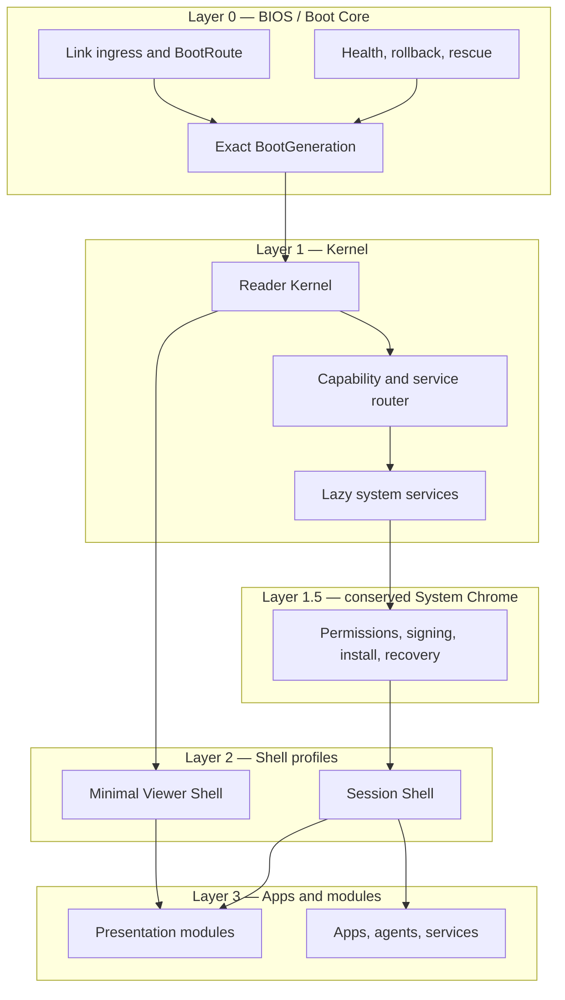

# Layered Web Client / OS architecture and module system

**Status:** draft — working architecture for iteration; interface names, package shapes, runners, repository topology, and implementation tools are not adopted
**Target repos:** planning, client, sdk
**Depends on:** [[Designs/web-client-os/README]], [[Designs/open-web-app-store/architecture]], [[Designs/efsv2/hierarchical-files-and-folders]]
**Reviewers:** @historical-client-architecture (2026-08-14), @current-v2-read-path (2026-08-14), @web-platform-standards (2026-08-14), @os-drives-pm boundary review (2026-08-14)
**Last touched:** 2026-08-14

#status/draft #kind/design #repo/planning #repo/client #repo/sdk #topic/cypherpunk-os #topic/app-model #topic/read-path #topic/privacy

## Problem

The direct client must be extremely small and fast, while the intended product
horizon includes replaceable retrieval, policy, presentation, storage,
identity, signing, package, agent, Shell, and runtime services. A monolithic
SPA would make every link pay for that horizon. Two independently implemented
clients would make resolver, verification, action, privacy, and diagnostic
semantics drift.

The architecture needs an understandable OS-like hierarchy, a small conserved
trust root, route-shaped lazy boot, exact module generations, explicit
capability flow, and enough shims to keep the product moving while EFS v2 and
browser mechanisms are still changing.

## Architecture alternatives

| Approach | Benefit | Failure | Disposition |
|---|---|---|---|
| Full historical `Bootstrapper -> Kernel -> System Chrome -> Shell -> Apps` on every navigation | One coherent generation and policy environment | Public links pay full startup, profile, storage, wallet, and Shell cost; violates direct guest independence | Reject as the universal boot path |
| Separate lightweight Web Client and separately implemented OS | Simple initial organization and very small guest bundle | Resolver, verification, diagnostics, action planning, accessibility, and cache semantics fork; later integration becomes redesign | Reject as product architecture |
| **One module graph with guest and full boot profiles** | Shared truth and interfaces; minimal route cost; gradual promotion; replaceable services | Requires strict dependency direction, lifecycle contracts, and performance budgets | **Recommended** |

## Layer model

`BIOS`, `Kernel`, `Shell`, and `Apps` are browser software roles. They do not
pretend the web origin is a hardware trust root or that a same-origin Worker is
a cryptographic enclave. The browser, selected client generation, origin,
operating system, and sufficiently privileged extensions remain part of the
trusted computing base.



### Layer 0 — BIOS / Boot Core

The Boot Core is the smallest conserved client role. It should be auditable as
one unit and change only through exact client-generation activation.

Responsibilities:

- capture and sanitize the incoming URL before optional modules see it;
- split chain, Core, Realm, route profile/config, root Mount, mount-local
  namespace/content/metadata Plans, basis, path, action, and non-secret boot
  hints into a typed `BootRoute`;
- remove or sequester fragment capabilities before logging, analytics,
  referrers, or module dispatch;
- start an untrusted/external link in `GuestRead`; admit `FullSession` or
  `Recovery` initially only from an explicit locally trusted launch context,
  and transition to `FilesWrite` only after GuestRead has established a pinned
  useful context plus an explicit authorized human-or-agent action (post-paint
  in visual sessions, structured progress in headless sessions);
- from the deployment trust anchor, verify the exact manifest and every
  subsequently loaded executable artifact before use;
- start the Reader Kernel and honest resolving frame;
- expose boot-health, last-known-good generation, and independent-export links.

It must not load accounts, query a wallet, open private stores, contact an
ambient package registry, execute a link-nominated module, or initialize the
general Session Shell.

The initially delivered document and embedded Boot Core are part of the
deployment trust anchor. Once running, they can verify every subsequently
loaded executable against an independently pinned manifest, but they cannot
attest their own delivery after the fact; [Subresource
Integrity](https://www.w3.org/TR/SRI/) anchors child resources, not the
document that declares the anchor. A stable HTTPS origin relies on that
origin/TLS and release process; an exact CID entry relies on how the user or
rescue tool obtained and checked the CID; an independently retained local
rescue relies on its own signature/hash and distribution. The UI must not turn
child-resource verification into the stronger claim that the bootstrap was
independently verified.

Conceptual interface:

```text
parseLink(url) -> BootRoute                 # requested mode is inert input
selectInitialBootProfile(route, launchTrust, localPolicySummary) -> BootProfile
promoteBootProfile(current, explicitAction, localPolicy) -> BootTransition
verifyBootSlice(generation, requiredInterfaces) -> VerifiedBootSet
startModule(verifiedEntry, interfaceVersion, endowments) -> ModuleHandle
reportBootHealth() -> BootHealth
rollbackBaseGeneration(exactGeneration) -> RecoveryPlan
```

### Layer 1A — Reader Kernel

The Reader Kernel is the shared substrate for the direct Web Client, full OS,
agents, and native adapters. It contains no product-specific View and no
wallet requirement.

Logical packages/interfaces:

| Interface | Responsibility | Must not own |
|---|---|---|
| Protocol SDK | IDs, canonical codecs, runtime validators, Core ABI, proofs, low-level index reads | Files paths, browser UI, wallet policy |
| Realm Reader | Explicit read contexts, admitted typed Records/Occurrences/Bindings, pagination, basis and completeness | Product reducers, global search, hidden endpoint authority |
| Artifact Reader / Verifier | Exact manifests/closures, Locator attempts, verified whole bytes/ranges, fallback evidence | Release identity, presentation selection, execution grants |
| Files Resolver | Stable Files view, point lookup, complete-or-qualified directory pages, properties, opened files, transcripts | URL grammar, HTTP status, browser cache, native host aliases |
| Presentation Router | Trusted mapping from resolved input profile and local handler policy to a presentation plan | Remote self-registration, installation, grants, execution |
| Diagnostics | Stable result/error codes, provenance, explanation, resumption hints, structured progress | UI prose as the canonical error model |

The generic Reader must not become path-only. Files, EAP, Git/Forge, packages,
Arcade, Media, and other typed reducers are siblings over generic Records,
Occurrences, Bindings, and artifacts.

The Reader's identity surface is uniformly `PrincipalId`. A contract Lens is
expected to carry Principal entries—targeting 64 if the evidence supports
it—not each controller key. Verifying the actual signer/account against a
Principal's historical controller state is an authority operation beneath that
surface.

Conceptual result:

```text
ReadContext
  purpose: INTERACTIVE | GATE | BACKGROUND | ACTION_PLAN
  chain + Core + Realm + exact basis/finality/freshness policy
  generic reader policy + coverage/query budgets
  FilesRouteContext? {
    routeConfig + rootMount
    namespacePlan + contentPlan + metadataPlan?
    filesProfile + path
  }
  endpoint/transport policy + cancellation/deadline

Resolved<T> =
  value? +
  semanticIdentity +
  provenance + historicalAuthority +
  Realm + exactBasis + finality + freshness +
  coverage + completeness + verification +
  diagnostics[] + resumption?
```

`GATE` is an enforced Reader context, not a caller convention. Its evaluator
must mechanically apply the requested finality/freshness/completeness policy
and return `SATISFIED`, `NOT_SATISFIED` only at a complete basis, or typed
`UNKNOWN`. A domain module such as EAP supplies the reducer/policy; the generic
Reader owns the qualified read and cannot learn an Achievement-specific Core
noun.

### Layer 1B — capability and service router

The smallest guest build may call trusted Reader packages directly, but the
architecture exposes the same operations as versioned service contracts so
Workers, Wasm modules, agents, Apps, and later native hosts can receive scoped
handles rather than ambient objects.

The router owns:

- interface discovery by stable service ID and version range;
- local binding from a service slot to an exact activated module;
- scoped `MessagePort`/handle creation, attenuation, revocation, cancellation,
  deadlines, quotas, and invocation receipts;
- lifecycle and health state;
- capability and dependency diffs across activation;
- explicit failure/fallback routing.

It does not define package identity or catalog trust; it consumes the exact
runtime-neutral `PackageHandoff` from
[[Designs/open-web-app-store/architecture#Runtime-neutral handoff]].

### Layer 1C — lazy system services

These modules are absent from the guest critical path and load only for an
explicit boot/action profile:

- local/private storage and encrypted namespaces;
- single-writer journal, materialized views, outbox, migrations, and recovery;
- identity, controller history, account, wallet, signer, and relayer adapters;
- action planning, authorization, submission, monitoring, and receipts;
- package installation, exact activation generations, updates, and rollback;
- background sync, custody, retention, and storage-health services;
- agent sessions, tool registry, memory, inference providers, and mandates;
- indexing/search adapters and optional hosted-service connectors.

System services may be replaceable, but security-critical changes require an
explicit high-risk review and often atomic activation with the conserved base
generation.

### Layer 1.5 — System Chrome

System Chrome is conserved authority UI, not general desktop layout. It owns:

- permission and capability review;
- module install/activation/update/rollback review;
- signer/wallet ceremony and exact action preview;
- recovery, key export, privacy disclosure, and destructive actions;
- trusted origin, module identity, full target, amount, Realm, and risk display;
- interaction gating and external confirmation where policy requires it.

An App, Presentation, Session Shell, file, package, catalog, or agent cannot
supply or control the canonical content, plan digest, or result of these
ceremonies. Replacing System Chrome is possible only by activating a different
explicitly trusted base generation, not by filling an ordinary module slot.

Within one web page, malicious pixels can still visually imitate any in-page
chrome. Authority never follows from appearance alone: modules cannot supply
or control the canonical plan digest or authorization result. High-risk
confirmation uses a recognizably isolated surface such as a separate
origin/top-level context, wallet or browser UI, native companion, or external
device, according to the selected profile. Visual phishing remains an explicit
residual even then.

### Layer 2 — Shell profiles

There are two Shell profiles over the same Reader Kernel:

1. **Minimal Viewer Shell** — trusted route navigation, file/folder listing,
   provenance/completeness, safe preview/download, raw inspection, and explicit
   Create/Play/Open-in-OS actions. It is part of the guest closure.
2. **Session Shell** — layout, launcher, workspaces, focus, windowing or
   non-window modes, notifications, activity, customization, and product
   navigation after full-session promotion.

Session Shell policy can be replaceable. It does not own raw compositor access
to security ceremonies or acquire capabilities merely because it arranges
their surfaces. A small first-party Rescue/Recovery surface remains available
if the selected Session Shell fails.

### Layer 3 — Apps and Presentation modules

Apps and Presentations consume exact verified resources and scoped services.
They do not become authority over the resources they display.

Useful package entry modes are:

- `guestEntry` — useful behavior with no account, private state, or ambient
  authority assumption;
- `sessionEntry` — behavior after explicit OS promotion and grants;
- `agentEntry` — structured tools/events over the same domain services;
- `headlessEntry` — optional non-visual compute/service behavior.

Not every package needs every entry mode. A package with no safe guest entry
cannot become the automatic handler for a public hyperlink.

## Module model

The names below are runtime concepts, not proposed Core Types or frozen package
schemas.

### Module descriptor

An activated module needs:

```text
ModuleDescriptor
  exact Project/Release/ResolvedPackageSet/ArtifactClosure
  provided interfaces + versions
  required interfaces + versions
  entrypoints and runner profiles
  inert requested capability ceiling
  configuration schema + migration identity
  resource-cost hints
  lifecycle and health contract
  provenance, compatibility, rights, advisory, and completeness evidence
```

The generic package facts come from `PackageHandoff`. Runtime-local fields such
as grants, selected runner, health, activation state, configuration secrets,
and live instances stay outside it.

### Service slots

A service slot names a function the system needs, not one implementation.
Illustrative slots include:

```text
efs.realm.transport
efs.realm.reader
efs.files.resolver
efs.artifact.retrieval
efs.presentation.handler
efs.wallet.connector
efs.identity.principal
efs.signer.broker
efs.actions.planner
efs.actions.submitter
efs.local.storage
efs.search.provider
efs.inference.provider
efs.agent.bridge
efs.shell.session
```

Profiles may define narrower subprofiles such as an artifact-retrieval handler
for `magnet:`/torrent sources. Interface names and media/scheme matching must be
versioned and must not rely only on file extensions or publisher-provided MIME
hints.

### Module trust and replaceability classes

| Class | Examples | Replacement rule |
|---|---|---|
| Conserved boot trust | Boot Core, verification semantics, Reader Kernel result law, System Chrome, base recovery | Only by explicit exact base-generation activation and health-gated rollback |
| Privileged system module | signer, identity driver, storage encryption, capability broker, update service | Replaceable behind a narrow interface; high-risk review, state migration, capability diff, restart/atomic coupling as required |
| Ordinary service module | transport, retrieval, cache, search, conversion, inference provider | Scoped capability; may switch per resource/session; no silent fallback |
| Presentation policy/module | renderer, folder Presentation, theme, locale pack, Session Shell | Exact verified package; bounded data/action surface; no inherited authority |
| App/agent/service | Arcade, Media, Forge, user modules, automation | Confined runner; explicit grants; exact activation and teardown |

“First-party” is provenance, not a trust class. A third-party implementation
may occupy a privileged slot only after the user deliberately admits it into
the corresponding trust class.

### Lifecycle

Every executable module should support the applicable subset of:

```text
inspect -> prepare -> activate -> healthy
                         |          |
                         v          v
                       failed <- degraded
                         |
                  deactivate -> dispose
```

- `inspect` and dependency resolution execute no package code.
- `prepare` verifies bytes and constructs the runner without granting live
  capabilities.
- `activate` installs exact local bindings and explicit grants atomically.
- `healthy` is profile-specific and cannot be self-attested by the module
  alone.
- `deactivate` revokes ports, removes routes/listeners, tears down frames and
  Workers, and releases object URLs/resources.
- `dispose` does not delete retained release bytes or user data without a
  separate action.

### Dependency and authority rules

- Dependency graphs are locked before activation; runtime follows no bare
  name, range, tag, branch, URL, or ambient registry.
- Required dependency cycles are rejected unless a later interface explicitly
  defines a cycle-safe protocol. The initial module graph is a DAG.
- A caller can invoke another module only through a granted service handle.
  Dependency does not imply capability inheritance.
- A module returning a handle receives no authority beyond the handle's
  explicit scope. Returned objects remain behind the same membrane.
- Updates create new exact activation generations and never silently inherit
  grants, local secrets, or mutable state compatibility.

### Generation and update acceptance

The first package/runtime fixture must prove all of these before optional
updates or rollback are claimed:

- discovering a channel candidate changes no installed/active state; refusal
  leaves the prior exact generation runnable with no nag-based forced upgrade;
- accepting an update creates a new exact capsule/generation and requires an
  explicit capability and data-migration diff; grants, secrets, publisher
  succession, forks, and identical bytes do not inherit silently;
- the candidate is prepared and health-checked before the active pointer
  flips; failed health leaves the old generation active and records typed
  evidence rather than half-activating the update;
- rollback reactivates an exact retained generation only when mutable-state
  compatibility is proved, or requires an explicit restore/migration recovery
  plan; it never silently rolls user data backward;
- removing every catalog, channel, update service, and original operator still
  leaves retained exact generations inspectable and runnable under local
  execution policy.

## User-owned configuration

James's example `/extensions/fileretrieval/torrent` captures the desired user
experience: system function is visibly mapped to a selected implementation in
a user-owned namespace. The architecture preserves that idea without making a
public path the only boot authority.

### Configuration objects

Keep these distinct:

1. `BootGeneration` — exact conserved base, Reader Kernel, trusted Viewer
   Shell, System Chrome, fallback handlers, and recovery information.
2. `HandlerPolicy` — mappings from input/action/scope to exact Presentation or
   service modules. It contains no grants.
3. `SystemProfile` — service-slot bindings, Shell selection, locale/theme,
   privacy/network policy, and allowed background behavior.
4. `InstallGeneration` — exact package set, runner, grants, health, retained
   bytes, update state, and application-state compatibility.
5. `SessionOverride` — ephemeral, bounded changes for one route/action/session.

### Configuration sources and precedence

Load candidate sources in this order, but never apply a generic
“last writer wins” object merge:

1. built-in last-known-good rescue defaults;
2. exact active local `BootGeneration`;
3. locally pinned user `SystemProfile` snapshot;
4. optional user-owned EFS profile resolved and verified after Reader Kernel
   starts;
5. explicit one-shot session choice.

Per-field rules define the effective profile:

- `BootGeneration` fixes the route parser, verifier/result law, conserved
  System Chrome, capability-broker ceiling, rescue entry, and allowed interface
  versions. No later source can replace or widen those fields.
- A local `SystemProfile` binds only declared service slots to exact,
  installed, verified, locally activated releases compatible with that base.
- A user-owned EFS profile is remote data after resolution. It may propose
  bindings and configuration, but becomes effective only through an exact
  local import/activation decision; it cannot directly grant, install, open
  private state, or alter recovery.
- Network, storage, signer, wallet, private-data, and agent authority is always
  an intersection with the base/client/user ceiling. Later layers may
  attenuate it, never broaden it.
- A `SessionOverride` may choose among already approved compatible modules or
  narrow behavior for one route/action. It cannot persist, activate a new
  Release, or weaken a denial.
- Unknown fields, incompatible schema versions, cyclic references, and
  ambiguous conflicts fail closed with field-level diagnostics. Fallback is
  explicit and never broadens authority.

An EFS projection might expose bindings under a friendly tree such as:

```text
/extensions/artifact-retrieval/torrent
/extensions/presentation/image
/extensions/wallet/connector
/extensions/inference/local
/system/shell
```

The exact paths are not frozen. A private/local overlay is required because a
public EFS tree would reveal installed modules, handlers, identities, and
preferences. The canonical runtime configuration is a typed exact profile;
the Files tree is one inspectable/editable projection of it.

A `defaultAccount` under a Principal profile is a mutable local or deliberately
published UX/routing preference. It is not a Principal identifier, authority
proof, or signer capability. Every operation independently resolves and
records the actual account and historical authorization basis.

### Bootstrap recursion rule

A module cannot be required to retrieve or verify itself. Everything needed to
load the first configured retrieval module must be:

- present in the exact boot closure;
- already retained and verified locally; or
- obtainable through a conserved baseline transport/retrieval implementation.

Custom retrieval modules extend the system after bootstrap. The rescue
implementation remains available even when the user's default changes.

### Link and query configuration

A URL may request a boot mode, endpoint, exact policy, or profile candidate.
It cannot silently:

- access private account/profile state;
- install or activate a module;
- persist a default;
- grant wallet, signing, network, storage, agent, or EFS-write authority;
- force full OS hydration when the requested resource has a guest path; or
- carry secrets in the query string.

If an exact nominated profile is already installed, locally approved, and
compatible, the Boot Core may use its safe read bindings without waiting for
full profile hydration. Otherwise the Minimal Viewer Shell uses rescue
defaults and offers the candidate after useful data appears.

## Route-shaped loading architecture

### Load phases

| Phase | Allowed work | Examples |
|---|---|---|
| Critical | Required to parse, verify, resolve, and paint the route | Boot Core, Reader Kernel slice, minimal CSS, built-in safe viewer |
| Interactive | Directly requested route behavior after first useful frame | directory continuation, selected preview, raw inspector, exact-link controls |
| Background | Optional warm-up permitted by local privacy/resource policy | fallback Locator probes, cache persistence, likely module prefetch, profile refresh |
| Explicit | Code or authority required only after a user/agent action | wallet connector, action planner, signer, runtime, package installer, full Shell, inference model |

### Performance rules

- Every package/module is assigned to one phase per boot profile.
- No guest-critical module imports an explicit-phase module, even indirectly.
- Exact dependency locks allow parallel fetch and verification; avoid
  serial package-discovery waterfalls.
- Domain packages have no top-level network, wallet, storage, DOM, or
  registration side effects.
- Present a stable trusted frame immediately; stream rows and verified ranges
  without making partial state look complete.
- Heavy decode, hash, proof, query, archive, inference, and transformation work
  runs in dedicated Workers when beneficial.
- Prefetching is conditional. It may leak interests and consume metered data,
  so it is never an unconditional performance trick.
- Cached module bytes are keyed by exact closure commitment; cached semantic
  facts include exact basis/policy. Current conclusions are recomputed.
- The full OS contributes zero transferred or evaluated JavaScript to the
  ordinary guest-read critical path.

## Read and promotion flows

### Guest read

```text
URL
 -> BootRoute
 -> exact ReadContext
 -> Realm Reader
 -> Files Resolver / typed reducer
 -> exact ArtifactRef
 -> Locator attempts + verification
 -> trusted PresentationPlan
 -> Minimal Viewer Shell
```

### Write promotion

```text
existing pinned guest context
 -> explicit New folder / New file / Publish revision intent
 -> lazy wallet/action module load
 -> connect selected wallet adapter
 -> resolve author PrincipalId, suggested default account, and actual signer
 -> build deterministic ActionPlan
 -> trusted System Chrome preview
 -> authorize every adapter-required artifact
 -> sign authored publication plus Realm admission/CAS intent separately
 -> submit/monitor
 -> canonical Reader Kernel read-back
 -> structured ActionReceipt
 -> return to Minimal Viewer Shell
```

Promotion preserves the route, exact basis, selected resource, and verified
handles as inputs. It creates a new authority context; it does not retroactively
make the guest session authorized or silently change Lens policy.

The first official Web Client includes this write promotion in its normal File
Browser. A raw diagnostic inspector can support contract bring-up, but a
separate debug page is not an MVP substitute. Proposal-bound direct-Core writes
stay quarantined and visibly non-certified until a Files-level precondition
path passes.

`Open in OS` is a separate explicit transition. Completing a File write does
not initialize the Session Shell, package manager, private stores, agents, or
unrelated system services.

### App activation

```text
PackageHandoff
 -> exact dependency/closure verification
 -> compatibility and policy evaluation
 -> effective capability intersection
 -> explicit Play/Launch
 -> runner creation
 -> scoped service ports
 -> health / exit / teardown / receipt
```

## Error and fallback model

Typed module/runtime outcomes include at least:

```text
NOT_INSTALLED
UNSUPPORTED_INTERFACE
UNSUPPORTED_PLATFORM
INCOMPLETE_DEPENDENCY_GRAPH
BYTES_UNAVAILABLE
TAMPERED
POLICY_DENIED
CAPABILITY_DENIED
VERSION_MISMATCH
CONFIG_INVALID
MIGRATION_REQUIRED
TIMEOUT
CRASHED
UNHEALTHY
CANCELLED
UNKNOWN
```

Fallback families remain separate:

1. **Content fallback:** corrupt/unavailable Locator to another eligible
   Locator; commitment stays fixed.
2. **Presentation fallback:** preferred handler to built-in raw/safe
   presentation; semantic resource stays reachable.
3. **Service fallback:** selected implementation to a locally allowed rescue
   implementation; provenance and behavior change are shown.
4. **Generation fallback:** failed update to the prior exact generation;
   mutable user data is not rolled back implicitly.
5. **Independent rescue:** exported static viewer, CLI/native tool, or offline
   image outside the compromised/evicted origin.

No fallback may broaden authority, reinterpret a Release, follow “latest,” or
turn `UNKNOWN` into absence.

### Independent rescue contract

Independent rescue is not merely the prior generation cached under the same
origin. At least one rescue artifact must be retained outside the primary
origin and update path as an exact immutable release with source revision,
build instructions, digest/signature, dependency lock, license/SBOM, supported
protocol/store schema ranges, and a plain verification procedure.

The first rescue profile should:

- boot from a separately controlled origin, local loopback launcher, or
  independently downloaded viewer/CLI/native package;
- require no primary EFS domain, Commons, catalog, update service, profile, or
  custom module to open an exact public Realm/resource;
- carry one built-in minimal transport, Reader/verifier, raw Files view, and
  export path, with all optional authority disabled by default;
- inspect/export compatible local state or explain why origin isolation makes
  it unavailable; never silently migrate, submit, or delete it;
- reject unsupported newer schemas/generations honestly and point to the exact
  required rescue generation without following mutable latest.

Fixed recovery fixtures kill the primary origin, trap a controlling service
worker in a boot loop, corrupt the active profile, remove every catalog/update
endpoint, interrupt storage migration, and make the newest generation fail
health checks. Recovery passes only when the independently retained artifact
still opens/exports what its declared compatibility covers.

## Browser mechanism posture

### First-class shipped foundations

- autonomous Web Components as a public UI integration boundary;
- document ES modules and import maps for trusted-shell resolution;
- dedicated module Workers and `MessagePort` RPC for heavy work and
  capability-shaped interfaces;
- core WebAssembly with explicit imports for portable compute;
- standard URL, Fetch, Streams, WebCrypto, Cache API, IndexedDB, and OPFS where
  their browser support and durability limits fit the selected profile.

Web Components provide composition, not security. Document import maps do not
govern Worker dependency resolution and do not prove package integrity.
Workers isolate event loops and DOM access, not ambient network/storage
authority. Wasm linear memory does not define filesystem, network, identity,
or signing capability.

### Conditional, emerging, and tooling lanes — not kernel ABI

- **Partial/conditional shipped:** WebGPU for optional acceleration; Trusted
  Types together with CSP enforcement for origins/profiles that can deploy it.
- **Emerging:** WebMCP for page-tool adapters, WebNN for optional inference,
  and native Signals or other still-moving reactivity standards.
- **Ecosystem/tooling rather than a native browser ABI:** WASI/WIT and the
  WebAssembly Component Model for a future cross-language runner lane.

The EFS agent/action contract remains an owned versioned schema over
capability-mediated RPC, with adapters to standards as they ship.

## Greenfield repository and tooling recommendation

No repository creation is authorized. When authorized, prefer one Web platform
workspace with separately buildable entrypoints rather than an OS monolith or
two unrelated clients.

Illustrative logical layout:

```text
apps/
  webclient/          # guest-critical entry plus explicit lazy Files-write chunks
  os/                 # added only with an authorized OS slice
packages/
  boot/
  route/
  reader/
  artifacts/
  files/
  actions/
  viewer-shell/
  system-chrome/      # later
  browser-cache/
  runtime-host/       # later
  os-sdk/             # later
tests/
  fixtures/
  conformance/
  browser/
experiments/          # disposable evidence, never product imports
```

Environment-neutral protocol/Reader/artifact/Files packages should have a
public package boundary suitable for Web, OS, and Drive consumption. Their
final repository placement should follow the EFS v2 SDK/repository design;
physical co-location during an experiment must not become an accidental API.

### Product and repository boundaries

| Boundary | Owns | Must not own |
|---|---|---|
| Protocol SDK | canonical IDs/codecs, Core ABI, validation, low-level Realm/index/proof calls, Principal verification primitives | Files paths, DOM/browser storage, Shell, wallet policy, product reducers |
| Shared Reader/artifact/Files modules | `ReadContext`, `Resolved<T>`, artifact verification/fallback, stable Files resolution/listing/revisions, generic action inputs | Web routes/chrome, native host aliases, catalog policy, app semantics |
| Web Client | static Boot Core, Minimal Viewer Shell, File Browser, browser cache/adapters, trusted write/install/permission chrome | Core truth, generic catalogs, native mount behavior, app-specific nouns |
| OS runtime SDK | capability ports, module lifecycle, action/tool interfaces, grants, session services, trusted chrome bridges | package discovery truth, Core/Files reimplementation, ambient signer/network |
| Apps/Presentations | domain reducers, UI, declared actions and runtime requests over shared services | installation authority, self-grants, hidden protocol/index semantics |
| Drive adapters | native process/daemon, handles, aliases, host error/metadata/locking projection | divergent Files identity/completeness semantics or client-owned cache truth |

The first four may begin in one workspace for iteration, but browser-neutral
SDK/Reader/Files packages need export maps and conformance tests that do not
import the Web Client. Native Drive work remains separately owned even if it
consumes the same packages.

James's repository direction is eventually to rename legacy repositories to
`*-v1` and reclaim `contracts`, `sdk`, `webclient`, and `drive` for active v2
work. No rename or repository creation is authorized. The migration must be
coordinated with active SDK work and should not happen until the package/API
boundaries and collision-safe transition plan are reviewed.

### Reversible tooling recommendation

This is a dated 2026-08-14 starting recommendation, not a dependency approval.
Exact versions are chosen and pinned only when repository creation is
authorized.

| Concern | Start with | Why / limit |
|---|---|---|
| Runtime/toolchain | current Active LTS Node pinned exactly | broad tooling support; Node is build/test infrastructure, never client runtime correctness |
| Workspace/package manager | [pnpm workspace](https://pnpm.io/workspaces) with one committed lockfile | simple multi-package graph and current supply-chain controls; do not add Nx/Turborepo until task-graph timing proves need |
| Static build | [Vite](https://vite.dev/guide/build) with relative `base` and multiple explicit entry chunks | directly supports static output and relative assets for unknown/IPFS bases; builder output must still pass clean static-host and hash-route tests |
| Language | strict TypeScript for shipped control/domain code; small plain-JS boot/config only when it measurably reduces risk/cost | types are developer evidence, not runtime validation; every URL, chain response, package, store, RPC, and cross-realm message is decoded at runtime |
| UI boundary | autonomous Web Components; optionally Lit inside a component | native stable composition/event seam; Lit may remove unsafe template/state boilerplate but never becomes public ABI |
| Format/basic lint | [Biome](https://biomejs.dev/) plus `tsc --noEmit` | one fast deterministic formatter/linter and type checker; add a narrow [type-aware typescript-eslint](https://typescript-eslint.io/getting-started/typed-linting/) pass only for rules Biome/TypeScript cannot express |
| Unit/conformance | [Vitest](https://vitest.dev/guide/) | fast TypeScript-compatible tests for codecs, reducers, policy, fixtures, and module contracts; browser behavior still needs real browsers |
| Browser/end-to-end | [Playwright](https://playwright.dev/docs/browsers) projects for Chromium, Firefox, and WebKit | one reproducible cross-engine harness; its patched WebKit is not branded Safari, so add real macOS Safari/iOS and Android/device runs |
| Documentation | checked-in Markdown for architecture/ADRs/how-to; TypeDoc only for exported public APIs | keeps the active spine reviewable without a docs framework or server; generated docs never replace semantics/conformance fixtures |

### Honest no-framework boundary

The Minimal Viewer Shell is small enough to test a native custom-element and
plain state-machine implementation. “No framework” is not a product goal:
home-grown template escaping, async state, focus restoration, form behavior,
localization, keyed lists, and accessibility can cost more and fail more often
than a small renderer. Compare native DOM and thin Lit implementations on the
same folder/file fixture. Keep the custom-element properties/events and domain
services identical, then choose on measured critical bytes, main-thread work,
security review burden, accessibility, and maintenance complexity.

Do not start with a router, global state framework, dependency injection
framework, component library, Storybook, design-system package, SSR/meta
framework, or native Signals dependency. Add one only when a fixed workload
demonstrates a concrete gap and the guest bundle can keep it out of unrelated
routes.

### Reproducibility and supply-chain floor

- Pin the Node and package-manager release plus every direct dependency; use a
  frozen shared lockfile in CI and retain build inputs.
- Configure current pnpm controls such as delayed new releases,
  `blockExoticSubdeps`, lockfile trust/integrity, strict dependency builds, and
  an explicit `allowBuilds` list, after verifying their exact names against the
  selected [pnpm settings version](https://pnpm.io/settings). Run no dependency
  lifecycle script merely because it is present.
- Prefer registry tarballs with ordinary provenance; require deliberate review
  for git URLs, local patches, native binaries, Wasm blobs, code generators,
  and packages with install scripts.
- Produce dependency/license inventories and an SBOM for release candidates;
  pin CI actions by immutable commit; scan secrets; review dependency and
  capability diffs; keep production credentials out of builds.
- Rebuild release artifacts in a clean environment, compare hashes or explain
  deterministic differences, sign/attest the exact output and source revision,
  and archive the toolchain/lockfile/SBOM alongside it.
- Treat a clean install with network disabled after the approved dependency
  cache is populated as a reproducibility fixture. No build step contacts an
  unlisted service or resolves a mutable “latest.”

### Static SPA and deployment floor

The Web Client is a static hash-routed build with relative assets and no
application server. Vite explicitly supports relative `base` values when the
deployment base is unknown, including content-addressed hosting. Hash routes
are the portable baseline; clean-path rewrites are a host-specific enhancement.

Deployment profiles are materially different:

The [IPFS gateway security
model](https://docs.ipfs.tech/concepts/ipfs-gateway/) is especially important:
path gateways share an origin, while subdomain gateways provide origin
isolation.

| Profile | Origin/storage consequence | Trust/header consequence |
|---|---|---|
| Ordinary static HTTPS or stable custom domain | stable origin can retain Cache, IndexedDB, OPFS, service-worker registration, and browser grants | initial document trusts DNS/TLS/host release process; operator may supply full security headers |
| IPFS CID-subdomain gateway | each release CID is a distinct isolated origin, so local stores, workers, grants, and service-worker identity do not carry to the next release | exact CID is immutable once independently selected; gateway/header behavior still needs measurement |
| DNSLink/custom-domain IPFS site | stable origin continuity is possible | DNSLink/domain becomes a mutable bootstrap pointer; loaded generation must still be pinned/verified and recovery must survive operator loss |
| IPFS path gateway | shared origin across unrelated content | unsafe for executing web applications; use only for passive retrieval/download, never as the OS/Web Client origin |
| Local loopback or independently retained rescue | origin and persistence depend on the launcher/profile | strongest independent byte pinning is possible, but browser restrictions and update ceremony differ |

The built directory must therefore execute unchanged through ordinary static
hosting, a CID-subdomain or appropriately configured DNSLink/custom-domain IPFS
profile, local loopback hosting, and a separately retained offline copy. A path
gateway may serve the same passive files but does not pass active-app hosting.

[`Worker()` entry scripts are
same-origin](https://developer.mozilla.org/en-US/docs/Web/API/Worker/Worker),
and document import maps do not resolve Worker graphs. Executable packages
loaded from a CID therefore need a
defined same-origin verified loader/bundle, a measured Blob-worker profile with
CSP caveats, or a separate confined iframe/runtime profile. CSP, Permissions
Policy, COOP/COEP, Trusted Types enforcement, and reporting also depend partly
on response headers; [meta CSP covers only a
subset](https://developer.mozilla.org/en-US/docs/Web/HTTP/Guides/CSP), so arbitrary gateways
cannot satisfy every hardening or runner profile.

Runtime chain/Realm/endpoint choices come from the typed link, built-in rescue
configuration, or explicit local settings—not build-time secrets or a hosted
configuration service. CSP and other headers vary across static gateways, so
the baseline must remain safe without assuming arbitrary response-header
control; stronger origin profiles may add headers with measured capability
labels.

Service workers may later improve shell/offline behavior but do not participate
in correctness. Browser caches are disposable acceleration; local journals and
private state have separate versioned storage, migration, export, and recovery
contracts.

## Architecture falsifiers

Revisit this architecture if any of the following occurs:

- showing a linked file requires loading wallet, package, private-state, agent,
  or full-Shell code;
- the OS and guest client need different Realm/Files/artifact semantics;
- a module cannot be changed without reading or editing unrelated consumers;
- a link/catalog/EFS path can activate code or grant authority;
- a custom retrieval module is required to retrieve itself without a rescue
  bootstrap path;
- an agent needs a hidden action API different from the human UI path;
- third-party code can supply/control canonical authorization or reach the
  isolated high-risk confirmation surface, rather than merely imitate pixels;
- clearing cache changes identity or converts uncertainty into absence;
- safe fallback silently follows a new Release, widens network access, or
  changes Lens policy; or
- the critical path cannot meet its budgets because interfaces create serial
  discovery or RPC waterfalls.

## Open questions

- [ ] Name and version the smallest Reader Kernel interface after two
      independent Files/EAP or Files/Git consumers exercise it.
- [ ] Determine whether trusted in-process modules and confined out-of-process
      modules can share one service IDL without forcing all hot-path calls
      through serialization.
- [ ] Measure document import maps, bundle-time splitting, and verified dynamic
      module loading against IPFS/static hosting before selecting a loader.
- [ ] Select and test the stable-origin, exact-CID, DNSLink, and independent
      rescue profiles without conflating origin continuity with immutable
      bootstrap trust.
- [ ] Define health evidence and atomic update-coupling groups for Boot Core,
      Reader Kernel, System Chrome, capability broker, signer, and storage.
- [ ] Test whether the inspectable EFS configuration-tree projection remains
      usable when canonical configuration is private, encrypted, versioned,
      and partly unavailable.

## Pre-promotion checklist

- [ ] All `## Open questions` resolved or explicitly deferred.
- [ ] `**Target repos:**` and package ownership confirmed.
- [ ] `**Depends on:**` designs accepted or dependency risk explicitly
      acknowledged.
- [ ] No `<!-- AGENT-Q: -->` comments remain.
- [ ] Two independent module implementations pass one interface/conformance
      suite without authority or semantic drift.
- [ ] Guest/read, write promotion, app activation, module failure, rollback,
      privacy, accessibility, and agent traces are measured.
- [ ] At least one `#status/review` round receives another agent or human
      comment.
