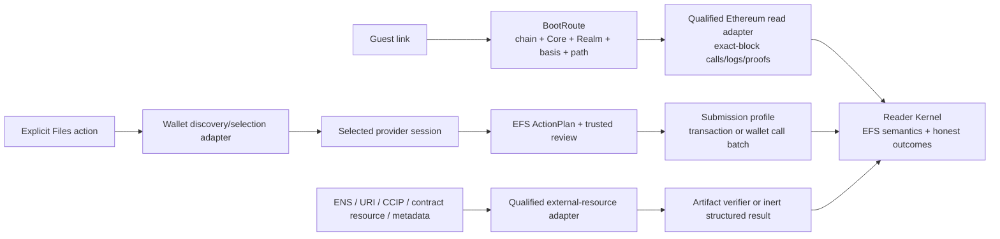

# Ethereum standards and interoperability foundation

**Status:** draft — researched client/OS/SDK direction for iteration; no EIP/ERC adapter, chain profile, signature profile, contract change, or public API is frozen
**Target repos:** planning, client, sdk, contracts
**Depends on:** [[Designs/web-client-os/README]], [[Designs/web-client-os/architecture-and-modules]], [[Designs/web-client-os/mvp-and-acceptance]], [[Designs/web-client-os/privacy-and-agents]], [[Designs/efsv2/README]]
**Evidence:** [[Reviews/2026-08-22-web-client-os-eip-erc-screen/README]]
**Reviewers:** @ethereum-standards-accounts-wallets (2026-08-22), @ethereum-standards-content-identity (2026-08-22), @ethereum-standards-apps-security-agents (2026-08-22)
**Last touched:** 2026-08-22

#status/draft #kind/design #repo/planning #repo/client #repo/sdk #repo/contracts #topic/efsv2 #topic/cypherpunk-os #topic/web-standards #topic/read-path #topic/app-model #topic/privacy #topic/agents

## Decision frame

James directed a complete EIP/ERC pass so the Web Client, modular Web OS, SDK,
and broader EFS design use current Ethereum standards deliberately. The
official corpus screen covered 1,561 source files across the now-separate EIP
and ERC repositories, representing 1,195 canonical substantive proposals at
the pinned revisions. The evidence and reproducible index are in
[[Reviews/2026-08-22-web-client-os-eip-erc-screen/README]].

The outcome is **standards-native interoperability without standards
laundering**. EFS should use strong Ethereum standards at its edges and carry
their exact evidence through the SDK and UI. It should not replace its own
semantics with a convenient Ethereum noun merely because that noun has an ERC
number.

This document separates six dispositions:

| Disposition | Meaning |
|---|---|
| **Baseline** | When the named EFS lane is used, conform to this Final standard and test the target profile. This is still not proof of universal chain/wallet support. |
| **Optional adapter** | Support external resources/contracts that use the standard without making it an EFS dependency or semantic identity. |
| **Design for** | Preserve fields, roles, failure states, and adapter seams now; implementation may be later or fixture-gated. |
| **Watch** | Emerging or incomplete work worth a pinned experiment; no public contract or correctness dependency. |
| **Negative evidence** | Preserve the requirement or hazard exposed by the proposal, but reject the proposed object as authority, safety, completeness, or EFS semantics. |
| **Out of scope** | A legitimate application standard that may belong in an App/domain adapter but does not change the generic client/OS skeleton. |

## Product laws recovered from the corpus

1. **Proposal status and product support are different axes.** Under
   [EIP-1](https://eips.ethereum.org/EIPS/eip-1), Final stabilizes the text.
   It does not prove deployment, fork activation, RPC/wallet/browser support,
   correct implementation, adoption, or safety. Draft, Review, and Last Call
   remain incomplete; Stagnant and Withdrawn remain evidence, not live
   dependencies.
2. **Chain is not Realm.** An EIP-155 chain ID, genesis/fork profile, contract
   address, Core deployment, Realm, Realm revision/code/admission basis,
   Principal policy, and actual Files path remain distinguishable. A standard
   Ethereum address or transaction reference cannot silently fill those
   fields.
3. **Locator is not identity.** ENS, `contenthash`, HTTP/IPFS, `web3://`, CCIP
   Read, a contract resource, token URI, script URI, metadata URI, or package
   registry can nominate where to read. It does not establish EFS
   File/Revision/Release identity, authority, closure, currentness,
   completeness, availability, or permission to execute.
4. **Transport is not verification.** RPCs, wallets, gateways, resolvers,
   indexers, registries, bridges, and injected providers are explicit external
   parties. Exact blocks, proofs, callbacks, signatures, committed bytes, code
   hashes, finality and EFS policy can improve claims; none turns the source
   into ambient authority.
5. **Dynamic authority is basis-qualified.** ERC-1271 validation, proxy
   implementation, account code/delegation, ENS resolution, wallet
   capabilities, controller state, bridge state, metadata, and agent
   observations can change. Historical claims preserve and verify the actual
   chain/basis/code evidence rather than asking only “is it valid now?”
6. **Discovery never performs the discovered action.** Interface detection,
   provider announcement, an agent/tool registry, package/catalog membership,
   metadata, a script pointer, an intent, or a cross-chain message may produce
   inert evidence. Install, grant, sign, send, render-active, invoke, and
   execute stay separate trusted-host transitions.
7. **Completeness requires a finite scope.** Logs, token events, table events,
   cross-chain messages, proxy traversal, metadata, and external resources do
   not prove complete enumeration merely because a standard describes them.
   EFS retains basis, range, cursor, source coverage, reorg state, and typed
   `PARTIAL/UNKNOWN`.

## Architectural placement

Ethereum interoperability is a family of versioned adapters around the Reader
and action systems, not a second Kernel and not a bag of objects exposed to
Apps.



Illustrative service boundaries—names are not frozen—are:

| Boundary | Responsibility | Forbidden shortcut |
|---|---|---|
| Ethereum execution profile | Named chain/fork/RPC feature and conformance evidence | infer support from proposal status, wallet brand, chain name, or one successful call |
| Qualified read adapter | Exact-block calls, logs, receipts, optional proofs, raw canonical results | repeated `latest`, RPC miss as absence, response as semantic verification |
| Wallet/provider adapter | User-triggered provider discovery, selection, permission, events, requests | guest probing, global “connected wallet,” provider object passed to an App |
| Signature verifier | EOA, contract, counterfactual, verifier/key, and later algorithm profiles at a basis | `ecrecover` as universal identity or present-day validation rewriting history |
| Submission adapter | Exact transaction/call-batch construction, status, monitoring, and evidence | submit/inclusion/one-popup as atomic EFS success |
| External resource adapter | Parse and resolve ENS, Web3 URL, CCIP, contract resource, token/package metadata | Locator or MIME as EFS identity, active rendering, install, or launch authority |
| Contract realization inspector | Code hash, proxy/beacon/facet/module indirection and basis | address/interface bit as immutable code or trusted behavior |

The future Protocol SDK owns canonical Ethereum encodings, low-level RPC and
contract calls, runtime validation, signature primitives, and raw evidence.
Shared Files/resolver modules interpret only EFS semantics. The Web Client owns
provider selection, trusted review, privacy disclosure, policy, presentation,
and product receipts. The OS runtime owns grants and live capability ports;
Apps receive only those ports, never an EIP-1193 provider, signer, RPC, or
registry object by default.

## Standards baseline for the direct reader and MVP write lane

### Qualified reads and citations

| Standard | Disposition | EFS use |
|---|---|---|
| [EIP-155](https://eips.ethereum.org/EIPS/eip-155) and [EIP-695](https://eips.ethereum.org/EIPS/eip-695) | **Baseline** | Carry and verify chain ID in the execution profile, signing/submission evidence, and receipts. It does not identify the Realm. |
| [EIP-1898](https://eips.ethereum.org/EIPS/eip-1898) | **Baseline** | Pin every supported dependent state call to one block hash; preserve `requireCanonical`, block-not-found, noncanonical, unsupported, and source-unavailable separately. |
| [EIP-234](https://eips.ethereum.org/EIPS/eip-234) | **Baseline** | Query logs by exact block hash where logs are needed; empty-at-this-block is not complete-range absence. |
| [EIP-1186](https://eips.ethereum.org/EIPS/eip-1186) | **Stagnant; optional proof adapter, fixture-gated** | `eth_getProof` supplies account/storage proof shapes and can take an EIP-1898 block hash. A proof becomes verified evidence only against an independently obtained, finalized/canonical header and state root under a named proof-validation profile. Preserve address, slots, raw proof nodes, expected root/header source, verification result, bounded failures, and history availability; an RPC response alone gains no authority. |
| [EIP-658](https://eips.ethereum.org/EIPS/eip-658) | **Baseline** | Preserve transaction execution status from the receipt. Status `1` still does not prove the intended EFS semantic effects or canonical read-back. |
| [ERC-7950](https://eips.ethereum.org/EIPS/eip-7950) | **Baseline for exported transaction citations** | Serialize external transaction references as chain ID plus transaction hash (`chainId:txHash:tx`) while keeping internal receipt fields structured. Add Realm/action IDs separately. |
| [EIP-1474](https://eips.ethereum.org/EIPS/eip-1474), [EIP-2696](https://eips.ethereum.org/EIPS/eip-2696), and [EIP-2700](https://eips.ethereum.org/EIPS/eip-2700) | **Design for / informational** | Use their RPC/request/event vocabulary where implemented, but the first is Stagnant and the latter two are constituent interfaces; the selected browser provider boundary is EIP-1193. |

The conceptual read evidence is:

```text
QualifiedEthereumBasis
  chain namespace + EIP-155 chainId
  genesis/fork/execution profile evidence
  blockHash + blockNumber + canonical requirement
  finality/safety observation and source
  optional proof profile + header/state-root source + raw nodes + result
  Core deployment/code evidence
  Realm + Realm revision/code/admission basis
  RPC/provider attempts, capabilities, failures, and raw canonical values
```

This object does not replace EFS `ReadContext`; it supplies the Ethereum
execution evidence inside one. A provider that cannot perform a required
exact-basis call yields `UNSUPPORTED` or `UNKNOWN` with a resumption option.
The adapter must not silently retry the semantic read at `latest`.

### Explicit wallet connection

| Standard | Disposition | EFS use |
|---|---|---|
| [EIP-1193](https://eips.ethereum.org/EIPS/eip-1193) | **Baseline** | Narrow selected-provider request/event adapter after explicit write intent. Treat the JavaScript provider and every response as adversarial. Invalidate pending plans on `chainChanged`, `accountsChanged`, disconnect, or an adapter/host-observed provider replacement; EIP-1193 defines no replacement event. |
| [EIP-6963](https://eips.ethereum.org/EIPS/eip-6963) | **Baseline** | Discover multiple injected providers only after the user invokes `Connect controller`. Keep the chosen provider instance for that session. Name, UUID, RDNS, icon, and presence are self-attested discovery metadata, not trust or feature detection. |
| [EIP-2255](https://eips.ethereum.org/EIPS/eip-2255) | **Design for** | Where supported, request and inspect wallet permissions explicitly. Wallet permission remains an external grant and never becomes Principal authority or an OS capability grant. |
| [ERC-4361 SIWE](https://eips.ethereum.org/EIPS/eip-4361), [ERC-5573 ReCaps](https://eips.ethereum.org/EIPS/eip-5573), and [ERC-8019 wallet-managed auto-login](https://eips.ethereum.org/EIPS/eip-8019) | **Optional hosted-service adapter / watch** | A relying-party service may establish a domain/URI/chain/nonce/time/resource-scoped session after explicit consent. It is not guest login, EFS Principal creation, an OS/App capability grant, or durable authority. Auto-login remains review-stage privacy and replay evidence, never default guest behavior. |
| [EIP-1102](https://eips.ethereum.org/EIPS/eip-1102) | **Negative evidence / compatibility** | `eth_requestAccounts` may be called through the selected EIP-1193 provider only after explicit user action. Reject the deprecated ambient `enable()` and single-`window.ethereum` architecture. |
| [EIP-3085](https://eips.ethereum.org/EIPS/eip-3085) and [EIP-3326](https://eips.ethereum.org/EIPS/eip-3326) | **Compatibility adapters** | Add/switch-chain requests, if used, require trusted preview of the exact target and post-event revalidation. Both are Stagnant and neither proves a chain/Realm safe or canonical. |
| [EIP-5593](https://eips.ethereum.org/EIPS/eip-5593) | **Stagnant; defense-in-depth evidence** | Prefer secure top-level contexts and no provider injection into sandboxed or third-party frames. The Web Client cannot enforce extension injection policy, and HTTPS/provider presence does not make the provider trusted. Guest boot still performs no discovery. |
| [EIP-5749](https://eips.ethereum.org/EIPS/eip-5749) | **Do not select** | Do not build the provider surface around `window.evmproviders`; use event-based EIP-6963 and retain a bounded legacy fallback only where evidence requires it. |
| [ERC-7846](https://eips.ethereum.org/EIPS/eip-7846) | **Watch** | A future wallet-connection adapter may consume this Draft only behind the same explicit selection and provider-session contract. It cannot become a new guest dependency or automatic account surface. |

Guest boot imports no wallet package, reads no provider property, dispatches no
EIP-6963 discovery event, calls no account/permission method, and derives no
default Lens/Principal from an ambient account. Provider discovery itself can
fingerprint installed wallets, so “we did not request accounts” is not enough.

Conceptual provider evidence is:

```text
ProviderSession
  chosen provider object identity for this page lifetime
  self-attested display metadata + sanitation outcome
  selected chain and account/controller
  requested/granted external wallet permissions
  feature probes and exact responses
  event generation fence + disconnect or host-observed replacement reason
```

It is live session state, never journal truth, Principal identity, or a token
that an App can serialize and replay.

Before every signature request and again before submission, the host re-reads
chain and account from the selected provider, compares them with the frozen
plan, locally recomputes the exact signing digest, and binds the request to the
current provider-session generation. A retained provider may mutate its
`request` function, silently return a different account/chain, re-announce
under a duplicate UUID, or emit no event at all. Every return and error is
runtime-validated hostile data; mismatch invalidates the plan rather than
being repaired in place.

### Typed actions, signatures, and historical verification

| Standard | Disposition | EFS use |
|---|---|---|
| [EIP-712](https://eips.ethereum.org/EIPS/eip-712) and [ERC-191](https://eips.ethereum.org/EIPS/eip-191) | **Baseline / design for** | Normal EFS wallet signing uses a versioned typed action domain. Bind chain, Realm/verifying contract, schema/action version, exact target/effects/commitments, nonce, expiry, basis/preconditions, declared Principal and actual signer. EIP-712 supplies no replay protection by itself; raw `personal_sign` is not portable EFS authority. |
| [ERC-1271](https://eips.ethereum.org/EIPS/eip-1271) | **Design for; MVP claim fixture-gated** | Verify contract-controller signatures with `isValidSignature` at the historical block/basis and record code/implementation evidence. Current validity cannot rewrite old authorization. |
| [ERC-6492](https://eips.ethereum.org/EIPS/eip-6492) | **Design for** | Preserve counterfactual/predeploy signature wrapper and factory/preparation evidence as a distinct profile. Simulation may execute setup-like calls; sandbox and qualify it rather than treating it as pure address recovery. |
| [ERC-7913](https://eips.ethereum.org/EIPS/eip-7913) | **Design for** | Allow a signer descriptor to be verifier address plus key bytes, preserving algorithm/verifier/key rather than forcing every key into an Ethereum address. Durable profiles require immutable/stateless code-pinned verifiers. |
| [EIP-7951](https://eips.ethereum.org/EIPS/eip-7951) | **Design for** | Reserve an optional P-256/WebAuthn-compatible controller profile on chains where the precompile is activated and measured. Define canonical/malleability handling; do not infer chain support from Final status. |
| [ERC-5267](https://eips.ethereum.org/EIPS/eip-5267) | **Optional adapter** | Inspect a contract's EIP-712 domain where implemented. Returned mutable fields are evidence to compare with the expected chain/contract/domain, not authoritative UI copy. |
| [ERC-2098](https://eips.ethereum.org/EIPS/eip-2098) | **Optional encoding adapter** | Accept/emit compact secp256k1 signatures only where the exact signature profile permits it; canonical internal evidence keeps scheme and original bytes explicit. |
| [ERC-7730](https://eips.ethereum.org/EIPS/eip-7730), [ERC-7739](https://eips.ethereum.org/EIPS/eip-7739), and [EIP-7749](https://eips.ethereum.org/EIPS/eip-7749) | **Draft; watch** | Clear-signing descriptors, nested smart-account typed signatures, and intended-validator signing may improve future ceremony. They remain incomplete; descriptor provenance cannot replace raw action bytes and trusted EFS semantics. |
| [ERC-6865](https://eips.ethereum.org/EIPS/eip-6865), [EIP-7896](https://eips.ethereum.org/EIPS/eip-7896), and [ERC-7754](https://eips.ethereum.org/EIPS/eip-7754) | **Draft/Stagnant/Draft; negative evidence for trusted ceremony** | Contract visualization output, an App-supplied ABI attached to `wallet_sendCalls`, or a DNS/backend-signed request may improve external-wallet display or tamper evidence. All remain untrusted presentation inputs. They cannot define the EFS action, substitute for locally generated calldata/digest/effect review, or make one deployment domain correctness authority. |
| [ERC-8111](https://eips.ethereum.org/EIPS/eip-8111) | **Review; optional encoding watch** | A bound-signature verifier may deliberately select one parity and accept the corresponding high- or low-`s` form. Never normalize silently across profiles; preserve exact bytes, parity/`s` policy, recovered signer, and malleability result. |

`SignatureEvidence` preserves scheme/profile revision, exact preimage/domain,
signature bytes, declared semantic Principal, signer descriptor, controller
authorization evidence, chain/basis, verifier code/realization, result, and
typed failure. `INVALID_AT_BASIS`, `VERIFIER_UNAVAILABLE`,
`HISTORICAL_STATE_UNAVAILABLE`, `UNSUPPORTED_SCHEME`, and `UNKNOWN` are not one
boolean.

Signing evidence is not consumption evidence. Every authority-bearing action
profile also defines:

```text
AuthorizationConsumptionProfile
  profile/version + authoritative consumer
  exact plan digest + ordered effect commitment
  signer descriptor + controller-authorization basis
  nonce namespace + nonce + expiry
  atomic consume rule or exact idempotent-effect rule
  consumed/already-consumed/conflict/unknown outcome
  carrier transaction/occurrence + canonical effect read-back
```

The portable authored `PublicationEnvelope` may intentionally be copied across
Realms: replaying its identical bytes creates no new authorship statement and
must resolve to the same exact IDs. A Realm-bound `AdmissionIntent`, spend,
grant, delegation or other action authorization is different: its named
consumer atomically consumes the nonce/digest or proves that an exact duplicate
is an idempotent no-op. A transport retry cannot produce a second effect. If
the current Core/adapter profile cannot name that consumer and prove the rule,
the write profile is `UNSUPPORTED`; EIP-712 does not fill the gap.

Verifier realizations remain separate profiles:

| Profile | Required bound |
|---|---|
| ERC-1271 | Exact-basis bounded `STATICCALL`/`eth_call`, full contract/proxy realization closure, requested digest/signature, bounded raw return or revert, historical-state availability and exact result. Present-day code cannot substitute. |
| ERC-6492 | Non-persistent, revert-only simulation against a pinned basis with bounded factory/calldata/code and resource policy. Any preparation or deployment that could persist is a separate reviewed `ActionPlan`, never hidden signature verification. |
| ERC-7913 | Exact verifier address, key bytes, algorithm/profile, immutable or code-pinned verifier realization, bounded call/result and basis. Verifier-plus-key is not forced into an account address. |
| P-256 | Raw curve verification through EIP-7951 where activated, with a named point/signature/malleability profile. This is not a WebAuthn ceremony. A WebAuthn verifier separately binds RP ID, origin, challenge, authenticator-data flags, client-data encoding, credential key and counter policy. |

### Submission and account execution

| Standard | Disposition | EFS use |
|---|---|---|
| [EIP-5792](https://eips.ethereum.org/EIPS/eip-5792) | **Preferred supported-wallet adapter** | Negotiate `wallet_getCapabilities`; use `wallet_sendCalls` where it improves the exact action. Preserve request/response version and ID, response chain ID, requested `atomicRequired`, observed `atomic`, status code `100/200/400/500/600`, ordered transaction-receipt subsets, raw capabilities, payer/sponsorship evidence, and typed unknown. Receipts are not per-call outcomes; only canonical effect read-back maps the batch to EFS effects. Explicit sequential submission remains the honest fallback. |
| [EIP-7867](https://eips.ethereum.org/EIPS/eip-7867) | **Stagnant; negative/watch evidence** | Strict/loose/none atomicity and continue/halt flow control expose useful failure distinctions but are not a supported base assumption. Unknown or downgraded flow control cannot satisfy an action that requires atomicity; the host must reject or explicitly re-plan. |
| [ERC-4337](https://eips.ethereum.org/EIPS/eip-4337) and [ERC-7562](https://eips.ethereum.org/EIPS/eip-7562) | **Design for / watch validation rules** | Support smart-account UserOperation submission as one adapter. Account sender, EntryPoint, exact validation-scope rules, bundler reputation/local policy, paymaster/payer, UserOp hash, outer transaction, inclusion, execution, EFS admission, and canonical read-back are distinct. Draft ERC-7562 bundler acceptance is infrastructure evidence, not authority. |
| [EIP-7702](https://eips.ethereum.org/EIPS/eip-7702) | **Design for; disabled by default** | Detect and disclose delegation code/profile where relevant. Authorization authority, delegated account, delegate realization, outer sender, actual EFS action signer, and payer may differ. Only a wallet-/host-owned audited profile may propose it; Apps never supply raw authorizations or delegation code. Reject `chain_id = 0` unless separately and explicitly approved, and re-check the exact delegation target/code before signing and submission. Authorization-list effects survive an outer execution revert, so delegation has its own receipt and canonical read-back. |
| [ERC-7579](https://eips.ethereum.org/EIPS/eip-7579), [ERC-6900](https://eips.ethereum.org/EIPS/eip-6900), [EIP-8130](https://eips.ethereum.org/EIPS/eip-8130), [EIP-8141](https://eips.ethereum.org/EIPS/eip-8141), and [EIP-8197](https://eips.ethereum.org/EIPS/eip-8197) | **Draft; watch** | Preserve execution-profile/version/phase/signature-algorithm seams. Do not freeze a public `WriteMechanism` enum around incomplete account/transaction proposals. |
| [ERC-7710](https://eips.ethereum.org/EIPS/eip-7710), [ERC-7715](https://eips.ethereum.org/EIPS/eip-7715), [ERC-7677](https://eips.ethereum.org/EIPS/eip-7677), [ERC-7679](https://eips.ethereum.org/EIPS/eip-7679), and [ERC-7769](https://eips.ethereum.org/EIPS/eip-7769) | **Draft except Review ERC-7677; watch** | Emerging contract delegation, execution permissions, paymaster service, UserOp builder, and bundler RPC evidence. Any future session/sponsor path needs exact target/effects, scope, budget, expiry, payer, privacy, idempotency, revocation, and independent observation. A contract delegation is not an OS capability grant. |
| [ERC-7902](https://eips.ethereum.org/EIPS/eip-7902) | **Draft; negative evidence / watch** | Its AA capabilities include an App-nominated EIP-7702 delegation target. The EFS public App SDK must not expose arbitrary raw 7702 authorization or let App data choose delegation code. Only wallet-/host-owned, audited, exact-policy flows may ever cross that boundary. |
| [ERC-2771](https://eips.ethereum.org/EIPS/eip-2771) | **Negative evidence for generic attribution** | A trusted-forwarder adapter may preserve forwarder plus extracted signer for a named contract profile. It cannot redefine generic Core authorship or make `msg.sender` equal the semantic Principal. |
| [EIP-3074](https://eips.ethereum.org/EIPS/eip-3074), [EIP-2711](https://eips.ethereum.org/EIPS/eip-2711), and [EIP-2938](https://eips.ethereum.org/EIPS/eip-2938) | **Reject** | Withdrawn/superseded execution paths are historical threat and migration evidence only. |

Every `ActionPlan`, `SignatureEvidence`, submission attempt and `ActionReceipt`
uses one role schema. Optional fields stay absent rather than being collapsed:

```text
ActionAuthorityRoles
  semantic Principal + requested author/effect owner
  controller-authorization evidence
  signer descriptor + signature result
  account sender / smart-account sender
  7702 authorization authority + delegated account + delegate realization
  outer transaction sender
  submitter / bundler / relayer
  paymaster / payer / sponsor
  requesting App or AgentSession
  EFS admission/effect consumer + canonical read-back
```

The mutable `defaultAccount` is only a routing/UX preference. The actual signer
may be an EOA account, contract-account verifier, verifier-plus-key descriptor,
P-256 key profile, or later explicitly supported scheme; the signer descriptor
and any involved account remain separate fields.

Transaction evidence preserves typed envelope, chain, sender, nonce, fees,
access list where present, calldata/value, account-execution profile,
authorization list, caller/submitter/relayer/bundler/payer, transaction or
UserOperation identifiers, receipt/status, finality, separately computed
effect ladder, and canonical EFS read-back. [EIP-2718](https://eips.ethereum.org/EIPS/eip-2718),
[EIP-2930](https://eips.ethereum.org/EIPS/eip-2930), and
[EIP-1559](https://eips.ethereum.org/EIPS/eip-1559) are the baseline typed
transaction vocabulary. Fee estimate, simulation, wallet acceptance,
submission, inclusion, receipt success, Realm admission, and Files success
remain separate states.

Wallet permissions, hosted sessions, delegated execution permissions and OS
authority are non-convertible evidence types:

| Evidence | May establish | Must never become implicitly |
|---|---|---|
| EIP-2255 wallet permission | What one wallet/provider currently reports it permits for one origin/session | Principal controller authority, EFS App grant, signer mandate |
| SIWE/ReCap session evidence | What one relying-party service authenticated and accepted for exact origin/resources/nonce/time | guest identity, public EFS authorship, OS capability or `AgentSession` |
| ERC-7715-style returned permission | What the selected wallet offers after its own attenuation/dependency decisions | the request as sent, an OS grant, or authority before fresh trusted preview |
| OS grant/mandate | Exact locally approved capability or ActionPlan policy | wallet/service permission, portable Principal authority, or package request |

A returned ERC-7715 permission that differs from the request, introduces a
factory/deployment dependency, or is not understood triggers a new trusted
preview and, for persistent effects, a new `ActionPlan`. No field is copied
between these evidence families merely because its label says “permission.”

## Guest resource, name, metadata, and contract adapters

### Names and URI-shaped resources

| Standard family | Disposition | EFS treatment |
|---|---|---|
| [ERC-137 ENS](https://eips.ethereum.org/EIPS/eip-137), [ERC-181 reverse resolution](https://eips.ethereum.org/EIPS/eip-181), [ERC-1577 `contenthash`](https://eips.ethereum.org/EIPS/eip-1577), and [ERC-634 text records](https://eips.ethereum.org/EIPS/eip-634) | **Optional adapters** | ENS is a mutable human-friendly binding and display layer. Preserve name/namehash, registry/resolver, resolved record, chain/Realm/basis and direction. Reverse names and text are self-claims; empty text cannot provide typed absence. `contenthash` is a transport locator, not EFS Release/File authority. |
| [ERC-4804 Web3 URLs](https://eips.ethereum.org/EIPS/eip-4804) | **Optional adapter** | Parse a Final `web3://` URL into an inert chain/address/call resource request and preserve the raw URL. Do not infer EFS serialization, Realm, basis, file bytes, MIME safety, or execution authority. |
| [ERC-6860](https://eips.ethereum.org/EIPS/eip-6860), [ERC-6821](https://eips.ethereum.org/EIPS/eip-6821), [ERC-6944](https://eips.ethereum.org/EIPS/eip-6944), [ERC-7087](https://eips.ethereum.org/EIPS/eip-7087), [ERC-7617](https://eips.ethereum.org/EIPS/eip-7617), [ERC-7618](https://eips.ethereum.org/EIPS/eip-7618), and [ERC-7774](https://eips.ethereum.org/EIPS/eip-7774) | **Watch / negative evidence** | Track revised grammar, ENS target selection, resolve mode, MIME, chunks, encoding, and invalidation. Reject silent chain changes, active contract-selected MIME, recursive/unbounded chunks, decompression bombs, or cache-event currentness as EFS truth. |
| [ERC-3668 CCIP Read](https://eips.ethereum.org/EIPS/eip-3668) | **Optional adapter** | Treat the gateway as untrusted transport and the callback contract at a pinned basis as verifier. Preserve URL disclosure, request/response, callback, failure, privacy, and fallback. Transaction-time CCIP is separately denied or reviewed. |
| [ERC-5219 Contract Resource Requests](https://eips.ethereum.org/EIPS/eip-5219) | **Optional adapter** | Parse an HTTP-like contract response as inert data. External-body URLs, headers, redirects, and media type are transport/presentation hints; executable or passive bytes still need the applicable closure/digest verifier and host policy. |
| [ERC-681](https://eips.ethereum.org/EIPS/eip-681), [ERC-1328](https://eips.ethereum.org/EIPS/eip-1328), [ERC-831](https://eips.ethereum.org/EIPS/eip-831), [ERC-1710](https://eips.ethereum.org/EIPS/eip-1710), and [ERC-5094](https://eips.ethereum.org/EIPS/eip-5094) | **Optional compatibility / informational** | Transaction, WalletConnect, old Ethereum URI, Web3-browser, and network-switch links are external intent inputs. Display and validate exact effects; never auto-connect, auto-switch, auto-sign, or auto-send. |

External-resource resolution returns `QualifiedExternalResource` with original
text/bytes, parser/profile revision, chain/contract/resolver/callback, pinned
basis, transport attempts, media/encoding hints, expected and observed
integrity, provenance/authority claims, privacy effect, result grade, and raw
fallback. It never returns an executable module handle.

EFS permanent Files names remain rich Unicode normalized to NFC. URI standards
in this section constrain only reversible external serialization/adapters;
ERC-1155 `{id}` substitution, Web3 URL auto typing, ENS text keys, or ASCII
address syntax cannot redefine Files names.

### Token and contract metadata

| Standard family | Disposition | EFS treatment |
|---|---|---|
| [ERC-20](https://eips.ethereum.org/EIPS/eip-20), [ERC-721](https://eips.ethereum.org/EIPS/eip-721), and [ERC-1155](https://eips.ethereum.org/EIPS/eip-1155) | **Optional domain adapters** | Data Explorer/Apps may inspect exact token state and metadata according to the standard. URI/event data is not token existence, EFS identity, byte integrity, permanence, complete inventory, or authority to load active content. |
| [ERC-1046](https://eips.ethereum.org/EIPS/eip-1046), [ERC-4906](https://eips.ethereum.org/EIPS/eip-4906), [ERC-7572](https://eips.ethereum.org/EIPS/eip-7572), and [ERC-8049](https://eips.ethereum.org/EIPS/eip-8049) | **Optional adapter / watch** | Import contract/token metadata and update events as source-qualified presentation evidence. Events are reorg-aware invalidation hints, not durable old values or completeness. Draft contract metadata never registers client code or trusted UI. |
| [ERC-2477](https://eips.ethereum.org/EIPS/eip-2477), [ERC-5625](https://eips.ethereum.org/EIPS/eip-5625), and [ERC-7053](https://eips.ethereum.org/EIPS/eip-7053) | **Informational / negative evidence** | A metadata digest is useful only when verified against fetched bytes. Storage/provider descriptions and media commits are claims, not measured durability, custody, provenance, or content validation. |
| [ERC-165](https://eips.ethereum.org/EIPS/eip-165) | **Baseline optional-contract detection** | Detect a claimed selector interface before using an adapter. The result proves no behavior, safety, authority, immutable implementation, or completeness. |
| [ERC-1820](https://eips.ethereum.org/EIPS/eip-1820) and [ERC-820](https://eips.ethereum.org/EIPS/eip-820) | **External compatibility only** | Registry-based implementer discovery remains mutable and manager-mediated. It cannot be a direct-read dependency or global EFS component registry. |

### Contract realization and upgrade evidence

[ERC-1167](https://eips.ethereum.org/EIPS/eip-1167),
[ERC-1967](https://eips.ethereum.org/EIPS/eip-1967),
[ERC-2535](https://eips.ethereum.org/EIPS/eip-2535),
[ERC-3448](https://eips.ethereum.org/EIPS/eip-3448), and
[ERC-7201](https://eips.ethereum.org/EIPS/eip-7201) are **design-for** evidence
for external contract inspection. A contract address may dispatch through a
minimal proxy, implementation slot, beacon, facet set, appended metadata, or
namespaced storage. The inspector preserves exact address, chain/basis,
runtime code hash, detected realization type, implementation/beacon/facet/module
closure, admin/upgrade evidence, cycles/depth/budget, and `UNKNOWN` fields.

Stagnant [ERC-1822](https://eips.ethereum.org/EIPS/eip-1822) remains a detected
legacy pattern, not present authority. Review-stage
[ERC-8152 CALM](https://eips.ethereum.org/EIPS/eip-8152) reinforces that
content-addressed logic and an authored storage-impact manifest still do not
prove behavior or safe composition. A mutable proxy address can be a stable
Project/contract reference; it is never an immutable EFS Release realization
without an exact implementation/closure and policy basis.

## Files, Type/Data ABI, packages, and Data Explorer pressure

| Standard | Disposition | Boundary finding |
|---|---|---|
| [ERC-5018 filesystem-like contracts](https://eips.ethereum.org/EIPS/eip-5018) | **Negative evidence** | Useful external adapter fixture only. Mutable names/chunks and contract-local enumeration do not satisfy EFS stable objects, immutable revisions, arbitrated Bindings, full qualified enumeration, plural Locators, verified bytes, Unicode policy, or cross-platform projection. |
| [ERC-1900 dType](https://eips.ethereum.org/EIPS/eip-1900) plus [ERC-2157](https://eips.ethereum.org/EIPS/eip-2157) and [ERC-2193](https://eips.ethereum.org/EIPS/eip-2193) | **Historical information** | Registry-backed on-chain type/storage/alias precedent. Do not import its governance, Solidity-library, global-registry, or behavior assumptions into the proposal-stage EFS layered Type/Data ABI. |
| [ERC-7813 Store](https://eips.ethereum.org/EIPS/eip-7813) | **Watch as Data Explorer adapter** | Table schemas and events could support a generic external-data View. “Last Call” is still incomplete. On-chain/off-chain tables need exact block basis, schema version, event range/coverage, reorg handling, raw fallback, and honest `PARTIAL/UNKNOWN`; an indexer replica is not authority. |
| [ERC-8100 representable state](https://eips.ethereum.org/EIPS/eip-8100) | **Draft; watch as inert presentation adapter** | Evaluate bounded bindings at one exact block into safely parsed inert XML/data. Contract-authored “XML complete” is a claim about its chosen representation, not EFS View completeness, byte-canonical identity, or permission to render active content. |
| [ERC-1319 package registry](https://eips.ethereum.org/EIPS/eip-1319) and [ERC-2942 EthPM URI](https://eips.ethereum.org/EIPS/eip-2942) | **Historical design evidence** | Retain exact release/manifest references, explicit versions, escaped components, and no guessing of omitted ambiguity. Do not inherit a canonical registry, mutable release authority, or its package identity. |
| [ERC-6224 dependency registry](https://eips.ethereum.org/EIPS/eip-6224), [ERC-7738 permissionless script registry](https://eips.ethereum.org/EIPS/eip-7738), and [ERC-5247 executable proposals](https://eips.ethereum.org/EIPS/eip-5247) | **Negative evidence / watch** | Registry entries, dependencies, executable targets, values, and calldata remain inert. They cannot install, grant, activate, or enter trusted client chrome. |
| [ERC-5169 client scripts](https://eips.ethereum.org/EIPS/eip-5169) | **Negative evidence** | Even Final client-script pointers require immutable/hash/authenticity validation and leave dependencies/runtime authority unresolved. EFS requires exact verified bootstrap and eager execution closure, host-selected runner, explicit grants/start, and teardown. |

No item above justifies a Files/Core shortcut or a hosted private index. Data
Explorer should consume these standards through bounded external-data adapters
over the same Reader/qualified-result law, while raw contract/RPC evidence
remains reachable when the adapter is absent or fails.

## Privacy, cross-chain, and agents

### Privacy-oriented standards

[ERC-5564](https://eips.ethereum.org/EIPS/eip-5564) and
[ERC-6538](https://eips.ethereum.org/EIPS/eip-6538) are **design-for** evidence
for optional stealth-payment identities. They do not create a private EFS
Principal, anonymous App session, or automatic scan. Preserve scheme,
meta-address source/basis, announcement range/coverage, one-time address,
funding/privacy disclosure, and typed scan failure. A stealth payment address,
public author Principal, wallet account, agent identity, and private local
persona remain separate.

[ERC-5630](https://eips.ethereum.org/EIPS/eip-5630) (Draft),
[ERC-7945](https://eips.ethereum.org/EIPS/eip-7945) (Review),
[ERC-7984](https://eips.ethereum.org/EIPS/eip-7984) (Draft), and
[ERC-8086](https://eips.ethereum.org/EIPS/eip-8086) (Draft) are
**informational** confidential-token or encryption work. Final
[ERC-7857](https://eips.ethereum.org/EIPS/eip-7857) is also only
**informational** private-agent-metadata evidence for EFS: Final stabilizes its
text but does not establish EFS privacy, key management, authorization, chain
support, or safe implementation. An encrypted pointer or “private” token label
supplies no network privacy, plaintext integrity, status freshness, or EFS
authorization by itself.

### Cross-chain identity and messages

| Standard family | Disposition | EFS treatment |
|---|---|---|
| [ERC-7930 interoperable addresses](https://eips.ethereum.org/EIPS/eip-7930) (Review), [ERC-7828 interoperable names](https://eips.ethereum.org/EIPS/eip-7828) (Review), and [ERC-7950 transaction citations](https://eips.ethereum.org/EIPS/eip-7950) (Final) | **Watch 7930/7828; use 7950 for transaction export** | Preserve chain-qualified address/name/transaction references. None identifies an EFS Realm or proves an ENS/CAIP label mapping current. Human-friendly forms always reveal their resolved exact target before authority-bearing use. |
| [ERC-7683 cross-chain intents](https://eips.ethereum.org/EIPS/eip-7683) | **Draft; watch** | Treat intent/order/resolver data as reviewable inert input. Solver, asset, source/destination, settlement/finality, timing and privacy remain explicit; no auto-submit. |
| [ERC-5164](https://eips.ethereum.org/EIPS/eip-5164) (Last Call), [ERC-6170](https://eips.ethereum.org/EIPS/eip-6170) (Draft), [ERC-7786](https://eips.ethereum.org/EIPS/eip-7786) (Final), and [ERC-7841](https://eips.ethereum.org/EIPS/eip-7841) (Draft) | **Design for evidence, not bridge trust** | Preserve source/destination chain, gateway/bridge profile, sender authentication, message/payload digest, delivery/finality/currentness, and failure. “Delivered” is not authorized, final, or semantically successful. |

ERC-7828 and ERC-7930 depend on CAIP work outside the EIP/ERC corpus. EFS needs
a separate pinned CAIP/chain-identity pass before freezing public chain/Realm
serialization. Friendly labels such as `sepolia` remain replaceable route-table
inputs, never the whole correctness identity.

### Agent interoperability

| Standard | Disposition | EFS treatment |
|---|---|---|
| [ERC-8001 agent coordination](https://eips.ethereum.org/EIPS/eip-8001) | **Final; optional external coordination adapter** | Exact typed intent, participant acceptance, nonce, domain/chain, expiry, and execution observation are useful. It supplies no agent identity, general reputation, runtime grant, privacy, or threshold policy. |
| [ERC-8004 trustless agents](https://eips.ethereum.org/EIPS/eip-8004) | **Draft; watch** | Import registry/reputation/validation facts as source-qualified discovery evidence. The draft itself does not prove an advertised capability works or is benign and does not solve Sybil trust. |
| [ERC-8126 agent verification](https://eips.ethereum.org/EIPS/eip-8126) | **Final; optional observation adapter** | A verification is provider, method, subject realization, task scope, time/basis, evidence, result, limitation, and expiry—not a universal score or future-safety claim. Its dependency on Draft ERC-8004 keeps it non-foundational. |
| [ERC-8257 agent tool registry](https://eips.ethereum.org/EIPS/eip-8257) and [ERC-8273 attestation-gated actions](https://eips.ethereum.org/EIPS/eip-8273) | **Draft; watch / threat evidence** | Manifest hash can verify fetched bytes but URI/predicate/listing cannot authorize invocation. Future action grants bind exact target/selector/args/value/nonce/expiry and guard reentrancy; broad capability-only authorization is rejected. |
| [ERC-8196 agent-authenticated wallet](https://eips.ethereum.org/EIPS/eip-8196) (Final), [ERC-8183 agentic commerce](https://eips.ethereum.org/EIPS/eip-8183) (Draft), and agent NFT/registry/mandate variants | **Informational / App adapter** | Preserve policy/evaluator/payment/controller provenance if an App consumes them. They do not replace the OS AgentSession, EFS ActionPlan/Receipt, signer broker, mandate, capability port, or trusted ceremony. |
| [ERC-8199 sandboxed smart wallet](https://eips.ethereum.org/EIPS/eip-8199) | **Draft; external-account adapter / negative security evidence** | A detached smart-wallet account may reduce asset blast radius for one agent workflow. It is not a browser/App sandbox, an OS capability boundary, an `AgentSession`, protection from malicious delegate/checker code, or proof of privacy and safe autonomy. |

The standard-corpus result strengthens the existing first-class agent model:
external agent identity, reputation, validation, tool discovery, commerce, and
wallet policy are plural evidence inputs. An `AgentSession` remains an
OS-local, explicitly authorized live relationship. No on-chain listing or
score installs an App, opens a provider, attaches private state, grants a
capability, or becomes a semantic Principal automatically.

## History, data availability, and cache consequences

| Standard | Disposition | Consequence |
|---|---|---|
| [EIP-4444](https://eips.ethereum.org/EIPS/eip-4444) and [EIP-7642](https://eips.ethereum.org/EIPS/eip-7642) | **Architectural information** | Execution clients may not serve old bodies/receipts. EFS needs plural history sources, explicit availability, import/export, and resumption; an unavailable source cannot prove absence. |
| [EIP-4844](https://eips.ethereum.org/EIPS/eip-4844) and [ERC-7588](https://eips.ethereum.org/EIPS/eip-7588) | **Negative evidence for durable storage** | Blob transactions/metadata can inform temporary DA adapters. Blob retention is not EFS custody or a release closure. |
| [EIP-2935](https://eips.ethereum.org/EIPS/eip-2935) and [EIP-4788](https://eips.ethereum.org/EIPS/eip-4788) | **Watch / recent-proof inputs** | Bounded recent block/beacon-root buffers can help specific proof profiles; they are not archives or globally durable provenance. |
| [EIP-7745](https://eips.ethereum.org/EIPS/eip-7745) and [EIP-8304](https://eips.ethereum.org/EIPS/eip-8304) | **Draft; high-priority watch** | Trustless log/transaction indexes could materially improve direct verification and reduce trusted-index dependence. Until activated and proven, Reader completeness stays on existing bounded source/coverage evidence. |
| [EIP-7910](https://eips.ethereum.org/EIPS/eip-7910) | **Informational adapter** | `eth_config` can expose current/next fork configuration from a node. It is useful support evidence and mismatch detection, not an independent chain identity/finality oracle. |
| [EIP-8072](https://eips.ethereum.org/EIPS/eip-8072) and [EIP-8123](https://eips.ethereum.org/EIPS/eip-8123) | **Draft; watch** | Transaction-inclusion subscriptions and gas-cap discovery may improve monitoring/planning. Polling fallback and typed unknown/timeout remain; node policy/capability is not semantic success. |

Browser Cache API, IndexedDB, OPFS, and Service Worker state are unrelated to
Ethereum history guarantees. Cache keys include exact EFS identity, chain,
Realm, basis/policy, verifier profile, and byte commitment as applicable.
Mutable RPC/ENS/metadata/agent/bridge results require freshness and provenance;
immutable verified bytes may deduplicate without laundering publisher Release
identity or authority.

## MVP acceptance additions

These extend [[mvp-and-acceptance]]; they do not expand the MVP into every
optional adapter.

- [ ] A clean guest navigation imports no wallet code, reads no EIP-1193
      provider property, dispatches no EIP-6963 request event, requests no
      account/permission, and observes no installed-wallet list.
- [ ] `Connect controller` explicitly starts EIP-6963 discovery. Two provider
      announcements are presented without trusting UUID/RDNS/name/icon;
      malicious SVG/data-URI metadata cannot execute or alter trusted chrome.
- [ ] The selected EIP-1193 provider's `accountsChanged`, `chainChanged`, and
      disconnect events plus a host-observed replacement fence every
      unapproved plan. Before sign and submit, chain/account/session generation
      are re-read. Throwing getters, mutated `request`, duplicate EIP-6963 UUID,
      re-announcement, malformed response, and silent account/chain mismatch
      all fail closed without assuming a provider event exists.
- [ ] A multi-call guest read uses one EIP-1898 block hash and exact EIP-234 log
      basis where applicable. An RPC lacking the exact-basis method returns
      `UNSUPPORTED/UNKNOWN`; it never retries at `latest` to produce a clean UI.
- [ ] An optional EIP-1186 fixture validates raw account/storage proof nodes
      against a separately obtained pinned header/state root. Corrupt proof,
      wrong header, reorged basis, unavailable history, and unsupported
      validation profile remain distinct and never become a verified read.
- [ ] The EIP-712 review payload binds chain, Realm/verifying contract, exact
      action/effects/commitments, basis/preconditions, nonce, expiry,
      Principal, and signer descriptor. Replaying it across action, Realm, chain,
      contract, resource, or generation fails.
- [ ] Re-submitting the exact still-valid signed plan, racing two identical
      submissions, or drifting preview/calldata exercises its named
      `AuthorizationConsumptionProfile`. A portable identical authored packet
      remains idempotently copyable; a Realm-bound effect consumes once or is
      an exact no-op, and the receipt proves which occurred.
- [ ] EIP-5792 capability absence takes an explicit sequential fallback. The
      fixture retains request/response version and ID, response chain ID,
      requested and observed atomicity, raw capabilities, status
      `100/200/400/500/600`, and ordered transaction-receipt subsets. It covers
      `atomicRequired=true` with observed non-atomic output, partial `600`, lost
      status, and accepted batches whose expected EFS effect is absent. Only
      canonical effect read-back maps receipts to effects.
- [ ] A transaction receipt exposes structured chain ID plus hash and exports a
      conforming ERC-7950 citation. Transaction execution status and EFS
      semantic success remain different fields.
- [ ] Historical verifier fixtures cover bounded exact-basis ERC-1271 across
      code/controller rotation; non-persistent ERC-6492 with a side-effecting
      factory attempt; ERC-7913 verifier-plus-key; raw P-256; and a distinct
      WebAuthn profile. Unavailable history, huge/reverting returns, wrong code,
      valid-P-256/wrong-WebAuthn-origin and disallowed high-`s` return named
      `INVALID`, `UNSUPPORTED`, or `UNKNOWN`; present-day validation never
      substitutes.
- [ ] An EIP-7702 fixture is disabled by default, rejects unapproved universal
      `chain_id = 0` and foreign/changed delegate realization, and proves that a
      reverting outer transaction can still change delegation. Delegation gets
      its own receipt/read-back and Apps cannot provide raw authorization.
- [ ] Wallet permission, SIWE/ReCap session evidence, ERC-7715-style returned
      permission and OS grant/mandate remain non-convertible. Fixtures cover
      nonce/origin/resource/statement reuse or mismatch, attenuation, unknown
      rules and dependency-factory effects; none creates an `AgentSession` or
      OS capability.
- [ ] EIP-3085/3326 cancellation, hostile RPC metadata, a success response with
      wrong re-read chain and stale-plan submission never select a Realm/Core
      deployment or preserve the old plan.
- [ ] One role fixture makes semantic Principal, controller authorization,
      signer descriptor, smart-account sender, 7702 authority/delegate, outer
      sender, bundler/relayer, paymaster/payer and requesting App all differ;
      the ActionPlan/receipt preserves every role and the final EFS read-back.
- [ ] Optional ENS/contenthash, Web3 URL, CCIP Read, and contract-resource
      fixtures all preserve transport/authority/integrity distinctions. A
      corrupt or unavailable primary may fall back only to bytes satisfying
      the same expected commitment; MIME/URI never activates code.
- [ ] A proxy fixture reports proxy address, exact-basis runtime code hash and
      implementation/facet realization separately. Unsupported/cyclic/deep
      indirection yields bounded `UNKNOWN`, not a false immutable-code badge.
- [ ] Removing old-history service yields a typed unavailable/partial result
      with source/range/resumption evidence, never an empty complete directory
      or absent Record.
- [ ] An ERC-8004/8126/8257-style agent listing can be inspected as inert
      evidence but cannot install, launch, acquire a wallet/provider, or invoke
      an EFS action without the normal PackageHandoff, runner, grant, and
      AgentSession laws.

## SDK and EFS v2 pressure packet

No new generic Core primitive is requested. The current proposal can express
the EFS semantics if the SDK/client boundary preserves the following generic
evidence rather than hiding it behind `boolean`, `latest`, or “connected
wallet” helpers:

| Need | Lowest owner | Required preservation |
|---|---|---|
| Exact Ethereum read basis | Protocol SDK + Reader | chain/execution profile, block hash/number/canonical/finality, RPC attempts, raw result/proof, unsupported/unavailable causes |
| Principal/controller verification | Core/Principal model + SDK | semantic Principal, signer descriptor, authorization history, signature scheme/preimage/bytes, verifier code and exact basis |
| Authorization consumption/idempotence | Core or named action consumer + SDK | plan/effect digest, nonce namespace, consumer, consume/no-op/conflict state, expiry, transaction/occurrence and canonical read-back |
| Action/submission separation | SDK + Client System Chrome | typed effects/preconditions, full `ActionAuthorityRoles`, account/delegation execution profile, transaction/UserOp/batch IDs, receipt subsets/status, independently computed effect ladder and read-back |
| External resource | SDK adapter + Artifact Reader | original locator/request, resolver/callback, basis, network/privacy effect, expected/observed integrity, transport attempts, inert media/metadata |
| Contract realization | SDK/Data Explorer adapter | exact address/chain/basis/code hash, proxy/beacon/facet/module closure, admin/change evidence, bounded unknown |
| Event/table completeness | Reader + domain adapter | exact block/range, schema/profile, cursor, source coverage, reorg state, finite completion claim, resumption |

The current generic interfaces fail this pressure only if they require one of
the following:

- reads can name only `latest`, block number, or friendly chain name;
- a cache/index/RPC miss becomes absence or complete empty output;
- `PrincipalId`, current/default account, controller authorization, signer
  descriptor, account/smart-account sender, 7702 authority/delegate, outer
  sender, bundler/relayer, paymaster/payer and requesting App collapse;
- signature verification is only current-state `ecrecover`/boolean;
- a signed action has no named atomic consumption or exact-idempotence authority;
- a URI/CID/contract address/interface bit becomes EFS semantic identity;
- an external metadata/script/agent/package registry can self-register active
  UI, install, capabilities, or execution;
- app code receives an EIP-1193 provider, wallet, RPC, signer, or cross-chain
  gateway as ambient authority; or
- supporting an external standard requires an EFS-specific Core noun, hosted
  database, Commons, or private index.

If the Type/Data ABI exposes EIP/ERC-backed external data, keep the standard's
raw canonical bytes plus generated profile validator behind the same versioned
adapter described in [[type-data-abi-boundary-pressure]]. ERC-1900/7813/8100
do not choose EFS `SemanticSpec`, `Shape`, `Representation`, `View`, or
`QueryProfile` bytes.

## Research and coordination queue

1. **SDK conformance fixture:** define generated/raw interfaces for EIP-1898,
   EIP-234/1186, EIP-1193/6963, EIP-712 plus authorization consumption,
   EIP-5792, ERC-1271, and ERC-7950 that retain raw canonical evidence and
   exhaustive failures without importing Web UI.
2. **Chain profile fixture:** test Sepolia plus one materially different EVM
   chain for exact-block calls, logs, receipts, `eth_config`, P-256 activation,
   archive availability, and wallet capabilities. Named support evidence is
   required; no hard-coded EFS domain or universal “EVM compatible” badge.
3. **Historical signer fixture:** EOA; bounded ERC-1271 across controller/code
   rotation; non-persistent ERC-6492 with hostile factory; ERC-7913 immutable
   verifier/key; raw P-256 where active; and a separate WebAuthn RP/origin /
   challenge profile. Establish archival/finality, returndata, malleability and
   simulation bounds plus exact unsupported outcomes.
4. **Data Explorer adapters:** pressure ERC-7813 tables, ERC-8100
   representations, ERC-5018 files, token metadata, ENS, and proxy realization
   through qualified raw fallback. Data Explorer owns presentation; the SDK
   owns reusable canonical adapters.
5. **External resource fixture:** ENS/contenthash, Web3 URL, ERC-5219 and
   ERC-3668 with corrupt fallback, unavailable verifier state, malicious MIME,
   redirect/privacy disclosure, and no active rendering.
6. **Wallet authority fixture:** exercise exact-payload/concurrent replay,
   EIP-5792 atomic/non-atomic/lost/partial outcomes, EIP-7702 outer-revert
   persistence and changed delegate, EIP-2255/SIWE/ReCaps/ERC-7715
   non-conversion, and all-distinct action roles.
7. **Agent evidence fixture:** import ERC-8001/8004/8126/8257/8199 shapes into an
   inert observation set and prove they cannot cross install/grant/launch/action
   boundaries.
8. **Adjacent standards passes:** pin current CAIP, ENSIP, WalletConnect,
   Ethereum JSON-RPC/reference APIs outside the EIP corpus, W3C/IETF URI/IRI,
   and browser-wallet specifications before freezing chain/Realm/link/provider
   public formats.
9. **Status refresh:** compare the pinned corpus before any implementation or
   API freeze. Normative changes, replacements, chain activation, and shipped
   support update evidence, never history.

These are mechanism and conformance questions, not mature owner choices. No
James decision is requested by this pass.

## Rejected shortcuts

- “Final ERC” as security, ecosystem support, or EFS adoption.
- Chain ID, friendly chain label, contract address, ENS name, wallet account,
  or transaction hash as the whole Realm/resource/Principal identity.
- Repeated `latest` calls as a coherent read snapshot.
- RPC, gateway, bridge, cache, event stream, or indexer miss as absence.
- SIWE as guest login, EFS Principal creation, or required static-SPA session.
- Wallet discovery during guest boot or `window.ethereum` as the account model.
- `personal_sign`, current `ecrecover`, or current ERC-1271 result as universal
  durable authority.
- An EIP-712 signature as replay protection without a named consumer or exact
  idempotent effect.
- One wallet popup, included transaction, successful receipt, or delivered
  cross-chain message as EFS semantic success.
- Blob data as durable EFS custody.
- ENS/contenthash/Web3 URL/token URI/contract resource/script URI as immutable
  EFS Release identity or executable closure.
- ERC-165/1820, contract metadata, proxy storage, package/agent/tool registry,
  or catalog membership as trust, install, grant, or activation.
- Contract-selected MIME or XML/HTML/JSON metadata as safe active UI.
- ERC-5018 or ERC-1900 as a shortcut around Files or the Type/Data ABI review.
- On-chain agent identity/reputation/verification as an OS `AgentSession` or
  mandate.
- A bridge/message standard as bridge trust, finality, sender authority, or
  successful destination effects.

## Promotion falsifiers

Do not promote this standards map until:

- the corpus index, pinned revisions, proposal counts, statuses, and canonical
  URLs reproduce;
- an independent review finds no relevant high-impact proposal omitted or
  mislabeled as current/final;
- every Baseline row has a named future conformance fixture and explicit
  unsupported behavior;
- Draft/Review/Last Call/Stagnant/Withdrawn evidence is labeled at each use;
- the SDK boundary preserves raw canonical inputs and qualified failures;
- guest boot proves zero wallet discovery/provider access;
- exact-block, provider-event invalidation, typed-signing replay, partial batch,
  historical signature, resource corruption, proxy indirection, and agent
  discovery fixtures above have owners in an authorized implementation plan;
- no EIP/ERC is presented as EFS protocol authority merely because the client
  interoperates with it; and
- no `<!-- AGENT-Q: -->` markers remain.
