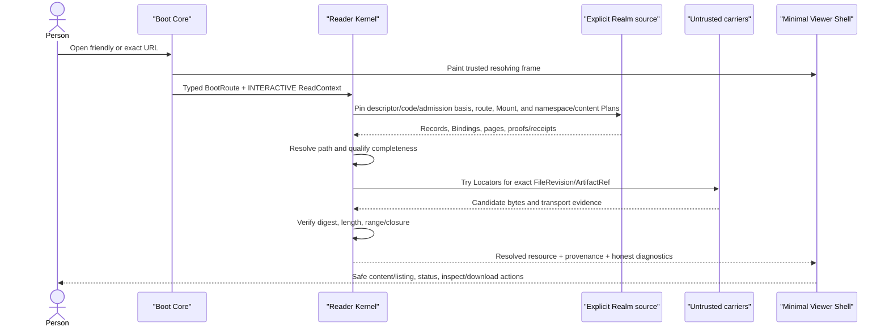

# Web Client MVP architecture, journeys, and acceptance

**Status:** draft — smallest official Web Client product slice for iteration; no implementation or protocol/profile freeze is authorized
**Target repos:** planning, client, sdk
**Depends on:** [[Designs/web-client-os/README]], [[Designs/web-client-os/architecture-and-modules]], [[Designs/web-client-os/technology-foundation]], [[Designs/web-client-os/system-profiles-and-generations]], [[Designs/efsv2/hierarchical-files-and-folders]], [[Designs/efsv2/core-architecture-candidate]]
**Reviewers:** @current-v2-read-path (2026-08-14), @historical-client-architecture (2026-08-14), @web-platform-standards (2026-08-14)
**Last touched:** 2026-08-15

#status/draft #kind/design #repo/planning #repo/client #repo/sdk #topic/efsv2 #topic/read-path #topic/files #topic/actions #topic/performance

## Outcome

The MVP is an official, static, self-hostable File Browser with two deliberately
different entry paths:

1. a very fast unauthenticated read path for public file and folder links; and
2. an explicit promotion into a basic write-capable File Browser for creating
   folders, creating files from local bytes, and publishing a new immutable
   revision of a controlled file.

The write path is not a separate engineering console. Low-level diagnostics
may be exposed in an inspector, but ordinary File Browser controls must drive
the same typed plans. A disposable empty-directory fixture may land first to
debug contracts; it is evidence toward the MVP, not a substitute for it.

The first adapter will necessarily track proposal-stage Core and Files
mechanisms. Its receipts must state exactly which conformance guarantees were
proved. The product must not present a direct-Core experiment as a
Files-certified write or conceal missing semantics behind a hosted service.

## Scope floor

### Required guest behavior

- Open an HTTPS or Web3-friendly deep link to a nested folder or file with an
  explicit chain namespace/reference, Core address/deployment/profile, and
  Realm without touching a wallet provider.
- Parse chain namespace/reference, Core address/deployment/profile, Realm
  descriptor and revision/code/admission basis, route config, root Mount,
  mount-local `namespacePlan`, `contentPlan`, optional `metadataPlan`, actual
  Files path, and optional exact resource/basis hints into separate fields.
  General reader policy and the Files Plans must not be flattened into one
  ambient “Lens.”
- Resolve a stable Directory or File, list a directory completely at one basis
  or say exactly why completeness cannot be established, and preserve
  `UNKNOWN` separately from absence.
- Resolve the exact immutable FileRevision selected at the pinned basis.
- Retrieve exact bytes through untrusted Locators, reject corruption, continue
  to eligible fallbacks, and keep semantic File/FileRevision identity fixed.
- Render trusted text and supported passive media safely; offer inert source,
  download, or raw inspection for active/unknown formats.
- Show friendly status first and make exact Realm, Principal set, route,
  Mount, namespace/content/metadata Plan, basis, completeness, provenance,
  digest, Locator attempts, and diagnostics inspectable without overwhelming
  an ordinary visitor.

### Required write behavior

- Offer `New folder`, `New file`/upload, and `Publish revision` in the official
  File Browser only after the user explicitly asks to write.
- Lazily load the selected wallet connector, identity/controller resolver,
  action planner, signer ceremony, submitter, and optional content publisher.
- Use a uniform `PrincipalId` surface. A selected Principal may have a mutable
  default/main controller account for ordinary routing, but every plan and
  receipt names the actual signer account and its historical authorization
  basis. The Principal is the author; its default account is neither the
  Principal's identity nor a spendable substitute.
- Pin the target Realm, parent Directory, exact Mount/config,
  `namespacePlan`, `contentPlan`, optional `metadataPlan`, current relevant
  Binding heads, and expected revisions before planning.
- Preview semantic effects, exact Records/IDs/digests, public permanence,
  byte-publication/storage effects, network endpoints, roles, preconditions,
  signatures, fees, and failure modes in trusted System Chrome.
- Under the current candidate, sign the authored `PublicationEnvelope` and the
  Realm-bound `AdmissionIntent` separately because every Files operation
  selects Binding leaves. A successor may replace those bytes only if it
  preserves equivalent explicit authored and Realm/CAS authorization. A
  connected account is never automatic Realm admission or Files authority.
- Submit, monitor, preserve a per-effect status ladder, and establish success
  only through canonical Reader Kernel read-back.
- Reopen the resulting exact link from a clean browser with no wallet or local
  cache and obtain the same qualified result.

### Deliberately deferred from this MVP

- rename, move, copy, delete/whiteout, undelete, multi-select, sharing grants,
  collaboration, conflict merge, and a rich document editor;
- arbitrary multi-Principal or delegated write policy beyond the fixed
  fixtures, even though the client shape must not foreclose it;
- offline authoring/submission claims, background synchronization, Service
  Worker dependence, durable browser custody, accounts-as-a-service, and full
  local-state recovery. Static install metadata is foundational; a verified
  offline shell may ship only if its separate generation/rollback fixture
  passes and still cannot become guest/write correctness;
- package installation, third-party executable Views, full Session Shell,
  Arcade Play, native mounts, private folders, or a default Commons;
- shared-profile Try, Adopt, Fork or Activate, whole-system configuration
  management, public profile galleries, third-party Wasm/Component execution,
  and hardened-launch profiles. Their object and authority seams are reserved
  now, but none is required to ship the File Browser MVP;
- ERC-1271 claims until a fixed smart-account fixture passes; an EOA-only
  adapter must report `ERC1271_UNSUPPORTED` rather than silently narrowing the
  Principal model.

## Cold-browser guest journey

Example friendly route:

```text
https://efs.eth.limo/#/sepolia/myfolder/file.jpg
```

This syntax is illustrative. It does not collapse `sepolia` into a Realm,
`myfolder/file.jpg` into protocol identity, or the gateway/origin into
correctness authority.

In a friendly link, `sepolia` may select a named replaceable client-default
route table, but that mapping is inspectable input rather than correctness
authority. Before resolving Files truth, the client surfaces the exact chain
namespace/reference, Core address/deployment/profile, Realm descriptor and
code/admission basis, route config, Mount, and Plans it selected. An exact
citation identifies those inputs directly; a missing mapping stays
`UNKNOWN/UNSUPPORTED` rather than falling through to a hidden deployment.



### Invariants

1. The Boot Core issues no wallet/provider request and opens no private profile,
   agent-memory, package, or full-OS store.
2. The `ReadContext` is pinned before a current or path-qualified conclusion is
   shown. A default endpoint is named input, never invisible authority.
3. Lens entries identify Principals, not their individual keys. The target
   contract profile is up to 64 Principals if measurement supports it; key
   authorization is verified within each Principal.
4. A directory is `COMPLETE` only when the scope index existed from Realm
   genesis or completed an exact completeness-gated backfill, and every unique
   Principal in the active mount-local `namespacePlan` reaches a terminal page
   at the same pinned basis. The client must then hydrate the complete role
   union and point-resolve it through that exact Plan. Known-name lookup or a
   terminal page for only one Principal is not enumeration.
5. A transport URL, CID, cache entry, or mirror is not a FileRevision. A digest
   mismatch marks that Locator attempt `TAMPERED` and does not poison the exact
   semantic object while another eligible Locator remains.
6. The client distinguishes at least `NO_TRANSPORT`, `UNAVAILABLE`, `TIMEOUT`,
   `MALFORMED_CLAIM`, `TAMPERED`, `INCOMPLETE`, `POLICY_DENIED`, `STALE`,
   `CONFLICT`, `UNKNOWN`, and proved `ABSENT`.
7. HTML, SVG with active features, scripts, archives, executables, and unknown
   types do not execute in the trusted client origin. Metadata never causes an
   ambient fetch or module activation.
8. All friendly labels have an exact inspectable source and raw form.

## Write-capable File Browser journey

### Identity and authority context

The client works in `PrincipalId` terms at its public action boundary. A raw
EOA may be normalized by the SDK into a zero-setup account Principal, subject
to the active Core design. For a managed Principal, the user may choose a
local/private default controller account to reduce routine ceremony.

These fields remain distinct in the plan and receipt:

```text
authorPrincipalId
defaultAccountHint?       # mutable UX preference only
actualSignerAccount
historicalAuthorizationBasis
requester                 # trusted UI or agent/tool identity
submitterOrRelayer
payerOrSponsor
Realm + admissionBasis
routeConfig + mountId
namespacePlanId + contentPlanId + metadataPlanId?
```

Changing `defaultAccountHint` must neither re-identify the Principal nor alter
the verdict for an earlier action. If the chosen account is not authorized by
the Principal and admitted for the exact operation at the pinned basis, the
plan fails before signing.

### Operation sequence

```text
pinned folder/file context
 -> explicit New folder / New file / Publish revision
 -> load write profile and chosen wallet connector
 -> resolve Principal and actual controller account
 -> compile immutable ActionPlan from trusted schemas
 -> publish/store exact bytes when the operation has content
 -> trusted human or delegated-agent review
 -> sign PublicationEnvelope
 -> sign Realm-bound AdmissionIntent with expected revisions
 -> submit publish()
 -> track per-effect admission/finality
 -> re-read through the ordinary Reader Kernel
 -> issue ActionReceipt and exact guest link
```

The current candidate operation units are:

```text
Create directory
  ObjectGenesis + publisher-charter bind
  + DirectoryEntry + name-slot bind

Create file
  ObjectGenesis + publisher-charter bind
  + ChunkTree + initial FileRevision
  + DirectoryEntry + file-head bind + name-slot bind

Publish revision
  ChunkTree + FileRevision + file-head CAS rebind
```

Exact Locator/custody evidence remains non-semantic transport data. These are
current proposal names and shapes, not adopted wire objects, but omitting the
`ChunkTree` or file-head Binding makes canonical revision selection/read-back
impossible under this candidate.

Because Files writes select BindingSet leaves, an implicit “same sender” B0
admission path is insufficient: the user must explicitly authorize both the
authored publication and the Realm-bound admission/CAS effects. A direct-Core
adapter that cannot prove the current Files preconditions must label its
result:

```text
writeProfile = EXPERIMENTAL_DIRECT_CORE
protocolConformance = false
filesPreconditionCertified = false
```

It may help bring up the official File Browser, but it cannot claim a stable
Files write API. A later FilesRouter/certifier is a candidate mechanism, not
an MVP assumption.

### Content publication failure boundaries

- Bytes are hashed and the exact content plan is frozen before upload or
  signing.
- The plan names each carrier contacted, disclosed data, retention claim,
  price, mutable Locator, and cleanup limitation.
- An upload succeeding before chain admission creates an orphan-retention
  condition, not a published File.
- Admission succeeding while all carriers fail leaves a real FileRevision with
  `BYTES_UNAVAILABLE`; the client may retry custody but must not invent new
  bytes under the same revision. That is an honest inspectable failure, not a
  passing file-create acceptance result.
- A local optimistic row is visually pending and never makes a directory
  listing complete. Read-after-create succeeds only when the authoritative
  listing/index path returns the admitted name at the pinned later basis.

## User journeys and visible outcomes

| Journey | Ordinary surface | Inspectable evidence | Must not happen |
|---|---|---|---|
| Guest opens nested folder | Breadcrumbs, rows, resolving/completeness status | chain, Realm, route, Mount, namespace/content Plans, basis, page coverage, conflicts, exact IDs | wallet probe, full OS boot, `UNKNOWN` rendered as empty |
| Guest opens file | safe preview or download, size/type, availability | File/FileRevision, digest, Locator attempts, provenance | corrupt bytes rendered, active content run in client origin |
| User creates folder | name field, plan review, wallet ceremony, pending row, receipt | Principal/signer split, Records, CAS, admission, canonical read-back | “connected wallet” treated as authority, optimistic success |
| User creates file | local preview, storage/publication disclosure, plan, receipt | exact byte commitment, carriers, Records/Bindings, cost, read-back | URL treated as identity, hidden upload, silent content replacement |
| User publishes revision | old and new immutable revision labels, explicit current selection | exact predecessor/new revision, signer basis, Binding transition | mutation of old bytes or silent “latest” substitution |
| Authorized agent performs same write | structured plan request, trusted ceremony/delegated checkpoint, progress, receipt | same ActionPlan digest and effect ladder as UI | hidden agent endpoint, weaker prompt, ambient signing |

## Provisional performance budgets

These are falsifiable design targets inherited partly from historical client
research and tightened for the route-shaped guest profile. They are not launch
claims. The first experiment must record the device, browser, cache state,
host/gateway, RPC source, Realm fixture, content size, and network conditions.

| Milestone | Provisional target | Accounting rule |
|---|---:|---|
| Static ingress document plus critical inline boot data | `<= 15 KiB` compressed | excludes browser framing; includes no remote fonts/telemetry |
| Transferred guest-critical executable bytes plus critical CSS | target `<= 250 KiB` compressed; `250–400 KiB` requires a dated measured exception; `> 400 KiB` fails this MVP budget | includes all transitive JavaScript, Wasm, generated adapter glue and styles before useful file/folder UI |
| Full selected passive viewer closure | `<= 1.2 MiB` compressed before content bytes | historical ceiling to remeasure, not a spending allowance |
| Trusted resolving frame | `<= 500 ms` warm and `<= 1.5 s` cold on the reference mid-tier device | static-host response included; chain/content completion excluded |
| Useful verified viewer/listing | `<= 3 s` under the provisional source envelope below | report transfer/source wait, verification, render, and client-added time separately |
| Executable parse/compile/instantiate/evaluate/execute before useful UI | cumulative `<= 150 ms` on the reference device | report JavaScript, Wasm, adapter glue, Worker startup/transfers and CSS/layout/render work separately |
| Peak client memory before useful UI | measured by route/browser; numeric gate selected by the first reference-device experiment | report main realm, Workers, Wasm memories, transfer copies and retained buffers separately; unrequested OS allocations fail |
| Main-thread long tasks before useful UI | none over `50 ms`; cumulative `<= 150 ms` | measure by route and browser |
| Avoidable serialized application waterfalls after shell fetch | `<= 2` | mandatory chain proof/index pagination is separately itemized |
| Unrequested OS/write/package/agent bytes or requests | exactly `0` | cached evaluation and speculative network requests count |

Performance is a product acceptance axis, not a later optimization. A module
boundary that adds a measurable serialization waterfall to the guest hot path
may remain an in-process interface while preserving the same logical contract.

The provisional cold source envelope is: empty browser HTTP cache; 10 Mbps
downlink and 80 ms RTT; static-document TTFB `<= 300 ms`; each fixed Realm/RPC
response TTFB `<= 600 ms`; selected carrier TTFB `<= 600 ms`; one directory
page; and passive content `<= 512 KiB`. The trace reports each source outside
that envelope instead of charging it to client CPU. The first experiment must
select the normative device/browser/route/source matrix and replace these
numbers. Until then, a missing measurement fails the evidence gate; an
exception between 250 and 400 KiB names evidence, approver, expiry, and removal
plan rather than silently redefining the target.

## Acceptance fixtures

### A. Cold guest and exactness

- [ ] A fresh Chromium, Firefox, and WebKit/Safari profile opens the exact
      nested fixture without account, wallet, Commons, hosted indexer, service
      worker, prior cache, or full OS.
- [ ] A throwing EIP-1193 provider records zero property access and zero
      requests during guest navigation.
- [ ] Chain namespace/reference, Core address/deployment/profile, Realm
      descriptor and Realm/code/admission high-water/basis, route config,
      Principal set, root Mount, namespace/content/metadata Plan, Files path,
      and actual source endpoints are visible as distinct inspector fields.
- [ ] The target 64-Principal Lens profile is measured for first, last, absent,
      conflict, and `UNKNOWN`; the client displays an honest unsupported result
      if the contract profile does not meet budget.
- [ ] Directory enumeration either terminates with a pinned complete result or
      visibly reports the exact missing `BindingScope`/index/coverage evidence,
      including genesis/backfill status and a terminal scope page for every
      unique Principal in the active `namespacePlan`.
- [ ] Deleting all browser state reproduces identical semantic IDs and
      qualified outcomes from the explicit Realm and carriers.

### B. Carrier and presentation safety

- [ ] Corrupt primary bytes are rejected before display; a verified fallback
      succeeds without changing FileRevision identity.
- [ ] With all Locators unavailable, the semantic file remains inspectable and
      bytes are `BYTES_UNAVAILABLE`, not absent.
- [ ] HTML/source/SVG/unknown fixtures remain inert; no embedded URL, script,
      form, WebSocket, WebRTC, wallet, or EFS write executes during browsing.
- [ ] Text decoding failures, media-type disagreements, oversized content,
      decompression bombs, and malicious filenames yield bounded typed errors.

### C. Official writes

- [ ] The File Browser creates an empty folder, a file with small fixed bytes,
      and a second immutable revision through ordinary controls.
- [ ] No wallet code or provider access occurs before the explicit write action.
- [ ] The plan uses `PrincipalId`; UI may suggest a default account, but the
      actual signer and historical authorization receipt are explicit.
- [ ] Under the current candidate, the PublicationEnvelope's exact
      `principalId`, ordered leaves, expiry, digest, and signer and the Realm
      AdmissionIntent's exact `realmId`, `envelopeId`, Binding `leafMask`,
      `action`, canonical ordered `expectedRevision` vector, nonce, expiry,
      digest, and signer are separately inspectable for every operation; stale
      expected revisions fail before or during admission and trigger a fresh
      plan rather than silent retry.
- [ ] Wallet rejection, user cancellation, provider disconnect, replacement,
      revert, dropped transaction, unavailable receipt, partial carrier
      upload, and `UNKNOWN` finality have distinct recoverable states.
- [ ] At a later pinned basis, a clean guest browser point-resolves the new
      folder/file name through the exact namespace Plan. The parent listing
      contains it if scope coverage is complete, or remains visibly qualified
      with the exact missing coverage while showing the separately proven point
      result. For a file, the content Plan selects the new file-head and exact
      FileRevision, verifies the committed bytes from a named carrier, and
      still opens the prior revision by exact ID. `BYTES_UNAVAILABLE` and local
      optimistic state do not satisfy this test.
- [ ] Canonical read-back compares the selected Object, ObjectGenesis,
      DirectoryEntry, name-slot/file-head Binding keys, selected Binding
      occurrence IDs and revisions, FileRevision/ChunkTree, and byte commitment
      to the exact IDs predicted by the authorized ActionPlan and accepted
      admission receipt. A same-name competing or wrong Object cannot satisfy
      success.
- [ ] Direct-Core experimental results carry all three non-conformance labels;
      no UI copy implies Files certification.

### D. Usability, global names, and accessibility

- [ ] Canonical Files names use rich Unicode with NFC normalization; fixtures
      cover composed/decomposed forms, combining marks, emoji, RTL, CJK, native
      IME, bidi isolation, confusables, and URI-safe serialization.
- [ ] The initial trusted document sets a valid BCP 47 `lang` and correct `dir`
      before useful content. The MVP contains one complete built-in
      baseline/recovery production pack and complete generated conformance
      packs; a local choice and validated nonpersistent session locale can
      switch those offline. Changing locale atomically updates document title,
      visible strings, accessible names, announcements, number/date
      presentation, direction and fallback without changing any canonical ID,
      digest, URL target, ordering or signed bytes. A real locale is advertised
      as supported only with complete reviewed release coverage.
- [ ] Message fixtures reject missing/extra typed placeholders, string
      concatenation, translator HTML and invalid fallback cycles. Expanded LTR,
      synthetic RTL, CJK/Thai segmentation, long terms, emoji/combining marks,
      missing messages and missing glyphs do not remove security/recovery UI.
- [ ] IME composition survives rerender, validation and shortcuts. Real RTL,
      Japanese/Chinese/Korean IME, an Indic script, Turkish casing and German
      expansion pass bounded conformance catalogs/input samples; they do not by
      themselves claim a complete production translation.
- [ ] Host projections use reversible aliases without changing canonical
      names; Linux/macOS/Windows restrictions are tested by the OS Drives lane.
- [ ] Keyboard, screen reader, zoom/reflow, visible focus, touch targets,
      orientation, reduced motion, high contrast, and error recovery meet the
      agreed WCAG 2.2 AA test plan.
- [ ] The same route/action model works at 320×568, 390×844, 768×1024,
      1280×720 and 2560×1440, portrait/landscape, 400% zoom, installed
      standalone mode, safe-area insets and coarse/fine/hybrid pointers.
      Components respond to allocated containers; narrow views keep path,
      result, write progress and trusted ceremony operable without
      horizontal-only or hover-only controls.
- [ ] Opening/closing and floating/split software keyboards, then rotating or
      zooming during active IME composition, keeps the focused field, trusted
      confirmation controls and validation/errors visible. Zoom is never
      suppressed; absent `interactive-widget`/VirtualKeyboard support uses the
      tested VisualViewport/scroll fallback or an explicit reduced profile.

### E. Agent parity

- [ ] The UI and structured agent tool produce the same canonical ActionPlan
      digest from the same inputs.
- [ ] The agent receives typed progress, cancellation, conflict, `UNKNOWN`, and
      ActionReceipt data rather than scraping presentation text.
- [ ] Removing the agent's wallet/write capability fails before signer access;
      a page-advertised WebMCP tool cannot restore it.
- [ ] A delegated agent can complete every supported non-ceremonial step and
      any explicitly delegated ceremony, while the same risk policy applies.

### F. Performance and dependency hygiene

- [ ] Each route publishes a transfer/request/main-thread/Worker/Wasm/memory
      report against the budgets above and fails CI on guest-to-explicit
      dependency or allocation leaks.
- [ ] Browser conformance serves the exact release `dist/` from a dumb static
      server—never Vite middleware/preview—and rejects Vite dev/HMR code,
      absolute asset roots, local paths, Node built-ins, remote imports/CDNs,
      undeclared output and unowned data URLs.
- [ ] Two clean air-gapped builds succeed from the retained source, dependency
      archives, standalone package-manager/toolchain/native artifacts,
      licenses, integrity map, bootstrap instructions, declared
      `BuildPlatformDescriptor`, and retained immutable base image/VM/rootfs or
      reproducible environment source with no registry, Corepack, warm cache,
      original service or unnamed host dependency. At least one build starts
      from that retained environment on a fresh compatible host; output
      differences are deterministic and explained against EFS
      release-manifest invariants.
- [ ] The static ingress/resolving frame contains no Lit or Web Awesome runtime
      and no external font/icon. The direct-Signals versus thin-Lit Minimal
      Viewer fixture decides whether Lit enters the viewer chunk; either result
      preserves the same `efs-*` custom-element/plain-data contract and budget.
- [ ] The fixed Web Awesome Core / Fluent WC v3 / Lion bakeoff selects a control
      pack before MVP dependency freeze; Web Awesome is the current candidate,
      not a pre-accepted result. The selected pack is pinned, self-hosted and
      selectively imported only behind EFS presentation adapters. Blocking it
      or its stylesheet/icon path leaves raw Files read, navigation,
      open/download and recovery usable; no vendor tag/token enters Kernel,
      route, stored settings or module interfaces.
- [ ] The EFS native shell versus current Core/MIT `<wa-page>` fixture is
      pre-selection evidence, not a requirement to ship a rejected dependency.
      If Web Awesome remains selected, Page may become an optional Session
      Shell only if focus, accessibility, privacy, failure and dependency
      budgets pass; it is never the guest/root correctness boundary.
- [ ] Application state uses the official TC39 Signals shape. Computed values
      are pure, async effects cancel by route/action generation, and only
      validated plain versioned data reaches Worker messages, storage, module
      ports, plans and receipts.
- [ ] Guest bundles contain no wallet, package installer, full Shell, Arcade,
      general agent runtime, inference model, or private-store initialization.
- [ ] Background prefetch is absent by default in privacy/data-saver fixtures
      and never contacts an endpoint not shown in network policy.

### G. Static, installed, and offline delivery

- [ ] One output with relative assets and hash routes runs unchanged from an
      ordinary static host, qualifying stable IPFS/DNSLink origin,
      CID-subdomain, local loopback and independent retained copy. An IPFS path
      gateway is rejected for active execution.
- [ ] A valid relative Web App Manifest has explicit stable-origin `id`, scope,
      hash-route start URL, name, language/direction, standalone display and
      self-hosted ordinary/maskable icons. Installation remains optional and
      no install shortcut performs authority-bearing work.
- [ ] Fresh guest read and supported foreground writes pass with installation,
      Service Worker, Cache, IndexedDB and OPFS unavailable or removed.
- [ ] Installed phone/desktop windows preserve route, focus, resizing, browser
      fallback and exact authority semantics; display mode changes chrome only.
- [ ] If a Service Worker ships, its small content-named
      `WorkerBootstrapGeneration` remains separate from inert staged
      `AppReleaseGeneration` assets and
      `LocalSelectionState.currentSelection.app`. It
      refuses corrupt/partial App closures, never uses Worker activation to
      select an App release, retains the prior healthy App generation, survives
      process termination/airplane-mode shell reload and exposes an
      out-of-scope rescue from a bootstrap boot loop.
- [ ] A tiny scope-relative `NetworkBootstrapGeneration` remains byte-identical
      across ordinary App-release publishes. On force reload or with no Worker,
      it reads the retained `AcceptedAppState` view of `LocalSelectionState`
      before importing any App code or
      registering a Worker, then launches exact v12 or returns a typed
      pin-unavailable/recovery result. It never executes network-current v13 as
      an accidental fallback. A clean browser with no accepted state follows
      the separately declared fresh-visit default/chooser behavior.
- [ ] The generation trace matches
      [[architecture-and-modules#Configuration objects]]: one
      `LocalSelectionState` atomically selects the accepted
      `AppReleaseGeneration`/contained `BootGeneration` plus optional compatible
      `SystemActivationGeneration`; browser Worker activation and mutable
      install status move none implicitly.
- [ ] Closing the last old client and restarting the browser exercises
      user-agent automatic waiting-worker activation without changing the
      accepted App generation. Network capture after PWA enablement discloses
      browser-managed same-origin requests to the exact registered Worker
      script; no hidden application/channel update endpoint appears.
- [ ] A domain-neutral `v12 -> v13` fixture installs and accepts exact v12,
      then changes the stable host's channel/current deployment to advertise
      v13. Online launch, offline launch, ordinary reload, more-than-24-hour
      update checks, closing every tab, browser restart and multi-tab use all
      continue running byte-exact v12. No v13 Worker is installing or waiting,
      and refusal/cancel creates no activation or nag-based degradation.
- [ ] Candidate v13 is staged as inert bytes only. Missing, truncated,
      corrupt, wrong-media-type or preflight-failing members leave v12 and
      `LocalSelectionState.currentSelection.app` untouched. Explicit Upgrade
      verifies the complete closure, presents capability, compatibility,
      trusted-base residual and migration differences, coordinates tabs,
      records acceptance, atomically records the coherent candidate App/System
      tuple as `BOOTING`, then either marks it `HEALTHY` or CAS-restores v12
      before reporting post-start rollback. v12 remains retained for compatible
      rollback.
- [ ] Kill the browser at every App staging, verification, preflight,
      selection-tuple transaction, post-start health and reload boundary.
      Restart yields complete
      accepted v12, complete accepted v13, or an explicit blocked/rollback
      state. If a separately accepted Worker-bootstrap change is required,
      repeat at register, download, install, waiting, activation and reload;
      that Worker serves the candidate plus every current, last-healthy,
      pending, session and retained rollback App and never changes an
      App/System selection field.
- [ ] During `BOOTING`, a second navigation receives conserved
      `ACTIVATION_IN_PROGRESS` UI and imports no candidate App code; only the
      fenced coordinator resumes the exact attempt. Broker-mediated modules
      have no ordinary leases before `HEALTHY`. Candidate same-origin App code
      is separately labelled TCB and effect-unconfined unless a named isolation
      profile actually blocks direct browser globals; tuple rollback never
      claims to undo ambient or remote effects.
- [ ] Retain rollbackable v12 and v13, stage v14 that requires a newer Worker,
      then prove that Worker can boot all three offline. If it cannot, v14
      acceptance is blocked until the user explicitly exports or removes each
      incompatible rollback root; no update silently strands retained v12/v13.
- [ ] Mutating bytes at an already published content-named v12 Worker URL fails
      deployment validation; the filename is not treated as browser-verified
      integrity. Worker 404, wrong media type, parse/install rejection and
      denied candidate update all leave the old Worker and accepted v12
      runnable without selecting v13. A blocked/recovery state is reserved for
      a separately reproduced ambiguous post-activation or lost-storage case.
- [ ] If accepted v12 bytes disappear, the client offers exact v12
      rehydration, explicit v13 acceptance, export/rescue, or a typed exact-
      release-unavailable outcome; it never silently falls forward. Clearing
      site data is tested as an honest fresh visit, and force reload is tested
      per selected browser profile against the conserved network loader.
- [ ] The same unchanged build/boot contract passes on two unrelated stable
      hostnames and at a random nested deployment prefix without compiled host
      or root-path branches. The prefix has exactly one same-scope Worker
      registration; its content-named script URL changes only after separate
      explicit Worker-bootstrap acceptance. A CID-subdomain rescue has
      separate storage/install identity, and cross-origin state movement is an
      explicit versioned export/import rather than inferred continuity.
- [ ] Concurrent `/a/` and `/b/` fixtures on one origin use different canonical
      `InstallationScopeId` namespaces for IndexedDB, Cache, OPFS, locks,
      channels and local selection records, with no accidental cross-selection.
      Adversarial sibling-path code still demonstrates same-origin access, so a
      shared-origin project host is rejected for the stateful installed profile
      and remains eligible only as a stateless mirror/rescue deployment.
- [ ] Offline UI distinguishes shell readiness, complete verified retained
      resource, stale/partial `UNKNOWN`, missing retained bytes, local draft,
      signed queued action and network-required operation. Cache never proves
      current absence or admission/finality.

### H. Forward system-profile non-regression

This is an architecture fixture, not a requirement to ship the profile manager
or a generic third-party runner in the File Browser MVP.

- [ ] A clean browser opens an exact foreign `SystemProfileGeneration` into a
      bounded inert Inspector without wallet detection, private-store access,
      module execution, complete closure fetch or full Shell boot.
- [ ] Missing package or showcase bytes leave the exact profile and its
      evidence inspectable while Try and Activate remain explicitly blocked or
      `UNKNOWN`; absence of transport never becomes absence of the profile.
- [ ] Exact and follow links are visually and structurally distinct. An exact
      link never resolves `latest`; a follow link exposes the named channel,
      curator/publisher policy, Realm/Lens/Plan, basis/coverage/head and frozen
      selected exact generation/lock, or an unresolved typed result when no
      unique actionable candidate exists. Paging and later operations pin a
      resolved receipt. Channel movement creates a new receipt and never
      substitutes; it fails an old plan only when that plan explicitly required
      the candidate to remain current.
- [ ] Opening, inspecting or keeping a profile inherits no grants, identities,
      secrets, private state, wallet, storage handles, agent mandates or update
      subscription. Try begins with an empty capability set and disposable
      state unless the person or authorized agent explicitly attaches a
      resource through trusted System Chrome.
- [ ] A hostile profile cannot replace the Reader/Verifier, permission
      ceremony, configuration manager, recovery UI or other conserved System
      Chrome merely by configuring the corresponding service slot.
- [ ] A synthetic one-thousand-module profile does not change the File Browser
      guest critical-path request, byte or main-thread budgets. Its bounded
      header is inspectable before any transitive package graph is loaded.
- [ ] One disposable Core Wasm Worker behind a WIT-shaped, versioned interface
      proves exact-byte verification before compilation, absence of undeclared
      network/storage/wallet imports, bounded cancellation, and a typed
      unsupported result for an unmet feature profile. It is evidence for the
      later runner, not an MVP dependency or a claim that Wasm is universally
      safe.
- [ ] After deleting every profile-manager and runner artifact, the ordinary
      exact file/folder route still satisfies sections A through G unchanged.

## Threat boundary

### Trusted for MVP correctness

- the selected browser and operating system;
- the exact client/BootGeneration bytes and conserved System Chrome;
- protocol codecs, validators, Realm Reader, Files Resolver, and byte verifier;
- the locally selected chain/Realm descriptor and read/write policy inputs;
- the wallet/signer only for the authority it actually proves.

### Untrusted inputs

- gateways, RPC endpoints, IPFS/HTTP/torrent carriers, Locators, caches, URLs,
  query/fragment fields, file bytes, names, media types, metadata, catalogs,
  system-profile recipes/generations, package and runner requests,
  Presentation requests, modules, and page-advertised agent tools;
- publishers, curators, other Principals, and connected accounts except for
  claims verified under the pinned policy;
- remote wallet UI and browser extensions beyond their explicit result;
- timing, availability, and privacy claims not independently established.

### Known residuals

- A static client cannot hide its source endpoint, RPC, IPFS gateway, DNS, and
  request pattern merely by verifying returned bytes.
- Same-origin Workers improve responsiveness and API shaping, not privilege
  isolation from all origin or browser compromise.
- A wallet, extension, browser, OS, compromised client release, or malicious
  authorized controller can violate user intent.
- Renderer bugs and resource-exhaustion attacks remain possible even for
  passive content; limits and safe fallbacks reduce rather than erase risk.
- Browser storage may be evicted and is not custody for unexported keys or the
  sole copy of authored data.

## EFS v2 pressure matrix

`Candidate` means expressible in the current design corpus, not implemented or
frozen. `Proposed dependency` is a design under evaluation. `Gap` means the
journey cannot honestly pass without more evidence or a generic primitive.

| Journey need | Candidate surface | Current assessment | Redesign trigger |
|---|---|---|---|
| Explicit Realm and pinned read basis | Realm descriptor/admission receipts and `ReadContext` | Candidate; exact bootstrap/finality bytes open | client needs hidden hosted authority to choose or reconstruct it |
| Uniform identity and historical signer verification | `PrincipalId`, account Principal, controller verification | Owner direction; exact Core mechanism and default-account storage open | API collapses Principal into current/default account or rewrites history |
| Up to 64 trust entries | bounded Lens/`ResolutionPlan` over Principals | Target if measured; contract results pending | keys consume Lens entries or the client silently widens/approximates policy |
| Stable path lookup | Directory/File Objects, DirectoryEntry plus mount-local namespace/content Plan Binding selection | Candidate | client-only database or ambient route-global Lens defines path truth |
| Complete directory listing | declared `BindingScope` or equivalent bounded index/page contract | **Proposed dependency**; known-name lookup is insufficient and candidate completeness requires genesis/backfill coverage plus terminal pages for every namespace-Plan Principal | UI calls a partial set complete or relies on a private index |
| Immutable file bytes | FileRevision, ChunkTree/ArtifactRef, digest, length, Locators | Candidate; bytes/profile open | URL/CID becomes revision identity or corruption cannot be rejected |
| File/folder creation | Object genesis, Entries, ChunkTree/FileRevision, charter/name/file-head BindingSets, expected revisions | Candidate; operation shape not frozen | arbitrary wallet writes cannot become visible under the selected namespace/content Plans |
| Authored publication plus Realm admission | PublicationEnvelope plus Realm-bound `AdmissionIntent` | Candidate requirement from B0/Files reconciliation | implicit sender authority admits selected Binding leaves |
| Certified Files CAS/preconditions | FilesRouter/certifier or equivalent | **Proposed, not MVP-frozen** | product claims certified semantics without a proof path |
| Content publication/custody | exact artifact commitment plus plural mutable Locators | Candidate semantics; carrier adapters and retention evidence open | hosted upload service becomes semantic truth or bytes are hidden in cache |
| Safe presentation | trusted built-in profiles over verified bytes | Client policy; implementable without Core noun | remote metadata registers executable UI or bypasses safe fallback |
| Structured actions and receipts | generic `ActionPlan`/`ActionReceipt` | Client/SDK requirement; current names illustrative | UI, agents, and apps use divergent authority paths |

If a row becomes a genuine gap, return a pressure packet with the exact user
journey, invariant/read/write, failed generic primitive, proper layer, options,
falsifier, and deferral cost. Do not introduce an app-specific Core noun or
hide the failure behind cache, Commons, a gateway, or a hosted database.

## Adjacent product pressure fixtures

These are consumers of the skeleton, not MVP features or transfers of domain
ownership.

| Consumer | Required generic seam | Current fit and remaining evidence |
|---|---|---|
| Arcade | stable Project, exact Release/ArtifactClosure, pinned curator selection, verified whole closure, explicit Play, compiled runner grants, teardown | Fits `Resolved<T>`, Artifact Reader, PackageHandoff, Presentation Router, and app-activation flow. Keep out of Files correctness; later prove corrupt-primary fallback and one opaque-frame profile. |
| EAP | exact typed Record/Occurrence/Binding reads, bounded reference closure, enforced `INTERACTIVE`/`GATE` contexts, `ActionPlan`/`ActionReceipt`, private local credentials/display state | Fits the generic Reader/action/private-state seams if `GATE` mechanically returns `SATISFIED`, complete-basis `NOT_SATISFIED`, or typed `UNKNOWN`. No Achievement Core noun or hosted EAP index is needed. |
| Open Web App Store | exact publisher Project/Release, locked dependency graph, artifacts, evidence/completeness/update candidate | One-way `PackageHandoff` fits; effective grants, installation, activation, secrets, and runtime instances remain client-local. Realm-local finite catalog enumeration still needs a pinned complete-page fixture. |
| Git/Forge, Media, Nanda | typed resources, exact artifacts, bounded backlinks/indexes, safe presentation, generic actions | Reader must remain Record-capable rather than path-only; each PM owns its reducers, schemas, writes, and product acceptance. |
| OS Drives | identical Files resolver outcomes, Unicode canonical names, reversible aliases, views and honest `UNKNOWN` | Shared semantic interface fits; native handles, host errors, daemons, caches, packaging, and three-host tests remain OS Drives scope. |

No current packet forces a client-specific Core noun. The sharp shared pressure
remains bounded complete enumeration with pinned basis/coverage and a
write/read-back path whose selected Binding leaves are actually visible under
the named mount-local namespace/content Plans.

## Development venue and repository posture

Sepolia is the definite first development Commons because it is the active,
near-free shared venue. The guest and write fixtures must still accept an
explicit Realm and work without Commons. Nothing in routes, package names,
defaults, or tests may promote Sepolia into the permanent or canonical Commons
venue.

The eventual repository direction is to rename legacy repositories to
`*-v1` and reclaim `contracts`, `sdk`, `webclient`, and `drive` for active v2
work. No rename, repository creation, or import migration is authorized here;
the transition must be coordinated with active SDK work and preceded by a
collision-safe repository design.

## Honest definition of done

The design milestone is done when James can review this packet as a coherent
baseline and every unresolved mechanism is plainly labelled. The MVP itself is
done only when all required acceptance fixtures pass from reproducible exact
sources, measured performance reports are attached, protocol/profile labels
match demonstrated conformance, and independent reviewers reproduce both the
cold guest link and official write journeys.

Shipping shared-profile execution, the System Configuration Manager, generic
Wasm/Component runners or a public gallery is not part of this MVP definition.
The MVP must preserve their data, authority and activation boundaries and pass
the non-regression fixture above without loading those systems on the guest
path.

It is not done because a mock UI renders, a wallet transaction succeeds, a
local cache contains the new row, one browser works, a hosted endpoint fills a
gap, or the full OS architecture looks plausible.

## Open questions

- [ ] Does the first official write slice require rename/move/delete, or do
      create folder, create file, and publish revision form the smallest
      compelling File Browser while destructive semantics mature?
- [ ] Which exact byte carrier and retention receipt can support clean-browser
      file read-back without becoming correctness authority?
- [ ] Can the current candidate expose bounded complete directory enumeration
      and read-after-create at a pinned basis without a private index?
- [ ] How is a Principal's mutable default account stored and synchronized
      without turning a public preference into identity or leaking a private
      controller set?
- [ ] Which exact account-Principal and ERC-1271 fixtures graduate the write
      path beyond its initial EOA arm?
- [ ] What device/network/Realm fixture becomes the normative performance
      budget, and which provisional numbers need revision after measurement?
- [ ] Which smallest profile header and disposable Core Wasm/WIT fixture prove
      the forward seams without turning the Files MVP into an OS-runtime
      project? See [[Designs/web-client-os/system-profiles-and-generations]].
- [ ] The Type/query-identity axis remains open; the latest owner response was
      not interpretable and no choice is inferred.

## Pre-promotion checklist

- [ ] All `## Open questions` resolved or explicitly deferred with links.
- [ ] Core/Files candidate names remain proposal-labelled.
- [ ] Guest-read and official-write fixtures have exact inputs and expected
      structured outputs.
- [ ] Performance, accessibility, privacy, security, agent, and clean-browser
      acceptance suites have named owners.
- [ ] No `<!-- AGENT-Q: -->` markers remain.
- [ ] At least one `#status/review` round receives another agent or human
      comment.
