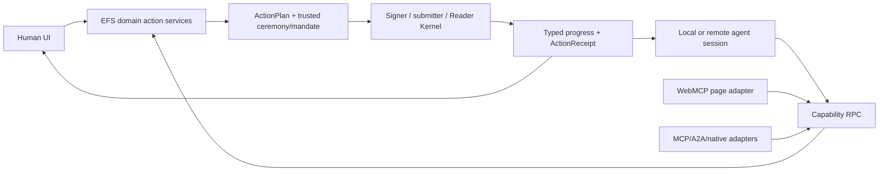

# Privacy reserves and first-class agent model

**Status:** draft — product requirements and extension seams for iteration; no privacy claim, agent protocol, signer delegation, or browser security profile is adopted
**Target repos:** planning, client, sdk
**Depends on:** [[Designs/web-client-os/README]], [[Designs/web-client-os/architecture-and-modules]], [[Designs/web-client-os/mvp-and-acceptance]]
**Inputs:** [[Designs/clientv2/network-privacy]], [[Designs/clientv2/agent-native]], [[Designs/clientv2/agent-native-os-compass-for-fable]] (historical mechanism evidence)
**Reviewers:** @web-platform-standards (2026-08-14), @historical-client-architecture (2026-08-14), @current-v2-read-path (2026-08-14)
**Last touched:** 2026-08-14

#status/draft #kind/design #repo/planning #repo/client #repo/sdk #topic/privacy #topic/agents #topic/capabilities #topic/web-standards

## Purpose

Privacy and agent support are expensive to retrofit because they change data
placement, network flow, storage, authorization, UI, interfaces, and audit
semantics. The MVP need not ship private folders, local inference, autonomous
signing, or every sandbox lane. It must avoid treating public EFS, one browser
origin, ambient `fetch`, a connected wallet, and human-only buttons as the
permanent architecture.

This packet reserves those seams while keeping the fast guest route small.
It makes no claim that a browser can provide anonymity, durable custody, a
perfect sandbox, or a solved prompt-injection boundary.

## Privacy constitution

1. **User intent, not mere technical reach, governs disclosure.** A module
   does not gain access because it shares an origin, is first-party, appears in
   a catalog, handles a file type, or can call a browser API.
2. **Public use does not require personal activation.** A guest link never
   opens wallets, profiles, address books, private indexes, agent memory, or
   model stores merely to improve personalization.
3. **Integrity, confidentiality, identity privacy, interest privacy, and
   availability are independent.** Verified bytes can still expose who asked
   for what; encrypted bytes can still expose graph and timing metadata.
4. **Private state has a legitimate home outside public EFS.** Drafts,
   journals, grants, negative display decisions, prompts, agent memory,
   imported credentials, local indexes, and unannounced module preferences need
   not become public protocol Records.
5. **Network behavior is inspectable policy.** Official code has no hidden
   analytics, fonts, price feeds, application/channel update checks, model
   calls, crash reporting, or fallback endpoints. Speculative fetch is a
   privacy decision. A user-enabled PWA separately discloses the browser's
   same-origin Service Worker script checks and lifecycle as a platform
   residual; those checks cannot select an EFS App release.
6. **Secrets never ride ordinary routes.** Query parameters are public-ish
   routing data. Fragment capabilities remain sensitive even though HTTP does
   not transmit the fragment; history, page code, screenshots, extensions,
   clipboard, and shoulder-surfing can still expose them.
7. **Encryption and deletion claims are precise.** Encryption cannot erase
   public metadata or prior recipients' copies. Local deletion cannot revoke a
   public occurrence. Browser eviction is not secure deletion.
8. **Exit includes private state.** Users can inspect, export, migrate, and
   restore critical local/private data without a hosted account or original
   EFS operator.

## Data and execution zones

The names are product zones, not protocol namespaces.

| Zone | Examples | Default persistence | Default network exposure | Authority rule |
|---|---|---|---|---|
| `PUBLIC_REALM` | admitted Records, Bindings, public names, immutable revisions, public Locators | reconstructable cache only | at least the selected RPC/Realm path observes requests; DNS/CDN/network intermediaries and extensions may also observe | public semantics remain Realm/basis qualified |
| `PUBLIC_ARTIFACT` | exact package/media/file bytes intended for broad retrieval | content-addressed cache or explicit retention | at least the chosen gateway/carrier observes retrieval; DNS/CDN, discovery/DHT, relays, providers/peers, network intermediaries, and extensions may observe identifiers, timing, or size | bytes verify against exact commitment; verification narrows integrity risk, not observer count |
| `LOCAL_PRIVATE` | settings, grants, handler choices, drafts, journal, outbox, private indexes, agent memory | versioned IndexedDB/OPFS or later native store | not directly network-addressable, but same-origin code with read access and egress can exfiltrate it; a no-egress claim needs a measured runner/origin profile | local policy and OS account protect access; browser storage is revocable and trusted same-origin code remains a residual |
| `PORTABLE_ENCRYPTED` | encrypted backup, private object, holder credential, shared vault | exact encrypted artifacts plus explicit key/capability management | ciphertext and metadata may be public or transported | possession/authorization to decrypt is separate from EFS admission |
| `SESSION_VOLATILE` | uncommitted plan, unlocked capability, preview bytes, inference context | memory only by default | only named action endpoints | revoked on exit, timeout, lock, or capability withdrawal |
| `EXTERNAL_SERVICE` | RPC, gateway, storage provider, remote index/search, relayer, remote inference | provider-defined and separately disclosed | provider sees the request allowed by its profile | endpoint capability scopes destination, method, data class, budget, and purpose |

Moving data between zones is an effect in an `ActionPlan`, not an incidental
implementation detail. A public Files projection of `/extensions/...` may be
useful for deliberately shared configuration, but it cannot be the canonical
home for secret endpoints, controller preferences, grants, installed-app
history, private handlers, or agent mandates. The authoritative profile may be
local or encrypted; a Files tree is an inspectable projection with explicit
visibility.

## Privacy dimensions shown separately

| Dimension | Question | MVP posture | Later extension seam |
|---|---|---|---|
| Integrity | Are these exact bytes/facts what the commitment says? | verify locally; show corrupt/unavailable distinctly | proof-carrying caches, verified replicas, range proofs |
| Semantic authority | Who asserted/admitted/selected this and under which policy? | pinned Realm, Principal policy, mount-local Files Plans, and basis | managed identity, private/rich Lenses, plural trust policy |
| Content confidentiality | Who can learn plaintext? | public Files content only; no confidentiality claim | encrypted objects, holder capabilities, selective disclosure |
| Identity privacy | Which user/account/person is exposed? | no wallet/profile access for guests; direct endpoint still sees network identity | proxies/OHTTP/Tor-capable transports, unlinkable personas, private payments |
| Interest privacy | Who learns the resource, path, digest, or graph queried? | explicitly “observer chosen by endpoint policy,” not anonymous | bulk snapshots, local replica, padded/batched queries, private information retrieval research |
| Linkability | Which reads, writes, Principals, accounts, and sessions correlate? | actual signer/account and public authorship disclosed on write | scoped personas, relayers, privacy-preserving credentials/payments |
| Local confidentiality | Who can read cached settings, drafts, prompts, and keys? | no secrets in re-fetchable cache; browser/OS compromise is residual | encrypted vault, hardware/passkey-backed unwrap, lock/timeout policy |
| Availability/custody | Can exact data be retrieved later? | plural Locators and honest availability; cache is acceleration | explicit retention contracts, replication policy, native custody |
| Telemetry | Who learns product and failure behavior? | none by default | locally enabled, endpoint-scoped, inspectable, redactable reports |

The ordinary UI may summarize these as a few understandable badges or a
privacy sheet, but the structured result preserves every axis.

Oblivious HTTP or another proxy can reduce linkability only with a cooperating
relay and gateway/target. It does not by itself hide request size, timing,
traffic shape, browser compromise, or every downstream observer; the selected
profile must name both parties and residuals.

## Network architecture reserve

### Endpoint capabilities

The long-term service router should replace ambient network access with handles
such as:

```text
NetworkCapability
  permitted origins or transport profile
  methods/protocols
  request and response data classes
  Realm/resource scope
  purpose
  byte/request/time budget
  foreground/background rule
  identity or proxy mode
  expiry + revocation
```

Trusted MVP packages may use a small audited fetch adapter directly for speed,
but its call sites and endpoints must conform to this same policy shape. An
iframe `sandbox` flag does not block HTTP, WebSocket, WebRTC, subresource, or
self-navigation egress; any profile claiming network denial needs a measured
cross-browser origin/CSP/runtime design. Unsupported enforcement is disclosed,
not represented as “no network.”

### Background work

- No unconditional preconnect, DNS prefetch, module prefetch, Locator sweep,
  update check, or profile hydration occurs on guest navigation.
- Local policy may allow post-paint work by endpoint, data class, metered/data
  saver state, battery, foreground state, and privacy mode.
- Speculative results are cached only under exact commitments and qualified
  basis. Speculation cannot create currentness or absence.
- A privacy mode can trade latency for fewer observers or a locally retained
  snapshot; the UI names the trade rather than promising a universal “private”
  mode.

### Link hygiene

- Ordinary query fields carry only non-secret boot hints and use strict
  allowlists, sizes, and canonical serialization.
- A fragment capability is parsed by the Boot Core, withheld from optional
  modules, and removed from the visible URL/history when the interaction model
  safely permits. This reduces leakage but is not a secrecy proof.
- The client applies a restrictive referrer policy, avoids third-party assets,
  and offers copy actions that distinguish a friendly public link, an exact
  citation, and a sensitive capability link.
- Module, profile, endpoint, wallet, or Lens hints from a shared link can
  nominate a choice but cannot persist it, activate code, open private state,
  or grant authority.

## Local storage, offline, and recovery reserve

[[technology-foundation#Installable PWA and static/IPFS delivery]] owns the
delivery mechanics. Privacy and correctness require the product to say which
offline claim it is making:

| Offline outcome | Meaning |
|---|---|
| `SHELL_OFFLINE_READY` | One exact verified client generation can boot locally; no claim about the requested EFS resource |
| `RESOURCE_RETAINED_VERIFIED` | Exact bytes and required semantic evidence are locally complete at a named basis |
| `CACHED_STALE` / `UNKNOWN` | Some evidence is retained but cannot prove the requested current result |
| `DRAFT_LOCAL` | Private work exists locally and has no admitted public effect |
| `SIGNED_QUEUED` | Exact authorization is retained, but submission/admission/finality remains unresolved |
| `OFFLINE_ACTION_UNSUPPORTED` | Fresh authority, carrier, Realm or foreground wallet/network interaction is required |

Installation, a green browser “online” indicator, a cached response, a Service
Worker, a retained UI row and an accepted wallet signature prove none of the
other rows. `navigator.onLine` is only a scheduling hint; each explicit
Realm/carrier operation produces the availability result.

### Storage classes

| Class | Examples | Loss response |
|---|---|---|
| Re-fetchable exact cache | verified public artifacts, exact module releases, immutable record pages | evict freely; reverify after fetch |
| Derived view/index | thumbnails, search indexes, materialized reducers | rebuild from named source/basis; version and discard on schema mismatch |
| Local preference | locale, theme, default Principal/account hint, handler policy | export/sync optionally; loss changes convenience, not public truth |
| Unsigned work | drafts, queued plans, edits, unpublished file bytes | explicit autosave, export, storage-health warning; never pretend recoverable |
| Signed but unsubmitted | authorization artifacts/outbox | high-integrity journal, replay/expiry rules, explicit recovery and privacy impact |
| Grant/mandate | capability grants, agent budgets, module authority | authenticated local store, expiry/revocation, audit; no silent cloud sync |
| Key/secret | decryption material, local signer secret, capability token | do not place in ordinary cache; use dedicated guarded provider and backup ceremony |

Cache API is suitable only for re-fetchable exact responses and static assets.
IndexedDB and OPFS can support structured/private state and large local files,
but remain origin-bound browser storage subject to quota, eviction, clearing,
bugs, and device loss. The OS needs versioned schemas, forward-only migration
steps with rollback/backup boundaries, checksums, interrupted-migration
recovery, export/import, and storage-health UI before claiming offline work.

No browser transaction atomically commits across Cache API, IndexedDB, and
OPFS. Stage immutable Cache/OPFS data under an exact generation ID, verify it,
then flip the active-generation pointer in one IndexedDB transaction. Journal
replay and migrations are idempotent, tolerate staged orphans, and retain the
old generation until recovery succeeds. `navigator.storage.persist()` is a
best-effort request, not backup or a durability proof.

Stable HTTPS/DNSLink origins can preserve installation and origin-bound stores
across exact client releases, but that mutable origin must pin/verify each
generation. Every CID-subdomain release is a distinct origin: a new CID has no
implicit access to the old Service Worker, Cache, IndexedDB, OPFS, grants,
journal or installation identity. A state handoff is an explicit export/import
or migration ceremony, never inferred continuity.

The offline journal uses append-only, versioned plain records with stable
intent/action IDs, Realm and basis, roles, exact input/payload digests and
separate draft/planned/signed/submitted/admitted/finality states. Signals,
provider handles and in-memory ports never become journal truth. Reconnect
re-reads current preconditions and checks idempotent identity before replay;
background events cannot select a signer, request a signature, guarantee a
time, or delete an unresolved record. Foreground review/retry remains the
universal path.

A Service Worker may provide the stable-origin offline shell after its exact
bootstrap, partial/corrupt App install, old-document/new-worker skew, rollback,
recovery and cross-browser behavior is proven. Its small content-named
`WorkerBootstrapGeneration` is separate from inert staged
`AppReleaseGeneration` assets and the EFS-owned accepted-App pointer. Browser
checks/automatic activation of an already accepted Worker bootstrap never
select a new App release; `skipWaiting()` does not force a mixed session. The
prior healthy App generation remains retained. No worker is part of Realm,
Files, artifact or action correctness. A missing worker uses ordinary network
boot. A controlling broken/malicious worker can intercept navigation; recovery
requires a rescue URL outside its scope—preferably another origin—or explicit
site-data reset, and the rescue generation must not depend on that worker.
The exact relationship among App, Boot, Worker and separately installed module
generations is defined once in
[[architecture-and-modules#Configuration objects]]; privacy policy introduces
no second activation pointer.

## Module privacy and isolation

Every module descriptor requests inert data classes and capabilities; the host
computes effective grants. Important distinctions include:

- exact read snapshot versus live subscription;
- selected File bytes versus folder enumeration;
- local private data versus public Realm data;
- endpoint-specific network versus general direct egress;
- session storage versus persistent module storage;
- model execution versus permission to send prompts remotely;
- action planning versus signer/submitter capability.

A module should receive copied immutable inputs or revocable service handles,
not ambient DOM, storage, wallet, network, or global Reader objects. Same-origin
Workers are a useful performance and API boundary, not a complete adversarial
sandbox. Opaque-origin iframes, CSP, Permissions Policy, Trusted Types, Wasm
imports, SES, and future Component/WASI runners are profile mechanisms to test;
none alone establishes least authority, confidentiality, network denial,
resource quotas, or freedom from browser exploits.

Privacy-sensitive module activation therefore records runner residuals,
effective grants, endpoint policy, retained data, teardown behavior, and an
uninstall/export path. A first-party module gets no exemption.

## First-class agent model

### Parity law

Humans and agents operate the same domain services:

```text
describe -> propose intent -> compile/dry-run -> authorize -> execute
         -> progress/cancel -> receipt -> inspect/recover
```

- The visual UI invokes these services; it is not the canonical action API.
- An agent invokes the same versioned schema and receives the same plan digest,
  basis, authority roles, warnings, progress, errors, and receipt.
- Any supported product capability may be delegated to an agent, including
  write, organization, installation, administration, and signing-mediated
  actions. Delegation is an explicit scoped mandate, never ambient authority.
- The agent need not receive raw key material. A signer broker may honor a
  mandate, require contemporaneous human confirmation, require an external
  device, or deny the action according to the same policy used for human UI.
- Default policy may reserve high-risk checkpoints for people; this is a
  configurable safety posture, not a permanent claim that agents are
  second-class users.
- An operation that only exists as a clickable button or only through an
  undocumented agent shortcut is a product defect.

### Stable owned tool contract

The Kernel/OS owns a runtime-neutral, versioned JSON-Schema/IDL contract over
capability-mediated RPC. Illustrative descriptor:

```text
ToolDescriptor
  stable tool ID + version
  requester/app/module provenance
  input/output/event/error schemas
  read purpose: INTERACTIVE | GATE | BACKGROUND | ACTION_PLAN
  required capability classes and scopes
  public/private/secret data classes
  network/artifact/storage/inference effects
  risk class and authorization checkpoints
  idempotency/retry/cancellation behavior
  deterministic plan support
  accessibility/localization explanation keys
```

The contract must support typed `Resolved<T>`, async progress/events,
cancellation, deadlines, resumable continuation, `ActionPlan`, `ActionReceipt`,
and subscriptions with explicit lifetime. UI prose is generated from trusted
explanation keys and exact typed values; a remote app or model does not supply
rich permission-prompt markup.

### Authority model

An `AgentSession` should carry:

```text
session identity and requester provenance
human/Principal on whose behalf it may act
exact module/model/inference-provider generation
granted service capabilities
Realm, resource, action, amount, endpoint, and time scopes
public/private/secret data allowances
request/byte/compute/spend/action budgets
taint and destination policy
human checkpoint or signer-mandate policy
pause, expiry, revocation, and emergency stop
invocation log and local receipt retention
```

The semantic author Principal, actual signer/controller account, agent session,
requesting App, submitter/relayer, and payer remain distinct. An agent session
is not automatically an EFS Principal, and a model provider is never the
author merely because it generated content.

### Untrusted-content boundary

Prompt injection cannot be solved by asking a model to ignore instructions.
The system must structurally separate control from data:

1. Compile the action shape from a trusted tool schema, user/delegated intent,
   and policy before untrusted content is read where possible.
2. Permit untrusted content to fill only declared typed data slots; it cannot
   add effects, destinations, capabilities, or authorization steps.
3. Taint private, untrusted, and externally sourced values across tool calls
   and enforce destination/data-class policy at capability boundaries.
4. Deny by default the dangerous combination of broad private-data access,
   untrusted-content ingestion, and unrestricted external network. An owner may
   deliberately create a narrower or break-glass mandate with visible residual
   risk, budgets, and receipts.
5. Bind authorization to the exact final plan digest. Re-planning, changed
   calldata, changed carrier, changed recipient, or changed bytes invalidates
   the prior approval unless the mandate explicitly covers the change.
6. Treat model output, memory, WebMCP tools, MCP/A2A metadata, web pages, files,
   package manifests, and catalog claims as untrusted inputs until the trusted
   schema and local policy say otherwise.

### Agent interface layers



Adapters may expose a subset or translate transport, but they may not alter
tool meaning, bypass capabilities, weaken read context, or become correctness
authority.

## Web standards posture as of 2026-08-14

This matrix distinguishes useful shipped foundations from moving targets. It
must be refreshed before implementation selection.

| Capability | Current posture | EFS use |
|---|---|---|
| Semantic HTML, modern CSS Grid/container queries/logical properties and preference/input media features | standards foundation; individual forward features remain profile-tested | native accessible responsive root shell across desktop/mobile/installed contexts; not authority or isolation |
| [Autonomous custom elements / Web Components](https://html.spec.whatwg.org/multipage/custom-elements.html) | broadly shipped platform composition | public UI/module integration boundary; not isolation |
| [JavaScript modules and import maps](https://html.spec.whatwg.org/multipage/webappapis.html#import-maps) | document support is usable; Worker resolution differs | trusted base loading and bundle-time mapping; not package integrity or general runtime registry |
| [TC39 Signals](https://github.com/tc39/proposal-signals) | owner-selected future JavaScript surface; exact polyfill/proposal revision still moving | single in-process reactive model; never persistence, RPC, capability or authority ABI |
| [Dedicated Workers](https://html.spec.whatwg.org/multipage/workers.html) and `MessagePort` | broadly shipped | responsiveness and capability-shaped RPC; not a least-authority sandbox |
| [WebAssembly core](https://webassembly.org/features/) | broadly shipped with feature variance | portable compute with explicit imports; not a filesystem/network/permission ABI |
| [Web App Manifest](https://www.w3.org/TR/appmanifest/) and [Service Workers](https://www.w3.org/TR/service-workers/) | manifest/install and worker lifecycle standards with platform differences | installable static profile and generation-safe offline shell after recovery proof; never semantic correctness or required guest entry |
| [Storage Standard](https://storage.spec.whatwg.org/), [IndexedDB](https://w3c.github.io/IndexedDB/), and [File System/OPFS](https://fs.spec.whatwg.org/) | usable but quota/eviction/device behavior varies | tiered cache/private state with explicit durability limits |
| [BCP 47](https://datatracker.ietf.org/doc/html/rfc5646), [Unicode LDML](https://www.unicode.org/reports/tr35/) and [ECMA-402 `Intl`](https://tc39.es/ecma402/) | durable language/locale standards with implementation data that evolves | versioned message/locale packs and localized presentation; never canonical protocol equality or signing input |
| [`iframe` sandbox](https://html.spec.whatwg.org/multipage/iframe-embed-object.html#attr-iframe-sandbox), [CSP](https://www.w3.org/TR/CSP3/), [Permissions Policy](https://www.w3.org/TR/permissions-policy-1/), and [Trusted Types](https://www.w3.org/TR/trusted-types/) | important defenses with different maturity and enforcement | ingredients in named runner profiles; no single “secure sandbox” badge |
| [WebMCP](https://webmachinelearning.github.io/webmcp/) | W3C Community Group draft/early implementation work | optional page-tool discovery/invocation adapter over the EFS-owned tool contract; not kernel ABI or authorization token |
| [Web Neural Network API](https://www.w3.org/TR/webnn/) | Candidate Recommendation Draft; availability is not universal | optional inference-provider backend with semantic fallback |
| [WebGPU](https://www.w3.org/TR/webgpu/) | shipped unevenly and still evolving | optional acceleration; never required for correctness |
| [WASI](https://wasi.dev/releases/) and Component Model/WIT | useful ecosystem specifications, not a native browser component ABI | later Wasm runner/toolchain lane behind an EFS runtime profile |

No stable primary web standard named **WebInference** was identified in this
pass. The term is treated as James's product goal for an interchangeable local
or remote browser inference service, not a dependency name. Track WebNN,
WebGPU, Wasm, browser model APIs, and future standards behind
`efs.inference.provider`.

WebMCP does not replace an OS agent protocol. It exposes tools associated with
a document/page environment and is not itself proof of installation,
Principal identity, local grant, signer authority, or MCP wire compatibility.

## Inference provider reserve

`efs.inference.provider` should accept exact model/profile requests and return
typed capability/support evidence. A provider profile names:

- exact model/tokenizer/config/artifact commitments and licenses;
- execution location: local browser, local native companion, user server, or
  third-party remote service;
- required WebNN/WebGPU/Wasm/CPU features and fallback policy;
- prompt/context/image/audio data classes and retention/training claims;
- endpoints, observers, network bytes, energy/compute/storage budgets;
- cancellation, streaming, reproducibility limits, and result provenance.

Remote fallback is never silent. Downloading a large local model is explicit,
lazy, resumable, integrity-checked, and separate from permission to read
private data. Model output is evidence/untrusted input, not protocol truth.

## Privacy and agent acceptance fixtures

### Guest privacy

- [ ] With wallet, profile, private stores, service worker, telemetry endpoint,
      package catalog, and agent bridge instrumented to throw, a public Files
      link still resolves and none is touched.
- [ ] Network capture lists only the chosen static origin, explicit Realm/RPC,
      and content carriers needed by the route; no third-party font, analytics,
      update, favicon, price, or speculative request appears.
- [ ] Data Saver/privacy mode disables all optional post-paint probes and the
      result remains semantically equivalent, with latency/availability trade
      shown honestly.
- [ ] A shared query link cannot expose private state or grant authority. A
      fragment-capability fixture is withheld from modules/logs and labelled
      sensitive without a claim of perfect secrecy.

### Local/private state

- [ ] Clearing only re-fetchable caches preserves signed/private state;
      clearing all browser storage triggers an explicit loss/recovery outcome.
- [ ] Interrupted migration—including a crash after immutable Cache/OPFS
      staging but before the IndexedDB active-pointer flip—corrupt store, quota
      exhaustion, eviction, and version rollback have fixed recovery fixtures.
- [ ] Export/import reconstructs critical local state on a clean profile with
      exact schema/generation provenance; secrets use a separate ceremony.
- [ ] Public `/extensions/...` projection omits private grants, secrets,
      controller preferences, agent memory, and unannounced installed modules.

### Module privacy

- [ ] A no-network module receives no fetch-capable service handle; each runner
      profile documents whether direct browser egress is actually prevented.
- [ ] A module crash/uninstall revokes ports, listeners, object URLs, frames,
      Workers, subscriptions, and session storage without deleting retained
      user data.
- [ ] Changing a handler or inference provider shows data/network/capability
      differences and does not silently broaden prior grants.

### Agent parity and control

- [ ] For every MVP UI action, an authorized agent can obtain the same schema,
      plan, progress, errors, receipt, and recovery path without DOM scraping.
- [ ] For every agent action, a human can inspect the exact semantic effects
      and authority basis in trusted UI.
- [ ] A WebMCP/page tool can advertise an action but cannot call a signer,
      private Reader, storage, or network destination without a local matching
      capability.
- [ ] Untrusted file content cannot add a recipient, change bytes, select a new
      Realm, widen a Locator endpoint, install a module, or change the action
      after authorization.
- [ ] Revoking or expiring an agent session stops new invocations and cancels
      applicable live ports; already-public admitted actions remain public.
- [ ] A scoped signer mandate and a human-confirmed signing policy both use the
      same ActionPlan digest and record which policy authorized the effect.
- [ ] Local and remote inference providers can be swapped without changing the
      domain action schema; remote use visibly discloses the sent data class.

## Falsifiers

Revisit the architecture if:

- useful guest reading requires wallet/profile/private-store access;
- a public EFS tree becomes the only home for grants, secrets, or agent memory;
- caches or service workers become correctness or the only copy of authored
  state;
- verified transport is described as anonymous or encrypted storage is
  described as unlinkable without evidence;
- modules or agents rely on ambient same-origin `fetch`, storage, wallet, DOM,
  or signer authority;
- human UI and agents compile different plans or use different write paths;
- an agent must click pixels for an official operation, or a human cannot
  inspect an agent-only operation;
- a model, WebMCP tool, package, catalog, or untrusted file can change the
  authority-bearing structure after approval;
- WebNN, WebGPU, WebMCP, WASI, SES, or a particular runner is required for
  semantic correctness; or
- replacing an inference/network/storage module silently changes disclosure or
  authority.

## Open questions

- [ ] Define the smallest typed visibility label that ordinary UI can explain
      without collapsing the privacy dimensions above.
- [ ] Select the default post-paint network policy after measuring latency,
      fallback value, observer exposure, data saver, and mobile battery cost.
- [ ] Determine which local/private state deserves encrypted export in the
      first Web Client and which belongs only to the later OS.
- [ ] Design capability-link lifecycle, redaction, handoff, and recovery before
      accepting secrets in fragments.
- [ ] Define the initial agent mandate language and default human checkpoints
      without preventing an owner from deliberately delegating full workflows.
- [ ] Measure browser runner profiles for actual network denial, storage
      isolation, teardown, and resource limits across Chromium, Firefox,
      Safari/WebKit, iOS, and Android.
- [ ] Refresh WebMCP, WebNN, WebGPU, browser inference APIs, WASI, and Component
      Model evidence before selecting any implementation dependency.

## Pre-promotion checklist

- [ ] All `## Open questions` resolved or explicitly deferred with links.
- [ ] Every privacy promise names observers, residuals, and a reproducible
      fixture.
- [ ] Local/private storage has versioning, migration, export, eviction, and
      loss behavior before it holds irreplaceable state.
- [ ] Agent parity, capability revocation, taint, plan binding, and signer
      policy pass adversarial review.
- [ ] Standards status is refreshed from primary sources.
- [ ] No `<!-- AGENT-Q: -->` markers remain.
- [ ] At least one `#status/review` round receives another agent or human
      comment.
