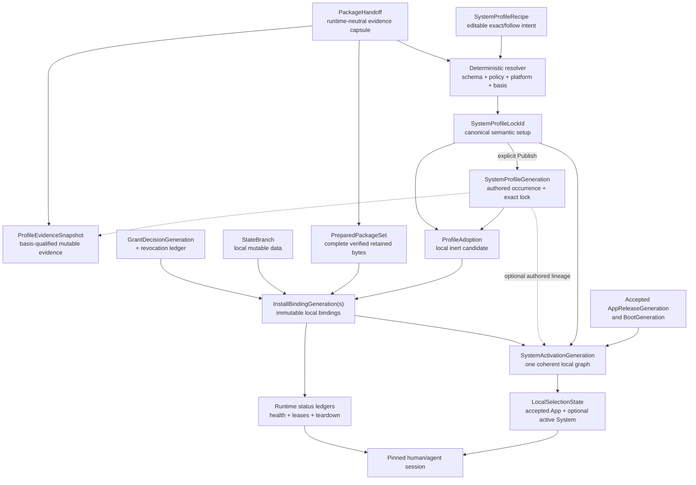

# Shareable system profiles, generations, and activation

**Status:** draft — owner-directed product architecture and researched working model; object names, canonical encodings, runner profiles, package bytes, and implementation remain evidence-gated
**Target repos:** planning, client, sdk
**Depends on:** [[Designs/web-client-os/README]], [[Designs/web-client-os/architecture-and-modules]], [[Designs/open-web-app-store/architecture]]
**Inputs:** [[Designs/clientv2/boot-and-profiles]], [[Designs/clientv2/packages-and-updates]], [[Reviews/2026-07-07-clientv2-corpus/research/closures-generations]] (historical evidence)
**Reviewers:** @functional-generation-architecture (2026-08-15), @wasm-wit-runtime (2026-08-15), @precedent-product-boundary (2026-08-15), @open-web-app-store-pm boundary review (2026-08-15)
**Last touched:** 2026-08-22

#status/draft #kind/design #repo/planning #repo/client #repo/sdk #topic/cypherpunk-os #topic/app-model #topic/privacy #topic/wasm #topic/wasi

## Owner direction and outcome

James supplied the following product direction on 2026-08-14 and 2026-08-15:

- EFS OS should recover the best requirements and practices from Nix, Guix and
  related functional systems, then adapt them to the Web rather than copying
  their mechanisms blindly.
- A person should be able to share a hyperlink to an unusual, highly tuned or
  beautiful OS setup—for example a gaming, media, accessibility, development
  or research environment—and another person should be able to understand
  exactly what it is.
- Opening someone else's setup is safe and read-only by default. It must not
  boot that setup, execute its code, connect a wallet, read private state,
  install packages, subscribe to updates, migrate data or grant authority.
- The recipient may explicitly inspect deeper, try the setup in a disposable
  environment, adopt it, fork it, attach selected personal resources, or
  activate it. Those are separate operations rather than one escalating
  button.
- A trusted OS configuration manager should let people retain and switch among
  whole-system profiles and generations. Experts should be able to build a
  configuration once and share it broadly without becoming permanent
  infrastructure or authority for its users.
- Core WebAssembly, WASI, WIT and the Component Model are foundational and
  recommended platform directions for portable, performant, capability-shaped
  code where they fit. Their exact versions, browser adapters and runner
  profiles remain measurable engineering choices.

The selected architecture is therefore a **Web-native functional system
model**: exact immutable software and configuration, capability-mediated local
authority, separately versioned mutable state, user-owned activation
generations, and carrier-independent reconstruction.

“Web Nix OS” is useful shorthand for the ambition, but not the mechanism. EFS
adopts the functional-system properties that survive Web pressure—exact locks,
closures, generations, atomic selection, rollback, roots and reproducibility
evidence—while replacing ambient host execution, store paths and one specific
evaluator with Web-native objects and capability-shaped runners.

This document does not authorize product implementation, a package/profile
wire format, a public catalog, a new Core noun, a Nix evaluator in the browser,
or an exact Wasm/WASI toolchain.

## Why this is foundational

Profiles are not a cosmetic theme feature. A complete system selection can
affect the App and Boot compatibility profile, Shell, handlers, retrieval,
storage, privacy policy, network paths, applications, agents, local state,
capability requests, migrations, update behavior and recovery. Adding
shareability after those systems are independently designed would force
unsafe implicit inheritance and painful rewrites.

The opportunity is also social. Existing operating systems make screenshots,
dotfiles and setup guides shareable, but seldom make the exact running system
itself a safe hyperlink. EFS can turn expert configurations into inspectable,
forkable public goods while keeping the recipient in control.

This machinery must add **zero mandatory work** to an ordinary file or folder
link. The direct guest path remains:

```text
Network/Boot bootstrap -> Reader Kernel -> Minimal Viewer
```

Profile inspection is another route-shaped guest workload over that same
Reader and verifier. Package resolution, complete closure fetch, private-state
opening and full OS startup happen only after the corresponding explicit
operation.

## Architecture alternatives

| Approach | Strength | Why it is not the primary model |
|---|---|---|
| **Exact locked profile plus local activation generation — selected** | Exact sharing, lazy content-addressed closure, coherent activation, local rollback, and clean state/authority separation | Requires several explicit object types and a deterministic evaluator/conformance suite |
| Monolithic OS image containing base, modules, grants and state | One apparent identity and rollback target | Couples first-party delivery to third-party modules, either leaks local state/authority or fails to describe the real system, and makes lazy social inspection expensive |
| Live collection of independently movable module pointers | Small updates and maximum apparent flexibility | Produces mixed generations, runtime resolution waterfalls, non-reproducible links, ambiguous rollback and dependency/authority races |

Running the Nix language, Guile, package build hooks or another general
evaluator inside the browser is not the system format. Nix, Guix, CI, remote
builders and reproducible build systems may all produce exact artifacts and
evidence for the same Web-native format.

A signed bundle, Isolated Web App, extension or native launcher is a parallel
hardened delivery profile for the same realization—not a competing package or
configuration model.

## Precedents and transferable lessons

No individual precedent supplies the whole EFS target. The following systems
do provide shipped evidence for important parts.

| Precedent | What is proven | Limitation EFS must avoid | EFS lesson |
|---|---|---|---|
| [Flox environments](https://flox.dev/docs/concepts/environments), [FloxHub environments](https://flox.dev/docs/concepts/floxhub), and [`flox activate`](https://flox.dev/docs/man/flox-activate) | Public environment pages, declarative manifest plus lock, supported-system variants, history/generations, remote/exact-generation activation, local cache and disconnected local copies through `pull --copy` | `owner/name` follows a hosted live generation; activation may execute arbitrary shell hooks and therefore presents a trust prompt; no browser capability sandbox, retained fork lineage or carrier-independent exact link | Closest social/deployment precedent. Preserve inspect, exact generation, copy/fork and history; replace ambient hooks and hosted authority with inert data, exact closures and explicit capabilities. |
| [Nix profiles and generations](https://nix.dev/manual/nix/2.35/package-management/profiles.html) plus [output-addressing types](https://nix.dev/manual/nix/2.35/store/derivation/outputs/index.html) | Immutable dependency closures, atomic profile switching, retained generations, rollback and explicit GC roots | Ordinary Nix outputs are generally input/derivation-addressed rather than universal output identity; the store excludes mutable state and must exclude secrets | Preserve source/lock/output/generation separation. Start EFS realization identity from exact bytes and keep state/secrets outside. |
| [Guix time machine and channels](https://guix.gnu.org/manual/en/guix.pdf) | Pinning the package definitions and toolchain as well as selected packages; authenticated history; whole-system generations and rollback | Authenticated history and pinned definitions still do not prove safe code or bit-identical independent builds | Evaluator/toolchain identity and historical trust basis are evidence axes, not activation authority. |
| [rpm-ostree deployments](https://coreos.github.io/rpm-ostree/administrator-handbook/) | Staged pending deployments, inspectable current/pending state, reboot activation, rollback, transient testing and immutable-system/mutable-data separation | Limited module-level capability model and no community profile workflow | Stage first, switch one coherent selection, retain the previous healthy generation, and never call code rollback a user-data rollback. |
| [OCI Image Specification](https://github.com/opencontainers/image-spec/blob/main/spec.md) | Content descriptors, exact manifests, multi-platform indexes, immutable configurations and separated runtime configuration | An image digest proves bytes, not publisher identity, safety, provenance, permissions or correct mutable volumes | Use exact descriptors and explicit platform realizations while preserving authored Release, trust evidence, grants and state as different identities. |
| [VS Code Profiles](https://code.visualstudio.com/docs/configure/profiles) | A shared URL opens profile contents for inspection; the recipient may deselect categories, create/import explicitly and use temporary profiles | Extensions are not a complete immutable closure and remote sharing depends on GitHub/Microsoft services | Strong mainstream UX precedent for inspect, derive selectively, temporary Try and explicit adoption. Enforcement cannot depend on an extension honoring Restricted Mode. |
| [Steam Workshop collections](https://steamcommunity.com/workshop/tools/) and [Modrinth packs](https://support.modrinth.com/en/articles/8802351-modrinth-modpack-format-mrpack) | Viral link sharing, ordered collections, add-versus-overwrite choice, easy copying, environment constraints, member hashes, sizes and plural download URLs | Workshop subscriptions and members update mutably; mod execution is not capability-confined; archive overrides need path-escape defenses | Copy the approachable preview/remix workflow. Reject visit-to-subscribe, mutable members in an exact profile, implicit overwrite and execution before full verification. |
| [Isolated Web Apps](https://github.com/WICG/isolated-web-apps) | A signed locally installed Web bundle can have an identity and update path independent of mutable Web hosting | Emerging Chromium-oriented profile, signing-key lifecycle and installation ceremony; not ordinary click-through Web reach | Keep one format compatible with a later hardened launcher while normal HTTPS/PWA use remains available and honestly weaker. |

Flox disproves the broad claim that shareable, reproducible environments with
generations and forks have never existed. As of 2026-08-15, no shipped product
was found in the primary-source precedent set reviewed above that combines all
of these properties:

- a host-independent typed exact identity carried in an ordinary compatible
  Web URL for a carrier-independent whole Web-OS profile;
- account-free inert inspection before fetching or executing the profile's
  executable closure;
- structural, capability, privacy, platform, storage and migration diffs;
- verified bytes from untrusted carriers plus local generation ownership;
- rollback and reconstruction without the publisher, catalog or original
  domain;
- forkable public configuration with grants, identities, secrets and private
  state kept outside; and
- equivalent structured operations for humans and agents.

That combination—not declarative environments alone—is the credible EFS
innovation claim.

## Product laws

1. **Inspect is not Try; Try is not Adopt; Adopt is not Activate.** No state
   transition implicitly performs another.
2. **An exact link stays exact.** It never consults `latest`, a live channel or
   an unlocked transitive dependency.
3. **A follow link stays qualified.** It names the publisher/curator, Realm,
   policy and resolution basis that selected its current candidate.
4. **Opening a profile executes nothing from the profile.** Metadata and
   verified passive showcase assets remain inert.
5. **The shared object is software and public configuration, not a clone of a
   person.** It excludes grants, secrets, wallets, identities, private data,
   handles, sessions and agent mandates.
6. **Authored identity and byte identity remain distinct.** A fork or another
   publisher using identical bytes is a different authored Release even when
   storage deduplicates the closure.
7. **Runtime dependencies never follow mutable names.** Every selected module,
   adapter, interface and executable member is exact before Try or Activate.
8. **Authority does not compose transitively.** A dependency graph is not a
   capability graph; every effective import/port is created by local policy.
9. **Updates create candidates and new generations.** They never mutate an
   installed profile or reactivate after a deliberate rollback.
10. **One local coordinator tuple selects one coherent system graph.** Per-slot
    or App/System pointers may not race into a mixed generation.
11. **Code rollback is not data rollback.** State branches, checkpoints and
    migrations have their own compatibility and recovery law.
12. **A public profile is an intentional disclosure.** Publication previews
    the fingerprint created by modules, policies, endpoints, locale, devices
    and interests.
13. **The configuration manager survives the configuration.** Trusted inspect,
    activation, rollback, recovery and export cannot depend on the candidate
    Shell or module graph being healthy.
14. **The browser remains part of the TCB.** Wasm, content addressing and a
    profile hash do not defeat a malicious same-origin bootstrap or browser
    runtime vulnerability.
15. **The direct Files product remains independently useful.** A profile with
    one thousand modules costs no more guest boot work than one with ten until
    the person opens profile details.

## Object and identity model

Names in this section are working product/interface names, not frozen protocol
bytes.



### `SystemProfileRecipe`

Optional editable intent for people, agents and authoring tools. It may contain
exact references, named channels, version ranges, alternatives, reusable
fragments and declared parameters. It is never booted or installed directly.

Recipe evaluation is inert and networkless over explicitly supplied inputs.
The resolver may fetch those inputs before evaluation, but ambient time,
wallet state, browser state, secrets, random values and undeclared network
results cannot influence the canonical result.

If a recipe contains a package range, channel or catalog choice, the generic
package resolver owned by the Open Web App Store produces the exact
`PackageHandoff`/`ResolvedPackageSet` and `ResolutionReceipt`. The system
evaluator composes those exact outputs into slots; it does not independently
re-solve package dependencies or create a second catalog/trust authority.

### `SystemResolutionReceipt`

Records the exact recipe, `lockSchemaId`, normative
`compositionSemanticsId`, evaluator implementation/conformance version,
consumed exact `ResolvedPackageSetId` values and each package-owned
`ResolutionReceipt` value/reference (or digest only after the package owner
defines canonical receipt bytes), Realm/basis, platform and slot decisions,
optional choices, conflicts, rejected alternatives and resulting
`SystemProfileLockId`. The package resolver continues to own the receipt
schema and source/catalog-policy meaning; this layer does not invent a second
package receipt identity. A `PackageHandoff` may transport those facts but is
not itself assumed to have semantic identity. Two independent conforming
system evaluators must produce the same canonical result or the format is not
ready to freeze.

### `SystemProfileLock` / `SystemProfileLockId`

Canonical identity-bearing semantic setup. Its exact canonical bytes commit
to:

- `lockSchemaId` and normative `compositionSemanticsId`; evaluator
  implementation/toolchain identity remains receipt/rebuild evidence and does
  not perturb semantic lock identity;
- one exact nominated `AppReleaseGeneration` and its contained
  `BootGeneration`, plus separate versioned App/Boot interface-compatibility
  constraints used when deliberately adapting/forking the profile;
- exact Shell, handler and service-slot bindings;
- publisher-qualified package `ReleaseRef`s, exact `ResolvedPackageSetId`s,
  ArtifactClosure IDs and dependency roles;
- exact `RunnerRealization` IDs for every executable slot;
- deterministic public configuration and capability/privacy/network request
  ceilings;
- complete platform/feature mapping and public state-schema/migration IDs; and
- a bounded identity-bearing `LockHeader` plus exact paged/Merkle graph root.

It excludes resolver diagnostics, current basis/freshness, Locators,
availability/durability, retained-byte status, advisories, yanks, succession,
compatibility/rebuild observations, rankings and other evidence that can
change without changing the selected semantic setup.

`LockHeader` contains only stable lock facts needed for constant-cost identity
and compatibility inspection: lock schema/composition semantics, nominated
exact App/Boot, platform map, module/closure counts and sizes, graph root, and
requested capability/privacy/network summaries. Profile publisher, origin
Realm/basis, exact-versus-follow status, current evidence coverage and
availability belong to a separately qualified Inspector/evidence header and
cannot change the lock.

### `SystemProfileGeneration`

Immutable authored occurrence that binds:

- publisher-qualified Project/Profile reference and immutable authored
  Release/Occurrence;
- one exact `SystemProfileLockId`;
- the publisher's exact authored metadata and fork/derivation lineage; and
- optional exact references to the resolution receipt and evidence snapshots
  available when it was published.

It excludes effective grants, local installation/health state, identities,
wallet/persona bindings, controller preferences, secrets, private data,
machine handles, sessions and agent mandates. Identical lock bytes under a
different publisher/occurrence remain a different authored profile generation.

One exact lock may contain a multi-platform realization index. Each entry maps
an explicit `WebProfileId`/runtime target to one exact realization. A client
never silently chooses different unlocked components and calls them the same
lock.

### `ProfileEvidenceSnapshot`

An exact, separately identified, basis-qualified **non-laundering index and
evaluation** over one authored profile generation and lock. It references
source evidence/results while preserving each source issuer, target, claim,
Realm/basis, coverage, verification state, conflict and typed `UNKNOWN`. It can
index provenance/SBOM, rights, compatibility, rebuild,
advisory/yank/succession, Locator, availability/durability, retained-byte
completeness and curator recognition. A later snapshot never erases an earlier
snapshot or collapses conflict; it may record an issuer's explicit
supersession claim and a named local/curator policy result, but the client does
not become a second provenance, advisory or availability authority. No
snapshot mutates the authored generation or `SystemProfileLockId`.

### `RunnerRealization`

Immutable, tagged platform-specific execution description selected by a
profile. It contains no effective grant, local state or runtime instance. All
variants commit to:

- the canonical executable Artifact/ArtifactClosure and authored Release;
- exact runner profile, version and semantic-conformance version;
- target platform/Web profile;
- selected executable closure and exact adapter/bootstrap/toolchain closure;
- immutable construction policy, enforceable resource ceilings and UI-surface
  profile; and
- required conformance-suite/profile IDs.

A Wasm/Component variant additionally commits to exact WIT
package/world/interface versions and digests, Component Model/Canonical ABI
revision and options, exact WASI package/interface versions, required Core
feature set and bounded memory/table declarations, declared imports/exports,
one exact browser adaptation closure or named native runtime profile, and
deterministic environment inputs.

A SES Worker variant commits to exact SES/Endo implementation bytes and
version, `lockdown()` options, outer Compartment/global/endowment profile,
module loader/archive/compartment-map and policy formats, Worker bootstrap and
construction mechanism, CSP/object-URL/network profile, quota/termination
policy, and any LavaMoat-style inner dependency-policy realization.

An opaque full-Web iframe variant commits to exact sandbox tokens,
credential/origin mode, CSP/network/Permissions-Policy/storage/navigation
profiles, verified closure-mount/resource-delivery mechanism, handshake and
teardown profile, and Shell-owned surface/gesture policy. Any construction
change that broadens these powers creates a different realization and a new
instance lease; a MessagePort cannot retrofit construction authority.

The canonical artifact remains distinct from a derived realization. A
`jco`-style browser closure, SES archive, or iframe resource mount is a
digest-linked platform output with its own provenance. A native runtime may
consume a canonical component directly. Engine caches and local AOT/compiled
output are optimizations, not identity, unless a profile deliberately
publishes and selects them as an exact realization.

### `PackageHandoff` and `PreparedPackageSet`

`PackageHandoff` remains the Open Web App Store's one-way, runtime-neutral
capsule. The OS consumes exact package/release/set, closure, requested
capability, provenance, compatibility, locator and completeness evidence. It
never writes grants, activation, state or runner authority back into the
handoff, and the profile never treats the whole evidence-bearing capsule as
semantic lock identity.

The lock commits to exact semantic IDs carried by a handoff—such as publisher
Release, `ResolvedPackageSetId`, ArtifactClosure and `RuntimeRequest`—plus the
OS-selected exact `RunnerRealization`. Its system-level receipt adds only
profile composition and platform/slot decisions; it never relabels handoff
evidence as a new package Release, Set, catalog judgment or update authority.

`PreparedPackageSet` is local inert evidence that every member required by the
selected platform/runner realization—executable, glue, configuration, schemas,
required passive assets, notices/licenses and migration inputs—has been fetched
and verified. It names its exact coverage profile. For an executable entry,
that coverage is the selected entry's full locked activation closure; a
separately committed optional activation unit is not a deferred hole and needs
its own complete preparation evidence before invocation. A broader offline/
install profile may require all such units. Preparation may perform static
import/feature/memory validation and compile already
verified Core Wasm without instantiation. It never evaluates adapter entry
modules, instantiates a component/module, runs a start function, package hook,
migration or other module code, or creates live capabilities.

The Open Web App Store terminology repair is published and aligned: the
obsolete `InstallGeneration` umbrella is retired. The shared boundary is an
OS-owned immutable `InstallBindingGeneration` plus mutable
`InstallStatusLedger`; `UpdateTrustState`, state-branch heads, grant revocation
and evidence snapshots keep separate identities/lifecycles. The handoff
continues to exclude every local object and gains no install/activation
ownership.

### `ProfileAdoption`

Local intent to retain an exact `SystemProfileLockId` as a candidate, with an
optional authored `SystemProfileGeneration`/evidence reference when the source
was public:

```text
NOMINATED
  -> ADOPTED_METADATA
  -> PREPARING
       -> PREPARED_COMPLETE
       -> PREPARED_PARTIAL
       -> BLOCKED
  -> ABANDONED
```

Adoption roots the exact profile metadata by default. `Keep Offline` is a
separate storage decision that roots the full verified closure.

### `StateBranch`, `GrantDecisionGeneration`, and revocation

`StateBranch` is a separately versioned local/private application or module
state volume. A foreign profile starts with fresh empty state. Existing state
can be attached only through an explicit binding/migration plan.

`GrantDecisionGeneration` is an immutable local record of allowed/denied
authority scoped to exact Releases, dependency set, runner realization,
profile, exact accepted `AppReleaseGeneration`/`BootGeneration`, state branch
and session policy. A foreign profile starts with an empty decision. Same
publisher, identical bytes, fork, update or previous install does not inherit
it silently. An App/base update creates a new grant decision after the
capability semantics and requested/effective diff is explicitly reviewed; it
may copy the same choices, but it cannot reuse the old App-scoped decision by
implication.

Expiry, revocation and emergency denial live in a separate monotonic
`GrantRevocationLedger`. Every live capability call intersects the immutable
decision with current ledger state, activation/session epoch, budgets and
platform support. Selecting or rolling back an old generation can never erase
a later revocation or resurrect a lease; only a new explicit grant decision
may authorize future access.

### `InstallBindingGeneration`

Immutable local binding of exact package/set, `RunnerRealization`, public and
private configuration digests, `GrantDecisionGeneration`, compatibility
contract, migration IDs, activation-unit identity and a state attachment
digest over `{branchId, schemaContractId, attachmentMode, migrationEpoch}`. The
mutable state-branch content/head is deliberately excluded, so an ordinary
application write does not rewrite install or system-activation identity. The
binding is never folded into the first-party `AppReleaseGeneration` or
runtime-neutral `PackageHandoff`.

Mutable prepared/retained-byte completeness, current health observations,
runtime instances, update candidates, failures and teardown progress live in
an `InstallStatusLedger`. Changing status never changes the install-binding
identity.

### `SystemActivationGeneration`

Immutable **local** snapshot referencing:

- one exact `SystemProfileLockId` and, when it came from a published profile,
  an optional exact `SystemProfileGeneration`/authored-lineage reference;
- the actual accepted `AppReleaseGeneration` and contained `BootGeneration`;
- exact `InstallBindingGeneration`s for every active slot;
- handler-policy and effective-configuration digests;
- state-attachment and `GrantDecisionGeneration` digests without exporting
  branch contents or secret decisions;
- exact completed migration/compatibility receipt IDs;
- the frozen activation-plan digest and exact host-observed health-policy ID;
  and
- its predecessor/lineage and required restart scope.

It is not public by default because even its wiring can reveal private
authority, state and behavior.

A locally resolved fork may therefore be tried and activated without first
publishing an EFS occurrence. `Publish` separately creates authored public
identity and disclosure; it is never a precondition for local use.

The activation's actual App/Boot must equal the lock's nominated exact
App/Boot. Compatibility constraints inform a deliberate adaptation, but using
a different accepted base first produces a different exact local lock; it is
never silently treated as the original shared setup.

Preflight, start, post-start health, rollback and recovery observations live in
a separate `SystemActivationStatus` ledger. An immutable generation never
changes because a later probe, crash or recovery attempt changes status.

### `LocalSelectionState` and `SessionGeneration`

One installation-scoped IndexedDB record selects the coherent App and optional
full-System graph:

```text
{
  epoch,
  currentSelection: { app, systemActivation? },
  lastHealthySelection: { app, systemActivation? },
  pendingTransaction?: {
    transactionId,
    fence,
    predecessorSelection,
    candidateSelection,
    phase,
    attempt,
    epoch,
    healthPolicy
  },
  rollbackCandidates: SelectionTupleRef[]
}
```

`AcceptedAppState` and `ActiveSystemState` are logical projections of this one
record, not independently committed pointers. App acceptance and profile
activation remain different authority effects, but any transaction that
changes both is physically atomic. If an App update occurs while a System is
active, compatibility evaluation first creates a new exact local
`SystemProfileLockId` nominating the candidate App/Boot, or blocks the update;
the old published/local lock never changes meaning. A compatible successor
`SystemActivationGeneration` references that new lock and App plus newly
authorized App-scoped `GrantDecisionGeneration`s and successor
`InstallBindingGeneration`s after presenting the lock/enforcement/request
diff. Exact package, state-branch and configuration refs may remain unchanged,
but old App-scoped grant decisions are never reused silently. Every System
activation self-checks that its App reference equals the App in its containing
selection tuple. Last-healthy and rollback state retain whole tuples that
actually ran together; recovery never infers a pair from independent fields.

The activation phase protocol is:

```text
STAGED -> PREFLIGHT_PASSED -> COMMIT_PENDING -> BOOTING
                                              -> HEALTHY
                                              -> POST_START_FAILED_ROLLED_BACK
                                              -> RECOVERY
```

- One coordinator owns the attempt under an installation-scoped Web Lock when
  available plus an IndexedDB owner token/CAS; the Web Lock is coordination,
  while the transactional CAS is correctness.
- Coordinator acquisition CAS-increments a monotonic fence. Every async
  completion carries `transactionId`, fence and expected epoch; a takeover may
  resume only the already frozen transaction under a higher fence, and every
  completion from an older owner is rejected. Wall-clock lease expiry is never
  part of selection correctness.
- `COMMIT_PENDING` freezes predecessor/candidate tuples and expected epoch.
  One IndexedDB transaction validates them, writes the candidate as current,
  records `BOOTING`/attempt/health policy and increments the epoch. A crash
  before commit exposes the old tuple; a crash after commit exposes the exact
  candidate plus its idempotent boot attempt.
- A successful host-check transaction marks the current tuple
  `lastHealthySelection`, adds the frozen predecessor as a whole retained
  rollback candidate under the approved retention policy, and only then clears
  pending. Failure CAS-restores the frozen predecessor before reporting
  `POST_START_FAILED_ROLLED_BACK`.
- Every tab/session pins its tuple and epoch; stale write/capability handles
  fail after a committed change. A recovering coordinator may resume the exact
  attempt but cannot invent a new candidate.
- `ACTIVATION_RECOVERY_REQUIRED` is reserved for unreadable/corrupt selection
  storage or external staged/state damage that cannot be reconciled to either
  frozen tuple. An ordinary process crash alone must recover old or new.

During `BOOTING`, broker-mediated module/runner candidates receive only an
attenuated `ActivationHealthLease`: exact read inputs, staged/copy-on-write
state and bounded host-observed health ports, plus only separately disclosed
idempotent probes. They receive no signer, public EFS write, secret, live
mutable volume or general network authority. The transaction that records
`HEALTHY` may create ordinary epoch-bound session leases from the already
authorized grant decisions. A module that cannot be checked without an
irreversible external effect is `NON_ROLLBACKABLE_HEALTH_UNSUPPORTED`; it
cannot advertise atomic health rollback merely because the local tuple can be
restored.

An exact App/Boot base is different: trusted same-origin ESM owns ambient Web
APIs and cannot honestly be confined by the module capability broker. Its
preflight may use static checks or an exact isolated health harness, but once
the privileged candidate entry executes, tuple rollback cannot undo its
storage, DOM, wallet-global, fetch or remote effects. Base acceptance therefore
precedes that execution and exposes `APP_HEALTH_EFFECTS_UNCONFINED`; post-start
health can restore code selection and checkpointed local state, not claim
universal effect rollback. A profile/module lane may claim the stronger health
lease only where its runner actually enforces it.

Although the candidate tuple is durably recorded during `BOOTING`, it is not
yet an ordinary launch target. New navigations/sessions enter conserved
activation-progress or recovery UI and mint no normal capability leases;
existing predecessor sessions remain pinned where safe. Only `HEALTHY` opens
the candidate to ordinary session creation. The logical `AcceptedAppState`
view is therefore phase-discriminated: during `BOOTING` it returns
`ACTIVATION_IN_PROGRESS`, and only the monotonic-fence coordinator may import
the exact candidate entry to resume the frozen health attempt.

Every human or agent document/session pins both its `AppReleaseGeneration` and
`SystemActivationGeneration` for its lifetime. A bounded `SessionOverride` may
attenuate policy or choose an already approved compatible module; it cannot
persist a new Release, weaken a denial or move the local selection tuple.

`SessionGeneration` is the immutable local runtime specification of those two
pins, attenuating overrides, requester, grant-decision refs, budgets and expiry
policy. A separate `SessionLeaseLedger` holds live resource handles, current
expiry/revocation, progress and teardown status. The generation lets existing
documents remain coherent while a later activation moves the origin-wide
pointer; the live ledger prevents a rollback from restoring revoked handles.
Neither is a public profile or an independently movable system selector.

### `SystemChannel`

Mutable Principal-qualified suggestion that may nominate a newer exact
profile. It never mutates an adopted profile, moves `LocalSelectionState`,
inherits grants, deletes rollback bytes or converts an exact link into a
follow link.

### `FollowResolutionReceipt`

Freezes one follow read as a discriminated result:

```text
RESOLVED {
  status: COMPLETE | POLICY_ACCEPTED_STALE,
  selector, Realm, Lens/Plan/policy, basis/finality/freshness/coverage,
  channelHeadRevision, exactCandidate, SystemProfileLockId, evidence
}

UNRESOLVED {
  status: PARTIAL | EQUIVOCAL | BACKWARD | UNKNOWN,
  selector, Realm, Lens/Plan/policy, basis/finality/freshness/coverage,
  evidence, candidates?
}
```

Only `RESOLVED` supplies an actionable candidate. Every Inspector page and
continuation for it binds the exact candidate and receipt; later channel
movement cannot invalidate exact paging or silently substitute another
profile. Try, Adopt, Fork or Activate pins the candidate the human or agent
inspected.

A plan includes `FollowCurrentnessPrecondition { inspectedHead }` only when
the person or policy genuinely means “still current under this selector at
authorization.” Revalidation failure then returns
`FOLLOW_CANDIDATE_CHANGED`, shows the new exact candidate and diff, and offers
either a new plan or an explicit plan for the already inspected exact
candidate. Background re-resolution always creates a new receipt. Adoption
retains the exact candidate by default; following/subscribing to future
candidates is a separate local intent.

## Deterministic configuration and module composition

The durable profile format is typed, declarative, inert and versioned. Do not
copy Nix's arbitrary functions, lazy evaluation, priority machinery or
`flake.lock` bytes merely because its concepts are useful.

Every field has one explicit composition law:

| Field class | Composition law |
|---|---|
| Conserved Boot/Kernel trust fields | Fixed by the accepted App/Boot compatibility profile; ordinary profile fragments cannot replace them |
| Singleton service slot | Exactly one exact implementation or explicit disabled value; unresolved conflict is an error |
| Ordered pipeline | Order is explicit in the recipe and frozen in the generation; no incidental import order |
| Additive set | Canonical union, deduplication and sort under a named comparison rule |
| Capability/privacy/network ceiling | Intersection/attenuation only; no fragment may broaden an earlier denial |
| Replaceable user preference | Last explicit locally authorized layer may replace only fields whose schema declares replacement safe |
| Private or machine-local value | A typed hole resolved by local activation, never serialized into the public profile by default |
| Unknown field | Security/authority-critical unknowns reject; namespaced non-critical extensions may be preserved but ignored only under an explicit compatibility rule |

The evaluated output retains provenance for every effective value: which
fragment defined it, which rule combined it, which alternatives lost, and why.
Cycles, unbounded graphs, ambiguous conflicts, unsupported interface versions
and nondeterministic evaluation are typed failures.

A module may depend on or call another module, but all authority-bearing calls
still cross the Kernel capability broker. Dependency composition never creates
ambient authority or lets a package construct its own effective grant graph.

The canonical encoding, graph paging and evaluator language remain evidence
questions. Already locked generations must boot without retaining or running
the authoring evaluator.

## Trusted System Configuration Manager

The System Configuration Manager is a conserved System Chrome/recovery
surface. Its activation, rollback, permission, migration and recovery logic
cannot be supplied by the profile it manages. A richer replaceable UI may call
the same structured operations, but the minimal trusted manager remains
reachable when the active Shell or profile is broken.

Human and agent operations share these versioned action paths:

```text
inspectProfile
compareProfile
planTry
startTry
endTry
planAdopt
planFork
planPublishProfile
planActivate
executePlan
rollbackActivation
pinOffline
exportClosure
repairGeneration
collectUnrooted
inspectReceipt
```

The manager provides at least:

- **Library:** active, last healthy, adopted, pinned, staged, failed and
  historical profiles/generations.
- **Inspector:** exact identity, author/fork lineage, components, dependency
  graph, platforms, size, completeness, capabilities, privacy/network effects,
  provenance, rights, advisories and compatibility.
- **Diff and Plan:** structural, capability, privacy, state/migration, storage,
  network, restart and rollback-feasibility differences.
- **Try:** disposable sessions and their leases/budgets.
- **Activation and Recovery:** one coherent selection tuple, health, old tabs, rollback,
  repair and rescue.
- **Storage:** metadata-only versus full-offline retention, roots, eviction
  risk, exports and explicit deletion.
- **Authoring:** fork, compose, validate, preview disclosure, publish exact,
  publish follow and retain lineage.

### Inspect

Resolve only the bounded profile header and requested graph/evidence pages.
Execute no profile code, initialize no wallet/private store, and do not fetch
an executable closure merely to render the page. Automatically fetch only
bounded metadata through the selected Reader policy. Passive showcase media
may auto-render from already retained bytes or policy-approved carriers; any
profile-nominated carrier requires explicit `Load media` consent showing the
observer, byte size and privacy effect before contact, followed by exact-byte
verification and safe-type handling.

### Try

After explicit action and full selected-closure verification, create a leased
disposable session with fresh ephemeral storage and an empty grant table.
Default Try has no wallet, signer, EFS writes, private files, secrets, host
storage or `NetworkCapability`. Core Wasm/component lanes omit network imports.
An iframe runner may claim `ENFORCED_NO_EGRESS` only after measured
cross-browser direct-egress denial; otherwise a requested no-network Try is
`TRY_UNSUPPORTED`, or the user explicitly chooses a separately labelled
direct-egress/allowed-origin profile. Each additional host resource is a
separate scoped session grant.

Conserved Boot, Reader and System Chrome do not become replaceable inside an
ordinary Try. A profile requiring a different trusted base can be inspected
and exported; running that exact base requires a separately isolated/hardened
profile rather than hot-replacing the current origin's verifier.

Exit tears down Workers, frames, object URLs, ports and capabilities, then
releases the Try GC lease. Crash recovery sweeps expired leases.

### Adopt

Retain the exact profile in the local candidate library. Adoption does not
execute, subscribe, grant, attach state or change the active system. The user
may retain metadata only, stage selected packages, or explicitly keep the full
closure offline.

### Fork

Create a local unpublished editable recipe/draft and retain source lineage
locally. It performs no EFS write and creates no public Project, Release,
Occurrence, follower or update subscription. Exact artifacts may deduplicate
physically, but grants, secrets and state do not copy. Selectively importing
parts of a profile is also a local fork rather than mutation. A separate
explicit Publish plan creates public authored identity and public
`derivedFrom` provenance. The local recipe can be deterministically resolved
to an exact lock, tried and activated without publishing.

### Activate

Produce a frozen plan covering exact packages, App/Boot preconditions,
capability/privacy/network differences, state choices, migrations, storage
budget, tab/session effects, restart scope and rollback feasibility. Only
after explicit human or authorized-agent approval may the manager create local
install-binding generations and select the new system activation.

Installation or handler configuration does not equal launch. An application
whose contract requires explicit Play/Launch still does not execute merely
because its package is present in the active profile.

## Link and sharing model

The route is host-neutral. One compatible deployment might expose:

```text
https://<client-host>/#/system/exact/<PortableResourceRef>
https://<client-host>/#/system/follow/<PrincipalQualifiedChannelRef>
https://<client-host>/#/system/showcase/<PortableResourceRef>
```

The syntax is illustrative. Public identity lives in the typed reference, not
in a hard-coded EFS domain.

- **Exact:** immutable authored profile occurrence plus its exact
  `SystemProfileLockId` and origin Realm/basis. It may additionally pin one
  realization; otherwise the lock commits the complete platform mapping and
  the client records which exact compatible entry it selected under a named
  `WebProfileId`. Evidence snapshots may advance without changing the lock. It
  never resolves latest or substitutes an uncommitted platform variant.
- **Follow:** stable publisher/curator-qualified channel plus explicit
  Realm/Lens/Plan/basis and one frozen `FollowResolutionReceipt`. A resolved
  receipt selects an exact candidate; an unresolved receipt remains
  partial/equivocal/backward/unknown and supplies no action candidate.
  Reproducibility applies to a resolved exact candidate; a later channel read
  produces a new receipt rather than mutating it.
- **Showcase:** inert presentation referring to one exact or follow object.
  Screenshots, video, description and claims never authorize modules or replace
  the inspectable profile.

A social profile page should make ambitious setups attractive without hiding
risk. Trusted UI separately names the exact profile publisher, any distinct
showcase/presentation publisher, follow selector/curator, fork publisher and
source-profile publisher. A fork publisher's `derivedFrom` is a provenance
claim—not consent, endorsement or authorship by the source publisher unless
separately verified evidence says so. Show exact/follow status, platforms,
Shell/theme preview, primary use cases, module/closure count and size,
capability/privacy summary, compatibility observations, evidence coverage,
retention/custody and a prominent `Inspect` path. `Try`, `Adopt`, `Fork` and
`Activate` remain visibly distinct.

Publishing is explicit and shows a disclosure inventory. Module choices,
custom endpoints, locale, accessibility settings, agent/inference providers,
privacy posture and niche applications can fingerprint the author. The
publisher may produce a deliberately redacted showcase, but a redacted page
must not claim to be the exact reconstructible profile it withholds.

## Attaching the user's resources

“Load my stuff into this setup” is an authority-bearing state-binding
operation, not a convenience toggle. Per application or resource, the user
chooses one supported mode:

| Mode | Effect |
|---|---|
| `NONE` | Fresh empty disposable/local state; default for foreign profiles and Try |
| `READ_ONLY_SNAPSHOT` | Exact snapshot visible through scoped handles; no mutation of the source |
| `COPY_ON_WRITE_BRANCH` | New branch begins from a checkpoint; changes remain isolated |
| `DEDICATED_BRANCH` | Existing app data is migrated/copied into a profile-specific branch |
| `LIVE_MUTABLE` | Explicit high-risk attachment to a live volume; allowed only when schema, concurrency, backup and rollback policy prove it safe |

Wallets, signing, private Files, agent memory, credentials, device handles and
network accounts each require their own capability ceremony. Attaching one
does not imply the others.

Profile removal never deletes state or grants automatically. Orphaned state is
listed for explicit export, reassignment or deletion. Negative local choices
remain local unless the user deliberately publishes them.

## Activation, health and rollback

Cache API and OPFS cannot join one atomic IndexedDB transaction, so activation
uses staged immutable data plus one transactional `LocalSelectionState` tuple:

1. Resolve the exact profile and platform entry.
2. Fetch and verify every required closure member.
3. Construct new state branches and migration outputs without mutating old
   branches.
4. Write checkpoints, draft install-binding generations and a frozen
   activation plan.
5. Run static, compatibility and disposable host-observed preflight checks;
   `PREFLIGHT_FAILED` leaves the current tuple untouched.
6. Coordinate/quiesce incompatible sessions and revoke stale write handles.
7. In one IndexedDB transaction, record the predecessor, pending candidate and
   new accepted-App/active-System tuple and epoch.
8. Restart broker-mediated members under `ActivationHealthLease` and any
   explicitly accepted App/Boot base under
   `APP_HEALTH_EFFECTS_UNCONFINED`; run post-start host-observed health, retain
   the predecessor until health and data compatibility are established, then
   enable ordinary session leases in the `HEALTHY` transaction. Local tuple
   rollback does not claim to undo a trusted same-origin base's ambient or
   remote effects.
9. On post-start failure, restore the previous coherent tuple and report
   `POST_START_FAILED_ROLLED_BACK`, or enter explicit recovery if restoration
   cannot be proven; never mix slot generations.

The accepted first-party App remains a separate authority effect. Normal
profile activation requires the current accepted `AppReleaseGeneration` as a
precondition and changes only the System field. If a profile nominates a
different base:

- adapting it to the current compatible base creates a new fork/profile
  lock and only an optional later authored generation;
- accepting its exact nominated App release remains a separate explicit
  effect; or
- when base and profile truly must change together, a compound plan may commit
  both `LocalSelectionState` fields in the same IndexedDB transaction while its
  plan and receipt still show two separate decisions.

Existing documents remain pinned to their old App and System generations.
State write handles carry activation epoch, branch and schema. After an
incompatible switch, an old tab becomes read-only/export-only or reloads; its
stale handle cannot corrupt the new branch.

Rollback changes exact code/configuration selection. Mutable state may reuse a
compatible branch, attach a retained pre-migration branch, execute an exact
down-migration, or stop for recovery. It never silently discard newer work or
pretend a one-way migration is reversible.

Migrations bind exact source schema, target schema, package and code closure;
run with source-read/new-branch-write handles; produce resumable receipts; and
receive no ambient network, signing or public-write authority. They never
mutate the only copy in place.

## Retention, garbage collection and export

Logical GC roots include:

- the complete transitive closure of `currentSelection`,
  `lastHealthySelection`, every `rollbackCandidate`, both frozen tuples of a
  pending transaction, and every running Session/Try tuple—including required
  App, Boot, compatible Worker/adapter, profile lock, install binding,
  ArtifactClosure, migration and schema objects;
- pending activation/recovery records and monotonic grant-revocation
  tombstones;
- user-pinned profiles and explicit full-offline pins;
- state branches/checkpoints needed for active use or rollback;
- unsent journals, signed outbox items, private drafts and user data; and
- exports that have not completed and been verified.

A shared link alone creates no durable root. Adoption roots metadata. `Keep
Offline` roots the full closure. Expired Try closures may be swept after crash
recovery.

Package GC never deletes state, grants, keys, journals or drafts merely because
no installed generation currently references them. Those enter a separate
reviewable data lifecycle.

Browser eviction can ignore application roots. “Retained offline” is therefore
conditional on browser storage remaining intact. The stronger exit lane is an
export containing the exact profile, complete closure, locks, interface and
platform descriptors, provenance/authorization evidence, rebuild receipts and
verification map. Private state, secrets and grants use a separate encrypted,
versioned, recipient-controlled backup/export. Exported grant decisions are
inert audit/policy candidates, not portable effective authority. A new
origin/device imports revocation tombstones before review, starts with empty
effective grants and requires fresh authorization against its App/Boot,
platform and local policy.

## WebAssembly, WIT, Component Model and WASI foundation

### Selected direction

EFS adopts **Core WebAssembly plus WIT-shaped interfaces as a first-class
foundation for portable non-DOM modules**. The WebAssembly Component Model is
the target component-composition and cross-language call ABI—not the EFS
package format, and it does not give `PackageHandoff` semantic identity—and is
reached through exact replaceable browser adapters until browsers execute
components natively. WASI
supplies selectively granted standard interfaces and capability design—not the
EFS Kernel, permission model or an ambient POSIX environment.

This is stronger than treating Wasm/WASI as a speculative extra runner. It
does not require rewriting the trusted Web Shell or paying a Wasm cost on the
guest Files path.

### Maturity and commitment

| Surface | Current evidence | EFS posture |
|---|---|---|
| [Core WebAssembly](https://webassembly.github.io/spec/core/) | Durable browser primitive; Core 3.0 is the current specification generation, while individual features still vary by engine | Selected foundational compute/module substrate. Every runner declares an exact feature profile. |
| [WIT interfaces and worlds](https://component-model.bytecodealliance.org/design/worlds.html) | Typed imports/exports and owned/borrowed resource handles across languages | Selected direction for portable service interfaces. Exact EFS packages/worlds remain to be designed and independently implemented. |
| [Component Model](https://github.com/WebAssembly/component-model) | Active W3C WebAssembly CG proposal with substantial tooling; not yet a native browser component loader | Target ABI through versioned adapters; never assume native browser execution until conformance proves it. |
| [WASI 0.2 and 0.3](https://wasi.dev/releases) | Labeled stable releases inside the WASI standards process; 0.3 adds async, streams and futures, while browser/language support remains uneven | Select named minimal imports per runner. Keep 0.2/0.3 profiles explicit; never grant a generic full CLI/POSIX world. |
| [`jco`](https://github.com/bytecodealliance/jco) and similar tools | Can transpile components to ES-module glue plus Core Wasm for browsers | Replaceable build/runtime adapter and TCB input, not public EFS ABI. Pin and verify all generated glue. |

### Execution lanes

1. **Trusted Web host:** BIOS, Reader/Verifier, permission ceremony, System
   Chrome and Shell in native ES modules plus Web Components. This lane owns
   DOM, wallet adapters, Service Worker and origin storage.
2. **Inert data:** themes, locales, policies, manifests, schemas and declarative
   UI/view descriptors. Validated data, never executable authority.
3. **Core Wasm service:** dedicated Worker, exact Core module and WIT-shaped
   ABI with no ambient imports. Preferred first usable lane for parsers,
   codecs, verification, archives, Git/media transforms, search/indexing,
   retrieval strategies and inference kernels.
4. **Wasm Component service:** exact component, WIT world, feature/WASI profile
   and adapter closure. Target portable module lane across browser and native
   hosts.
5. **Opaque full-Web app:** sandboxed opaque-origin iframe with Permissions
   Policy/CSP where enforceable and typed `MessagePort` capabilities. Required
   for rich/legacy DOM applications and games because the EFS Wasm service
   lane intentionally exposes no DOM and rich Web documents require document
   semantics.
6. **SES Worker App:** ordinary evidence-gated JavaScript App/service lane in
   one dedicated Worker. An OS-owned outer Compartment starts with no ambient
   host globals and receives only hardened async capability stubs; an exact
   LavaMoat/Endo dependency policy may further attenuate packages inside the
   App. SES remains a library realization of a Stage-1 standards direction,
   not process isolation or a CPU/memory-DoS guarantee. See
   [[app-runtime-and-direct-launch]].
7. **Native adapter:** later Wasmtime/other native hosts and Drive/device
   adapters implement compatible worlds with stronger fuel/resource controls.

Untrusted Wasm does not receive direct DOM/custom-element registration. It may
drive an OS-owned semantic UI surface or live inside an opaque app lane.

The current LavaMoat browser integrations harden an application's dependencies
and must not be mistaken for the outer boundary against a malicious publisher.
The OS-owned SES Compartment/Worker, exact launch plan and instance lease remain
that boundary. A simpler single-bundle SES profile may ship before per-package
policy if the hostile fixture passes; perfect dependency attenuation is not a
precondition for the first useful confined JavaScript App.

### Browser realization

```text
verified component/Core bytes
  -> feature and profile validator
  -> dedicated Worker
  -> trusted exact generated binding glue
  -> Kernel capability broker over typed MessagePorts
  -> OS-owned resources and surfaces
```

- Verify each executable member and generated-glue asset **before that member
  enters a compiler or module loader**. `compileStreaming()` is a compiler
  entry, not an EFS digest proof. Ready/launch still requires complete
  verification of every member required by the selected runner realization;
  optional/lazy data may remain qualified incomplete but cannot be consumed as
  verified.
- Generated browser glue is trusted executable code. It is produced by a
  pinned adapter closure, contains no publisher-supplied JavaScript, runs in
  the Worker and receives only explicitly built imports.
- Retain the canonical Core/component artifact separately from every published
  exact derived platform realization. Pin each representation's
  adapter/generator, WIT digest, shims, flags, feature profile, provenance and
  output closure. Local engine caches/AOT output remain non-semantic unless an
  exact profile deliberately selects them as a realization.
- Pass large data through verified stream/resource handles rather than repeated
  unbounded byte-list copies. Measure Canonical ABI and Worker transfer costs.
- Reject disallowed, unbounded or over-ceiling memory/table, feature and import
  requirements before instantiation. Enforce broker-side byte, request,
  storage and concurrency ceilings; terminate a runaway Worker by the declared
  deadline; revoke its epoch/handles; abort cancellable host work; and reject
  late completions before they commit effects. No portable browser
  instruction-fuel guarantee is assumed; native fuel/epoch interruption is a
  separately stronger profile.
- Threads, SIMD, GPU, JSPI and shared memory are named advanced profiles.
  SharedArrayBuffer/cross-origin-isolation headers are not required by the
  static/IPFS guest baseline.

### Capability law

```text
effective authority
  = package request
  ∩ runner/profile ceiling
  ∩ client/admin policy
  ∩ user/session grant
  ∩ current platform support
```

Imported WIT interfaces declare possible technical dependencies; a package
`RuntimeRequest`/capability ceiling separately asks for authority. The host may
bind only an interface that is both declared and effectively granted. Neither
the interface declaration nor a WIT `resource` handle type self-grants
authority. The host resource table maps opaque handles to scoped Kernel
capabilities and rechecks generation, basis, expiry, budget and revocation on
every call.

The baseline component imports no filesystem preopens, HTTP/sockets,
environment, wallet/signing, EFS writes, secrets, clock, randomness, locale,
device or host storage. Each granted import is named. Raw signing keys are
never exposed; at most a component receives a typed plan/request port whose
ceremony and receipt remain Shell-owned.

Generic `wasi:cli`/POSIX compatibility is a separate legacy profile. Mapping
EFS into a fake POSIX filesystem would erase Realm, basis, completeness and
`UNKNOWN`; first-class EFS worlds expose typed Reader, Artifact, File and
Action resources directly.

### Claims and limits

Core Wasm provides bounds-checked isolated linear memory and reaches its host
through imports. WIT makes dependencies inspectable, and a deny-by-default host
can materially reduce ambient authority. This is a safe and recommended
substrate for EFS modules when the declared runner contract is honored.

Wasm does not prove package correctness, source provenance, reproducible
builds, universal determinism or superior performance. It does not by itself
stop infinite loops, memory pressure, algorithmic bombs, side channels,
runtime exploits or bugs inside a program's own linear memory. It cannot hide
secrets from a malicious host origin. Those are runner, browser, provenance,
resource-policy and bootstrap-trust concerns.

Portability is the tuple of exact component bytes, WIT world/version/digest,
Core feature profile, runner semantics, adapter, capabilities and declared
inputs. Compiled engine caches are optimization only. Exact bytes remain
identity.

Reproducible source builds separately pin compiler, linker, adapter, WIT,
shims, flags and dependency/build environment, then collect independent
matching-build evidence. Exact deployment bytes do not imply deterministic
behavior across clock, network, browser, GPU or external state.

## Performance integration

A profile with one thousand modules must not make the guest load one thousand
package manifests. The first profile frame uses only:

```text
Boot Core + Reader Kernel + Profile Inspector + bounded profile header
```

The first frame combines two bounded objects. Identity-bearing `LockHeader`
commits schema/semantics, nominated exact App/Boot, platform map, module and
closure counts/sizes, graph root and requested capability/privacy/network
summary. A basis-qualified `ProfileInspectorEnvelope` separately names the
profile/showcase publishers, origin Realm/basis, exact/follow result and
current evidence coverage/availability. Dependency and slot pages stream
lazily. Executable bytes are fetched only for explicit detail, Try, offline
retention or activation.

Local comparison may begin after first paint and must not put private local
configuration into a network request. Exact byte deduplication is a storage
optimization; it never merges authored Release identity or grants.

## Error and recovery vocabulary

At minimum preserve these typed states:

| State | Meaning / recovery |
|---|---|
| `PROFILE_UNKNOWN_NO_TRANSPORT` | No eligible carrier; retry/add transport without claiming absence |
| `PROFILE_PARTIAL` | Header or graph is incomplete at the named basis; inspection may continue with coverage shown |
| `PROFILE_HASH_MISMATCH` | One Locator returned corrupt bytes; reject it and try another without poisoning profile identity |
| `PROFILE_CONFLICT` | Deterministic composition produced incompatible definitions; show field provenance |
| `PROFILE_CYCLE_OR_LIMIT` | Cycle, depth, member, byte or evaluation budget exceeded |
| `FOLLOW_UNRESOLVED_PARTIAL_OR_UNKNOWN` | Coverage/transport cannot identify one actionable candidate; inspect evidence or retry without claiming absence |
| `FOLLOW_UNRESOLVED_EQUIVOCAL_OR_BACKWARD` | Conflicting or backward channel head under the selected policy; preserve candidates/evidence and choose no action candidate |
| `FOLLOW_CANDIDATE_CHANGED` | A plan carrying an explicit currentness precondition found a different head; show the diff and require authorization of either the new or already inspected exact candidate |
| `UNSUPPORTED_WEB_PROFILE` | No exact compatible platform/runner entry; never silently substitute |
| `INCOMPLETE_CLOSURE` | Inspectable but not Try/Activate-ready |
| `BASE_APP_MISMATCH` | Current accepted App does not satisfy the profile precondition; offer fork/separate base acceptance/export |
| `CAPABILITY_DENIED` | Requested effective authority is unavailable or refused; profile remains inspectable/adoptable |
| `STATE_BINDING_REQUIRED` | A required state hole is unresolved; offer fresh branch, snapshot, copy/migration or cancel |
| `MIGRATION_UNSAFE_OR_FAILED` | Old state remains intact; the local selection tuple does not move |
| `TRY_UNSUPPORTED` | Available isolation profile cannot safely execute this setup; inspect/export remain available |
| `PREFLIGHT_FAILED` | Non-activating candidate check failed; current tuple remains selected and candidate status records the failure |
| `POST_START_FAILED_ROLLED_BACK` | Candidate was selected and started, host health failed, and the predecessor tuple was actually restored |
| `NON_ROLLBACKABLE_HEALTH_UNSUPPORTED` | A broker-mediated candidate health check would require an irreversible public/remote/live-state effect before `HEALTHY`; do not claim atomic activation/rollback |
| `APP_HEALTH_EFFECTS_UNCONFINED` | A trusted same-origin App/Boot candidate can use ambient Web APIs after explicit base acceptance; post-start failure can restore selection/checkpointed local state but not claim external-effect rollback |
| `STORAGE_PRESSURE` | Show exact roots/bytes and export/removal choices; never collect irreplaceable data as package cache |
| `ACTIVATION_RECOVERY_REQUIRED` | Selection storage is unreadable/corrupt or external staged/state damage cannot be reconciled to either frozen tuple; enter conserved recovery rather than mixing graphs. An ordinary process crash alone does not qualify. |

## Threat boundary and hardened launch

An ordinary stable HTTPS/PWA origin cannot cryptographically pin itself. A
malicious same-origin root document or Service Worker can replace the verifier,
alter Wasm imports, spoof prompts and read origin-wide state. SRI and child
digests help only after trusted root code chooses them.

The standard Web profile therefore offers the conditional returning-user
release guarantee defined in [[architecture-and-modules#Domain-neutral accepted-release boot]].
The same exact profile/closure should also remain packageable for an immutable
CID/local verifier, extension, signed bundle/IWA or native launcher. That lane
must preserve EFS Principal/Release identity separately from its packaging key
and must not imply that ordinary Web launches have the hardened guarantee.

Browser storage clearing/eviction, runtime vulnerabilities and platform
behavior remain explicit residuals. Retained exact historical generations may
carry known vulnerabilities; the OS shows current advisory evidence and local
policy without silently forcing an upgrade.

## EFS v2 and App Store pressure

No Core change is justified by this design yet. Generic typed
Records/Occurrences, exact ArtifactClosures, Principal-qualified Bindings,
Realm/basis-aware resolution and plural Locators can carry or reference the
portable objects. Global search, rankings, recommendations and profile social
feeds remain replaceable catalog/index applications with explicit coverage.

The Open Web App Store owns generic Project/Release identity, dependency
resolution, catalogs, package evidence, update candidates and the inert
`PackageHandoff`. Web Client/OS owns profile composition, local preparation,
runner selection, isolation, grants, state attachment, migration, activation,
health, rollback and user-facing ceremony.

If a bounded exact profile cannot be reconstructed or paged from current
generic Records/artifacts without a private hosted database, return a pressure
packet with the exact failing fixture before proposing a SystemProfile Core
noun or index.

## Delivery horizons

### MVP reservation

- Keep the Files guest and wallet-enabled write paths independent of profile
  hydration.
- Reserve exact generations, interface/runner identifiers, state/grant
  separation and the trusted configuration-manager boundary.
- Add no generic third-party profile execution requirement.
- Run one disposable Core-Wasm Worker fixture behind a WIT-shaped ABI to test
  exact-byte verification, unsupported features, budgets, termination and
  browser/native result equivalence.

### Near-term inspection

- Trusted read-only exact/follow profile Inspector over generic Reader and
  Artifact interfaces.
- Bounded header plus paged graph, provenance/capability/privacy summaries,
  verified passive showcase assets and Copy exact citation.
- Local metadata adoption, export and explicit full-offline pinning with no
  execution.

### Personal OS configuration manager

- Disposable Try for proven runner profiles.
- Recipe authoring, deterministic resolution, selective fork and publish.
- Local state branches, grant planning, install-binding generations, one coherent local
  App/System selection tuple, health, rollback, GC and recovery.
- Human and agent parity across every operation.

### Long-term crowdsourced OS

- Mature Component Model/WASI services across browser/native hosts.
- Rich profile galleries, catalogs, signed observations and social discovery
  without making one catalog correctness authority.
- Multi-platform realization indexes, native/Drive adapters, advanced media,
  gaming, Git/Forge, agents and private/local modules.
- Format-compatible hardened sovereign launchers and portable encrypted state
  exports.

## Acceptance fixtures

1. A clean browser opens an exact profile with no profile code, wallet,
   private store, executable closure or full Shell load.
2. Removing every transport yields `PROFILE_UNKNOWN_NO_TRANSPORT`, not absent.
3. A corrupt primary Locator is rejected; a verified fallback preserves exact
   profile identity.
4. A missing closure member permits qualified inspection but blocks Try and
   Activate.
5. The same exact link produces the same authored generation, lock,
   configuration, graph and selected software after channels/catalogs,
   Locators, availability, advisories and compatibility observations change;
   those changes produce separately qualified evidence snapshots.
6. A follow link returns either a resolved receipt visibly recording selector
   Principal, Realm/Lens/Plan/policy, basis/finality/freshness/coverage, head
   revision and exact candidate, or an unresolved partial/equivocal/backward /
   unknown result with no actionable candidate. A channel change does not
   invalidate paging of the resolved exact candidate and never substitutes;
   only a plan with `FollowCurrentnessPrecondition` fails with
   `FOLLOW_CANDIDATE_CHANGED` and offers a new diff or explicit authorization
   of the already inspected candidate.
7. A profile attempts to replace the verifier, System Chrome or capability
   broker as an ordinary module; validation rejects it.
8. Base-App mismatch never silently changes
   `LocalSelectionState.currentSelection.app`.
9. A Core Wasm/component Default Try attempts network, wallet, IndexedDB, OPFS,
   private Files, signing and EFS writes; every undeclared import/effect fails
   and the host remains responsive. An opaque iframe does not pass a
   no-network profile unless direct egress is independently blocked; otherwise
   Try is unsupported or explicitly labelled direct-egress/allowed-origin.
10. Exiting or crashing Try tears down authority and eventually sweeps its
    expired lease without touching the active system.
11. Adopt, restart and boot offline: the active profile remains active and the
    adopted candidate remains inert.
12. Fork creates only a local unpublished draft with retained source lineage
    and copies no grant, secret, follower, update subscription or state. It can
    resolve to an exact local lock, Try and Activate without an EFS write. A
    separate Publish plan creates the new authored identity and public
    `derivedFrom` claim.
13. Two independent evaluators produce the same canonical
    `SystemProfileLockId` from the same recipe/inputs, including conflicts and
    platform choices; publisher occurrence and evidence remain separately
    identified.
14. Killing the browser at every App/profile/compound activation phase recovers
    an old coherent `LocalSelectionState`, a new coherent state or explicit
    recovery—never a new-App/old-System, old-App/new-System or mixed-slot
    graph.
15. A migration fails halfway; old state and the coherent selection tuple
    remain intact.
16. A one-way migration succeeds and rollback is requested; the UI offers a
    compatible branch, exact down-migration, export or cancel rather than
    silently reversing/discarding data.
17. An old tab writes after incompatible activation; its epoch-bound handle is
    rejected without corrupting the new branch.
18. Identical ArtifactClosure bytes under another publisher/Release inherit no
    grants.
19. Removing catalogs, update services and publisher sites does not stop a
    complete retained active generation.
20. GC preserves the transitive closures of current, last-healthy, every
    rollback candidate, both pending tuples and every running session/Try plus
    migration/outbox/data roots and revocation tombstones; it sweeps expired
    Try cache and exposes orphaned state for explicit review.
21. An agent receives a profile link through hostile content; it may inspect
    but cannot Try, Adopt, Fork or Activate without a matching mandate and
    typed plan.
22. A one-thousand-module profile meets the same guest critical-byte/request
    budget as a ten-module profile; graph pages and executable fetch remain
    lazy.
23. A pure WIT world with no clock, random, network, locale or concurrency
    import runs the same exact component through pinned browser and native
    adapters and produces byte-identical canonical results and exact typed
    errors. A separate environmental world may vary only across an enumerated,
    predeclared input vector; any other drift fails conformance.
24. A malicious Wasm component probes undeclared imports, infinite loop,
    memory/output/message bombs and stale handles. The provisional fixture
    rejects absent/over-256-page memory maxima, absent/over-128-entry table
    maxima and undeclared imports; caps host exchange at 1 MiB, 128 messages,
    eight concurrent calls and 4 MiB test storage; and terminates a Worker
    within one second after a 250 ms wall-time budget expires. No undeclared
    effect occurs, its epoch/handles are revoked, cancellable host work aborts,
    late completions cannot commit, and the UI remains responsive. These
    numbers constrain the experiment, not a frozen production profile.
25. Independent clean builds reproduce the canonical component and browser
    representation closure or fail the reproducibility claim without changing
    deployment identity.
26. A malicious same-origin host can subvert a Wasm import in a red-team
    fixture; documentation and UI correctly treat this as bootstrap-origin
    failure rather than crediting Wasm with protection it cannot supply.
27. Publishing a profile shows a privacy/fingerprinting inventory and never
    includes a secret/private field by default.
28. A full exported profile/closure reconstructs and verifies offline without
    EFS-operated hosts; private-state restoration remains a separate encrypted
    ceremony.
29. An instrumented adapter with top-level side effects and a module/component
    with a start function records zero execution through Inspect, Adopt, Keep
    Offline and Prepare. Only an explicit, frozen-grant Try, Activate or Play
    may evaluate/instantiate it.
30. Grant network, activate generation A, revoke it, activate B, then roll back
    to A. The monotonic revocation ledger keeps network denied, every old lease
    and handle remains invalid, and only a new explicit grant decision can
    authorize another capability.
31. An attacker-controlled showcase Locator records zero requests during
    profile inspection and unfurl. Only explicit `Load media` after observer,
    size and privacy disclosure may contact it; retained/policy-approved bytes
    remain separately eligible for safe passive display.
32. A JavaScript-capable social unfurler performs no wallet/private-store/module
    access. Capability references never appear in OpenGraph, canonical URL,
    referrer, analytics, crash-report or ordinary log output.
33. A hostile fork and separately published showcase claim `derivedFrom` a
    famous profile. Trusted UI preserves all publisher/selector roles and does
    not label either object official, endorsed or authored by the source
    publisher without separately verified evidence.
34. Two tabs race activation, one stalls, and the other CAS-takes over the
    frozen transaction under a higher monotonic fence. Every late completion
    from the old fence is rejected; no wall-clock expiry decides correctness
    and no effect commits under the stale owner.
35. A broker-mediated module candidate's post-start health code attempts
    signing, a public EFS write, general network, secret access and mutation of
    a live state volume. Every effect is denied under
    `ActivationHealthLease`; ordinary leases appear only after `HEALTHY`. A
    module requiring an irreversible probe returns
    `NON_ROLLBACKABLE_HEALTH_UNSUPPORTED` rather than a false rollback claim.
36. An accepted App update leaves the package and state graph unchanged. The
    plan still derives a new exact local lock nominating the new App/Boot,
    presents the lock/capability-enforcement diff and creates a new App-scoped
    grant decision/install binding. The original shared lock remains exact and
    the old decision is not reused merely because requested grants are
    textually identical.
37. Retained v12 and v13 rollback tuples plus candidate v14 require a new
    Worker bootstrap. The Worker must boot all three exact App closures offline
    or v14 remains blocked until each incompatible rollback root is explicitly
    exported or removed.
38. A candidate App/Boot entry directly invokes ambient `fetch`, origin
    storage, DOM and an injected wallet global. An isolated preflight harness
    records only what it can enforce; privileged execution is labelled
    `APP_HEALTH_EFFECTS_UNCONFINED`, occurs only after explicit base acceptance,
    and never claims that tuple rollback undoes remote or ambient effects.
39. While one tab owns a fenced `BOOTING` attempt, another navigation reads the
    phase-discriminated accepted-App view and receives conserved
    `ACTIVATION_IN_PROGRESS` UI without importing candidate App code or minting
    ordinary leases. Only the current fence may resume the exact attempt.

## Research and experiment queue

- Define and independently implement the smallest canonical profile encoding,
  paged graph, evaluator and conflict vectors. Compare plain canonical data,
  constrained declarative fragments and total expression languages without
  making authoring syntax the boot format.
- Prototype the Inspector using a Flox/VS Code/Workshop-informed UX: bounded
  summary, selective fork, exact/follow distinction, diff categories and
  explicit operation verbs.
- Measure a synthetic 10/1,000/100,000-module graph for header size, paged
  reconstruction, browser storage, comparison and GC behavior.
- Run Core Wasm and Component Model adapters across Chromium, Firefox, WebKit,
  Wasmtime and at least two source languages; pin the exact adapter closure.
- Define candidate WIT worlds for Artifact Reader, content transform, resolver,
  action planner and OS-owned semantic UI, then falsify them with Arcade,
  Media, Git/Forge and Files workloads.
- Prove capability denial, stale-handle revocation, resource quotas and Worker
  termination under adversarial modules. Keep native fuel/epoch controls a
  named stronger profile.
- Model state-branch reuse, copy-on-write, concurrent tabs, forward/down
  migration and irreversible rollback with crash injection at every boundary.
- Run privacy studies on public profile fingerprinting, interest leakage during
  closure fetch and safe redacted showcase behavior.
- Compare ordinary PWA, immutable CID/local verifier, IWA, extension and native
  launcher use of the same exact profile without splitting identity or state
  semantics.
- Compare constrained configuration/evaluation precedents such as NixOS/Guix
  modules, CUE, Dhall and Nickel for totality, conflict provenance, bounded
  evaluation and independent implementation; select none by analogy alone.
- Pressure-test the rebuild/update evidence plane against reproducible-builds,
  in-toto/SLSA, TUF-style rollback/freeze defenses and transparent logs while
  keeping attestations, publisher identity, local policy and activation
  authority separate.
- Model encrypted cross-device profile-state export, key recovery, selective
  secret reattachment and origin migration without turning a public profile or
  catalog into the user's account or backup provider.
- Pressure-test rights, attribution, fork lineage, takedown/advisory display and
  hostile profile spam with the Open Web App Store PM rather than inventing a
  second catalog model.

## Historical disposition

Retain the July corpus requirements for exact guest generations, source versus
lock, immutable closures, user-owned generations, rollback, GC roots, export,
private overlays and shared-profile Trojan defenses.

Explicitly supersede the historical `gx` behavior in
[[Designs/clientv2/boot-and-profiles]] where opening another person's exact
generation immediately booted it as a guest. The new sequence is always:

```text
Open -> Inspect
Inspect -> {Try | Adopt | Fork | Plan Activate}
```

Each branch is independent and none implicitly performs another.

Retire inherited fragment grammar, flat whole-OS manifests, old package/Lens
schemas, Service Worker activation as a system pointer, automatic grant
inheritance and claims that zero EFS grants or Wasm alone mean universal
safety.

## Open evidence questions

- [ ] Which canonical data encoding and field-level composition language can
      two independent implementations reproduce without a permanent evaluator
      dependency?
- [ ] What is the smallest bounded header and paging/proof contract that keeps
      profile inspection constant-cost while proving graph completeness?
- [ ] Which App/Boot interface changes require an exact base change rather than
      an ordinary compatible profile realization or fork?
- [ ] Can an alternate exact App base be tried safely in an ordinary browser
      origin, or must that remain hardened-launch/export-only?
- [ ] Which state attachment modes can meet concurrency, backup, migration and
      rollback law for real Arcade, Media, Git/Forge and agent workloads?
- [ ] Which initial WIT worlds and Core/WASI feature profiles pass browser and
      native independent-implementation tests without bloating the guest path?
- [ ] What profile facts are safe to publish by default, and which combinations
      create unacceptable fingerprinting or physical/identity risk?
- [ ] What exact local retention/export claims remain honest under quota,
      browser eviction, origin migration and organization death?

No item currently requires an owner ruling. These are research, experiment and
cross-PM pressure questions.

## Pre-promotion checklist

- [ ] James reviews the written profile/generation/activation model.
- [x] Historical auto-boot profile behavior is marked superseded everywhere it
      could be mistaken for current direction.
- [x] Open Web App Store confirms the one-way `PackageHandoff` boundary and no
      duplicate package/catalog authority.
- [x] Open Web App Store publishes its confirmed terminology repair from the
      obsolete umbrella `InstallGeneration` to the OS-owned immutable
      `InstallBindingGeneration` plus separate mutable ledgers before either
      design is promoted.
- [ ] At least two independent evaluators reproduce canonical profile vectors.
- [ ] Exact/follow/Inspect/Try/Adopt/Fork/Activate fixtures pass for human and
      agent surfaces.
- [ ] State branches, migrations, selection-tuple transactions, tab epochs, rollback,
      GC, export and crash recovery pass adversarial fixtures.
- [ ] Core Wasm/WIT browser/native conformance and ambient-authority attacks
      establish the initial runner profile.
- [ ] A one-thousand-module profile preserves the guest critical-path budget.
- [ ] Public-profile privacy and rights/provenance reviews find no silent
      disclosure or authority inheritance.
- [ ] Ordinary Web and hardened-launch profiles preserve one exact profile
      identity while stating different trust guarantees.
