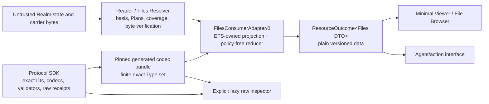

# File Browser / Web OS pressure on the layered Type and Data ABI

**Status:** draft — design-only adapter and fixture packet; no Type bytes, executable experiment, public data, protocol conformance, or product implementation is authorized
**Target repos:** planning, contracts, sdk, client
**Depends on:** [[Designs/efsv2/layered-type-system-and-data-abi]], [[Designs/efsv2/hierarchical-files-and-folders]], [[Designs/web-client-os/architecture-and-modules]], [[Designs/web-client-os/mvp-and-acceptance]], [[Designs/web-client-os/technology-foundation]]
**Reviewers:** @type-boundary-map, @type-journey-acceptance, @generated-sdk-ui-redteam (2026-08-22)
**Last touched:** 2026-08-22

#status/draft #kind/design #repo/planning #repo/contracts #repo/sdk #repo/client #topic/efsv2 #topic/read-path #topic/files #topic/app-model

## Outcome

The layered Type proposal can support the File Browser and later Web OS only
behind one finite, versioned, EFS-owned consumer adapter. The ordinary UI and
agent action surface should receive Files domain values plus qualified result
states. It should not receive `SemanticSpec`, `LogicalShape`, `Representation`,
`DataView`, or `QueryProfile` machinery and should never infer compatibility
from shape, a mutable catalog, or a self-asserted View.

The smallest credible first posture is **exact-Type-first**:

1. one adapter profile pins a finite exact Type/package closure and the Core,
   Realm, Files, result-code and interface profiles it understands;
2. generated codecs validate exact protocol bodies and preserve raw canonical
   bytes, while an EFS-owned projection produces bounded File Browser DTOs;
3. the Reader and Files Resolver return one shared discriminated outcome
   algebra to the UI, agents, Workers and later native adapters;
4. a bounded Data View may be a separately measured comparator for evolution,
   but View-wide discovery or acceptance is not an MVP dependency; and
5. every write plan is bound to one trusted operation interface and exact
   adapter profile, never to caller-supplied schema or Type metadata.

This pass does **not** justify an executable fixture under the current scope.
The Web Client/OS spine still prohibits product implementation and repository
scaffolding, and the Type proposal requires a separate disposable experiment
plan before T1–T9 code. The exact matrix below is the authorized reversible
outcome. A later owner-authorized experiment should instantiate it behind the
same adapter without promoting its bytes.

No new application-specific Core noun is required. Two already identified
generic pressures remain load-bearing: bounded complete Binding enumeration
and executor/operation-bound consent for Files-certified mutations.

## Authority and non-adoption boundary

- [[Designs/efsv2/layered-type-system-and-data-abi]] is a draft comparison
  target. Its names and formulas are evidence, not adopted protocol identity.
- Current MC/1/B0 Files Types and Core/Files mechanisms are also candidates.
  This packet uses symbolic profile and Type references so neither arm becomes
  a de facto SDK ABI.
- The adapter is a replaceable implementation boundary. It cannot redefine
  Core validity, Realm admission, Files meaning, Lens authority, exact Record
  identity, or query completeness.
- A generated TypeScript type is not an EFS Type. Durable APIs use explicit
  names such as `EfsTypeRevisionRef`; source-language convenience never erases
  the distinction.
- No fixture may publish irreversible data, select a canonical Realm or Type
  catalog, or set `protocolConformance=true`.
- Generated Web Components, schema renderers, forms and documentation are
  applicable Web contributions under WCOS-R65 and the mandatory gate in
  [[technology-foundation#Modern Web guidance and evidence gate]]. Generation
  supplies no accessibility, security, privacy, performance or browser-profile
  waiver.

## Three boundary approaches

| Approach | Result | Disposition |
|---|---|---|
| **A. Finite exact-Type adapter** | One adapter pins exact Types, generated codecs and Files semantics, then returns stable domain DTOs. A new Type is accepted only by an explicit adapter/profile generation. | **Recommended MVP/control.** Smallest authority story and easiest to reconstruct. |
| **B. Pinned Data View adapter** | A finite accepted Type set projects through one exact bounded `ViewRevisionId`; UI still consumes the same domain DTOs. | **Disposable evolution comparator.** Useful only if it reduces adapter churn without making structural projection semantic authority. |
| **C. Generic schema-driven UI or View-wide query** | Runtime schema packages generate UI/actions and discover arbitrary View implementers. | **Reject for MVP.** Leaks Type machinery and remote presentation into trusted surfaces, adds guest boot cost, and cannot honestly prove open-universe completeness. |

Approach A and B must expose identical app-facing values and outcomes. If the
View arm needs new UI concepts, ambient mapping traversal, publisher code,
automatic future-Type acceptance or weaker failures, it loses.

## Names that must not collapse

| Name | Meaning |
|---|---|
| `EfsTypeRevision` | Exact persistent-data decoder/validator identity |
| `ViewRevisionId` / Data View | Exact bounded Type-to-data projection identity from the layered proposal; “Data View” is only the qualified prose alias |
| `FilesViewSnapshot` | One exact Realm/Mount/Plan/basis-qualified Files resolution context |
| `ResolutionPlan` / contract Lens | Principal-qualified selection policy for Binding heads |
| `PresentationPlan` | Trusted local choice of safe renderer and UI behavior |
| `QueryProfile` | Exact-Type index obligation and coverage generation |
| `BindingScope` | Generic first-mutation scope used to enumerate Binding positions; not a Type query |
| `ConsumerAdapterProfile` | Local/versioned SDK mapping from finite protocol profiles into one product interface; not an EFS Record, View, grant or trust claim unless separately proposed |

The source-language packages and error messages must use these qualified names.
Bare `View`, `Type`, `Lens`, `Profile`, `verified`, and `schema` are too easy to
misread across the protocol, Files, UI, module and browser layers.

## Boundary graph



The exact generated bundle is build/release input owned by the trusted client
generation. Guest browsing never downloads, imports, evaluates, recompiles or
runs publisher-supplied generator/source/toolchain material. A raw descriptor
inspector is explicit, bounded, lazy and read-only; it cannot register a
handler, renderer, custom element, action, capability or locale message.
The Realm Reader and Files Resolver do not import adapter DTOs. The adapter
consumes their qualified evidence plus the pinned generated codecs and projects
one consumer value/outcome surface.

## Candidate adapter contract

Names and field spelling below are illustrative interface design, not frozen
TypeScript, WIT, JSON, Core or EFS bytes.

```text
FilesConsumerAdapterV0 {
  descriptor() -> FilesConsumerAdapterDescriptor

  parseRoute(untrustedUrl) -> ResourceOutcome<FilesRouteRequest>
  resolvePath(readContext, canonicalPath) -> ResourceOutcome<PathTarget>
  listDirectory(readContext, directory, cursor?, limit)
    -> ResourceOutcome<QualifiedPage<DirectoryRow>>
  openFile(readContext, fileObject) -> ResourceOutcome<OpenedFile>
  acquireVerified(openedFile, range?) -> ByteOutcome

  planCreateDirectory(readContext, CreateDirectoryIntent) -> PlanOutcome
  planCreateFile(readContext, CreateFileIntent, ExactContentInput) -> PlanOutcome
  planPublishRevision(readContext, PublishRevisionIntent, ExactContentInput)
    -> PlanOutcome
  compareReadBack(actionPlan, admissionEvidence) -> ActionReceipt

  inspectRaw(evidenceHandle) -> ResourceOutcome<RawInspection>
}
```

```text
FilesConsumerAdapterDescriptor {
  adapterInterfaceRevision
  adapterReleaseClosure
  CoreProfileRef
  RealmProfileRef
  FilesProfileRef
  acceptedExactTypeRevisions[]       # finite, sorted
  acceptedViewProjections[]? [{
    exactTypeRevisionRef
    viewRevisionRef                 # exact candidate ViewRevisionId
    viewBindingCommitmentRef        # exact canonicalViewBindingBytes inclusion or defined digest
    bindingPlacement: IN_TYPE | DETACHED_COMPARATOR
  }]
  generatedCodecClosure
  requiredExactTypeQueries[]? [{
    exactTypeRevisionRef
    queryProfileRef
    realmProfileRef
    requiredGeneration
    requiredCoverage
    requiredBasisRule
  }]
  requiredBindingScopeListing? {
    scopeProfileRef
    namespacePlanRef
    genesisOrBackfillRequirement
    sameBasisTerminalPageRequirement
  }
  acceptedViewInventorySnapshots[]? # optional T4 comparator only
  resultRegistryRevision
  actionInterfaceRevision
  writeCertificationProfile
  conformanceClaims[]                # false/qualified until separately proved
}
```

The adapter descriptor is exact release evidence. It grants no authority and
does not make a Type, View, QueryProfile, catalog, generator or Files write
safe merely by listing it.

`IN_TYPE` requires the binding commitment to be included in the named exact
Type revision. `DETACHED_COMPARATOR` is disabled outside the separately
labelled experiment and gains no authority from structural validity. No exact-
Type `QueryProfile` certifies Files directory enumeration; only the separate
`requiredBindingScopeListing` evidence can support that claim.

The optional T4 arm uses one reconstructible manifest:

```text
ViewInventorySnapshot {
  viewRevisionRef                    # exact candidate ViewRevisionId
  typeInventoryHighWater
  includedExactTypeQueries[] {       # sorted by exactTypeRevisionRef
    exactTypeRevisionRef
    queryProfileRef
  }
  membershipAndCoverageRuleRef
  realmProfileRef
  requestedBasis
}
```

View-wide `COMPLETE` is legal only for the exact manifest plus terminal
coverage required by its membership/coverage rule. “Data View” elsewhere in
this packet is a qualified prose alias; persisted evidence uses
`ViewRevisionId` and the exact binding commitment.

### Generated protocol/codegen surface

The Protocol SDK and generator need exact, raw-preserving bindings for the
candidate bodies and Core ABI structures actually traversed by the journeys:

- `ObjectGenesis`, `DirectoryEntry`, `DirectoryWhiteout`, `FileRevision`,
  `MountDescriptor`, public Mount config and route config;
- `ResolutionPlan`, Binding key/head/target/set/tombstone and `BindingScope`
  page/cursor evidence;
- `ChunkTree`, byte/digest/Locator and availability/evidence bodies;
- Record, Occurrence, PublicationEnvelope, Realm admission/basis/finality and
  Principal historical-authorization structures; and
- the action/admission structures used by the selected direct-Core or
  Files-certified write profile.

Some items above are Core ABI structures or derived codecs rather than admitted
EFS Records. Code generation preserves that category instead of making every
shape look like one universal EFS Type.

Every decoded value retains:

```text
DecodedExactRecord<T> {
  exactTypeRevisionRef
  recordId
  canonicalBody
  value?                       # only after exact validation
  referenceExtraction
  validationReceipt
  unknownFieldOrVariantEvidence?
}
```

An older decoder never reserializes a newer body through a lossy object model.
Unknown or unsupported exact Types remain raw, inspectable evidence.

### Minimum app-facing DTOs

The UI, agent and service boundary needs only these generated bindings from one
EFS-owned interface definition:

| DTO | Minimum contents |
|---|---|
| `FilesRouteRequest` | chain namespace/reference, Core/deployment/profile, Realm descriptor/revision/basis hints, route config, root Mount, distinct namespace/content/metadata Plans, canonical path and requested purpose |
| `FilesReadContext` | exact pinned route fields, `INTERACTIVE | GATE | BACKGROUND | ACTION_PLAN`, finality/freshness policy, transport policy, deadline/cancellation and query budget |
| `DirectorySnapshot` | exact directory Object, Files view, rows/page, qualification, coverage and continuation |
| `DirectoryRow` | canonical name bytes/string, child Object, FILE/DIRECTORY kind, optional effective Mount, selected placement/Binding evidence handle and provenance summary |
| `OpenedFile` | File Object, selected immutable FileRevision, ChunkTree/commitment, media hints, pinned open handle and qualification |
| `BindingResolutionTrace` | derived position, Principal-qualified candidate heads, Plan result, selected occurrence/revision and typed blocking reason; ordinary UI receives a concise summary while Inspector receives the full trace |
| `LocatorAttempt` | eligible Locator evidence, endpoint class/fingerprint, outcome, bytes/range attempted, timing and privacy disclosure; never Release/File identity |
| `ActionIntent` variants | only bounded semantic fields for create directory, create file and publish revision; no arbitrary Type, View, schema, Plan or rich prompt supplied by the caller |
| `ActionPlan` / `ActionReceipt` | exact interface/adapter identity, semantic effects, roles, CAS/preconditions, predicted IDs/commitments, disclosure/cost, authorization/admission/finality ladder and canonical read-back |

Presentation-only labels and messages come from trusted EFS locale packs keyed
by stable field/error/explanation codes. Type packages and generator output may
not supply HTML, ARIA authority wording, bidi controls, permission language,
focus order, action grouping or trusted ceremony prose.

Each DTO field and evidence handle declares a public/private/secret data class
and disclosure policy. `EvidenceHandle` is opaque, scoped and non-forgeable;
raw inspection requires a separate inspection capability and never follows
merely from a read/action capability. Human and agent parity means identical
authorized semantics and outcome law, not disclosure of route, Locator,
provenance or private evidence beyond a capability-filtered/redacted DTO.
Forwarding, persistence or network export of those fields is an explicit
planned effect.

DTO values—including canonical names, media hints, diagnostics and raw
evidence—remain untrusted display data. Render them as bounded escaped text
with bidi isolation and control visualization where required. They cannot
supply HTML, trusted `aria-*` authority wording, locale keys, focus behavior,
permission text, destination labels or action grouping. Accessible names
combine a trusted localized template with the safely rendered value.

## Qualified outcome algebra

One optional `value?` plus loosely related status fields is too easy for UI or
agent bindings to misuse. The shared interface uses an exhaustive discriminated
outcome while preserving independent qualification axes.

```text
ResourceOutcome<T> =
  PRESENT {
    value: T,
    satisfiedClaim,
    qualification,
    evidence
  }
| PARTIAL {
    partialValue?,
    missingCoverage[],
    qualification,
    evidence,
    resume?
  }
| UNKNOWN {
    reason,
    requestedClaim,
    qualification,
    evidence,
    resume?
  }
| ABSENT {
    completeBasisProof,
    qualification,
    evidence
  }
| MASKED {
    selectedWhiteoutOrPolicy,
    qualification,
    evidence
  }
| CONFLICT {
    competingCandidates[],
    qualification,
    evidence,
    resume?
  }
| INVALID {
    subject,
    validationStage,
    diagnostics[],
    qualification,
    evidence
  }
| UNSUPPORTED {
    requiredAdapterOrProfile,
    encounteredTypeOrInterface,
    rawEvidenceHandle?,
    qualification
  }
```

`PRESENT` means the named claim—such as “this File exists at this exact
FilesView basis”—was established. It does not mean universally trusted,
current forever, executable, safe, complete beyond the requested scope, or
available as bytes.

`qualification` keeps at least these axes separate:

```text
typeValidation
historicalAuthority
RealmAdmission
BindingOrLensSelection
basis + finality + freshness
coverage + completeness
consumerAcceptance
```

Byte acquisition has a separate exhaustive result:

```text
ByteOutcome =
  BYTES_VERIFIED { semanticRef, commitment, verifiedRangeOrClosure, attempts[] }
| BYTES_TAMPERED { semanticRef, commitment, completeAttemptCoverage, attempts[] }
| BYTES_UNAVAILABLE { semanticRef, commitment, completeAttemptCoverage, attempts[] }
| BYTE_STATUS_UNKNOWN { semanticRef, commitment?, missingCoverage, attempts[], resume? }
| BYTE_POLICY_DENIED { semanticRef, policy, attempts[] }
| BYTE_CANCELLED { semanticRef, attempts[], resume? }

LocatorAttempt.outcome =
  VERIFIED | NO_TRANSPORT | UNAVAILABLE | TIMEOUT | MALFORMED_CLAIM |
  TAMPERED | INCOMPLETE | POLICY_DENIED | CANCELLED
```

A corrupt primary followed by a verified fallback therefore returns
`BYTES_VERIFIED` with one retained `TAMPERED` attempt. `TAMPERED` never poisons
the FileRevision or silently changes the commitment. With complete eligible
coverage and no verified bytes, any tampered attempt makes the terminal result
`BYTES_TAMPERED`; `BYTES_UNAVAILABLE` is reserved for complete coverage with no
tampering. Incomplete Locator coverage remains `BYTE_STATUS_UNKNOWN`.

Only `ABSENT` with its complete-basis proof, or an intentionally hidden
`MASKED` result whose selected whiteout/policy and scope are retained, may feed
a not-found UI. Only a complete-basis semantic absence or selected whiteout
may populate a protocol negative cache; a local presentation mask is not
protocol absence. `PARTIAL`, `UNKNOWN`, `INVALID`, `UNSUPPORTED`, missing
bytes, timeouts, empty pages and local optimistic state may not.

Action planning has its own exhaustive law:

```text
PlanOutcome =
  PLAN_READY { plan: ActionPlan }
| PLAN_INVALID_INTENT { diagnostics[] }
| PLAN_DENIED { policyOrCapability, evidence }
| PLAN_CONFLICT { preconditions, evidence, resume? }
| PLAN_UNKNOWN { reason, evidence, resume? }
| PLAN_UNSUPPORTED { requiredAdapterOrInterface, evidence }
| PLAN_CANCELLED { resume? }
```

UI, agent, Worker/WIT and native bindings expose the same discriminants. Each
`ActionReceipt.perEffectState` is likewise drawn from one exact versioned
`EffectOutcome` registry; UI copy is never the state machine.

## Interface-bound actions

The Type proposal's `InterfaceRevision`/`WorldProfile` separation is useful,
but a data Type/package is inert and cannot generate an authority-bearing
action by itself.

```text
ActionPlan/0 {
  interfaceRevisionId
  operationKey
  schemaVersion
  adapterProfile
  writeProfile
  protocolConformance
  filesPreconditionCertified
  intentDigest + planDigest
  pinnedReadContext
  authorPrincipalId
  authorizationContext =
    EXPLORATORY { defaultAccountHint? }
  | SIGNABLE { actualSignerAccount, historicalAuthorizationBasis }
  requester
  submitterOrRelayer?
  payerOrSponsor?
  semanticEffects[]
  exactRecordAndBindingEffects[]
  requiredCapabilities[]
  preconditions[]                 # including canonical CAS vectors
  predictedIdsAndByteCommitments[]
  publicPrivacyNetworkCostEffects[]
  requiredAuthorizationArtifacts[]
  expiry + state
}

ActionReceipt/0 {
  planDigest + interfaceRevisionId + executionId
  writeProfile + protocolConformance + filesPreconditionCertified
  effectOutcomeRegistryRevision
  actualRoles
  authorizationEvidence[]
  perEffectState[]
  submissionAdmissionFinalityEvidence[]
  readBack: ResourceOutcome<ExpectedFilesResult>
  diagnostics[] + resume?
}
```

`writeProfile`, both conformance booleans, signer/authority fields and every
semantic/effect precondition are included in `planDigest` and the canonical
read-back comparison. `READY_FOR_SIGNATURE` and every later state require the
`SIGNABLE` arm; if the actual signer or historical authorization basis cannot
be established at the pinned basis, planning returns
`PLAN_UNKNOWN` or `PLAN_UNSUPPORTED`; a non-signable exploratory draft has a
distinct state and cannot proceed to authorization. A direct-Core plan and
receipt are exactly `EXPERIMENTAL_DIRECT_CORE`, `false`, `false`; a later
certified profile names its independently proved certification basis.

Unknown request fields or operations reject before planning. An unknown major
interface refuses execution. An unknown minor operation returns typed
`UNSUPPORTED` with no effect. Unknown response fields remain raw-preserved and
surface as `UNSUPPORTED` or `PARTIAL` when they could affect the requested
claim; state-changing readers never silently ignore them.

UI and authorized agent calls use the same intent validator, planner and
read-back comparator and obtain the same plan digest from the same inputs.
Neither can submit a schema, View, Type package or Presentation string that
changes the trusted action structure.

## Layer-leakage verdict

| Layered-Type concept | Lowest layer that needs it | Ordinary UI/agent treatment | Leak that fails this design |
|---|---|---|---|
| `SemanticSpecId` | Type authoring/package verification, consumer acceptance and Inspector | Hidden; Inspector may show exact meaning commitment and publisher/curator evidence | UI infers File meaning, trust or action authority from the spec alone |
| `LogicalShapeId` | generator, canonical decoder and compatibility tool | Hidden; raw Inspector only | shape equality selects a renderer, action, Type or fallback |
| `RepresentationId` | codec generator/validator and raw reconstruction | Hidden; raw Inspector only | browser guesses representation or treats alternate bytes as the same Record |
| `TypeRevisionId` | Protocol SDK and finite Files adapter | Friendly UI hides it; Inspector and `UNSUPPORTED` diagnostics expose it | mutable `latest`, catalog alias or same shape substitutes for the pinned Type |
| `ViewRevisionId` (Data View) | Core/SDK projection comparator and finite adapter acceptance | Hidden during ordinary use; Inspector explains projection | caller/self-asserted View enters trust, selection or action authority |
| `QueryProfileId` | Realm/index reader and adapter coverage contract | Friendly UI says complete/partial/unknown; Inspector exposes ID/generation/basis | UI queries arbitrary profile or equates a partial/empty page with absence |
| Type families, traits, successors, projections and catalogs | discovery/authoring/consumer policy | Optional lazy evidence | generic SDK traverses them to infer compatibility or authority |
| generator/source/toolchain artifacts | reproducible build evidence | No guest runtime presence | publisher code executes, imports, registers UI or adds a critical-path request |

The generic Protocol SDK may expose `EfsTypeRevisionRef`,
`RawCanonicalRecord`, exact decode/validate, bounded
`projectPinnedDataView`, and qualified page primitives. Rich compatibility,
catalog UX and acceptance of a successor belong to tooling or explicit
consumer policy. The Files SDK owns the domain projection; the Web Client owns
presentation only.

## Reusable Type-control dispositions

These three controls came from the parent Type pressure lane. This packet
instantiates them only as proposal-labelled fixture arms.

| Control | Does this workload need it? | File Browser / OS disposition |
|---|---|---|
| Qualified existence target: `targetClass=RECORD|OBJECT` plus `constraint=EXISTS` | **Yes, narrowly**, for lossless unknown-reference inspection, backlinks, archive/export closure and resumption. Authority-bearing Files references avoid it. | Compare raw-reference preservation, exact Type, pinned View and existence-only arms. Existence-only proves only that the exact Record/Object exists at the named basis. It preserves existence/backlink/archive closure but proves no Files meaning, authorship, authorization, admission-currentness, Binding/Lens selection or byte availability. Unqualified `ANY` is never a closed target and cannot satisfy a Files action or head/parent validator. |
| Exact self-reference across Type evolution | **Yes if** a `FileRevisionFixture/2` parent DAG cites a `/1` revision; otherwise the read-only evolution can avoid the seam. | `ref(record self)` is exact-Type-revision self and therefore cannot cite `/1` from `/2`. The cross-version fixture must use an explicitly finite exact `{v1,v2}` target set or a pinned View whose semantics are sufficient. An existence-only target still needs Files app validation and is rejected for authority-relevant revision lineage in this control. |
| View-wide `COMPLETE` | **No for MVP**; exact-Type queries and BindingScope cover its journeys. **Yes only** in the optional T4 comparator. | Completeness is qualified to one pinned finite Type-inventory high-water snapshot and terminal coverage for every included profile. A later Type does not invalidate the old snapshot's qualified result, but the current/open-universe query is `PARTIAL` until a new inventory snapshot classifies it. |

These controls do not make existence into authority, self-reference into
structural compatibility, or a snapshot into permissionless future
completeness.

## Fixture-wide symbolic pin

No candidate bytes or deployment are selected:

```text
R   = explicit disposable Realm
RR  = pinned Realm implementation/admission-policy revision and Core profile
B0  = initial block-hash/admission-high-water basis
B1  = later pinned read-back basis
RC  = exact FilesRouteConfig
M   = exact root Mount
PN  = mount-local namespace ResolutionPlan
PC  = mount-local content ResolutionPlan
PM? = optional metadata ResolutionPlan
P   = candidate author PrincipalId
A   = actual signer account plus historical authorization basis
AP0 = exact FilesConsumerAdapterProfile control
```

Every result and receipt retains `R, RR, B, RC, M, PN, PC, PM?`, adapter
profile, exact selected Type/Record/Occurrence/Binding IDs, coverage, Locator
attempts and result grade. Guest journeys make zero wallet/provider, Commons,
full-OS, hosted-indexer, Service Worker or private-store calls.

## Exact fixture and acceptance matrix

| ID and journey | Generated call / validator | Pinned inputs and candidate primitive | Required result | Falsifier |
|---|---|---|---|---|
| `TDAB-G1` clean nested guest browse | `parseRoute`, `resolvePath`; route, Mount, Files-name/profile and exact Record validators | `R,RR,B0,RC,M,PN,PC,AP0`; Realm Records/admission, DirectoryEntry, Binding and FileRevision | `PRESENT<FileTarget>` with exact basis/provenance and zero optional-system activity | Hidden deployment/Lens/indexer, wallet/cache/OS import, or unsupported Type becomes absence |
| `TDAB-G2` Binding/Lens point resolution | position/Binding-key derivation, target/profile validator, bounded Plan reducer | `PN`, parent Object and canonical name; Principal-qualified Binding heads; Plan arms 1/8/32/64 | selected Entry as `PRESENT`, selected Whiteout as `MASKED`, or typed `ABSENT`, `CONFLICT`, `UNKNOWN`, `INVALID`; no fallthrough through a blocking result | unavailable/malformed higher priority falls through, keys replace Principals, or route/UI supplies ambient Lens authority |
| `TDAB-G3` complete-or-qualified listing | `listDirectory`; BindingScope cursor, first-mutation hydration, role-union, coverage and same-basis validators | every unique Principal in `PN`; genesis/backfill state and terminal pages at `B0` | `PRESENT<QualifiedPage>` with `COMPLETE`, or `PARTIAL` naming missing scope/principal/page/coverage and resume | known-name or Type QueryProfile is presented as complete directory enumeration; empty partial page becomes absence |
| `TDAB-G4` unavailable basis/history | exhaustive `ResourceOutcome` validator and negative-cache guard | requested `B0` with one required historical/basis proof withheld | `UNKNOWN(HISTORY_OR_BASIS_UNAVAILABLE)` with resume; no lower-tier answer | 404, empty, `ABSENT`, cached negative or hidden live read |
| `TDAB-R1` qualified existence-only reference | typed-reference extractor and exact Record/Object existence validator | same unknown target under raw-preservation, exact-Type, pinned-View and proposed `targetClass=RECORD|OBJECT, constraint=EXISTS` arms; pinned basis | each arm reports its exact closure; existence-only retains existence/backlink/archive closure while authority/currentness/Files meaning remain `UNKNOWN` or unevaluated | unqualified `ANY` is called closed, existence grants authority, or the client drops the unknown exact target |
| `TDAB-W1` create folder | trusted `CreateDirectoryIntent`, ObjectGenesis/Entry codecs, charter/name Binding and plan/read-back comparator | `R,RR,B0,RC,M,PN,P,A`, parent heads and expected revisions | plan predicts exact Object/Entry/Binding effects; two explicit authorization artifacts under current candidate; at `B1` exact point read matches every predicted ID | wallet probes before intent, Principal/signer collapse, optimistic/admitted conflation, same-name wrong Object satisfies read-back |
| `TDAB-W2` create file | folder validators plus ChunkTree, FileRevision, file-head Binding and byte commitment validators | `R...PN,PC,P,A`, exact local bytes and carrier plan | at `B1`, namespace Plan selects exact File, content Plan selects exact initial revision, byte verifier matches commitment; receipt remains proposal-labelled | URL/CID becomes identity, missing charter/head/commitment passes, or carrier success equals admission |
| `TDAB-W3` publish immutable revision | revision parent-DAG/same-node validator, ChunkTree codec, file-head CAS and read-back comparator | current exact file head/expected revision under `PC` at `B0` | new immutable revision selected at `B1`, old revision still opens by exact ID, stale CAS requires a new plan | old bytes mutate, stale retry is silent, or head can select another File Object |
| `TDAB-B1` no transport | Locator eligibility/attempt ledger and `ByteOutcome` validator | valid selected FileRevision/ChunkTree with every eligible transport unavailable | semantic file remains `PRESENT`; `BYTES_UNAVAILABLE` or `BYTE_STATUS_UNKNOWN` according to coverage | missing carriers erase semantic File/Revision or create negative cache |
| `TDAB-B2` tampered primary/fallback | digest/length/ChunkTree verifier and attempt-transcript validator | fixed selected commitment; primary wrong bytes, fallback exact bytes | primary attempt `TAMPERED`, final `BYTES_VERIFIED`, unchanged FileRevision/commitment | corrupt bytes reach renderer, Release/File identity is poisoned, or fallback silently changes bytes/identity |
| `TDAB-B3` all eligible bytes tampered | byte verifier, complete eligible-Locator coverage and attempt transcript | every eligible candidate returns bytes that violate the selected commitment | semantic file remains `PRESENT`; terminal acquisition is `BYTES_TAMPERED`, never absence or generic unavailable | a caller must inspect nested attempts to discover corruption, corrupt bytes render, or an incomplete set is called terminal |
| `TDAB-E1` one Type evolution | independent descriptor/body vectors, compatibility-direction and adapter-profile validators | exact provisional v1/v2 Type IDs; `EXACT` control plus finite Data View comparator; pinned adapter generation | new adapter reads explicitly accepted revisions; old adapter returns `UNSUPPORTED` plus raw evidence; old Records and exact citations unchanged | same shape implies same meaning, mutable latest reinterprets history, unknown fields are dropped, or new index claims complete before backfill |
| `TDAB-E2` cross-revision parent lineage | typed-reference-role and Files revision-lineage validator | `/2` revision cites exact `/1` parent; finite `{v1,v2}` target-set arm versus pinned-View arm | accepted only through the explicitly selected finite target rule plus Files same-object/parent validation; exact self alone rejects it | `/2` self silently matches `/1`, existence proves lineage, or structural View validity grants authority |
| `TDAB-Q1` finite View-inventory snapshot | optional T4 inventory/high-water and per-Type profile coverage validator | pinned finite inventory snapshot, then one later implementing Type | old snapshot may remain qualified `COMPLETE` for its closed inventory; the current/open query becomes `PARTIAL` until a new snapshot classifies the later Type | `COMPLETE` means all future implementers, a later Type silently expands old results, or hostile self-implementation poisons the snapshot |
| `TDAB-A1` human/agent parity | one `ActionIntent`, `ActionPlan` and `ActionReceipt` interface validator | identical inputs, policy and adapter profile | identical plan digest/effects; agent gets structured outcomes and no weaker authority path | UI-only action, agent DOM scraping, remote schema changes ceremony, or ambient signer access |
| `TDAB-A2` plan failure/redaction parity | exact `PlanOutcome`, effect-state and disclosure-policy validators | cancel, deny, conflict, unknown and unsupported cases; redacted versus full inspection capability | human/agent/Worker/native bindings preserve the same plan state; redacted agent can receive an authorized plan/digest without private route/Locator/raw evidence, and full disclosure appears as a planned grant/effect | generic throw/error string, hidden retry, or read/action authority unlocks raw/private evidence |
| `TDAB-U1` hostile display data | DTO rendering, trusted-locale-template and accessible-name suite | filenames/media/diagnostics containing markup-like text, bidi controls, prompt injection and overlong graphemes | escaped bounded text, required bidi isolation/control visibility, equivalent keyboard/screen-reader meaning, no DOM activation or trusted-action wording change | remote value supplies HTML/ARIA/locale/action grouping, spoofed destination/permission copy, or inaccessible truncation |
| `TDAB-P1` Web/performance gate | `verify:web-evidence`: retained guidance match/`NO_GUIDANCE_MATCH`, primary-standard revision, feature-policy row, measured full/reduced/unsupported/rescue profile, native-before-library decision, accessibility/privacy/performance fixtures and independent review; plus exact bundle/egress trace | guest route on every declared Web Profile with Inspector/codegen blocked | zero publisher generator/guidance/runtime requests; DTO rendering meets bytes/CPU/a11y/i18n/privacy budgets | generated code bypasses evidence, schema supplies trusted UI, or Type machinery enters guest critical path without measured need |

## Disposable evolution fixture

The single evolution case is deliberately a fixture, not a recommendation to
change the candidate Files Type:

```text
FileRevisionFixture/1
  node, content, mediaType, charset?, executableHint, parents[]

FileRevisionFixture/2
  same permanent field keys
  + contentLanguage? at one new permanent numeric key
```

1. Version 2 receives a new `LogicalShapeId`, `RepresentationId` and
   `TypeRevisionId`. If the v1 normative semantic commitment already defined
   the optional language axis, the experiment may retain its `SemanticSpecId`;
   otherwise semantic meaning also changes and a new `SemanticSpecId` is
   mandatory. The tool must make this choice explicit rather than guessing.
2. The exact-Type control uses two generated decoders and accepts only the
   finite set named by `AP0` or its successor.
3. The comparator defines a bounded `FileRevisionCoreDataView/1` over the
   authority-relevant common slots. Its adapter still pins the exact v1/v2
   Types and exact binding commitment/placement; a random future
   self-implementer is not accepted. A detached binding exists only in the
   labelled comparator arm.
4. If a `/2` revision cites a `/1` parent, exact `ref(record self)` is
   insufficient because self means the same exact Type revision. The fixture
   compares an explicitly finite `{v1,v2}` reference target with the pinned
   common View. A generic existence-only target is retained as a negative
   control and cannot pass Files same-object/lineage validation by itself.
5. The old adapter returns `UNSUPPORTED` with the exact raw v2 body and needed
   adapter/profile. It never decodes v2 as v1, ignores the selected file head,
   falls through, reports absence, or rewrites the body.
6. The new adapter produces the same common `OpenedFile` DTO plus a typed
   optional extension. `contentLanguage` affects presentation only and grants
   no renderer, execution, authority or locale-pack capability.
7. If an exact-Type index is needed for v2, it receives a new QueryProfile and
   remains `PARTIAL` until exact backfill coverage. Directory completeness
   still comes from BindingScope across the namespace Plan, not from this Type
   query.
8. The optional View-wide arm pins one finite Type-inventory high-water
   snapshot and terminal coverage for every included exact-Type profile. A
   later implementing Type leaves the old snapshot's qualified `COMPLETE`
   result intact but makes a current/open query `PARTIAL` until a successor
   inventory snapshot classifies it.
9. Exact v1 Records, IDs, citations and cached verified bytes remain valid.
   A mutable successor/catalog link proposes v2 but never changes an open
   resource or old receipt.

Kill the View comparator if it accepts unknown implementers, changes authority
or failures, loses raw data, adds Core graph traversal, or requires a different
UI/agent contract from the exact-Type control.

## Generated validators and fixed attacks

| Validator family | Must prove | Fixed attacks |
|---|---|---|
| Exact descriptor/body | canonical ID/body, bounds, reference roles, unknown preservation and rejection precedence | same-shape wrong meaning, wrong representation, duplicate/reserved key, excessive depth/work, trailing bytes, unknown variant |
| Typed references | exact closed target class, exact-revision self, finite set/View/existence-only mode and preserved target evidence | unqualified `ANY`, `/2` self matching `/1`, existence as authority/currentness, dropped unknown target |
| Files semantic profile | object charter/meaning, canonical name, parent/child/mount equality, media grammar, revision parents and exact head target | wrong parent/name/Type, Occurrence instead of Record, FILE/DIRECTORY swap, invalid mount, cross-object revision |
| Binding/Lens | exact position/key, Principal-qualified heads, selected Plan algorithm/basis, blocking malformed/conflict/unknown result | controller key as Lens entry, caller-selected Plan, malformed high-priority fallthrough, stale head |
| Listing coverage | BindingScope genesis/backfill, all unique Plan Principals, same-basis terminal pages, role hydration/union/point resolution | first tombstone, Withdrawal, 10,240 dead roles, duplicate/churn roles, empty partial pages, cursor replay across view |
| Bytes | ChunkTree geometry/root/digest/length, range proof, complete attempt transcript and terminal tampered/unavailable distinction | corrupt primary, all tampered, partial fallback, wrong commitment, decompression/size bomb, MIME disagreement, all carriers unavailable |
| Actions/read-back | interface/adapter/write profile identity, exhaustive plan/effect outcomes, roles/signing basis, conformance labels, exact effects, CAS, both authorization artifacts, admission/finality and predicted-result equality | default account as Principal, signable plan without authority basis, remote schema adds effects, silent CAS retry, relayer/payer collapse, same-name competing Object |
| Evolution | exact v1/v2 IDs, directional read, raw preservation, finite committed/comparator View set, exact cross-revision reference rule, QueryProfile and finite inventory-snapshot coverage | implicit shape/self compatibility, mutable latest, unknown-field loss, auto-accept future Type, open-universe or premature COMPLETE |
| Consumer rendering/disclosure | field data class, capability-filtered evidence, trusted locale template, escaped/bidi-safe bounded text and accessible meaning | raw-inspection escalation, route/Locator leak, markup/ARIA injection, spoofed action copy, prompt-injection prose |

Cross-language Type bytes and rejection precedence remain owned by the Type
T1/T2 work. This client packet consumes those vectors and adds product-level
projection/outcome/action/read-back vectors; it must not make one shared
generated implementation count as independent proof.

## Core pressure packet 1 — bounded complete Binding enumeration

**Journey.** A clean guest lists every name in one selected directory under
`PN` at `B0`, including names first introduced by a tombstone and names whose
old occurrences were later withdrawn.

**Invariant/read.** `COMPLETE` requires every possible name position for every
unique Principal in the selected namespace Plan, terminal same-basis pages and
genesis or completeness-gated backfill coverage. An empty page is not absence.

**Why current generic primitives fail.** Known-key Binding reads cannot
discover unknown name roles. Type/backlink/Principal occurrence postings have
the wrong liveness and key domain and cannot prove the complete current plural-
Plan namespace.

**Proper layer.** A bounded, state-readable generic Core Binding-scope/index
primitive. Files owns reversible name roles, Plan reduction and sorting.

**Leading alternative.** The current genesis-present `BindingScope` candidate
records first bind/first tombstone per `(Principal,purpose,subject)` and exposes
bounded pages with explicit basis/coverage. A generic completeness-gated
backfill is the only eligible upgrade path.

**Falsifier.** Existing generic indexes reconstruct the same set under
withdrawal, tombstone and high churn with bounded work and honest completion;
or `BindingScope` cannot remain reconstructible/bounded under the fixed churn
fixture.

**Cost of deferral.** The File Browser can provide known-name point lookup,
including `ABSENT` only where the pinned Plan and authoritative Binding map
prove it, plus qualified partial listings. Without BindingScope it cannot
advertise complete directories, infer absence from a listing, or certify
enumeration-based read-after-create.

## Core pressure packet 2 — executor/operation-bound mutation consent

**Journey.** A user creates a folder/file or publishes a revision and the
official client claims the admitted effects obeyed the selected mount-local
Plans, exact CAS/NOREPLACE preconditions and authorized semantic operation.

**Invariant/write.** Consent and the reconstructible receipt bind the Realm,
executor/certifier, operation hash, ordered leaves/leaf mask, expected revision
vector, selected Plans/basis, action, nonce/expiry and actual signers. Direct
generic publication cannot impersonate Files certification.

**Why current generic primitives fail.** Generic Record/Binding admission can
make individually valid state but does not by itself prove the complete
Files-level route/Plan/precondition computation or prevent bypass of a claimed
certifier.

**Proper layer.** Generic executor/operation-bound admission consent and
receipt semantics in Core/Realm; a separately codehash-pinned FilesRouter or
equivalent application certifier consumes it. The Type system does not gain a
Files mutation noun.

**Interim.** A fixed wallet-owned, single-Principal direct-Core fixture may be
useful only when explicitly authorized and must report
`EXPERIMENTAL_DIRECT_CORE`, `protocolConformance=false`, and
`filesPreconditionCertified=false`.

**Falsifier.** Existing generic admission already binds and enforces every
listed invariant atomically, blocks direct bypass and permits independent
historical reconstruction without a new seam.

**Cost of deferral.** The official client can debug basic writes but cannot
claim Files-certified arbitrary Plan semantics or graduate the experimental
receipt labels.

## No additional Core change from this pass

- Type-layer-to-Files projection belongs in generated SDK/adapters and explicit
  consumer policy. Core must not infer semantic compatibility or execute a
  generator.
- Corrupt/unavailable Locator fallback belongs in exact commitment evidence,
  transport policy and the client verifier. It needs no Files-specific Core
  noun.
- Type evolution uses immutable exact Types, explicit finite acceptance and
  QueryProfile coverage. It does not require mutable schema identity or a Core
  inheritance graph.
- Qualified existence-only reference targets, exact-revision self semantics and
  finite inventory snapshots remain Type T1/T4 comparison controls. The Files
  path can reject unqualified/open references and does not require a new
  Files-specific Core noun for them.
- Action interface schemas describe effects and errors but grant no authority;
  capability and signing remain Shell/Kernel policy.

## Feedback to the layered Type proposal

This packet asks the EFS v2 Type owner to pressure-test, not adopt, these
generic requirements:

1. **Normative generated-consumer boundary.** Generated ABI output is pure
   codecs, validators, bounded domain DTO bindings and opaque evidence handles.
   Layer descriptors, catalogs and generator artifacts are inspection/build
   evidence, not primary UI or agent schemas.
2. **Consumer-owned exact projection.** One versioned consumer adapter maps a
   finite accepted exact Type/View set to domain DTOs. A Type package cannot
   self-install that mapping or make its display/action metadata trusted.
3. **Exhaustive outcome bindings.** Generated TypeScript, Rust, WIT/JSON and
   agent bindings preserve `PARTIAL`, `UNKNOWN`, `INVALID`, `UNSUPPORTED`,
   conflict, proved absence, semantic presence and byte availability as
   distinct cases with evidence/resumption.
4. **Action interfaces remain separate from data Types.** Plans and receipts
   bind one trusted `InterfaceRevision`; callers fill bounded intent slots and
   cannot supply executable validation or prompt content.
5. **No runtime generator authority.** Exact package closures may contain
   generator/source/toolchain material for reproducibility, but trusted client
   releases use prebuilt pinned codecs. Guest routes execute none of it.
6. **Unknown preservation is end to end.** Raw exact bodies survive decoding,
   projection, cache/export and adapter evolution; state-changing consumers do
   not ignore unknown fields/variants that could affect the requested claim.
7. **Query axes remain separate.** Type QueryProfile coverage cannot certify a
   complete Files directory. View-wide completeness remains a separate T4 arm
   and is not required by the File Browser.
8. **Reference targets are closed and qualified.** Unqualified `ANY` supplies
   no closed reference contract. A proposed existence-only Record/Object target
   preserves exact closure while proving no authority/currentness, and exact
   self means the same exact Type revision.
9. **Cross-revision lineage is explicit.** A new Type cannot cite an old
   revision through exact self. Consumers use a finite exact target set or a
   pinned View plus domain validation; existence alone is insufficient for
   authority-relevant lineage.
10. **View-wide completion is snapshot-qualified.** A `COMPLETE` result names
    the finite Type-inventory high-water snapshot and terminal per-Type
    coverage. Later Types do not rewrite that old result and keep a current/
    open query `PARTIAL` until a successor snapshot classifies them.

## Future disposable experiment gate

If the owner separately authorizes execution, write a collision-safe plan
before code. The experiment should be perishable and live under an explicitly
named `experiments/` boundary in an authorized existing workspace, never a new
greenfield product repository by implication.

Required inputs:

- a frozen-for-the-experiment B0 control and layered candidate descriptor/body
  vector closure from the Type lane;
- one synthetic Realm state fixture containing the exact route, directory,
  File, Binding/Lens, scope, Locator and write/read-back cases above;
- two independently implemented exact codec/validator results rather than one
  generator reused as its own oracle;
- exact adapter/interface/result profile manifests and malformed corpora; and
- the retained modern-Web guidance/standards-evidence closure required by
  WCOS-R65 before any UI or generated document is created.

The experiment must be offline by default, deploy no contract/public Record,
contact no live wallet, live Realm RPC or live carrier, import no product code,
and expose `protocolConformance=false`. Every Realm/carrier input is a
synthetic, retained offline fixture. A later live adapter is a separate
authorization.

## Acceptance and morning verdict

This pressure packet is complete enough for the next design iteration when:

- every MVP read/write journey maps to one adapter call and exhaustive result;
- exact Type layers are inspectable but absent from ordinary UI/action inputs;
- exact-Type and finite-View evolution arms share one UI/agent contract;
- old/unknown data is raw-preserved and never becomes absence;
- `TAMPERED` is a Locator attempt while semantic identity and byte outcome stay
  separate;
- actions bind one trusted interface, roles, effects, preconditions and
  canonical read-back;
- BindingScope and routed-consent pressures remain precise and no new Core noun
  is invented;
- generated Web output remains subject to WCOS-R65; and
- no code, permanent bytes, deployment or irreversible data was created.

Morning verdict: **proceed with the versioned exact-Type adapter and matrix as
the Web Client/OS boundary recommendation; do not begin the executable fixture
or ask for a Type/Core permanence choice yet.** First obtain explicit fixture
authorization and frozen-for-experiment Type/Core/Files inputs. Return to the
owner only if the exact-Type and finite-View arms both survive but impose a
real product fork, or if a measured generic Core gap remains after the two
falsifiers above.

## Open questions

- [ ] Which exact B0 and layered descriptor/vector closures are sufficiently
      stable to freeze only for the disposable comparison?
- [ ] Does the finite pinned Data View comparator materially reduce adapter
      maintenance without changing failures, authority, bytes or UI?
- [ ] What exact result-code registry and `ResourceOutcome` encoding is shared
      across TypeScript, Rust, WIT/JSON and native Drive adapters?
- [ ] Can existing generic indexes falsify the BindingScope need under the
      withdrawal/tombstone/high-churn matrix?
- [ ] Can existing admission semantics falsify the executor/operation-bound
      consent need without weakening reconstructibility or bypass resistance?

These are engineering and experiment questions, not mature owner decisions.

## Pre-promotion checklist

- [ ] All open questions resolved or explicitly deferred with evidence.
- [x] Type/Core/Files names and every adapter/interface name remain
      proposal-labelled.
- [x] No executable fixture, repository, protocol byte, public Record,
      deployment or irreversible action is authorized or created.
- [x] Guest, writes, Binding/Lens, failure, tamper and evolution have exact
      symbolic inputs, outcomes and falsifiers.
- [x] Type-layer leakage and the generated UI/agent boundary are explicit.
- [x] Mandatory modern-Web guidance and standards evidence remain a gate.
- [x] Independent Type-boundary, journey/Core and generated-SDK/UI reviews are
      recorded.
