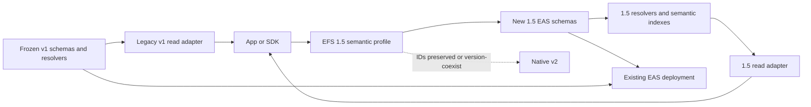

# V1 feasibility, live state, and migration boundary

**Status:** implementation-feasibility review; live facts are dated, proposed
1.5 architecture is not an owner ruling or contract authorization

## Verdict

EFS 1.5 is feasible on EAS, but not as an SDK alias and not as a reinterpretation
of the frozen v1 schemas.

The clean shape is an additive sibling `efs/1.5` profile:

1. new EAS schemas carry universal EFS IDs and semantic references in their
   payloads;
2. native EAS `refUID` is zero for new semantic graph relationships;
3. one immutable shared 1.5 router/registry-index recomputes IDs, validates
   legal shapes/cardinality/references, and rejects mismatches;
4. that semantic index/view layer keys state by EFS IDs while retaining
   receipt history and receipt-to-DataId/RecordVersionId/edge maps;
5. existing v1 contracts and receipts remain readable as legacy evidence; and
6. one ordinary `EAS.multiAttest` call can atomically create a small graph
   because dependent semantic IDs are known before mining.

This is a sibling profile over the same carrier, not a second blockchain and
not a mutation of old receipt meaning.

## Why v1 cannot be patched from the SDK alone

An EAS receipt UID commits to schema, recipient, attester, timestamp,
expiration, revocability, `refUID`, payload, and a collision bump. The
timestamp and bump are only final during admission, so the receipt is not a
precomputable semantic identifier.

EAS also validates any nonzero `refUID` as an already-existing EAS receipt.
A universal EFS object ID therefore cannot be substituted into that field.

The frozen v1 model is receipt-dependent:

| V1 record | Receipt dependency |
|---|---|
| ANCHOR | parent is an EAS receipt UID; shared path identity is not explicit |
| DATA | empty payload; no author salt or stable owned-object preimage |
| PIN | definition/target and indexes ultimately use receipt/schema UIDs |
| TAG | definition/target and current edge are receipt-indexed |
| PROPERTY | binding depends on a PIN receipt even though the value is shared |
| MIRROR | references a DATA receipt |
| LIST_ENTRY / REDIRECT | reference receipt identities |

An SDK can expose a friendlier name for those UIDs, but it cannot make them
portable, predictable, or safe as offline semantic references. A resolver-only
upgrade cannot repair old DATA because there are no bytes from which to derive
an owned universal identity.

## Reuse versus rewrite

| Surface | Reuse | Replace or add | 1.5 rule |
|---|---|---|---|
| EAS core | Existing deployed EAS can remain the chain-local carrier. | Pin and test the exact supported behavior/deployment. | EAS UID is always a receipt. |
| Frozen v1 schemas | Read as legacy evidence. | Register sibling 1.5 schemas. | Never change the meaning of live v1 receipts. |
| Resolver concepts | Reuse validation, first/current state, revocation, and bounded-read lessons. | One immutable shared router/registry-index/storage/events plus bounded binding modules. | Recompute semantic IDs; never let physical schemas split identity, references, or slot state. |
| Index concepts | Reuse reverse lookup and current-state needs. | Key on EFS IDs and slots; retain receipt history. | Core queries must be reconstructible and bounded. |
| EFSRouter/views | Reuse product ergonomics and tests where semantics match. | New typed 1.5 views/results. | No silent truncation or mixed v1/1.5 identifier type. |
| SystemAccount | Keep for its existing system role. | Use a separately chosen stable curator/user account if needed. | It is not a general user identity or automatic Arcade curator. |
| SDK batching | Reuse the one-prompt goal and EAS call plumbing. | Rewrite planning/order, ID types, payloads, retries, and result lifecycle. | Persist a deterministic write plan; do not reorder dependencies implicitly. |
| Content hashes/mirrors | Reuse the current canonical digest convention only after one source is confirmed. | Separate exact digest and transport from object ID. | Never put transport or changing bytes into a stable object identity by accident. |

### Approaches rejected

| Approach | Verdict | Reason |
|---|---|---|
| Alias EAS UIDs as universal IDs | reject | Keeps every failure 1.5 exists to fix. |
| Retain v1 schemas and reinterpret fields | reject | DATA is unsolved; changes frozen meaning; receipt dependencies remain. |
| Universal ID in EAS `refUID` | impossible for new subjects | EAS rejects a non-receipt reference. |
| Old-receipt-to-new-ID sidecar as canonical graph | avoid | Produces two identities and cannot recover original owned DATA authorship. |
| Upgrade existing resolver proxies in place | possible but not preferred | Shares storage and upgrade blast radius with v1 and risks semantic drift. |
| New schemas plus one shared immutable router/registry-index/view | recommended | Isolates the new profile, prevents cross-schema identity splits, and preserves v1 evidence. |

## EAS behavior the design may rely on only after pinning

Current EAS source supports one atomic `multiAttest` transaction:

- schema groups execute in caller order;
- receipt records for one group are stored before its resolver callback;
- a failure in a later record or resolver reverts the entire transaction; and
- only the recorded attester can later revoke the receipt.

The contract/SDK proof must still pin exact deployed behavior and cover these
traps:

- the current SDK groups by first-seen schema and may reorder a dependency
  graph; 1.5 must build and test an explicit canonical order;
- a schema registered as revocable can still receive a non-revocable
  attestation unless the resolver rejects it;
- on the pinned EAS 1.7.1 behavior, `isAttestationValid(uid)` establishes
  existence but does not fold revocation or expiry; EFS current-state logic
  reads those fields explicitly and then applies supersession/slot state;
- revocation is chain-, deployment-, and receipt-specific;
- delegated EAS admission preserves a useful chain-local attester but does not
  prove an EFS-native device actor; and
- an invalid final item must roll back the entire intended atomic action.

For the 1.5 MVP, both native `expirationTime` and semantic `expiresAt` are zero.
TAGDEF, DataId, and RecordVersion admissions are non-revocable; PIN/TAG requests
must be revocable. Resolvers reject the wrong request flag. Adding expiry is
possible, but is not cheap unless every index, getter, event fold, and UI
implements stale-not-dead behavior.

EAS schema strings do not enforce canonical ABI payload bytes. EAS-ABI/1 is
therefore all-static: a seven-word prefix plus at most 16 top-level scalar
application words, exact length, and canonical padding/range. Dynamic fields
reject until a successor codec freezes a different extraction algorithm.
TAGDEF carries the raw restricted-ASCII segment for contract validation and
enumerable path reconstruction, not only its hash.

## Recommended semantic indexes

The exact storage layout remains contract work, but the capability set should
include at least:

- origin-scoped receipt reference -> DataId, RecordVersionId and/or
  semantic edge/slot as applicable;
- semantic object/edge/slot -> append-only receipt history;
- shared subject/DataId -> canonical preimage and RecordVersionId -> canonical
  type/shape/body commitment;
- definition/type -> admitted records;
- descriptor-declared typed reference -> paginated RecordVersion backlinks by
  `(TypeId, fieldRole, targetKind, targetId)`;
- target -> backlinks, with definition/role filtering;
- PIN slot -> current effective target and receipt;
- TAG edge -> current effective weight/state and receipt;
- exact path/topic lookup plus bounded child enumeration where claimed; and
- an enumerable on-chain storage spine with body commitments, paginated receipt
  references, receipt aggregation, stored admission ordinals, and current slot
  heads sufficient to reconstruct state without historical logs. Bodies may be
  recovered from pinned EAS `getAttestation` records rather than duplicated in
  both contracts.

Global objects/records-by-principal remains evidence-gated rather than silently
becoming a 1.5 core index. A concrete product may add a bounded roots-forward
or orphan-tail design after demonstrating the need.

“Current” always means current under the named EAS deployment/chain and read
basis. Events should contain both semantic IDs and origin-scoped EAS receipt
references, including superseded/current relationships, but remain an
accelerator rather than the only reconstruction source.

All arrays are paginated and every resolver/index callback is O(1) in prior
history length. The fork proof benchmarks duplicate-receipt bloat, shared-topic
children, and typed-reference fanout; the index stores commitments and receipt
references rather than duplicating full application bodies.

## Receipt-fold baseline to prove

The fork prototype should start from this conservative rule:

1. byte-identical shared-subject retries converge on one semantic subject;
   additional EAS receipts may exist but are inert for canonical subject state;
2. same ID with a different preimage is rejected;
3. receipt aggregation groups lineage retries under DataId, exact typed-record
   retries under RecordVersionId, and relationship retries under
   SemanticEdgeId; distinct versions never collapse under their shared DataId;
4. slot resolution compares distinct edges using a stored realm-local semantic
   admission ordinal plus per-slot revision/CAS. One canonical receipt defines
   an activation; a duplicate is inert only when it matches that activation's
   edge and predecessor revision;
5. a delayed retry against an older revision fails rather than reassert an old
   edge over a newer head;
6. revoking a duplicate or stale receipt does not change current state;
7. revoking the current activation's canonical receipt clears and advances the
   slot, never resurrects an older value, and attached duplicates do not keep
   it alive;
8. reasserting the same SemanticEdgeId after clear creates a new activation
   ordinal at the new expected slot revision; and
9. exact DataId/RecordVersion admissions are non-revocable; withdrawal is a
   new revocable relationship, not erasure; and
10. an equivalent receipt on another realm remains independent.

These are recommended proof semantics, not yet frozen contract bytes. The ID
spec must decide whether mutable TAG weight is part of `SemanticEdgeId` or
state over a stable TAG slot. Neither value is native v2's future ClaimId.

## Live Sepolia inventory

Read at block `11,441,982` from the deployed indexer:

| Frozen schema | Records |
|---|---:|
| ANCHOR | 517 |
| PROPERTY | 372 |
| DATA | 107 |
| PIN | 425 |
| TAG | 138 |
| MIRROR | 95 |
| LIST | 0 |
| LIST_ENTRY | 0 |
| REDIRECT | 0 |
| **Total** | **1,654** |

The 107 DATA events came from seven distinct attesters. This may be test/demo
state, but “v1 is empty” is false and cannot justify destruction.

One important source/live mismatch also exists: deployed resolver bytecode
reports `MAX_ANCHOR_DEPTH = 32`, while current `contracts/main` says `256`.
Any migration or adapter must treat live bytecode as truth.

The live indexer and mirror are owned by the EFS Safe. The existing
`SystemAccount` bootstrap is sealed, modules are not sealed, and its authorized
module list is empty. None of those facts makes it a suitable user or Arcade
curator identity.

## Legacy coexistence and migration

### What can be preserved honestly

- Every v1 EAS receipt can remain retrievable by its original realm-qualified
  UID with its real attester, time, schema, revocation, and payload.
- Some shared ANCHOR paths can be reconstructed into candidate 1.5 topic IDs
  after canonicalization, with a provenance link back to the old receipts.
- Existing content bytes and digests can be reused when independently verified.
- Apps can provide a dual read adapter while new writes use only the 1.5 path.

### What cannot be claimed

- Old DATA cannot be losslessly converted into author-owned 1.5 objects; its
  frozen payload has no universal ID preimage.
- An importer cannot present itself or the original v1 attester as the author
  of a newly manufactured universal statement without an actual re-authoring
  action.
- A redirect or sidecar does not make the old receipt itself universal.

### Migration labels

Each imported item should be one of:

- **legacy-only** — read by original origin-scoped EAS receipt reference;
- **projected** — deterministic interpretation with explicit source receipt
  and loss notes;
- **re-authored** — a new 1.5 statement signed/admitted by its stated author;
- **reseeded** — a new official object produced from an independently verified
  source manifest; or
- **discarded test fixture** — only after inventory and an explicit decision.

Old records are never overwritten in place.

## Fork proof before SDK redesign

1. Publish candidate Solidity and TypeScript `EFS-ID/1` implementations and
   matching vectors for root, `/Arcade/`, child topics, DataId,
   RecordBodyCommitment, RecordVersionId, subject-qualified PIN, TAG, restricted
   ASCII boundaries, malformed names, numeric extremes, and reserved values.
2. Register the minimum sibling schemas on a fork of the actual Sepolia state.
3. Submit one complete representative graph in one `multiAttest` with every
   semantic EAS `refUID = 0`; separately exercise one Arcade portable-profile
   record without adding an Arcade-specific contract kind.
4. Prove every EFS ID is known before submission and every EAS UID remains a
   separately typed receipt after mining.
5. Make the final record invalid and prove full rollback.
6. Race two creators of `/Arcade/` and prove convergence without ownership or
   poisoning.
7. Exercise retries, PIN A→B→A, TAG weight 1→2→1, delayed retries,
   duplicate/noncanonical/current revocation, and no-resurrection.
8. Reconstruct state from events and compare it with resolver/index getters at
   the same basis.
9. Measure ordinary, worst-case, and adversarial gas/read bounds.
10. Prove v1 and 1.5 identifiers cannot be parsed or routed as each other.
11. Test direct EOA and stable smart-account attesters; test delegated variants
    only as an interoperability lane, not an MVP identity promise.
12. Inventory all 1,654 live records and dependent URLs/apps before deciding
    retain, re-author, reseed, or discard.
13. Reject wrong revocability, nonzero native/semantic expiry, noncanonical ABI,
    trailing bytes, and any adapter that mistakes EAS existence for current
    liveness.

Passing this fork proof authorizes a contract/SDK handoff for review; it does
not promote the 1.5 design or authorize a production deployment.
