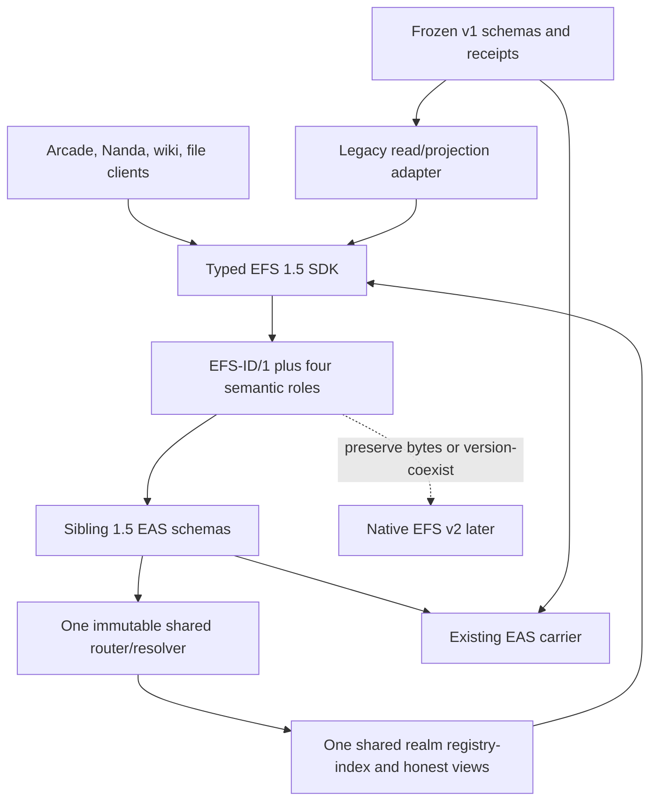

# EFS v2 to 1.5 — the minimum bridge that does not create another trap

**Date:** 2026-08-07
**Status:** completed design/review pass; recommendation for the active
`Designs/efs15/` draft, not implementation authorization or an owner ruling
**Scope:** subtract portable data from v2, identify the load-bearing remainder,
prove its fit over EAS/v1, and pressure-test Arcade, Nanda, Git/wiki, files, and
shared schemas

#kind/review #status/done #repo/planning #repo/contracts #repo/sdk #repo/client #topic/efs15 #topic/efsv2

## Plain-English verdict

**EFS 1.5 is worth doing.** Dropping general portable signed application data
(while keeping one narrow relayable immutable-type authorization) removes most
of v2's hardest machinery. The surviving bridge is coherent, useful, and bounded:

> Keep EAS as the chain-local receipt, validator, and revocation system. Give
> EFS things predictable universal IDs. Express the graph with four semantic
> roles. Make exact versions immutable, fold EAS receipts explicitly, and tell
> the truth when a read is partial or realm-specific.

That is enough to remove the worst v1 trap without requiring KEL, a native
carrier, cross-chain global state, private drives, full lenses, or a GitHub
clone.

It is **not** a small SDK patch. V1 schemas, resolvers, indexes, and views use
EAS receipt UIDs as structure. The safest implementation is a new additive
`efs/1.5` schema/resolver/index/view profile over the existing EAS deployment,
with v1 left readable as legacy evidence.

The planning uncertainty is now finite, but the proof package is not only an
ID file: it includes the coordinated type/record identity, graph/receipt fold,
honest indexes, and a bounded fork prototype. Arcade then adds its own portable
package/runner/curator profile rather than expanding the kernel.

## Readiness at a glance

| Question | Answer after this pass |
|---|---|
| Is 1.5 the right contraction? | **Yes.** It captures the non-additive v1 fixes and defers most v2 machinery. |
| Can existing v1 contracts support it unchanged? | **No.** New sibling schemas and semantic resolver/index/view logic are required. |
| Can EAS still be used? | **Yes.** It remains useful for attester provenance, realm-local admission evidence, resolver validation, revocation, and interoperability; 1.5 stores its own semantic ordinal for slot resolution. |
| Is a portable envelope required? | **No** for current Arcade/Nanda public-artifact use. |
| Is KEL required? | **No** for the MVP. One stable visible address/principal remains the honest identity model, with explicit key-loss/rotation debt. |
| Are universal IDs alone enough? | **Almost, but no.** Slot/cardinality, receipt folding, exact-versus-moving file semantics, and honest reads are inseparable adjacent gates. |
| Is the graph small? | **Yes.** Shared TAGDEF, stable owned DATA lineage, cardinality-one PIN, and cardinality-many TAG. Exact typed bodies use RecordVersionId; LIST is conditional. |
| Can Arcade UI work continue now? | **Yes**, behind an adapter. Permanent v1 seeding cannot be promised migratable. |
| Is 1.5 implementation-ready? | **Architecture-ready for a freeze/prototype pass; not deployment-ready.** Exact bytes and fork conformance still need proof. |

## Recommended architecture

### The four roles

| Role | What it protects |
|---|---|
| **TAGDEF** | one ownerless ID for a shared topic or graph predicate such as `/Arcade/` |
| **DATA** | an author-owned stable lineage/object ID; exact typed bytes receive a body-bound RecordVersionId |
| **PIN** | one current value for a stable semantic slot, such as game slug → exact release |
| **TAG** | many membership/annotation edges, such as curator → approved game or record → topic |

`LIST` should enter 1.5 only if a concrete product promises an immutable
collection charter or append-only ledger that tags cannot express. Properties,
mirrors, predecessors, placement, types, redirects, and comments should first
be reserved roles over this core. Physical Solidity schemas may specialize for
gas or validation, but developers get one canonical semantic spelling.

## What universal IDs buy immediately

- `/Arcade/` and other shared subjects have one predictable ID across chains,
  deployments, offline packages, and native v2 implementations that accept the
  frozen profile.
- A client can construct all semantic parents, targets, slots, and dependent
  records before submission.
- A small graph becomes single-transaction-constructible with
  `EAS.multiAttest` without waiting a block merely to discover a mined UID.
  Actual atomic behavior and gas fit remain fork/prototype gates.
- Stable links and cache keys stop depending on timestamped chain-local EAS
  receipts.
- EAS receipts remain available for audit, revocation, realm-local admission
  evidence, resolver admission, and interoperability rather than being
  discarded; 1.5 stores the semantic ordinal used for slot resolution.
- V1 and future carriers can be projected around the same EFS identity without
  pretending their current state or author evidence is globally equivalent.

## The four adjacent pieces we cannot skip

### 1. Slot and cardinality semantics

PIN and TAG cannot be “just edges.” One chooses one current target; the other
allows many. The ID profile must close legal definition/target/cardinality
combinations and forbid two canonical encodings of one fact.

### 2. Receipt folding

One semantic edge can have multiple EAS receipts because of retries, relays,
or duplicate races. Receipt aggregation first groups those receipts without
merging realm-local revocation; slot resolution then chooses among distinct
edges using a stored semantic admission ordinal. A per-slot revision/CAS
witness separates inert retries from new activations: one canonical receipt
controls liveness, duplicates cannot keep it alive, and reasserting the same
edge after clear receives a new activation ordinal. The state machine must
define supersession, current/stale revocation, no-resurrection, realm
separation, and history. Raw EAS validity or “latest UID” is not sufficient.

### 3. Immutable revision and link semantics

An EFS DataId is not a content hash or exact record ID, and a moving file path is not an exact
revision. Arcade builds, Nanda releases, Markdown edits, and Git-backed pages
need the same law:

- new exact typed bytes/meaning create an immutable RecordVersionId under a
  stable DataId lineage;
- a stable path/channel PIN may move to it;
- exact citations never auto-follow; and
- integrity digest and transport/mirror remain separate from semantic identity.

### 4. Honest reads and trust source

Every read states realm and basis and distinguishes found,
`ABSENT_PROVEN(bound,evidence)`, and unknown, plus
partial/completeness/truncation/cursor state. Only a complete point getter or
bounded state walk may prove absence; endpoint emptiness, caches, partial scans,
and budget exhaustion remain unknown. The viewer or resource owner chooses the
policy used for a security gate; an untrusted game/app URL may pin content or
suggest a view but cannot provide the lens that authorizes itself.

These rules are a small compatibility seam, not the full v2 lens system.

## Keep the good parts of EAS

EFS 1.5 should be a better EAS-shaped developer experience, not a rejection of
EAS. It must retain:

- reusable shared application schemas/types;
- deterministic shape checks plus stateful resolver policy;
- bounded records-by-known-type queries;
- exact TypeId lookup plus a paginated on-chain catalog for canonical 1.5 type
  descriptors, with registration kept distinct from endorsement;
- broader/ranked type search as a replaceable accelerator;
- explicit realm-local admission and revocation evidence; and
- loss-aware import/projection of real EAS data and tools.

The minimum identity split is:

| Layer | Scope |
|---|---|
| TypeId | publisher-qualified universal immutable semantic application type/version, reusable by anyone; not automatically a graph DefinitionId |
| ShapeId | canonical application-body fields under a named codec; distinct types may share it |
| Physical EAS schema reference | origin tuple plus SchemaUID; raw UID commits to exact field string, resolver, and revocability but not chain/deployment |
| ValidatorId | directly called read-only structural/semantic module plus config; outcome is admission-basis-specific unless a stronger purity profile applies |
| AdmissionPolicyId | stateful realm-local authorization/cardinality policy |
| DataId | stable publisher/author-qualified object or lineage |
| RecordVersionId | one exact immutable typed body committing DataId, TypeId, ShapeId, and canonical body |
| EAS receipt reference | origin tuple plus UID for one realm-local admission/provenance statement |

The origin types are explicit:
`EasDeploymentRef = (chainId, easAddress, schemaRegistryAddress)`,
`PhysicalEasSchemaRef = (EasDeploymentRef, schemaUid)`, and
`EasReceiptRef = (chainId, easAddress, receiptUid)`.

A narrow first profile should freeze an immutable on-chain
`TypeDescriptorV1` execution descriptor and an all-static `EAS-ABI/1`: seven
prefix words plus at most 16 top-level scalar application words. Dynamic fields
reject until a successor codec freezes a different body extractor. Native typed
EAS schemas use the exact `efs`-prefixed field spelling in
[[efs-id-1-candidate]] to carry claimed DataId, RecordVersionId,
RecordBodyCommitment, TypeId, ShapeId, explicit BindingVersionId, and DATA
salt. The resolver derives PrincipalId from attester and recomputes both IDs.
Freeze a standard typed-admission and
binding interface around one immutable shared router/registry-index. Every
physical schema points to that router; bounded immutable validator/policy
modules may specialize app admission but cannot write core identity,
references, slots, or ordinal state. Validators use fixed-gas static calls; a
stateful policy has the same bounded input behind a non-reentrant call and may
have external side effects under its own/downstream authority; the router core
is guarded, but the binding must trust/audit that app behavior. A narrow
chain-independent ECDSA TypeAuthorization makes publisher-authored descriptors
relayable; binding registration is permissionless and permanent.
Registration recomputes descriptor/type/shape/binding/schema identities and
verifies the pinned SchemaRegistry, EAS, router, revocability, and immutable
module code/configuration. `BindingVersionId`
covers reusable type/shape/validator/policy/code/physical-schema configuration.
The first binding-record pair stores its evaluation basis/result separately
from every physical receipt's provenance and pointer to that pair. A duplicate
receipt cannot make a reused module result appear evaluated at a later block.
A static module can still read mutable dependencies, so its
outer codehash does not prove timeless deterministic validity; only the
router-native codec/identity/reference checks make that claim. A rejected
resolver call has no durable EAS receipt. There
is no binding activation/deactivation owner; “permanent” means registered, not
guaranteed to accept later writes. Distrust is a reader policy and a directly
committed code/config change creates a new binding. Proxy/oracle dependency
behavior stays basis-qualified until a future bounded validator profile can
prove more.

A TAGDEF named `GameRelease` does not by itself provide field shape,
validation, or records-by-type. The contract/SDK proof needs one complete
publish → reuse → admit → query → project trace before durable app schemas.

TypeDescriptor may declare at most eight top-level `bytes32` typed EFS-object
references. First RecordVersion admission—not duplicate receipts—populates
both known-type and target-first paginated indexes using stable FieldRoleIds.
All declared references are indexed, so a complete target-first walk can prove
absence without converting immutable body references into TAGs or requiring an
app-specific contract. Gas/storage bounds remain prototype items.

## Product conclusions

### Arcade portable profile

The guest path and most UI work can proceed now. The durable graph needs
universal IDs, verified multi-file closure, exact release links, a stable
official curator principal, and policy chosen outside hostile game content.
Comments and full social/moderation features are not a reason to expand 1.5.

This is an application profile and deployment, not an EFS 1.5 core type set.
Before durable seeding, Arcade must distinguish a publisher-qualified stable
GameProject/Work, an immutable GameRelease whose typed body commits exact
artifact closure, and a chain-independent `ArtifactManifest/1` package
identity. There is no objectively global canonical GameId; curators select
among projects/releases, and an official slug is their moving PIN/view. The
minimum manifest carries version, entrypoint, sorted relative member paths,
`f1220` digest, size, media type, and runner/capability ceiling. Single-file is
one member; unsupported multi-file execution fails closed. A MIRROR claim binds
a locator to the expected exact digest; publishing and strict reads verify
bytes off-chain because the EAS resolver cannot fetch a URL. A modified upstream
version is provenance, not a mirror.

GameProject/GameRelease/ArtifactManifest shapes, `/Arcade/` slug policy, mirror
and provenance records, runner capabilities, and official curator principal
belong to this profile/deployment. Core 1.5 contributes only its generic
ID/principal, type/reference, graph-fold, admission, query, and coexistence
seams.

The current no-contract-change Arcade plan and 1.5 coexist only under this
rule: **anything seeded through v1 before the 1.5 gates is disposable and must
be explicitly reseedable.** A v1 DATA receipt cannot be losslessly converted
into the same author-owned 1.5 object.

The SDK exposes a stamped sibling `efs/1.5` profile rather than aliases inside
v1. It may carry forward v1's dry-run, persisted plan, idempotence, and receipt
ergonomics, but not the mined-UID dependency graph or noncanonical hash writer.

### Nanda

1.5 can support stable public provider/service/release/evidence records and
replaceable catalogs. Shared schemas and closure manifests are mandatory.
Catalog discovery remains separate from execution trust; private memory,
secrets, and scoped agent execution remain elsewhere.

### Git-backed Markdown

1.5 can support a useful single-publisher archive/wiki: Git owns Git objects
and OIDs; EFS owns semantic repository/page identity, exact-versus-moving links,
placement, availability, and publisher/lens claims. It must not be described as
a neutral GitHub-class forge until replay-safe multi-maintainer ref CAS and
strong authority are implemented in the separate Git/v2 work.

### Ordinary files

Public, low-stakes files fit. A valuable personal drive does not fit safely
unless its stable recoverable principal, privacy, sharing, and recovery model
exist from write one.

Full traces and no-go claims are in
[`product-traces-and-acceptance.md`](./2026-08-07-efs-v2-to-15-corpus/product-traces-and-acceptance.md).

## Identity boundary

The honest 1.5 model remains simple:

> One visible `bytes32 PrincipalId`, currently restricted to a zero-padded
> address, is one visible author in a lens.

A raw EOA works but has no recovery. A reviewed smart account can later hide
several device/session keys behind the same stable address **if the account
itself calls EAS** and the receipt attester is asserted after submission.

The API may reserve separate author/principal, actor/signer, and submitter/payer
types. It must leave actor absent unless there is real evidence. A unilateral
`parentKey`, bilateral display link, account controller, or EAS delegation is
not durable EFS-native authority.

Using a full-width principal in IDs avoids truncating a future namespace. It
does not make KEL retroactive, prove historical devices, prevent a stolen-key
inception race, or guarantee no object rekey unless future v2 deliberately
preserves that principal.

## Live-v1 finding and migration boundary

The Sepolia deployment is not empty. At block `11,441,982`, the deployed
indexer reported 1,654 records: 517 ANCHOR, 372 PROPERTY, 107 DATA, 425 PIN,
138 TAG, and 95 MIRROR. DATA came from seven attesters. LIST, LIST_ENTRY, and
REDIRECT were zero.

This may largely be fixture/demo data, but it must be classified before any
abandonment. Deployed behavior also differs from current source in at least
one measured place: live `MAX_ANCHOR_DEPTH` is `32`, while current main says
`256`.

The migration rule is conservative:

- keep old receipts readable by realm-qualified EAS UID;
- project reconstructible facts with source and loss labels;
- re-author when the claimed author actually creates a new 1.5 object;
- reseed official content from a verified source manifest; and
- never present an importer or a sidecar mapping as original authorship.

Details and the fork method are in
[`v1-feasibility-and-migration.md`](./2026-08-07-efs-v2-to-15-corpus/v1-feasibility-and-migration.md).

## What 1.5 deliberately leaves for v2

- portable signed application envelopes and carrier-independent
  authorship/revocation; the ECDSA TypeAuthorization is a narrow immutable-type
  publication exception, not a general record envelope;
- KEL recovery, rotation, scoped device actors, historical authorization,
  organizations, passkeys/PQ, and non-address principals;
- cross-chain unqualified current state or global revocation;
- full typed/compiled lens architecture;
- encrypted private drives and unlinkable personas;
- native carrier, chain-free mode, complete OS capability system;
- full multi-maintainer neutral Git forge and GitHub-class collaboration; and
- native Arcade comments/moderation as a launch dependency.

These are explicit debts with pull-forward triggers, not forgotten features.
The complete classification is in
[`v2-disposition-ledger.md`](./2026-08-07-efs-v2-to-15-corpus/v2-disposition-ledger.md).

## Finite freeze package

### Gate 1 — `EFS-ID/1`

Independently review [[efs-id-1-candidate]], then freeze versioned domains,
byte layouts, root/path/name grammar, principal
encoding, salts, TagDef/DataId, coordinated
ShapeId/TypeId/RecordBodyCommitment/RecordVersionId/FieldRoleId,
slot/semantic-edge formulas, EfsObjectKind constants, succession rules, and
Solidity/TypeScript vectors.
Differentially fuzz the two
implementations. `SemanticEdgeId` groups 1.5 receipts; it is not native v2
ClaimId.

The reopened v2 TAGDEF-kind-word and five-word SLOT drafts currently reuse the
same `efs.id.tagdef.v1`/`efs.id.slot.v1` strings incompatibly. Gate 1 must make
v2 adopt 1.5's frozen layouts or rename those draft profiles; two formulas
cannot claim one versioned namespace.

The 1.5 spec itself must prove a synthetic successor domain can coexist through
an explicit immutable-namespace adapter without reinterpretation. Native v2 is
not a launch dependency; when it arrives it may preserve the IDs natively or
expose the frozen 1.5 namespace as legacy.

### Gate 2 — semantic graph and schema bridge

Close the legal role/target/cardinality table and one-fact-one-encoding rule.
Freeze the bounded on-chain TypeDescriptor, origin-scoped physical EAS schema
binding, permanent binding lifecycle, separate validator/admission policy and
fixed module calls, records-by-type indexes, and validation grades. Freeze
canonical ABI acceptance, exact schema spelling, per-role revocability, zero
native/semantic expiry, the shared registry-index, and bounded typed reference
backlinks.

### Gate 3 — receipt/read state machine

Freeze receipt aggregation separately from slot resolution, including a stored
realm-local semantic admission ordinal, slot revision/CAS and activation
epochs, duplicate/retry/supersession/revocation behavior, point/enumeration
consistency, `ABSENT_PROVEN`, `UNKNOWN`, completeness, cursors, and no silent
truncation.

### Gate 4 — exact record/reference profile

Freeze DataId versus RecordVersionId, exact versus moving links, typed body
references, predecessor/supersession, and integrity-versus-transport semantics.
Arcade's ArtifactManifest and runner are a portable application profile layered
on this seam, not kernel kinds.

### Gate 5 — core fork proof plus one product slice

On a fork of the actual Sepolia deployment, register the sibling schemas and
prove one atomic representative graph write, rollback, race convergence,
receipt fold,
full-body/current-state reconstruction from enumerable storage without logs,
gas bounds, v1/1.5 type separation, and EAS conformance.

Separately run one Arcade intake → exact manifest → verified fetch → sandbox →
comment slice as product evidence; failure of its package/runner policy does not
rename the core ID profile.

### Gate 6 — Arcade operational identity and legacy plan

Choose the stable official Arcade curator principal/realm before valuable
writes. Classify the 1,654 v1 records and dependent apps/URLs. Publish which
pre-1.5 demo state is disposable, projected, re-authored, or reseeded.

## Suggested implementation order

1. Independently review and fuzz [[efs-id-1-candidate]]; replace its smoke
   vectors with two-language golden vectors.
2. Write the graph/schema/receipt capability table against that ID profile.
3. Build the minimal contract fork proof before changing the production SDK.
4. Turn the passing proof into separate contracts and SDK handoffs.
5. Put Arcade/Nanda clients behind a v1/1.5 adapter; continue guest UI work.
6. Inventory/reseed legacy state and only then select a production deployment.

This order avoids polishing an SDK around identifiers or state folds that the
contracts cannot enforce.

## Stop or resize conditions

Stop calling the result 1.5 if it requires any of the following:

- dual canonical EFS/EAS references;
- a second transaction solely to discover an identifier;
- any future profile silently reinterpreting frozen 1.5 IDs rather than
  preserving them or exposing an explicit immutable legacy namespace;
- a private official indexer to reconstruct claimed core state;
- caller/URL-supplied trust for installs or execution;
- a throwaway EOA for a valuable long-lived collection;
- a false lossless migration of v1 DATA; or
- pulling portable envelopes, full KEL, private drives, full Git authority,
  and native app social infrastructure into the Arcade MVP.

## Owner attention

This pass does not create a large owner packet. The architecture questions
have a recommended answer and can proceed through design/prototype review.

Before the first valuable Arcade write, the owner will need to approve the
stable official curator principal/realm and confirm that any earlier v1 demo
seed is disposable or explicitly reseedable. That decision should be prepared
only after the ID/fork proof shows what address/account and deployment choices
are real.

## Highest-leverage next action

**Build one independent Solidity/TypeScript differential-and-fuzz freeze harness
for [[efs-id-1-candidate]] and replace its recomputed smoke values with golden
vectors before changing durable Arcade data or starting the 1.5 SDK profile.**

That is the one irreversible surface. Everything else in the recommended 1.5
profile can then be tested around it on a fork.

## Supporting record

- [[efs-id-1-candidate]] — concrete candidate formulas, name grammar, smoke
  vectors, two-fold state model, and remaining independent-review gates
- [`corpus README`](./2026-08-07-efs-v2-to-15-corpus/README.md)
- [`v2 disposition ledger`](./2026-08-07-efs-v2-to-15-corpus/v2-disposition-ledger.md)
- [`v1 feasibility and migration`](./2026-08-07-efs-v2-to-15-corpus/v1-feasibility-and-migration.md)
- [`product traces and acceptance`](./2026-08-07-efs-v2-to-15-corpus/product-traces-and-acceptance.md)
- [`adversarial review`](./2026-08-07-efs-v2-to-15-corpus/adversarial-review.md)
