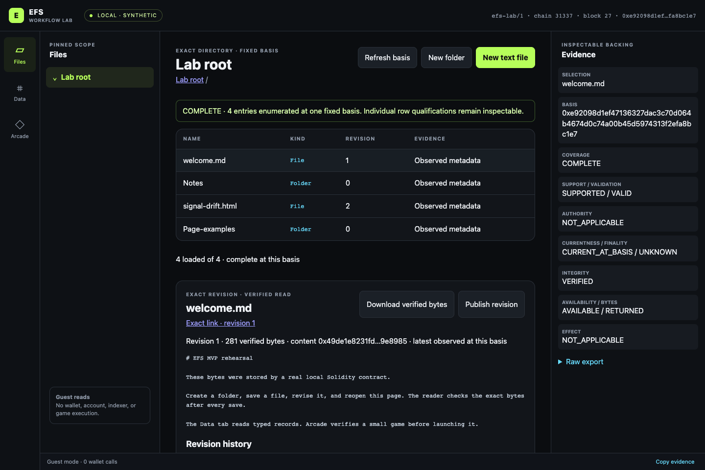
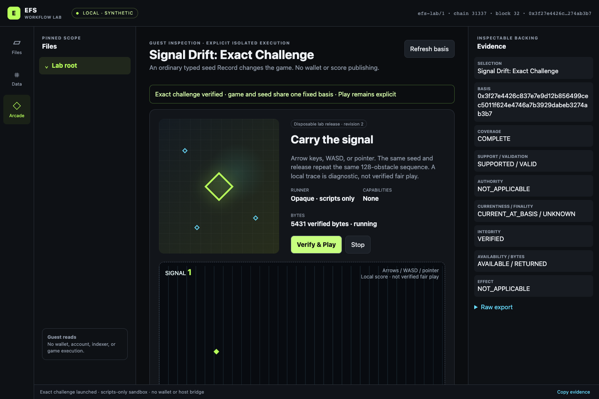

# EFS MVP rehearsal

**Status:** joined local rehearsal executed and reviewed; not full C0 or a production MVP
**Latest increment:** [workflow extension and review closure](extension-results.md) —
exact Files links/history/upload/download, a lossless exact-schema table, and
shared typed challenges; 95 Node and 27 joined browser journeys pass.
**Source:** MVP-C0 foundation `bbad508`, merged with planning main `fffe293` at `35113aa`.
**Authority:** James requested on 2026-09-04 that v2 PM perform the design work,
validation and prototypes needed for an MVP spanning contracts, SDK, Web Client,
Files/data browsing and possibly Arcade, before creating the product repositories.
This permits local browser and contract experiments. It is not protocol promotion
or public deployment authority.

## Objective

Make the intended MVP interaction concrete: browse without a wallet, create a
folder and file, approve a relayed write once, revise using a bounded session,
recover from a fresh reader, inspect typed data, and explicitly launch a small
game from verified bytes. A Solidity consumer must also exercise a bounded read.

The full C0 profile remains the conformance target. This smaller, separately
namespaced workflow laboratory tests contract/SDK/browser integration before
implementing its entire TypeSchemaGroup, index and authority grammar. The lab
must enumerate every shortcut and may never count its successes as M0/C0 passes.

## Execution plan

1. Write the repository and integration blueprint and close the known bootstrap
   questions with explicit experimental recommendations.
2. Build a real local Solidity interaction laboratory: atomic semantic state,
   separate Core-only byte carrier, strict typed payload validation, immutable
   revisions, bounded listings, CAS, EIP-712/direct/session authorization and
   an onchain read consumer. Persist enough evidence for independent read-back.
3. Implement the five SDK seams over that laboratory. Preserve raw evidence,
   immutable basis, coverage and errors; retain a TypeScript consumer contract
   and a Solidity helper design. Separate local validation from observed effect.
4. Build a thin browser with Files, typed-data inspection and a tiny original
   game. All executable game bytes must be verified before explicit launch;
   browsing performs no launch. The game has no wallet or host authority.
5. Run joined local tests, adversarial failures, independent recovery and
   browser verification. Record costs and the precise remaining C0/MVP gaps.
6. Review the assembled increment and hand over reproducible commands, source
   artifacts and a small ordered backlog for the real repositories.

## Engineering boundaries

- All sources live in this isolated planning experiment; v1 packages are inputs
  for lessons only. No new product repository is needed for this rehearsal.
- The recommended baseline is one semantic state owner with internal modules,
  one Core-only byte carrier, and optional deployment infrastructure. A contract
  per filesystem or application noun is unnecessary.
- The lab uses its own printable `efs-lab/` domains and explicitly versioned
  ABI. These identifiers are never canonical EFS IDs or C0 genesis evidence.
- Deterministic local test accounts are for the ephemeral local chain only.
  No real wallet, remote RPC default, public deploy, credentials or persistent
  private key is part of the demo. Provider calls are instrumented.
- The lab's single owner and finite Type/operation bounds are comparison
  controls, not a proposed permission model for the permanent permissionless
  system. Their omitted functionality must stay visible.
- Source-specific read modules may share transport/setup but independent
  validation must derive expectations from serialized bytes, not call the
  implementation's validation functions as its oracle.

## First-checkpoint results (retained history)

Fresh final local runs on 2026-09-04:

- **24/24 Solidity tests**, including a 128-case payload/range fuzz run.
- **42/42 Node tests**: real Anvil integration, SDK fault/authority cases,
  browser state/lifecycle laws and the local gateway's negative tests.
- **Strict TypeScript consumer check passed.**
- **8/8 real Chromium journeys passed**, including 1440px desktop and 390px
  mobile, cold reopening, all three write paths and a running verified game.
  [Machine-readable browser result](artifacts/browser-results.json).
- **9 full-path/read measurements** in [measurements.json](artifacts/measurements.json).
  The largest lab storage case is too expensive for some execution profiles.

The browser observed zero guest wallet calls, one owner message for relayed
file creation, one owner transaction for direct folder creation, one separate
session setup signature, and zero routine wallet calls for session revisions.
These are local simulations, **not real wallet-extension popup compatibility
results**. No external runtime requests or page errors occurred in the run.

Read [build-readiness.md](build-readiness.md) first: what to retain, what to
replace, measured costs and the ordered implementation backlog.
[Repository blueprint](repository-blueprint.md) ·
[Contracts](contracts-design.md) · [SDK](sdk-design.md) ·
[Browser](browser-design.md) · [Progress/review record](progress.md).
The [source/output manifest](artifacts/source-manifest.json) content-pins the
executable inputs and retained outputs; Git retains the exact checkpoint.

All nine full C0 M0 rows remain NOT_RUN. This lab does not implement the full
16-Type admission, generic graph indexes, Principal/Binding/Lens, multi-placement
Files, genesis or large-content closure. No public chain was used.

## Run it

Prerequisites: Node 26.0.0, Foundry 1.7.1 (`forge`, `anvil`) and native solc
0.8.30+commit.73712a01. The experiment pins Cancun, optimizer 200 and via-IR.
Set `EFS_LAB_SOLC` to that compiler executable if it is not named `solc`.

From this directory:

```sh
npm ci --ignore-scripts --no-audit --no-fund
npm run check
npm run demo
```

Open the loopback URL printed by `demo`. Every run creates a fresh local chain
and synthetic data; it stops after one hour or Ctrl-C. No persistent wallet,
RPC service or real account is needed. `EFS_LAB_PORT` optionally fixes its port.
Do not expose it through a tunnel or use its test accounts anywhere else.

```sh
npm run measure
npm run test:browser
npm run test:extensions
npm run test:files-ui
```

Browser checks use locked Playwright 1.62.1. Supply an installed Chromium path
through `EFS_LAB_CHROMIUM`, or install Playwright's browser separately with
`npx playwright install chromium`. The retained run used Chromium
148.0.7778.96 on Darwin arm64. `EFS_LAB_SKIP_BUILD=1` skips compilation only
when artifacts already match the current source. Browser/measurement output
is regenerated under `artifacts/`; compiler and dependency caches are ignored.

The loopback gateway models read/wallet/relay/session transports; it is test
infrastructure, not a proposed EFS backend. All file/data evidence comes from
the disposable contracts and is checked by the browser SDK.

## Preview




